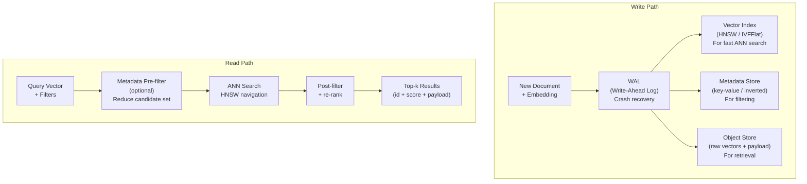
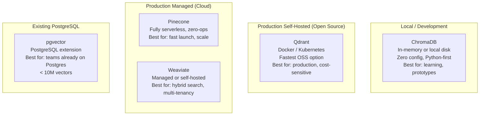
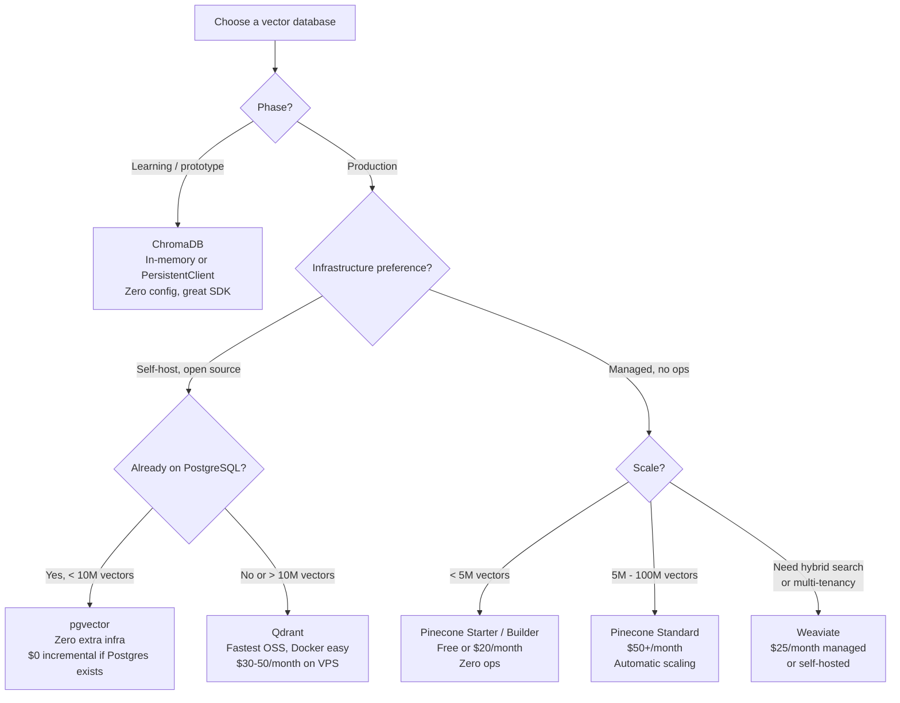
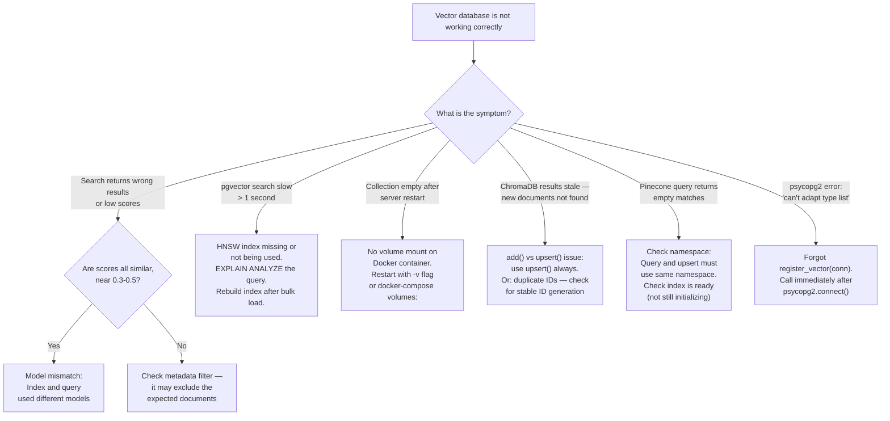

# Chapter 8: Vector Databases — AI Memory at Scale

---

> *"A vector database is what happens when you ask: 'What if a database understood what data means, not just what it says?'"*

---

## Learning Objectives

By the end of this chapter you will be able to:

- Explain what a vector database is, why it exists, and how it differs from relational and document databases
- Use ChromaDB for local development and prototyping with persistent and in-memory modes
- Use Qdrant for production self-hosted deployments with filtering, payloads, and named vectors
- Use Pinecone for fully managed, serverless production deployment
- Implement pgvector as a vector search extension inside your existing PostgreSQL database
- Apply HNSW and IVFFlat indexing to handle millions of vectors with sub-20ms latency
- Choose the right vector database for a given use case using a structured decision framework
- Diagnose and fix five specific production failures in vector database deployments

---

## Prerequisites

- **Required:** Chapter 7 — Embeddings (vectors, cosine similarity, embedding models, chunking)
- **Required:** Chapter 4 — AI APIs, SDKs & Streaming (async patterns)
- **Installed:** `chromadb`, `qdrant-client`, `pinecone`, `pgvector`, `psycopg2-binary`, `numpy`

---

## Estimated Reading Time

**80 – 95 minutes**

---

## Estimated Hands-on Time

**5 – 7 hours**

---

## Table of Contents

1. [Why This Topic Exists](#1-why-this-topic-exists)
2. [Real-World Analogy](#2-real-world-analogy)
3. [Core Concepts](#3-core-concepts)
4. [Architecture Diagrams](#4-architecture-diagrams)
5. [Flow Diagrams](#5-flow-diagrams)
6. [Beginner Implementation — ChromaDB](#6-beginner-implementation)
7. [Intermediate Implementation — Qdrant](#7-intermediate-implementation)
8. [Advanced Implementation — Pinecone Serverless](#8-advanced-implementation)
9. [Production Architecture — pgvector in PostgreSQL](#9-production-architecture)
10. [Vector Database Comparison & Decision Framework](#10-vector-database-comparison)
11. [Best Practices](#11-best-practices)
12. [Security Considerations](#12-security-considerations)
13. [Cost Considerations](#13-cost-considerations)
14. [Common Mistakes](#14-common-mistakes)
15. [Debugging Guide](#15-debugging-guide)
16. [Performance Optimisation](#16-performance-optimisation)
17. [Exercises](#17-exercises)
18. [Quiz](#18-quiz)
19. [Mini Project](#19-mini-project)
20. [Production Project](#20-production-project)
21. [Key Takeaways](#21-key-takeaways)
22. [Chapter Summary](#22-chapter-summary)
23. [Resources](#23-resources)
24. [Glossary Terms Introduced](#24-glossary-terms-introduced)
25. [See Also](#25-see-also)
26. [Preparation for Chapter 9](#26-preparation-for-chapter-9)

---

## 1. Why This Topic Exists

In Chapter 7 you learned to generate embeddings and store them in NumPy arrays. This works for a few hundred documents. It breaks at ten thousand. And at a million documents it is completely impractical — a full scan takes seconds, and re-building the index after every update takes minutes.

The problem has four dimensions:

**Scale:** A plain NumPy array with 1 million vectors × 1536 dimensions × 4 bytes = 6 GB in RAM. That is before indexing, before metadata, before queries. A production RAG system might have 50 million chunks.

**Speed:** Finding the nearest neighbours in 6 GB of raw vectors requires comparing your query against every single vector — a O(n) operation. At 1 million vectors this takes ~2 seconds. At 10 million vectors, it takes 20 seconds. Users cannot wait 20 seconds for a search result.

**Updates:** When documents change, you need to update their embeddings. Rebuilding a NumPy array from scratch every time a document changes is not viable for a live system.

**Persistence:** NumPy arrays live in RAM. When your process restarts, every embedding is gone and must be regenerated.

Vector databases solve all four problems simultaneously:

- **Scale:** Store vectors on disk with memory-mapped access — not everything in RAM
- **Speed:** Build approximate nearest-neighbour (ANN) indexes (HNSW, IVFFlat) that find the top-k most similar vectors in milliseconds, not seconds
- **Updates:** Upsert individual vectors without rebuilding the entire index
- **Persistence:** Data survives process restarts, server reboots, and deployments

Vector databases also add capabilities that plain arrays cannot provide:
- **Metadata filtering:** "Find the 10 most similar documents, but only those published after 2024 and tagged 'python'"
- **Namespaces/tenants:** Isolate data per customer without running separate databases
- **Hybrid search:** Combine vector similarity with keyword search for better recall
- **Replication:** Serve high read traffic across multiple replicas

The result is a database engine purpose-built for the one operation that makes AI applications work: "given a query vector, find the k most similar stored vectors, fast."

---

## 2. Real-World Analogy

### The Library Card Catalogue Analogy

Imagine the old-style library card catalogue with millions of index cards — one per book. To find a book, you walk to the cabinet, open the drawer for the right letter, and flip through cards until you find it. For an exact title lookup, this is fast. But if you want "all books similar to *Dune*," you are stuck — the catalogue does not understand meaning, only alphabetical order.

A vector database is like a library where every book has been given a precise coordinate on a three-dimensional "topic map" — Science Fiction books cluster together, History books cluster together, Cookbooks cluster together. Finding books similar to *Dune* means: "find all books near Dune's coordinate." The librarian walks to that area of the map and hands you a list. Milliseconds, not minutes.

### The Airport Routing Analogy

HNSW (Hierarchical Navigable Small World) — the indexing algorithm inside most vector databases — works like airline routing. To fly from Sydney to a small town in Montana, you do not take a direct flight. You hop Sydney → Los Angeles → Denver → Butte. Each hop gets you closer. HNSW uses the same principle: it builds a network of "shortcuts" between vectors so that navigating to the nearest neighbour requires only a few hops, not an exhaustive search.

---

## 3. Core Concepts

### Vector Database

**Technical definition:** A database management system designed to store, index, and query high-dimensional embedding vectors, optimised for approximate nearest-neighbour (ANN) search with filtering, persistence, and update capabilities.

**Simple definition:** A database whose primary data type is a vector (a list of numbers representing meaning), and whose primary query operation is "find the most similar vectors to this one."

---

### Approximate Nearest Neighbour (ANN)

**Technical definition:** A class of algorithms that find vectors closest to a query vector without exhaustively comparing every stored vector — trading a small amount of recall accuracy (typically 1–5%) for orders-of-magnitude speed improvement.

**Simple definition:** Finding "close enough" neighbours very fast, rather than finding the perfect nearest neighbours slowly. In practice, 95–99% recall with millisecond latency is better for AI applications than 100% recall with second latency.

---

### HNSW (Hierarchical Navigable Small World)

**Technical definition:** An ANN index structure that builds a multi-layer graph of vectors, where each layer contains a random subset of vectors with long-range connections. Search starts at the top layer (few nodes, long-range hops) and descends to lower layers (more nodes, fine-grained search).

**Simple definition:** The airport routing algorithm applied to vector search. Build a network of "shortcut connections" between vectors, then navigate to the nearest neighbour in a few hops rather than scanning everything. HNSW is the most widely used vector index: fast query, good recall, high memory usage during construction.

**When to use:** Default choice for most production use cases. Best query speed and recall.

---

### IVFFlat (Inverted File with Flat Quantisation)

**Technical definition:** An ANN index that clusters vectors into n_lists groups using k-means, then at query time searches only the n_probes closest clusters. Flat quantisation stores full-precision vectors within each cluster.

**Simple definition:** Sort all vectors into buckets by topic. At query time, only search the most relevant buckets rather than all of them. Cheaper to build than HNSW, uses less memory, but slightly lower recall.

**When to use:** When memory is constrained, or when you want lower index build time. Not ideal when recall >98% is required.

---

### Collection (ChromaDB/Qdrant) / Index (Pinecone) / Table (pgvector)

**Technical definition:** The top-level organisational unit in a vector database that groups vectors sharing the same dimensionality and distance metric, analogous to a table in a relational database.

**Simple definition:** The "table" for your vectors. You create one collection per embedding model + content type. Documents embedded with `text-embedding-3-small` (1536 dims) go in one collection; code embedded with a code model (3072 dims) go in another.

---

### Point / Record / Document

**Technical definition:** The atomic storage unit in a vector database — a combination of a unique ID, one or more embedding vectors, and optional metadata (called "payload" in Qdrant, "metadata" in ChromaDB, "metadata" in Pinecone).

**Simple definition:** A single stored item: an ID, a vector, and any extra information you want to attach (source file, date, category, author, etc.) so you can filter results and display context.

---

### Payload / Metadata

**Technical definition:** Arbitrary key-value data stored alongside each vector in the database, available for filtering queries and included in search results.

**Simple definition:** The extra information you attach to each vector — typically the original text, its source, the date it was indexed, and any category labels. You can filter by metadata during search: "only return results where category = 'python'."

---

### Hybrid Search

**Technical definition:** A retrieval method that combines dense vector similarity search with sparse keyword-based search (BM25/TF-IDF), merging results using a fusion algorithm (typically Reciprocal Rank Fusion).

**Simple definition:** Using both "what does this mean?" (embeddings) and "does this contain these exact words?" (keywords) to find results. Hybrid search outperforms pure vector search for queries with specific technical terms, proper nouns, or model numbers that embeddings may not capture.

---

### Namespace (Pinecone) / Tenant

**Technical definition:** A logical partition within a single vector index that provides data isolation without requiring separate database instances. Queries within one namespace do not see data from other namespaces.

**Simple definition:** A way to give each customer their own isolated slice of the database without running separate infrastructure. "Customer A's documents" and "Customer B's documents" live in the same index but cannot see each other.

---

### Cosine Distance vs Cosine Similarity

**Technical definition:** Cosine similarity ranges from -1 (opposite) to 1 (identical). Cosine distance = 1 - cosine_similarity, ranging from 0 (identical) to 2 (opposite). Many vector databases return distance (lower = more similar) rather than similarity (higher = more similar).

**Simple definition:** Watch the direction — a score of 0.05 from ChromaDB means high similarity (low distance). A score of 0.95 from a similarity-returning system means high similarity. Always check your database's documentation to know which direction scores go.

---

## 4. Architecture Diagrams

### 4.1 Vector Database Internal Architecture



### 4.2 The Five Major Vector Databases — When to Use Each



### 4.3 HNSW Index Structure

```mermaid
graph TB
    subgraph "Layer 2 (sparse — long-range shortcuts)"
        L2A["Node A"] --- L2B["Node F"]
        L2B --- L2C["Node M"]
    end

    subgraph "Layer 1 (medium density)"
        L1A["Node A"] --- L1B["Node C"]
        L1B --- L1C["Node F"]
        L1C --- L1D["Node J"]
        L1D --- L1E["Node M"]
    end

    subgraph "Layer 0 (dense — all nodes)"
        L0A["A"] --- L0B["B"]
        L0B --- L0C["C"]
        L0C --- L0D["D"]
        L0D --- L0E["E"]
        L0E --- L0F["F"]
        L0F --- L0G["G"]
        L0G --- L0H["H"]
        L0H --- L0I["I"]
        L0I --- L0J["J"]
        L0J --- L0K["K"]
        L0K --- L0L["L"]
        L0L --- L0M["M"]
    end

    note["Search: Start at Layer 2,\nnavigate toward query,\ndrop to Layer 1, repeat,\ndrop to Layer 0 for final results.\n\nResult: O(log n) hops instead of O(n) scan"]
```



---

## 5. Flow Diagrams

### 5.1 Choosing a Vector Database



---

## 6. Beginner Implementation

### ChromaDB — Zero-Config Local Vector Store

ChromaDB is the fastest way to get started. It requires no running server, no Docker, no configuration. `pip install chromadb` and you are running.

```python
# chromadb_intro.py
# Learning example — ChromaDB in-memory and persistent modes
import chromadb
from chromadb.utils.embedding_functions import OpenAIEmbeddingFunction
import os

# --- Mode 1: In-memory (for testing — data is lost when process exits)
in_memory_client = chromadb.Client()

# --- Mode 2: Persistent (survives restarts — data saved to disk)
persistent_client = chromadb.PersistentClient(path="./chroma_data")

# --- Mode 3: HTTP server (for multi-process or remote access)
# http_client = chromadb.HttpClient(host="localhost", port=8000)

# For this example, use persistent
client = persistent_client

# Create (or reuse) a collection
# metadata={"hnsw:space": "cosine"} sets cosine similarity as the distance metric
collection = client.get_or_create_collection(
    name="knowledge_base",
    metadata={"hnsw:space": "cosine"},
)

# --- Add documents
# ChromaDB can auto-embed with a built-in embedding function,
# OR you can provide your own pre-computed embeddings.
# Here we provide pre-computed embeddings for full control.

documents = [
    "Rate limiting controls how many API requests a client can make per time window.",
    "Exponential backoff adds increasing delays between retries after API failures.",
    "A context window limits how many tokens an LLM can process in one call.",
    "Prompt engineering shapes model behaviour through carefully crafted instructions.",
    "Embeddings are dense vector representations of text that capture semantic meaning.",
    "RAG systems combine document retrieval with language model generation.",
    "Tool use allows language models to call external functions and APIs.",
    "Fine-tuning adapts a pre-trained model to a specific domain or task.",
]

# Generate embeddings with OpenAI (requires OPENAI_API_KEY in environment)
from openai import OpenAI
openai_client = OpenAI()

def get_embeddings(texts: list[str]) -> list[list[float]]:
    response = openai_client.embeddings.create(
        model="text-embedding-3-small",
        input=texts,
    )
    return [item.embedding for item in response.data]

embeddings = get_embeddings(documents)

collection.upsert(   # upsert = add new, update existing
    ids=[f"doc{i}" for i in range(len(documents))],
    documents=documents,           # Store original text for retrieval
    embeddings=embeddings,         # Pre-computed vectors
    metadatas=[
        {"category": "api", "chapter": 4},
        {"category": "error-handling", "chapter": 4},
        {"category": "llm-concepts", "chapter": 2},
        {"category": "prompting", "chapter": 5},
        {"category": "embeddings", "chapter": 7},
        {"category": "rag", "chapter": 9},
        {"category": "agents", "chapter": 10},
        {"category": "fine-tuning", "chapter": 13},
    ],
)

print(f"Collection has {collection.count()} documents")

# --- Query: semantic search
query = "How do I deal with hitting API rate limits?"
query_embedding = get_embeddings([query])[0]

results = collection.query(
    query_embeddings=[query_embedding],
    n_results=3,
    include=["documents", "metadatas", "distances"],
)

print(f"\nQuery: '{query}'")
for i in range(len(results["ids"][0])):
    doc_id = results["ids"][0][i]
    text = results["documents"][0][i]
    distance = results["distances"][0][i]
    meta = results["metadatas"][0][i]
    # ChromaDB returns cosine distance (lower = more similar, range 0-2)
    similarity = 1 - distance   # Convert to similarity (higher = more similar)
    print(f"  [{similarity:.4f}] (ch{meta['chapter']}) {text[:80]}")
```

### ChromaDB with Metadata Filtering

```python
# chromadb_filtered.py
# Production example — ChromaDB with metadata filters
import chromadb

client = chromadb.PersistentClient(path="./chroma_data")
collection = client.get_or_create_collection("knowledge_base",
    metadata={"hnsw:space": "cosine"})

# Filter: only search documents from specific chapters
results = collection.query(
    query_embeddings=[query_embedding],
    n_results=3,
    where={"chapter": {"$gte": 5}},   # Only chapters 5 and later
)

# Filter with AND
results = collection.query(
    query_embeddings=[query_embedding],
    n_results=3,
    where={"$and": [
        {"category": {"$in": ["api", "error-handling"]}},
        {"chapter": {"$gte": 4}},
    ]},
)

# Delete a document
collection.delete(ids=["doc0"])

# Update metadata only (not embedding)
collection.update(
    ids=["doc1"],
    metadatas=[{"category": "error-handling", "chapter": 4, "reviewed": True}],
)

# Get collection stats
print(f"Total documents: {collection.count()}")
```

**Node.js ChromaDB:**

```javascript
// chromadb-basic.mjs
// Learning example — ChromaDB in Node.js
// npm install chromadb openai
import { ChromaClient } from "chromadb";
import OpenAI from "openai";
import "dotenv/config";

const chroma = new ChromaClient({ path: "http://localhost:8000" });  // Requires chromadb server
const openai = new OpenAI();

async function getEmbeddings(texts) {
  const response = await openai.embeddings.create({
    model: "text-embedding-3-small",
    input: texts,
  });
  return response.data.map((item) => item.embedding);
}

const collection = await chroma.getOrCreateCollection({
  name: "knowledge_base",
  metadata: { "hnsw:space": "cosine" },
});

const docs = [
  "Rate limiting controls API request frequency.",
  "Exponential backoff adds delays between retries.",
];
const embeddings = await getEmbeddings(docs);

await collection.upsert({
  ids: ["doc0", "doc1"],
  documents: docs,
  embeddings,
  metadatas: [{ category: "api" }, { category: "error-handling" }],
});

const queryEmb = await getEmbeddings(["How do I handle rate limits?"]);
const results = await collection.query({
  queryEmbeddings: queryEmb,
  nResults: 2,
  include: ["documents", "metadatas", "distances"],
});

console.log("Results:", results.documents[0]);
```

---

### Production Issue: ChromaDB Collection Grows Without Bounds — Storage Fills Up

**Symptoms:**
After running for 3 weeks, your server disk reaches 100% capacity. `du -sh ./chroma_data` shows 45 GB. The original document corpus was only 500 MB. Your application upserts documents on every indexing run, and the same documents have been upserted hundreds of times. ChromaDB's SQLite backing store has grown to 45 GB.

**Root Cause:**
ChromaDB's persistent client stores full document text, embeddings, and metadata in SQLite. If your indexing pipeline uses `collection.add()` instead of `collection.upsert()`, it creates duplicate entries for every document on every run. Even with `upsert()`, old versions of updated documents leave behind orphaned embeddings that accumulate over time if IDs change between runs (e.g., using auto-generated UUIDs instead of stable content-hash IDs).

**How to Diagnose It:**
```python
# Check how many documents are in the collection vs how many you expect
client = chromadb.PersistentClient(path="./chroma_data")
collection = client.get_collection("knowledge_base")

actual_count = collection.count()
expected_count = len(your_document_list)

print(f"Expected: {expected_count}, Actual: {actual_count}")
if actual_count > expected_count * 1.1:
    print("WARNING: Collection has >10% more documents than expected — likely duplicates")

# Check for duplicate IDs
import os
db_size = os.path.getsize("./chroma_data/chroma.sqlite3") / (1024 ** 3)
print(f"SQLite file size: {db_size:.2f} GB")
```

**How to Fix It:**
```python
# Use content-derived stable IDs — the same document always gets the same ID
import hashlib

def stable_doc_id(source_path: str, chunk_index: int) -> str:
    """Create a stable, deterministic ID for each document chunk."""
    content = f"{source_path}:chunk:{chunk_index}"
    return hashlib.sha256(content.encode()).hexdigest()[:16]

# Then upsert (not add) — existing IDs are updated, not duplicated
collection.upsert(
    ids=[stable_doc_id(path, i) for i, path in enumerate(doc_paths)],
    documents=documents,
    embeddings=embeddings,
    metadatas=metadatas,
)

# For ChromaDB, to reclaim space: delete the collection and re-create
# SQLite does not automatically reclaim freed space
client.delete_collection("knowledge_base")
collection = client.create_collection("knowledge_base",
    metadata={"hnsw:space": "cosine"})
# Re-index from scratch
```

**How to Prevent It in Future:**
Always use stable, deterministic IDs derived from document content or path + chunk index. Use `upsert()` everywhere — never `add()` in production. Schedule periodic collection size checks in your monitoring. For large-scale production use, consider Qdrant or Pinecone which handle storage more efficiently than ChromaDB's SQLite backend.

---

## 7. Intermediate Implementation

### Qdrant — Production Open-Source Vector Database

Qdrant is the leading open-source vector database in 2026 by query performance. It runs as a Docker container, has a clean Python client, and handles millions of vectors efficiently.

```bash
# Start Qdrant with Docker (persistent storage)
docker run -d \
  --name qdrant \
  -p 6333:6333 \
  -p 6334:6334 \
  -v $(pwd)/qdrant_storage:/qdrant/storage \
  qdrant/qdrant
```

#### 7.1 Basic Qdrant Operations

```python
# qdrant_basic.py
# Production example — Qdrant vector database
# pip install qdrant-client openai
from dotenv import load_dotenv
from qdrant_client import QdrantClient
from qdrant_client.models import (
    Distance, VectorParams, PointStruct,
    Filter, FieldCondition, MatchValue, Range
)
from openai import OpenAI
import uuid

load_dotenv()
openai_client = OpenAI()

# Connect to local Qdrant (Docker)
client = QdrantClient(url="http://localhost:6333")

# For in-memory (testing only):
# client = QdrantClient(":memory:")

COLLECTION = "knowledge_base"
DIMS = 1536   # text-embedding-3-small


def ensure_collection():
    """Create the collection if it doesn't exist."""
    existing = [c.name for c in client.get_collections().collections]
    if COLLECTION not in existing:
        client.create_collection(
            collection_name=COLLECTION,
            vectors_config=VectorParams(
                size=DIMS,
                distance=Distance.COSINE,  # Cosine similarity
            ),
        )
        print(f"Created collection '{COLLECTION}'")
    else:
        print(f"Collection '{COLLECTION}' already exists")


def embed_batch(texts: list[str]) -> list[list[float]]:
    response = openai_client.embeddings.create(
        model="text-embedding-3-small",
        input=texts,
    )
    return [item.embedding for item in response.data]


def index_documents(docs: list[dict]) -> None:
    """
    Upsert documents into Qdrant.
    Each doc: {"id": str, "text": str, "metadata": dict}
    """
    texts = [doc["text"] for doc in docs]
    embeddings = embed_batch(texts)

    points = [
        PointStruct(
            id=doc["id"],          # Must be int or UUID string
            vector=emb,
            payload={              # Qdrant calls metadata "payload"
                "text": doc["text"],
                **doc.get("metadata", {}),
            },
        )
        for doc, emb in zip(docs, embeddings)
    ]

    client.upsert(
        collection_name=COLLECTION,
        points=points,
        wait=True,   # Wait for indexing to complete before returning
    )
    print(f"Indexed {len(points)} points")


def search(query: str, limit: int = 5, filters: dict | None = None):
    """Semantic search with optional metadata filtering."""
    query_emb = embed_batch([query])[0]

    # Build filter if provided
    query_filter = None
    if filters:
        conditions = []
        for key, value in filters.items():
            if isinstance(value, dict) and "$gte" in value:
                conditions.append(
                    FieldCondition(key=key, range=Range(gte=value["$gte"]))
                )
            else:
                conditions.append(
                    FieldCondition(key=key, match=MatchValue(value=value))
                )
        query_filter = Filter(must=conditions)

    results = client.query_points(
        collection_name=COLLECTION,
        query=query_emb,
        query_filter=query_filter,
        limit=limit,
        with_payload=True,
    )

    return [
        {
            "id": point.id,
            "score": point.score,   # Cosine similarity: 1.0 = identical
            "text": point.payload.get("text", ""),
            "metadata": {k: v for k, v in point.payload.items() if k != "text"},
        }
        for point in results.points
    ]


# --- Example usage ---
ensure_collection()

docs = [
    {"id": "1", "text": "Rate limiting controls API access frequency.",
     "metadata": {"category": "api", "chapter": 4}},
    {"id": "2", "text": "Exponential backoff adds delays between retries.",
     "metadata": {"category": "error-handling", "chapter": 4}},
    {"id": "3", "text": "Context windows limit LLM token processing capacity.",
     "metadata": {"category": "llm-concepts", "chapter": 2}},
    {"id": "4", "text": "Embeddings represent text meaning as numeric vectors.",
     "metadata": {"category": "embeddings", "chapter": 7}},
    {"id": "5", "text": "RAG retrieves relevant documents before generation.",
     "metadata": {"category": "rag", "chapter": 9}},
]

index_documents(docs)

# Basic semantic search
print("\n--- Semantic Search ---")
results = search("how to handle API errors with retries")
for r in results[:3]:
    print(f"  [{r['score']:.4f}] {r['text']}")

# Filtered search: only RAG or embeddings chapters
print("\n--- Filtered Search (chapter >= 7) ---")
results = search("how do AI systems find relevant information",
                 filters={"chapter": {"$gte": 7}})
for r in results[:3]:
    print(f"  [{r['score']:.4f}] ch{r['metadata']['chapter']}: {r['text']}")
```

#### 7.2 Qdrant Named Vectors (Multiple Embeddings per Document)

For advanced use cases, Qdrant supports storing multiple vectors per document — for example, a title embedding and a body embedding:

```python
# qdrant_named_vectors.py
# Production example — multiple vector types per document
from qdrant_client import QdrantClient
from qdrant_client.models import VectorParams, Distance, NamedVectorStruct

client = QdrantClient(url="http://localhost:6333")

# Create collection with two named vector spaces
client.create_collection(
    collection_name="articles",
    vectors_config={
        "title": VectorParams(size=1536, distance=Distance.COSINE),
        "body": VectorParams(size=1536, distance=Distance.COSINE),
    }
)

# Upsert with named vectors
from qdrant_client.models import PointStruct

client.upsert(
    collection_name="articles",
    points=[
        PointStruct(
            id=1,
            vector={
                "title": embed("Rate Limiting Best Practices"),  # 1536 floats
                "body": embed("Rate limiting prevents API abuse by controlling..."),
            },
            payload={"title": "Rate Limiting Best Practices", "author": "Alice"},
        )
    ],
)

# Search using only the title vector
results = client.query_points(
    collection_name="articles",
    query=embed("rate limit API"),
    using="title",     # Specify which vector space to search
    limit=5,
)
```

**Node.js Qdrant:**

```javascript
// qdrant-basic.mjs
// Production example — Qdrant in Node.js
// npm install @qdrant/js-client-rest openai
import { QdrantClient } from "@qdrant/js-client-rest";
import OpenAI from "openai";
import "dotenv/config";

const qdrant = new QdrantClient({ url: "http://localhost:6333" });
const openai = new OpenAI();

const COLLECTION = "knowledge_base";
const DIMS = 1536;

async function ensureCollection() {
  const { collections } = await qdrant.getCollections();
  if (!collections.find((c) => c.name === COLLECTION)) {
    await qdrant.createCollection(COLLECTION, {
      vectors: { size: DIMS, distance: "Cosine" },
    });
  }
}

async function embedBatch(texts) {
  const resp = await openai.embeddings.create({
    model: "text-embedding-3-small",
    input: texts,
  });
  return resp.data.map((item) => item.embedding);
}

async function indexDocuments(docs) {
  const texts = docs.map((d) => d.text);
  const embeddings = await embedBatch(texts);

  await qdrant.upsert(COLLECTION, {
    wait: true,
    points: docs.map((doc, i) => ({
      id: parseInt(doc.id),
      vector: embeddings[i],
      payload: { text: doc.text, ...doc.metadata },
    })),
  });
}

async function search(query, limit = 5) {
  const [queryEmb] = await embedBatch([query]);
  const results = await qdrant.query(COLLECTION, {
    query: queryEmb,
    limit,
    with_payload: true,
  });
  return results.points.map((p) => ({ score: p.score, ...p.payload }));
}

await ensureCollection();
await indexDocuments([
  { id: "1", text: "Rate limiting controls API frequency.", metadata: { chapter: 4 } },
  { id: "2", text: "Exponential backoff retries with delays.", metadata: { chapter: 4 } },
]);

const results = await search("handling API errors");
console.log(results);
```

---

### Production Issue: Qdrant Collection Becomes Unavailable After Docker Restart

**Symptoms:**
After restarting your Docker container, all queries to Qdrant return `Collection 'knowledge_base' not found`. Your collection and all vectors are gone. Re-indexing 500,000 documents takes 2 hours and you discover this at 2 AM when a production alert fires.

**Root Cause:**
The Docker container was started without a volume mount. All Qdrant data (the `/qdrant/storage` directory inside the container) was stored in the container's writable layer, which is destroyed when the container is removed or recreated.

**How to Diagnose It:**
```bash
# Check if the container has a volume mount
docker inspect qdrant | grep -A 10 "Mounts"

# If you see "Mounts": [] or no /qdrant/storage binding, data is ephemeral
# Every time the container is removed, all data is lost
```

**How to Fix It:**
```bash
# Stop and remove the old container (data is already gone)
docker stop qdrant && docker rm qdrant

# Restart with a proper volume mount
docker run -d \
  --name qdrant \
  -p 6333:6333 \
  -p 6334:6334 \
  -v /home/ubuntu/qdrant_storage:/qdrant/storage:z \
  --restart unless-stopped \
  qdrant/qdrant

# /home/ubuntu/qdrant_storage is now the persistent data directory
# Data survives container restarts, updates, and recreations
```

```yaml
# docker-compose.yml — the correct way to run Qdrant
version: "3.9"
services:
  qdrant:
    image: qdrant/qdrant:latest
    ports:
      - "6333:6333"
      - "6334:6334"
    volumes:
      - qdrant_data:/qdrant/storage
    restart: unless-stopped

volumes:
  qdrant_data:   # Docker named volume — persists across container recreations
```

**How to Prevent It in Future:**
Never run a stateful database container without a named Docker volume or host path mount. Add a startup health check to your application that verifies the vector database contains the expected number of documents — not just that the service is running. If the count is below a threshold, trigger an automatic re-indexing job.

---

## 8. Advanced Implementation

### Pinecone Serverless — Fully Managed Production

Pinecone is a fully managed serverless vector database. No infrastructure to run, no Docker containers to maintain. Pay per read/write unit rather than per hour.

> **Note:** Information in this section was verified June 2026. Pinecone has fully committed to serverless as the default. Pod-based indexes are legacy. See [docs.pinecone.io](https://docs.pinecone.io) for current API details.

```python
# pinecone_production.py
# Production example — Pinecone serverless
# pip install pinecone openai
from dotenv import load_dotenv
from pinecone import Pinecone, ServerlessSpec
from openai import OpenAI
import os
import time

load_dotenv()

pc = Pinecone(api_key=os.environ["PINECONE_API_KEY"])
openai_client = OpenAI()

INDEX_NAME = "knowledge-base"
DIMS = 1536


def ensure_index():
    """Create the index if it does not exist."""
    existing = [idx.name for idx in pc.list_indexes().indexes]

    if INDEX_NAME not in existing:
        pc.create_index(
            name=INDEX_NAME,
            dimension=DIMS,
            metric="cosine",
            spec=ServerlessSpec(
                cloud="aws",
                region="us-east-1",
            ),
        )
        # Wait for index to be ready
        while not pc.describe_index(INDEX_NAME).status.get("ready"):
            print("Waiting for index to be ready...")
            time.sleep(2)
        print(f"Index '{INDEX_NAME}' created")


def get_index():
    """Get a reference to the index by host."""
    desc = pc.describe_index(INDEX_NAME)
    return pc.Index(host=desc.host)


def embed_batch(texts: list[str]) -> list[list[float]]:
    response = openai_client.embeddings.create(
        model="text-embedding-3-small",
        input=texts,
    )
    return [item.embedding for item in response.data]


def upsert_documents(docs: list[dict], namespace: str = "default") -> None:
    """
    Upsert vectors into Pinecone.
    docs: list of {"id": str, "text": str, "metadata": dict}
    namespace: logical partition (use customer ID for multi-tenant)
    """
    index = get_index()
    texts = [doc["text"] for doc in docs]
    embeddings = embed_batch(texts)

    # Pinecone expects: list of {"id": str, "values": list[float], "metadata": dict}
    vectors = [
        {
            "id": doc["id"],
            "values": emb,
            "metadata": {
                "text": doc["text"],   # Store text in metadata for retrieval
                **doc.get("metadata", {}),
            },
        }
        for doc, emb in zip(docs, embeddings)
    ]

    # Upsert in batches of 100 (Pinecone recommends batch size 100)
    BATCH_SIZE = 100
    for i in range(0, len(vectors), BATCH_SIZE):
        index.upsert(
            vectors=vectors[i : i + BATCH_SIZE],
            namespace=namespace,
        )
    print(f"Upserted {len(vectors)} vectors into namespace '{namespace}'")


def search(
    query: str,
    top_k: int = 5,
    namespace: str = "default",
    filter: dict | None = None,
) -> list[dict]:
    """
    Semantic search in Pinecone.
    filter: Pinecone metadata filter dict, e.g. {"chapter": {"$gte": 5}}
    """
    index = get_index()
    query_emb = embed_batch([query])[0]

    results = index.query(
        vector=query_emb,
        top_k=top_k,
        namespace=namespace,
        filter=filter,
        include_metadata=True,
        include_values=False,  # Don't return vectors in results — saves bandwidth
    )

    return [
        {
            "id": match.id,
            "score": match.score,
            "text": match.metadata.get("text", ""),
            "metadata": {k: v for k, v in match.metadata.items() if k != "text"},
        }
        for match in results.matches
    ]


def delete_namespace(namespace: str) -> None:
    """Delete all vectors in a namespace (e.g., when a customer cancels)."""
    index = get_index()
    index.delete(delete_all=True, namespace=namespace)
    print(f"Deleted all vectors in namespace '{namespace}'")


# --- Example ---
ensure_index()

# Upsert documents for "company_abc" (multi-tenant namespace)
upsert_documents(
    docs=[
        {"id": "doc1", "text": "Rate limiting controls API access frequency.",
         "metadata": {"category": "api", "chapter": 4}},
        {"id": "doc2", "text": "Exponential backoff retries with increasing delays.",
         "metadata": {"category": "error-handling", "chapter": 4}},
        {"id": "doc3", "text": "RAG retrieves documents before generation.",
         "metadata": {"category": "rag", "chapter": 9}},
    ],
    namespace="company_abc",
)

# Search within that tenant's namespace only
results = search(
    query="how to handle API rate limit errors",
    namespace="company_abc",
    filter={"chapter": {"$gte": 4}},
)
for r in results:
    print(f"[{r['score']:.4f}] {r['text']}")
```

**Pinecone Node.js:**

```javascript
// pinecone-production.mjs
// Production example — Pinecone serverless in Node.js
// npm install @pinecone-database/pinecone openai
import { Pinecone } from "@pinecone-database/pinecone";
import OpenAI from "openai";
import "dotenv/config";

const pc = new Pinecone({ apiKey: process.env.PINECONE_API_KEY });
const openai = new OpenAI();

const INDEX_NAME = "knowledge-base";
const DIMS = 1536;

async function ensureIndex() {
  const { indexes } = await pc.listIndexes();
  if (!indexes?.find((i) => i.name === INDEX_NAME)) {
    await pc.createIndex({
      name: INDEX_NAME,
      dimension: DIMS,
      metric: "cosine",
      spec: { serverless: { cloud: "aws", region: "us-east-1" } },
      waitUntilReady: true,
    });
  }
}

async function embedBatch(texts) {
  const resp = await openai.embeddings.create({
    model: "text-embedding-3-small",
    input: texts,
  });
  return resp.data.map((item) => item.embedding);
}

async function upsertDocuments(docs, namespace = "default") {
  const desc = await pc.describeIndex(INDEX_NAME);
  const index = pc.index(INDEX_NAME, desc.host);

  const embeddings = await embedBatch(docs.map((d) => d.text));
  const vectors = docs.map((doc, i) => ({
    id: doc.id,
    values: embeddings[i],
    metadata: { text: doc.text, ...doc.metadata },
  }));

  await index.namespace(namespace).upsert(vectors);
  console.log(`Upserted ${vectors.length} vectors`);
}

async function search(query, namespace = "default", topK = 5) {
  const desc = await pc.describeIndex(INDEX_NAME);
  const index = pc.index(INDEX_NAME, desc.host);
  const [queryEmb] = await embedBatch([query]);

  const results = await index.namespace(namespace).query({
    vector: queryEmb,
    topK,
    includeMetadata: true,
    includeValues: false,
  });

  return results.matches.map((m) => ({ score: m.score, text: m.metadata.text }));
}

await ensureIndex();
await upsertDocuments([
  { id: "1", text: "Rate limiting controls API frequency.", metadata: { chapter: 4 } },
], "company_abc");

const results = await search("API rate limits", "company_abc");
console.log(results);
```

---

## 9. Production Architecture

### pgvector — Vector Search in Your Existing PostgreSQL

If your team already runs PostgreSQL, `pgvector` adds vector search as a native extension — no additional database to operate, monitor, or pay for. This is the right choice for teams under 10M vectors who want to keep their data in one place.

> **Note:** pgvector is available on AWS RDS PostgreSQL 15+, Google Cloud SQL PostgreSQL, Supabase, Azure Database for PostgreSQL, and Neon.

```sql
-- Enable pgvector extension
CREATE EXTENSION IF NOT EXISTS vector;

-- Create a table with a vector column
CREATE TABLE document_chunks (
    id          BIGSERIAL PRIMARY KEY,
    source_file TEXT NOT NULL,
    chunk_index INTEGER NOT NULL,
    chunk_text  TEXT NOT NULL,
    metadata    JSONB DEFAULT '{}',
    embedding   vector(1536),   -- 1536-dimensional vector for text-embedding-3-small
    created_at  TIMESTAMPTZ DEFAULT NOW(),
    UNIQUE(source_file, chunk_index)
);

-- Create HNSW index for fast cosine similarity search
-- Must be done AFTER adding initial data (index build time scales with rows)
CREATE INDEX ON document_chunks
    USING hnsw (embedding vector_cosine_ops)
    WITH (m = 16, ef_construction = 64);

-- m = max connections per layer (16 is default, 32 gives better recall at more memory)
-- ef_construction = build-time search depth (higher = better quality, slower build)
```

```python
# pgvector_production.py
# Enterprise example — pgvector with psycopg2
# pip install pgvector psycopg2-binary openai python-dotenv
from dotenv import load_dotenv
from pgvector.psycopg2 import register_vector
import psycopg2
import psycopg2.extras
from openai import OpenAI
import os
import json

load_dotenv()

openai_client = OpenAI()


def get_connection():
    """Connect to PostgreSQL with pgvector registered."""
    conn = psycopg2.connect(os.environ["DATABASE_URL"])
    register_vector(conn)   # Register the vector type with psycopg2
    return conn


def embed_batch(texts: list[str]) -> list[list[float]]:
    response = openai_client.embeddings.create(
        model="text-embedding-3-small",
        input=texts,
    )
    return [item.embedding for item in response.data]


def upsert_chunks(chunks: list[dict]) -> None:
    """
    Upsert document chunks with embeddings.
    chunks: list of {"source_file": str, "chunk_index": int, "text": str, "metadata": dict}
    """
    texts = [c["text"] for c in chunks]
    embeddings = embed_batch(texts)

    conn = get_connection()
    try:
        with conn.cursor() as cur:
            for chunk, emb in zip(chunks, embeddings):
                cur.execute(
                    """
                    INSERT INTO document_chunks
                        (source_file, chunk_index, chunk_text, metadata, embedding)
                    VALUES (%s, %s, %s, %s, %s)
                    ON CONFLICT (source_file, chunk_index) DO UPDATE SET
                        chunk_text = EXCLUDED.chunk_text,
                        metadata   = EXCLUDED.metadata,
                        embedding  = EXCLUDED.embedding
                    """,
                    (
                        chunk["source_file"],
                        chunk["chunk_index"],
                        chunk["text"],
                        json.dumps(chunk.get("metadata", {})),
                        emb,   # pgvector handles the list[float] → vector conversion
                    ),
                )
        conn.commit()
        print(f"Upserted {len(chunks)} chunks")
    finally:
        conn.close()


def semantic_search(
    query: str,
    limit: int = 5,
    min_year: int | None = None,
) -> list[dict]:
    """
    Semantic search using cosine similarity (<=>) operator.
    pgvector operators: <=> cosine distance, <-> L2 distance, <#> inner product
    """
    query_emb = embed_batch([query])[0]

    # Build SQL with optional filter
    where_clause = ""
    params: list = [query_emb, limit]

    if min_year:
        where_clause = "WHERE (metadata->>'year')::int >= %s"
        params.insert(1, min_year)

    sql = f"""
        SELECT
            id,
            source_file,
            chunk_text,
            metadata,
            1 - (embedding <=> %s::vector) AS similarity   -- Convert distance to similarity
        FROM document_chunks
        {where_clause}
        ORDER BY embedding <=> %s::vector   -- Sort by cosine distance (ascending)
        LIMIT %s
    """
    # The query embedding is used twice: once for similarity score, once for ordering
    params = [query_emb] + (params[1:-1] if min_year else []) + [query_emb, limit]

    conn = get_connection()
    try:
        with conn.cursor(cursor_factory=psycopg2.extras.DictCursor) as cur:
            cur.execute(sql, params)
            rows = cur.fetchall()
            return [
                {
                    "id": row["id"],
                    "source": row["source_file"],
                    "text": row["chunk_text"],
                    "metadata": row["metadata"],
                    "similarity": float(row["similarity"]),
                }
                for row in rows
            ]
    finally:
        conn.close()


# Example
upsert_chunks([
    {"source_file": "chapter-04.md", "chunk_index": 0,
     "text": "Rate limiting controls how many API calls you can make per minute.",
     "metadata": {"chapter": 4, "year": 2026}},
    {"source_file": "chapter-07.md", "chunk_index": 0,
     "text": "Embeddings represent text as vectors in semantic space.",
     "metadata": {"chapter": 7, "year": 2026}},
])

results = semantic_search("how to handle rate limits")
for r in results:
    print(f"[{r['similarity']:.4f}] {r['text'][:80]}")
```

**Docker Compose for local pgvector development:**

```yaml
# docker-compose.yml
version: "3.9"
services:
  postgres:
    image: pgvector/pgvector:pg17   # Official pgvector image with PostgreSQL 17
    environment:
      POSTGRES_USER: dev
      POSTGRES_PASSWORD: devpassword
      POSTGRES_DB: aiapp
    ports:
      - "5432:5432"
    volumes:
      - postgres_data:/var/lib/postgresql/data
      - ./init.sql:/docker-entrypoint-initdb.d/init.sql
    restart: unless-stopped

volumes:
  postgres_data:
```

```sql
-- init.sql — runs automatically on first start
CREATE EXTENSION IF NOT EXISTS vector;

CREATE TABLE IF NOT EXISTS document_chunks (
    id          BIGSERIAL PRIMARY KEY,
    source_file TEXT NOT NULL,
    chunk_index INTEGER NOT NULL,
    chunk_text  TEXT NOT NULL,
    metadata    JSONB DEFAULT '{}',
    embedding   vector(1536),
    created_at  TIMESTAMPTZ DEFAULT NOW(),
    UNIQUE(source_file, chunk_index)
);
```

---

### Production Issue: pgvector HNSW Index Not Being Used — Sequential Scan at Scale

**Symptoms:**
Your pgvector semantic search is fast during development with 10,000 documents but runs in 3–8 seconds with 500,000 documents in production. `EXPLAIN ANALYZE` shows `Seq Scan on document_chunks` — the HNSW index is not being used.

**Root Cause:**
One of three causes: (1) the HNSW index was created before rows were inserted, and the index is stale or empty; (2) `maintenance_work_mem` is too low for PostgreSQL to use the HNSW index efficiently; (3) the planner's cost model estimates that a sequential scan is cheaper because `random_page_cost` is set too high for SSD storage.

**How to Diagnose It:**
```sql
-- Check if the index exists and has been built
SELECT indexname, indexdef FROM pg_indexes
WHERE tablename = 'document_chunks';

-- Check the query plan — are we using the index?
EXPLAIN ANALYZE
SELECT chunk_text, 1 - (embedding <=> '[0.1,0.2,...]'::vector) AS sim
FROM document_chunks
ORDER BY embedding <=> '[0.1,0.2,...]'::vector
LIMIT 10;
-- Look for: Index Scan using document_chunks_embedding_idx
-- If you see: Seq Scan — the index is not being used

-- Check if the index is empty
SELECT pg_relation_size('document_chunks_embedding_idx') AS index_size;
-- If 8192 bytes (one block), the index may not have been built properly
```

**How to Fix It:**
```sql
-- Fix 1: Drop and rebuild the index (create AFTER bulk data load)
DROP INDEX IF EXISTS document_chunks_embedding_idx;

-- Load all your data first, then create the index
-- HNSW index on 500K rows takes 5-15 minutes but is needed only once
CREATE INDEX document_chunks_embedding_idx
ON document_chunks
USING hnsw (embedding vector_cosine_ops)
WITH (m = 16, ef_construction = 64);

-- Fix 2: Tune memory for index build (run before CREATE INDEX)
SET maintenance_work_mem = '2GB';

-- Fix 3: Set random_page_cost for SSD storage (default 4.0 is for spinning disks)
-- Edit postgresql.conf or set per-session:
SET random_page_cost = 1.1;

-- Fix 4: Force index use during query (for debugging only)
SET enable_seqscan = off;
EXPLAIN ANALYZE SELECT ... ORDER BY embedding <=> %s LIMIT 10;
```

**How to Prevent It in Future:**
Always create the HNSW index after bulk-loading data, not before. Add `SET maintenance_work_mem = '1GB'` before index creation in your deployment scripts. Use `EXPLAIN ANALYZE` as part of your performance acceptance tests for any database-touching feature. Monitor query latency: if average semantic search exceeds 500ms, suspect a missing or unused index.

---

## 10. Vector Database Comparison & Decision Framework

> **Pricing verified June 2026. See official provider pages for current rates.**

### Comparison Table

| Database | Type | Best Scale | Latency @ 1M vecs | Cost | Best For |
|----------|------|-----------|------------------|------|---------|
| **ChromaDB** | Open source | < 100K | ~5ms (in-memory) | Free | Learning, prototypes |
| **Qdrant** | Open source | 1M – 100M | ~12ms p99 | $30–50/mo (self-hosted) | Production OSS, best speed |
| **Pinecone** | Managed SaaS | 100K – 1B+ | ~10ms p99 | $0–$20+/mo | Zero-ops, managed scale |
| **Weaviate** | Open source / Managed | 1M – 100M | ~16ms p99 | $25+/mo managed | Hybrid search, multi-tenancy |
| **pgvector** | PostgreSQL extension | < 10M | ~15ms p99 | $0 incremental | Existing Postgres teams |
| **FAISS** | Library (no server) | Up to 1B | < 5ms (GPU) | Free | Research, batch offline |
| **Milvus** | Open source | > 100M | ~18ms p99 | ~$100+/mo | Very large scale |

### Detailed Comparison

| Dimension | ChromaDB | Qdrant | Pinecone | pgvector |
|-----------|---------|--------|----------|---------|
| **Setup complexity** | `pip install` | Docker | API key only | Add extension to Postgres |
| **Persistent by default** | Optional | Yes | Yes | Yes |
| **Metadata filtering** | Basic ($eq, $in) | Advanced (range, geo, nested) | Good (nested JSON) | Full SQL WHERE |
| **Hybrid search** | No | Yes (sparse + dense) | Yes | With tsvector + pgvector |
| **Multi-tenancy** | Collections | Collections + payload filter | Namespaces | Schemas / Row-level security |
| **Horizontal scaling** | No | Yes (distributed mode) | Automatic | Manual sharding |
| **Backup** | File copy | Snapshots API | Managed | pg_dump |
| **Free tier** | Forever free | Forever free (self-hosted) | Starter tier | Forever free (self-hosted) |

### Decision Framework

**Use ChromaDB when:**
- You are learning or building a prototype
- The corpus is under 100K documents
- You want to avoid running any infrastructure

**Use Qdrant when:**
- You need production performance at minimal cost
- The corpus is 100K – 50M documents
- You can manage a Docker container
- You need advanced filtering (geo, range, nested)

**Use Pinecone when:**
- You need zero infrastructure operations
- You are launching fast and cannot own database operations
- Multi-tenancy with namespaces is important
- You can absorb the managed service cost

**Use pgvector when:**
- Your team already runs PostgreSQL
- The corpus is under 10M documents
- You want transactional consistency between vector data and relational data
- Operational simplicity (one database) outweighs vector-specific performance

**Use Weaviate when:**
- You need hybrid search (dense + sparse) as a first-class feature
- Complex multi-tenancy (built-in tenant isolation API)
- You need a GraphQL query interface

---

## 11. Best Practices

### 1. Create Indexes After Bulk Inserts, Not Before

```python
# WRONG: create index, then insert data — index rebuilt incrementally = slow
collection = client.create_collection("docs")
# Insert 500,000 documents one by one...
# Index is rebuilt with each insert — very slow

# RIGHT: insert all data, then create index (for pgvector and FAISS)
# For pgvector:
with conn.cursor() as cur:
    # 1. Disable index temporarily during bulk load
    cur.execute("DROP INDEX IF EXISTS docs_embedding_idx")
    # 2. Bulk insert all data (much faster without live index)
    execute_batch(cur, insert_sql, all_rows, page_size=1000)
    # 3. Create index after all data is loaded
    cur.execute("""
        CREATE INDEX docs_embedding_idx
        ON document_chunks USING hnsw (embedding vector_cosine_ops)
    """)
conn.commit()
# For ChromaDB and Qdrant: they handle indexing automatically, no manual step needed
```

### 2. Use Stable, Deterministic IDs

```python
import hashlib

def chunk_id(source_path: str, chunk_index: int, embedding_model: str) -> str:
    """
    Stable ID ensures the same chunk always has the same ID.
    Includes the embedding model to invalidate IDs after a model change.
    """
    key = f"{source_path}::{chunk_index}::{embedding_model}"
    return hashlib.sha256(key.encode()).hexdigest()[:16]

# Using stable IDs means upsert is safe to re-run: same chunk = same ID = update, not duplicate
```

### 3. Always Store the Source Text in Metadata / Payload

```python
# WRONG: store only the embedding — can't display results to users
client.upsert(collection_name="docs", points=[
    PointStruct(id=1, vector=emb, payload={"doc_id": "abc"})
])
# At query time: you get doc_id back but must re-query original DB to get text

# RIGHT: store text in payload alongside embedding
client.upsert(collection_name="docs", points=[
    PointStruct(
        id=1,
        vector=emb,
        payload={
            "text": chunk_text,           # Full chunk text for display
            "source": "chapter-07.md",
            "chunk_index": 0,
            "embedding_model": "text-embedding-3-small",  # For version tracking
        }
    )
])
# At query time: all display information is immediately available — no extra DB call
```

### 4. Validate Model Consistency at Startup

```python
def validate_index_health(collection_name: str, expected_dims: int, expected_model: str):
    """Run on application startup to catch model mismatch before serving requests."""
    # Sample a few stored points and check their embedding dimensions
    results = client.query_points(
        collection_name=collection_name,
        query=[0.0] * expected_dims,  # Dummy query just to get sample data
        with_vectors=True,
        limit=1,
    )
    if results.points:
        actual_dims = len(results.points[0].vector)
        stored_model = results.points[0].payload.get("embedding_model", "unknown")

        if actual_dims != expected_dims:
            raise RuntimeError(
                f"Index dimension mismatch: expected {expected_dims}, got {actual_dims}. "
                "Re-index required after model change."
            )
        if stored_model != expected_model:
            import logging
            logging.warning(
                f"Embedding model mismatch: index has '{stored_model}', "
                f"app configured for '{expected_model}'"
            )
```

### 5. Use `ef` Parameter at Query Time for Accuracy vs Speed Tradeoff

```python
# HNSW has a query-time parameter ef (search depth):
# Higher ef = better recall, slower query
# Lower ef = faster query, lower recall

# In Qdrant: set via search_params
from qdrant_client.models import SearchParams

results = client.query_points(
    collection_name="docs",
    query=query_emb,
    search_params=SearchParams(hnsw_ef=128),  # Default is usually 128
    limit=10,
)

# In pgvector: set per-session
# SET hnsw.ef_search = 200;  -- More accurate but slower
# SET hnsw.ef_search = 40;   -- Faster but lower recall

# Rule of thumb: ef_search = top_k * 4 gives ~99% recall
```

### 6. Monitor Index Health and Query Latency

```python
import time

def timed_search(query: str) -> tuple[list, float]:
    """Measure search latency for monitoring."""
    start = time.perf_counter()
    results = search(query)
    latency_ms = (time.perf_counter() - start) * 1000

    # Log for monitoring
    import logging
    logger = logging.getLogger(__name__)
    logger.info(
        "vector_search",
        extra={
            "latency_ms": round(latency_ms, 2),
            "result_count": len(results),
            "top_score": results[0]["score"] if results else 0,
        }
    )

    # Alert if latency exceeds threshold
    if latency_ms > 500:
        logger.warning("slow_vector_search", extra={"latency_ms": latency_ms})

    return results, latency_ms
```

---

## 12. Security Considerations

### API Key Rotation

Both Pinecone and managed Qdrant use API keys for authentication. These must be rotated regularly and never exposed in client-side code.

```python
# WRONG: hardcoded API key in source code
pc = Pinecone(api_key="pc-abc123xyz...")

# WRONG: API key in client-side JavaScript (visible in browser)
const pc = new Pinecone({ apiKey: "pc-abc123xyz..." });

# RIGHT: always from environment variables, never from code
import os
pc = Pinecone(api_key=os.environ["PINECONE_API_KEY"])

# RIGHT: vector database operations run server-side only
# Users should never have direct access to the vector database
# Your API → vector DB  (server-side)
# User → Your API       (authenticated, rate-limited)
```

### Namespace / Tenant Isolation

In multi-tenant systems, you must prevent cross-tenant data access:

```python
# WRONG: user-controlled namespace parameter
def search_docs(user_query: str, user_namespace: str) -> list:
    # If user passes namespace="competitor_company", they see competitor data
    return index.query(vector=embed(user_query), namespace=user_namespace)

# RIGHT: namespace derived from authenticated user context
def search_docs(user_query: str, authenticated_user_id: str) -> list:
    # Namespace is always derived from the authenticated identity — never user input
    namespace = f"tenant_{authenticated_user_id}"
    return index.query(vector=embed(user_query), namespace=namespace)
```

### Data Classification — What to Store in the Vector Database

```python
# WRONG: storing PII in vector payloads
client.upsert(collection_name="users", points=[
    PointStruct(
        id=user_id,
        vector=embed(f"{user.name} {user.email} {user.medical_history}"),
        payload={"name": user.name, "email": user.email, "ssn": user.ssn}
    )
])
# The payload is queryable — SSNs are now accessible to anyone with DB access

# RIGHT: store only non-sensitive reference IDs; resolve via secure lookup
client.upsert(collection_name="users", points=[
    PointStruct(
        id=user_id,
        vector=embed(user.anonymised_profile),  # Anonymise before embedding
        payload={"user_id": str(user_id)}  # Reference only — no PII
    )
])
# Look up actual user data from the secure relational database using the user_id
```

---

## 13. Cost Considerations

> **Prices verified June 2026. Always check current provider pricing before making production decisions.**

### Monthly Cost at Different Scales

| Scale | ChromaDB | Qdrant (self-hosted) | Pinecone | pgvector |
|-------|---------|---------------------|---------|---------|
| 100K docs | $0 | $0 (local) / $30 (VPS) | $0 (free tier) | $0 (existing PG) |
| 1M docs (1536 dims) | ~$10 disk | $30–50/mo VPS | ~$20–50/mo | $30–80/mo (dedicated) |
| 10M docs | Not practical | $100–200/mo | $200–500/mo | $150–300/mo |
| 100M docs | Not practical | $500–1,000/mo (cluster) | $1,000–5,000/mo | Not recommended |

### Storage Cost Formula

1M documents × 500 average tokens ≈ 500M tokens embedded
Each vector: 1536 dims × 4 bytes = 6 KB
1M vectors: 6 GB raw vector data + 2–3 GB index overhead + metadata ≈ 10–15 GB total

```python
def estimate_storage_gb(
    doc_count: int,
    dims: int = 1536,
    metadata_bytes_per_doc: int = 500,
) -> float:
    """Estimate total storage in GB for a vector collection."""
    vector_bytes = doc_count * dims * 4           # float32 = 4 bytes
    hnsw_overhead = vector_bytes * 0.5            # HNSW adds ~50% overhead
    metadata_bytes = doc_count * metadata_bytes_per_doc
    total_bytes = vector_bytes + hnsw_overhead + metadata_bytes
    return total_bytes / (1024 ** 3)

print(f"1M docs @ 1536 dims: {estimate_storage_gb(1_000_000):.1f} GB")  # ~10.5 GB
print(f"1M docs @ 512 dims:  {estimate_storage_gb(1_000_000, 512):.1f} GB")  # ~4.1 GB
```

---

## 14. Common Mistakes

### Mistake 1: Not Registering `pgvector` Type in psycopg2

```python
# WRONG: forgetting to register the vector type
import psycopg2
conn = psycopg2.connect(DATABASE_URL)
# ... execute query with vector ...
# Error: can't adapt type 'list'

# RIGHT: register immediately after connecting
from pgvector.psycopg2 import register_vector
conn = psycopg2.connect(DATABASE_URL)
register_vector(conn)   # Must call this before any vector operations
```

### Mistake 2: Confusing ChromaDB Distance with Similarity

```python
# ChromaDB query() returns DISTANCE (lower = more similar, range 0–2 for cosine)
# NOT similarity (higher = more similar, range 0–1)

# WRONG: treating distance as similarity
results = collection.query(query_embeddings=[query_emb], n_results=5)
for i, dist in enumerate(results["distances"][0]):
    if dist > 0.8:   # WRONG: 0.8 distance = low similarity, not high
        print("High similarity result")

# RIGHT: convert distance to similarity
for i, dist in enumerate(results["distances"][0]):
    similarity = 1 - dist   # Convert cosine distance to similarity
    if similarity > 0.8:    # Now correctly identifies high-similarity results
        print(f"High similarity result: {similarity:.3f}")
```

### Mistake 3: Rebuilding the Entire Index on Every Deployment

```python
# WRONG: drop and recreate collection on every application startup
def startup():
    client.delete_collection("docs")   # Destroys all indexed data
    collection = client.create_collection("docs")
    index_all_documents()              # Re-embeds everything — takes hours

# RIGHT: use upsert to add/update changed documents only
def startup():
    collection = client.get_or_create_collection("docs")
    # Only re-index documents that have changed since last run
    changed_docs = get_changed_documents_since(last_run_timestamp)
    if changed_docs:
        index_documents(changed_docs)
```

### Mistake 4: Using Pinecone IDs with Colons or Special Characters

```python
# WRONG: Pinecone IDs cannot contain spaces or colons
index.upsert(vectors=[{
    "id": "doc:chapter 4:section 2",   # Colons and spaces not allowed
    "values": emb,
}])
# Error: invalid ID format

# RIGHT: use URL-safe characters only
def safe_pinecone_id(raw: str) -> str:
    import re
    return re.sub(r"[^a-zA-Z0-9_-]", "_", raw)

index.upsert(vectors=[{
    "id": safe_pinecone_id("doc:chapter 4:section 2"),   # "doc_chapter_4_section_2"
    "values": emb,
}])
```

### Mistake 5: Querying Without Limiting Result Count

```python
# WRONG: no limit — returns ALL similar results, potentially thousands
results = client.query_points(
    collection_name="docs",
    query=query_emb,
    # No limit parameter
)
# This can return thousands of results, consuming memory and bandwidth

# RIGHT: always specify a limit
results = client.query_points(
    collection_name="docs",
    query=query_emb,
    limit=10,   # Only return top 10 results
    with_payload=True,
)
```

---

## 15. Debugging Guide

### Diagnostic Flowchart



### Error Reference Table

| Error | Cause | Fix |
|-------|-------|-----|
| All scores ~0.3–0.45 | Model mismatch (index vs query) | Re-embed index with current model |
| `Collection not found` after restart | No Docker volume mount | Mount volume: `-v /path:/qdrant/storage` |
| pgvector query > 2 seconds | HNSW index missing or not used | `EXPLAIN ANALYZE` → rebuild index |
| `can't adapt type list` (psycopg2) | Missing `register_vector(conn)` | Call `register_vector(conn)` after connect |
| ChromaDB returns 0 results | Filter excludes all docs | Test without filter first |
| Pinecone `404 index not found` | Index not ready yet or wrong region | Wait for `describe_index().status.ready` |
| Duplicate documents accumulate | Using `add()` instead of `upsert()` | Replace all `add()` with `upsert()` + stable IDs |
| pgvector out of shared memory | `maintenance_work_mem` too low | `SET maintenance_work_mem = '1GB'` before index |

---

## 16. Performance Optimisation

### HNSW Parameter Tuning

```python
# HNSW has two key parameters that control the quality/speed tradeoff:
#
# m (max connections per layer): 
#   Default 16. Increasing to 32 or 64 improves recall but uses 2-4× more memory.
#   Recommendation: 16 for most cases, 32 for highest recall requirements.
#
# ef_construction (build-time search depth):
#   Default 64. Increasing to 128 or 200 improves index quality but takes longer to build.
#   Recommendation: 64-100 for production, 200 for highest quality.

# Qdrant: set at collection creation time
client.create_collection(
    collection_name="docs",
    vectors_config=VectorParams(size=1536, distance=Distance.COSINE),
    hnsw_config=HnswConfigDiff(
        m=32,                # Higher recall, 2× memory
        ef_construct=100,    # Better quality index build
    ),
)

# pgvector: set in CREATE INDEX statement
# CREATE INDEX ON docs USING hnsw (embedding vector_cosine_ops)
# WITH (m = 32, ef_construction = 100);
```

### Parallel Indexing

```python
import asyncio
from qdrant_client import AsyncQdrantClient

async def index_parallel(all_chunks: list[dict], batch_size: int = 100):
    """Index documents in parallel batches for maximum throughput."""
    client = AsyncQdrantClient(url="http://localhost:6333")

    # Embed all in one pass
    all_texts = [c["text"] for c in all_chunks]
    all_embeddings = await embed_all_async(all_texts)   # Async batch embedding

    # Build points
    all_points = [
        PointStruct(id=i, vector=emb, payload={"text": c["text"], **c["metadata"]})
        for i, (c, emb) in enumerate(zip(all_chunks, all_embeddings))
    ]

    # Upload in parallel batches
    batches = [all_points[i:i+batch_size] for i in range(0, len(all_points), batch_size)]
    tasks = [
        client.upsert(collection_name="docs", points=batch, wait=False)
        for batch in batches
    ]
    await asyncio.gather(*tasks)
    print(f"Indexed {len(all_points)} documents")
```

### Benchmark: Expected Latency by Database and Scale

| Database | 100K vecs | 1M vecs | 10M vecs | Notes |
|----------|-----------|---------|---------|-------|
| ChromaDB (in-memory) | < 1ms | 10–50ms | N/A | No HNSW — brute force above ~500K |
| Qdrant (HNSW, local) | < 5ms | 8–15ms | 20–40ms | p99 latency |
| Pinecone (serverless) | 10–20ms | 10–20ms | 10–20ms | Network latency dominant |
| pgvector (HNSW, SSD) | 5–15ms | 15–25ms | 40–100ms | Degrades without index tuning |

---

## 17. Exercises

### Exercise 1 — ChromaDB CRUD (45 minutes)
Build a Python script that: creates a persistent ChromaDB collection, indexes 30 documents from a topic of your choice, runs 5 semantic queries, deletes 5 documents, re-queries and verifies the deletions, and updates the metadata of 3 documents. Log the count before and after each operation.

### Exercise 2 — Qdrant with Metadata Filtering (60 minutes)
Run Qdrant with Docker. Index 50 documents with at least 3 metadata fields including a numeric year and a string category. Build 5 queries that combine semantic search with different filter conditions (year range, category match, compound AND filter). Measure and log query latency for each.

### Exercise 3 — pgvector Setup (90 minutes)
Set up a local PostgreSQL with pgvector using the Docker Compose from this chapter. Create the `document_chunks` table and HNSW index. Index 100 documents. Run `EXPLAIN ANALYZE` on a similarity query and verify the HNSW index is being used. Implement a Python function that does semantic search with an optional `WHERE chapter >= ?` filter.

### Exercise 4 — Multi-Tenant Pinecone (90 minutes)
Create a Pinecone index (free tier). Implement a system with two "tenants" using namespaces. Index different sets of documents per tenant. Verify that searching in namespace A does not return documents from namespace B. Implement a `delete_tenant(tenant_id)` function that removes all vectors for a given tenant.

### Exercise 5 — Database Comparison (60 minutes)
Index the same 500 documents in both Qdrant and pgvector. Run the same 10 queries against both. Measure: (1) index build time, (2) p50 and p99 query latency, (3) result quality (do top 3 results match between the two?). Write a one-page summary of when you would use each.

---

## 18. Quiz

**1.** A plain NumPy array can store embeddings. What four specific problems does a vector database solve that NumPy cannot?

**2.** Explain the difference between HNSW and IVFFlat indexing algorithms. When would you choose IVFFlat over HNSW?

**3.** ChromaDB query returns distances between 0 and 2. How do you convert these to similarity scores between 0 and 1?

**4.** Your Qdrant data disappeared after a server restart. What was the most likely cause and how do you fix it?

**5.** You have 8 million documents and already run PostgreSQL. Which vector database do you choose and why?

**6.** What does the `m` parameter in HNSW control? What is the trade-off when you increase it from 16 to 32?

**7.** What is hybrid search and when does it outperform pure vector search?

**8.** In a multi-tenant SaaS application using Pinecone, how do you prevent one tenant from seeing another tenant's data?

**9.** Write the SQL to create an HNSW index on a pgvector `embedding` column using cosine distance.

**10.** You create an HNSW index on your pgvector table and run `EXPLAIN ANALYZE` — it shows `Seq Scan`. What are the three most likely causes?

---

**Answers:**

1. The four problems: (1) **Scale** — NumPy arrays must fit entirely in RAM; at 1M × 1536 dims = 6 GB that is a constraint; vector DBs use memory-mapped disk access. (2) **Speed** — NumPy similarity search is O(n) brute force; vector DBs use HNSW/IVFFlat indexes for O(log n) search. (3) **Updates** — you cannot upsert a single vector in NumPy without rebuilding the array; vector DBs support atomic upserts. (4) **Persistence** — NumPy arrays are lost on process exit; vector DBs persist to disk.

2. **HNSW** builds a multi-layer graph of vectors with shortcuts between similar nodes; search hops through layers, getting progressively closer to the target. Fast queries, high recall, high memory usage during build. **IVFFlat** clusters vectors into n_lists buckets with k-means, then searches only n_probes buckets at query time. Lower memory, faster to build, slightly lower recall than HNSW. Choose IVFFlat when: memory is constrained (large number of vectors, limited RAM), index build time is critical (frequent full re-builds), or you can accept 95% rather than 99% recall.

3. ChromaDB returns cosine distance (0 = identical, 2 = opposite). Convert to similarity: `similarity = 1 - distance`. A distance of 0.12 → similarity of 0.88.

4. Most likely cause: **no Docker volume mount**. All Qdrant data stored in the container's writable layer, which is destroyed on container removal. Fix: `docker run -v /host/path:/qdrant/storage qdrant/qdrant`. Going forward: always use `docker-compose.yml` with a named volume.

5. **pgvector**. Reasons: (1) the corpus (8M docs) is under the 10M practical limit for pgvector with good HNSW tuning; (2) team already operates PostgreSQL — no additional infrastructure to run, monitor, or pay for; (3) transactional consistency between vector data and relational data is "free"; (4) $0 incremental cost if PostgreSQL already has spare capacity.

6. `m` controls the number of bidirectional connections each node has in the HNSW graph (default 16). Increasing from 16 to 32: **benefit** — better recall (more paths to reach nearest neighbours), typically improving from ~97% to ~99% at the same ef_search. **cost** — approximately 2× memory usage for the index structure, and 2× slower index build time. Typical rule: use m=16 for most cases, m=32 when recall >99% is required.

7. **Hybrid search** combines dense vector search (semantic meaning) with sparse keyword search (BM25/TF-IDF), merging results with Reciprocal Rank Fusion. It outperforms pure vector search when: the query contains specific technical terms, product model numbers, or proper nouns that embeddings may generalise away from (e.g., "GPT-4o vs Claude Haiku pricing" — the exact model names matter, not just the general topic "AI model comparison").

8. Use **namespaces** — each tenant gets their own isolated namespace (e.g., `tenant_{user_id}`). At query time, always derive the namespace from the authenticated user context (from JWT/session), never from user-supplied input. Use `index.upsert(namespace=tenant_ns)` and `index.query(namespace=tenant_ns)`. To delete a tenant: `index.delete(delete_all=True, namespace=tenant_ns)`.

9. `CREATE INDEX ON document_chunks USING hnsw (embedding vector_cosine_ops) WITH (m = 16, ef_construction = 64);`

10. Three likely causes: (1) **Index created before data was loaded** — at creation time there were 0 rows, so the index is empty and unused; drop and recreate after loading data. (2) **`maintenance_work_mem` too low** — PostgreSQL cannot use the index efficiently; `SET maintenance_work_mem = '1GB'` before creating index. (3) **`random_page_cost` set for spinning disks** (default 4.0) — planner thinks sequential scan is cheaper; set `random_page_cost = 1.1` for SSD storage to make the index cost model accurate.

---

## 19. Mini Project

### Build a Searchable Personal Note Archive (2–3 hours)

Build a local semantic search tool for Markdown notes using Qdrant and OpenAI embeddings.

**What it must do:**

1. **Index command:** Reads all `.md` files from a `./notes/` directory. Splits each file into paragraphs. Embeds each paragraph. Upserts into a local Qdrant instance (Docker). Stores: paragraph text, file name, paragraph index, and word count in payload.

2. **Search command:** Embeds the query. Returns top 5 paragraphs across all notes, showing file name, similarity score, and the first 200 characters of the paragraph.

3. **Stats command:** Shows: total paragraphs indexed, files indexed, Qdrant collection info.

**Technical requirements:**
- Qdrant running via Docker with a named volume mount (persistent storage)
- `upsert()` — re-running `index` on unchanged files must not create duplicates
- Stable paragraph IDs derived from file name + paragraph index
- Query with a minimum similarity threshold (skip results below 0.6 similarity)

**Acceptance Criteria:**
- [ ] Re-running `index` command produces the same number of points (no duplicates)
- [ ] Searching with vocabulary not in the note returns the semantically correct paragraph
- [ ] Deleting a note and re-running `index` removes that note's paragraphs
- [ ] Stats shows correct count after indexing

---

## 20. Production Project

### Build a Multi-Tenant Knowledge Base API (1–2 days)

Build a production-grade knowledge base search API that serves multiple tenants, with Qdrant for storage and FastAPI for the HTTP layer.

**Architecture:**

```
Documents (per tenant)
    ↓
POST /api/{tenant_id}/index — chunk + embed + upsert to Qdrant namespace
    ↓
GET  /api/{tenant_id}/search?q=... — embed query + Qdrant search + return results
    ↓
DELETE /api/{tenant_id}/document/{doc_id} — remove doc's chunks from Qdrant
```

**Requirements:**

- FastAPI with API key authentication (each tenant has their own key)
- Tenant data isolated by Qdrant collection name (one collection per tenant)
- Chunking: 400-token chunks with 50-token overlap using tiktoken
- Stable chunk IDs: `sha256(tenant_id + source_path + chunk_index)[:16]`
- Async embedding using `AsyncOpenAI` with semaphore (max 10 concurrent batches)
- Embedding model stored in each point's payload for version validation
- Startup check: if any collection's model name ≠ configured model, log warning
- Response includes: chunk text, source file, chunk index, similarity score

**Acceptance Criteria:**
- [ ] Two tenants can index different document sets with no cross-contamination
- [ ] Searching tenant A never returns documents from tenant B
- [ ] Re-indexing the same documents (upsert) produces 0 new points
- [ ] `/health` endpoint verifies Qdrant connectivity and returns collection count per tenant
- [ ] Full request logged: tenant, query, latency, result count, top score
- [ ] Load tested: 50 concurrent search requests in < 500ms p95

---

## 21. Key Takeaways

- **Vector databases solve four problems NumPy cannot:** scale beyond RAM, sub-millisecond ANN search, atomic upserts, and persistence
- **HNSW is the default index** — fast queries, high recall; IVFFlat for memory-constrained cases
- **ChromaDB for development, Qdrant for production OSS, Pinecone for managed scale, pgvector for existing Postgres teams**
- **Always use stable deterministic IDs** — content-derived IDs prevent duplicates in upsert pipelines
- **Store source text in the payload** — avoid extra database roundtrips at query time
- **Create HNSW indexes after bulk data load** — not before; empty-index creation then insertion means slow incremental updates
- **Namespace isolation is mandatory for multi-tenant systems** — derive namespace from authenticated identity, never from user input
- **ChromaDB returns distance (lower = better), Qdrant/Pinecone return similarity (higher = better)** — check the direction before writing threshold logic
- **Mount Docker volumes** — all stateful databases must persist data outside the container layer
- **pgvector HNSW index must be rebuilt after large bulk inserts** — run `EXPLAIN ANALYZE` to verify index usage
- **Latency benchmark:** at 1M vectors — Qdrant ~12ms, Pinecone ~10–20ms, pgvector ~15–25ms, all well within user expectations

---

## 22. Chapter Summary

| Topic | Key Takeaway |
|-------|-------------|
| Why vector databases | Scale, speed (ANN), persistence, atomic upserts — NumPy handles none of these |
| HNSW index | Multi-layer shortcut graph; O(log n) search; m and ef_construction control quality |
| IVFFlat index | Cluster-based; lower memory than HNSW; ~1–5% lower recall |
| ChromaDB | pip install, zero config; development and prototypes; SQLite backend |
| Qdrant | Docker, open source, fastest OSS; payload filtering; named vectors |
| Pinecone | Serverless, zero ops; namespaces for multi-tenancy; $0–$20+ per month |
| pgvector | PostgreSQL extension; SQL similarity operators `<=>`, `<->`, `<#>` |
| Distance vs similarity | ChromaDB: distance (0=identical). Qdrant/Pinecone: similarity (1=identical) |
| Stable IDs | `sha256(path + index + model)[:16]` — prevents duplicates on re-index |
| Docker persistence | Always use named volumes; data in container writable layer is ephemeral |
| Index after bulk load | Build HNSW index after inserting all data, not before |
| Hybrid search | Dense + sparse (BM25) for better recall on technical terms and proper nouns |

---

## 23. Resources

### Official Documentation

| Resource | URL |
|----------|-----|
| ChromaDB Docs | docs.trychroma.com |
| Qdrant Docs | qdrant.tech/documentation |
| Pinecone Docs | docs.pinecone.io |
| pgvector GitHub | github.com/pgvector/pgvector |
| Weaviate Docs | docs.weaviate.io |

### Further Reading

| Resource | Why Read It |
|----------|-------------|
| "Efficient and Robust Approximate Nearest Neighbor Search Using HNSW" (Malkov & Yashunin, 2018) | The original HNSW paper — explains the algorithm you are relying on |
| "ANN Benchmarks" (ann-benchmarks.com) | Live benchmark comparing HNSW, IVFFlat, and other ANN algorithms on real data |
| Qdrant blog: "Vector Search Performance Guide" | Practical HNSW tuning guide from the Qdrant team |

---

## 24. Glossary Terms Introduced

| Term | Definition |
|------|-----------|
| Vector database | Database optimised for storing and ANN-searching high-dimensional embedding vectors |
| ANN (Approximate Nearest Neighbour) | Algorithms finding the closest vectors to a query without exhaustive comparison |
| HNSW | Hierarchical Navigable Small World; multi-layer shortcut graph for fast ANN search |
| IVFFlat | Inverted File Flat; cluster-based ANN index; lower memory than HNSW |
| Collection / Index | Top-level grouping of vectors in a vector database (equivalent to a table) |
| Point / Record | Atomic unit: one ID + one or more vectors + payload/metadata |
| Payload | Qdrant's term for metadata stored alongside each vector |
| Hybrid search | Combining dense vector search with sparse keyword search (BM25) |
| Namespace | Logical data partition within a single index (Pinecone); enables multi-tenancy |
| Cosine distance | 1 − cosine_similarity; 0 = identical, 2 = opposite |
| ef_construction | HNSW build-time search depth; higher = better quality index |
| ef_search (hnsw_ef) | HNSW query-time search depth; higher = better recall, slower |
| m | HNSW parameter: max connections per node; higher = better recall, more memory |
| Reciprocal Rank Fusion | Algorithm for merging ranked result lists from hybrid search |
| Upsert | Insert a record if it does not exist; update it if it does (using the ID) |
| register_vector | pgvector-python function to register the vector type with psycopg2 |
| vector_cosine_ops | pgvector operator class for HNSW index using cosine distance |
| Named volumes (Docker) | Docker volume attached to a host directory; data persists across container restarts |

---

## 25. See Also

| Chapter | Why It's Related |
|---------|-----------------|
| [Chapter 7: Embeddings](./chapter-07-embeddings.md) | The foundation — embeddings are what you are storing in vector databases |
| [Chapter 9: RAG](./chapter-09-rag.md) | Vector databases are the retrieval engine in every RAG pipeline |
| [Chapter 15: Production Architecture](./chapter-15-production-architecture.md) | Deploying vector databases at scale: replication, backup, failover |
| [Chapter 17: Observability](./chapter-17-observability.md) | Monitoring vector database health: query latency, index drift, recall accuracy |
| [Chapter 18: Security](./chapter-18-security.md) | API key rotation, tenant isolation, PII in vector payloads |
| [Chapter 19: Cost Engineering](./chapter-19-cost-engineering.md) | Vector storage costs at scale, dimension reduction, model selection for cost |

---

## 26. Preparation for Chapter 9

Chapter 9 (RAG — Retrieval Augmented Generation) combines everything from this module: embeddings (Chapter 7) + vector databases (Chapter 8) + AI APIs (Chapter 4) + prompt engineering (Chapter 5) into a complete pipeline that answers questions using your own documents.

**Technical checklist:**
- [ ] You can run a Qdrant collection locally with Docker and persistent storage
- [ ] You can upsert documents with stable IDs and query with metadata filters
- [ ] You understand why chunks use overlapping tokens at boundaries
- [ ] You have completed at least one of the mini or production projects from this chapter

**Conceptual check — answer without notes:**
- [ ] What is the difference between HNSW and IVFFlat? When would you use each?
- [ ] Why should the HNSW index be created after bulk data is loaded?
- [ ] What happens if you use different embedding models for indexing and querying?
- [ ] How do namespaces enable multi-tenancy in Pinecone?

**Optional challenge before Chapter 9:**
Think through this question: a user asks "What does our pricing policy say about refunds?" Your documents are a 200-page PDF. Describe the full pipeline: how do you get from the PDF to the answer? What decisions do you make at each step? Write down the decision points — Chapter 9 answers every one of them with production code.

---

*Chapter 8 of 20 | The Complete AI Engineering Course*

*Previous: [Chapter 7: Embeddings](./chapter-07-embeddings.md)*
*Next: [Chapter 9: RAG — Retrieval Augmented Generation](./chapter-09-rag.md)*
