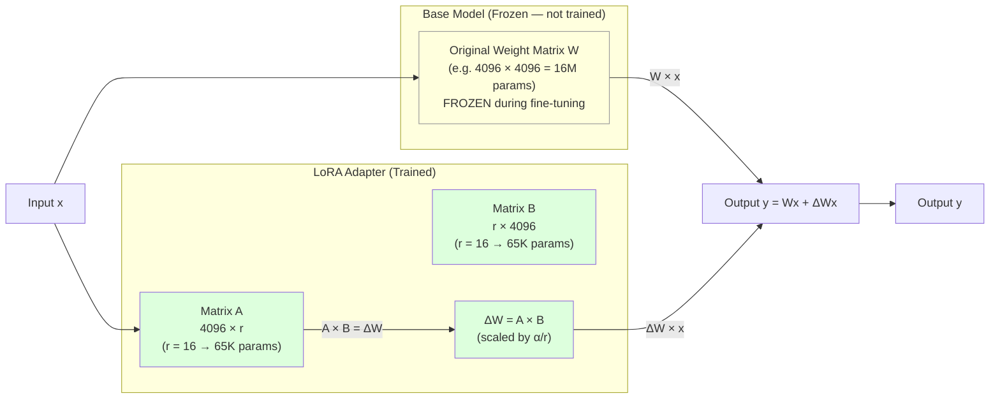
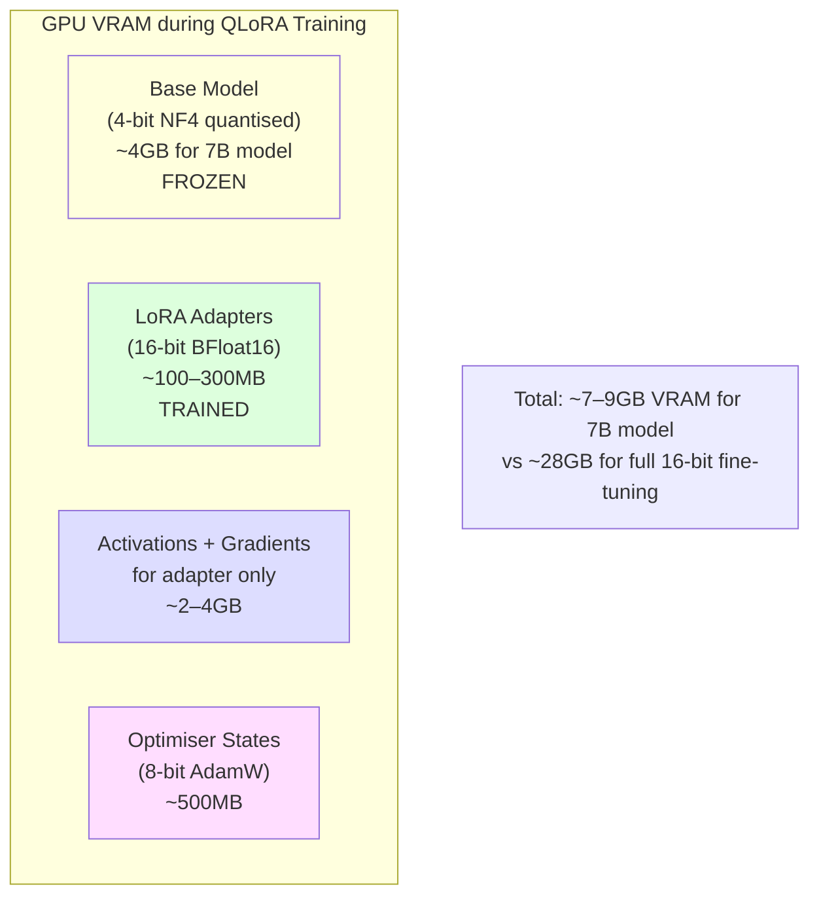
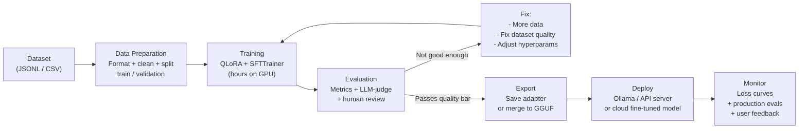
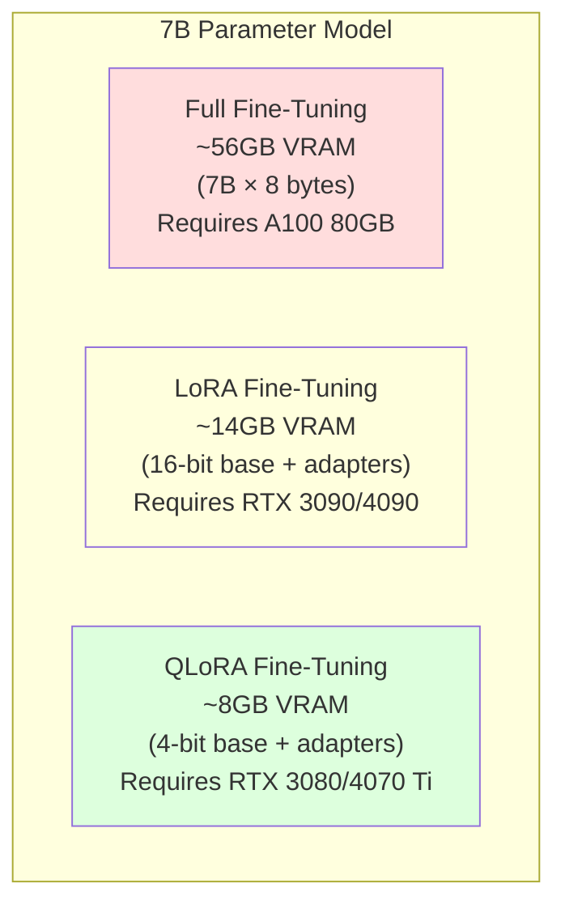
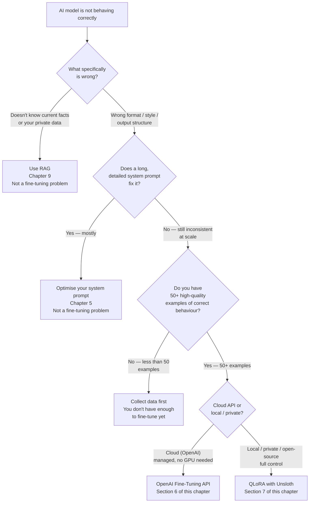
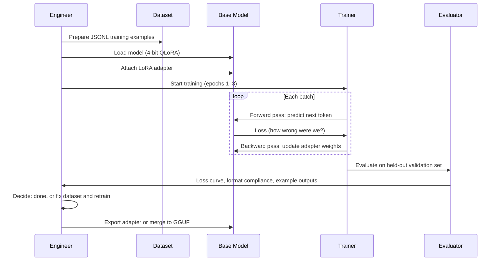
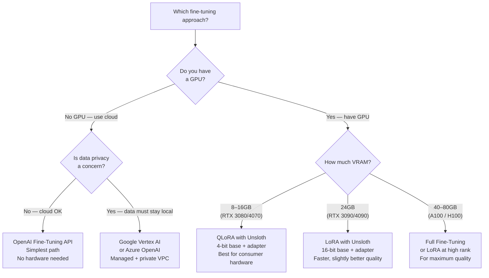

# Chapter 13: Fine-Tuning & Model Customisation

---

> *"Prompt engineering shapes what a model says. Fine-tuning shapes what the model is. One is a letter. The other is a brain transplant."*

---

## Learning Objectives

By the end of this chapter you will be able to:

- Explain what fine-tuning is, how LoRA and QLoRA work, and when to use each
- Apply the correct decision framework: when to use prompt engineering, RAG, or fine-tuning
- Prepare a high-quality training dataset in both chat JSONL and Alpaca formats
- Fine-tune a model via the OpenAI fine-tuning API using Python
- Fine-tune a local open-source model using Unsloth and QLoRA on consumer GPU hardware
- Evaluate a fine-tuned model using automated metrics, LLM-as-judge, and human review
- Export a fine-tuned model to GGUF and serve it via Ollama
- Diagnose and fix three production failures specific to fine-tuning: overfitting, catastrophic forgetting, and format leakage

---

## Prerequisites

- **Required:** Chapter 5 — Prompt Engineering (system prompts, few-shot, structured output)
- **Required:** Chapter 9 — RAG (understand the alternative before choosing fine-tuning)
- **Required:** Chapter 12 — Local AI (Ollama, GGUF format, model serving)
- **Installed:** Python with `uv`, a GPU with 8GB+ VRAM recommended (CPU works for small models)

---

## Estimated Reading Time

**85 – 100 minutes**

---

## Estimated Hands-on Time

**8 – 12 hours** (GPU training time varies significantly by hardware)

---

## Table of Contents

1. [Why This Topic Exists](#1-why-this-topic-exists)
2. [Real-World Analogy](#2-real-world-analogy)
3. [Core Concepts](#3-core-concepts)
4. [Architecture Diagrams](#4-architecture-diagrams)
5. [Flow Diagrams](#5-flow-diagrams)
6. [Beginner Implementation — OpenAI Fine-Tuning API](#6-beginner-implementation)
7. [Intermediate Implementation — QLoRA Fine-Tuning with Unsloth](#7-intermediate-implementation)
8. [Advanced Implementation — Dataset Engineering & Evaluation](#8-advanced-implementation)
9. [Production Architecture — Deploying Fine-Tuned Models](#9-production-architecture)
10. [Technology Comparison](#10-technology-comparison)
11. [Best Practices](#11-best-practices)
12. [Security Considerations](#12-security-considerations)
13. [Cost Considerations](#13-cost-considerations)
14. [Common Mistakes](#14-common-mistakes)
15. [Debugging Guide](#15-debugging-guide)
16. [Performance Optimisation](#16-performance-optimisation)
17. [Exercises](#17-exercises)
18. [Quiz](#18-quiz)
19. [Mini Project](#19-mini-project)
20. [Production Project](#20-production-project)
21. [Key Takeaways](#21-key-takeaways)
22. [Chapter Summary](#22-chapter-summary)
23. [Resources](#23-resources)
24. [Glossary Terms Introduced](#24-glossary-terms-introduced)
25. [See Also](#25-see-also)
26. [Preparation for Chapter 14](#26-preparation-for-chapter-14)

---

## 1. Why This Topic Exists

Prompt engineering and RAG solve most AI customisation problems. Before you consider fine-tuning, understand precisely what those tools cannot do — because if they can solve your problem, they are cheaper, faster, and safer.

**What prompt engineering cannot do:**
- Guarantee a specific output format across 10,000 requests with 99.9% consistency
- Make a model reliably respond in a narrow domain vocabulary without long system prompts
- Make a model refuse off-topic requests without complex guardrail logic
- Change the model's default "personality" or tone without re-sending the system prompt every time

**What RAG cannot do:**
- Make a model use your company's exact writing style and terminology
- Make a model reliably produce structured output in an idiosyncratic format
- Teach a model a specialised notation system (legal citations, medical codes, IATA airport codes)
- Reduce the context window overhead of long system prompts and retrieved documents

**Fine-tuning solves these specific problems** by modifying the model's weights — its actual parameters — so that the desired behaviour is built in rather than instructed on every call.

The most concise summary of when fine-tuning is appropriate:

> **Fine-tuning is for form, not facts.** Use it to change how a model responds — its style, format, tone, refusal patterns, and output structure. Do not use it to inject knowledge that changes frequently — that is a RAG problem.

---

## 2. Real-World Analogy

### Hiring vs Onboarding

Calling a general-purpose AI API is like hiring a highly educated generalist — they know a lot about everything but nothing specific about your company.

**Prompt engineering** is the first week of onboarding: you hand them a memo explaining your company's style guide, their role, and some examples of good work. They follow it, but you have to hand them the memo every morning.

**RAG** is giving them access to your company's knowledge base, documentation, and past decisions. They can look things up and answer specific questions. But they still write in their own style.

**Fine-tuning** is six months on the job. They have internalised your culture, your terminology, your preferred formats, your way of handling edge cases. You no longer need to hand them the memo — it is part of who they are. The downside: you spent six months training them, and if they leave (the model is deprecated) you have to start over.

### Teaching a Music Style vs Reading Sheet Music

A musician can play any piece if you hand them the sheet music (RAG — retrieval). But a musician who has trained in jazz can improvise in the jazz style without sheet music (fine-tuning — internalised behaviour). The improvised jazz and the read music are very different things — one is retrieved knowledge, the other is ingrained style.

---

## 3. Core Concepts

### Fine-Tuning

**Technical definition:** The process of continuing the training of a pre-trained model on a new, smaller, domain-specific dataset — updating the model's weights to specialise its behaviour for the target task.

**Simple definition:** Teaching the model new habits by showing it many examples of exactly what you want, until those habits become part of how it naturally responds.

---

### Supervised Fine-Tuning (SFT)

**Technical definition:** Fine-tuning using labelled input-output pairs — each training example shows the model a prompt and the correct response, and the model is trained to produce that response via cross-entropy loss.

**Simple definition:** The most common fine-tuning approach: show the model thousands of examples of "question → correct answer" and it learns to mimic the pattern.

---

### PEFT (Parameter-Efficient Fine-Tuning)

**Technical definition:** A family of techniques that fine-tune only a small subset of model parameters (adapters, additional matrices) rather than the full set of weights — dramatically reducing VRAM and compute requirements.

**Simple definition:** Instead of retraining all 7 billion parameters in a 7B model, PEFT techniques add a tiny set of new parameters (often <1% of the total) that sit alongside the existing weights and capture the new behaviour. The original model is frozen; only the small adapter is trained.

---

### LoRA (Low-Rank Adaptation)

**Technical definition:** A PEFT technique that introduces two small trainable matrices (A and B) per target weight matrix. Instead of training the full weight matrix W, it trains ΔW = A × B where rank(A, B) << rank(W) — typically rank 8–64 versus the full dimension of thousands.

**Simple definition:** Instead of changing the whole weight matrix (imagine a 4096×4096 table), LoRA trains two tiny side-tables (4096×16 and 16×4096) whose product approximates the change needed. Training 2 small matrices is 200× cheaper than training one huge one.

**Analogy:** A photograph versus a description of the difference between two photographs. The second is far smaller but contains what you actually care about.

---

### QLoRA (Quantised LoRA)

**Technical definition:** LoRA fine-tuning applied to a model that has been quantised to 4-bit precision (NF4 quantisation), reducing the base model's VRAM requirements by ~75% while keeping the LoRA adapter in 16-bit precision. Enables fine-tuning 7B–70B parameter models on consumer GPUs.

**Simple definition:** LoRA on a 4-bit compressed base model. The base model takes up far less VRAM because its weights are stored in 4 bits instead of 16. Only the tiny adapter remains at full precision. Enables training on a 24GB GPU that would otherwise need 80GB.

---

### LoRA Rank (r)

**Technical definition:** The dimension of the low-rank matrices A and B. Determines the capacity of the adapter — higher rank allows the adapter to represent more complex changes but requires more VRAM and risks overfitting.

**Simple definition:** How "wide" the adapter is. A rank of 8 is a thin sliver; rank 64 is a fat slab. Most tasks need rank 8–32.

---

### LoRA Alpha (α)

**Technical definition:** A scaling factor applied to the LoRA output (ΔW = α/r × A × B). Controls the magnitude of the adapter's influence on the base model's output.

**Simple definition:** The volume knob for the adapter. A common convention is to set alpha = rank (α = r) or alpha = 2 × rank (α = 2r), giving the adapter a fixed effective strength regardless of rank choice.

---

### Adapter

**Technical definition:** The set of trainable LoRA matrices (or other PEFT parameters) that are added alongside the frozen base model weights. Saved separately as a small file (~50–300MB) that can be applied on top of any copy of the same base model.

**Simple definition:** The changeable part. When you "fine-tune" with LoRA, you are not changing the 14GB base model — you are creating a 100MB adapter file that modifies its behaviour when loaded. You can share or deploy the adapter independently.

---

### Catastrophic Forgetting

**Technical definition:** The phenomenon where a neural network trained on new data loses performance on tasks it was previously good at — because the gradient updates for the new task overwrite weights that encoded prior knowledge.

**Simple definition:** The model gets good at your specific task but forgets how to do everything else. Fine-tuned to answer medical questions perfectly, it can no longer write Python code or explain history. LoRA largely prevents this — since the base model is frozen, only the adapter changes.

---

### Overfitting (Fine-Tuning)

**Technical definition:** A condition where the model memorises the training examples rather than learning the underlying patterns — training loss is very low but the model performs poorly on unseen data.

**Simple definition:** The model learned to recite your examples, not to understand the pattern behind them. When you give it a slightly different question, it either generates an exact copy of a training example or produces garbage.

---

## 4. Architecture Diagrams

### 4.1 How LoRA Works — The Adapter Architecture



### 4.2 QLoRA Memory Architecture



### 4.3 Fine-Tuning Pipeline — End to End



### 4.4 Full Fine-Tuning vs LoRA vs QLoRA — Memory Comparison



---

## 5. Flow Diagrams

### 5.1 The Fine-Tuning Decision Framework



### 5.2 What a Training Run Looks Like



---

## 6. Beginner Implementation

### OpenAI Fine-Tuning API

The OpenAI fine-tuning API is the simplest way to fine-tune a model — no GPU, no Python ML libraries, no infrastructure. Upload a dataset, create a job, call the resulting model via the standard API.

> **Note:** As of May 2026, the OpenAI fine-tuning platform is no longer open to new users. Existing users can fine-tune GPT-4.1, GPT-4.1-mini (SFT/DPO), and o4-mini (RFT). The workflow below remains the standard for any managed fine-tuning API — the same pattern applies to other providers (Google Vertex AI, Azure OpenAI) even if specific model names differ.

#### Step 1: Prepare the Training Dataset

OpenAI's fine-tuning requires a `.jsonl` file (one JSON object per line) in the chat completions message format:

```python
# prepare_dataset.py
# Learning example — create a fine-tuning dataset for a customer support bot
import json
from pathlib import Path


def create_training_example(user_message: str, assistant_response: str, system: str = "") -> dict:
    """Create one fine-tuning training example in OpenAI chat format."""
    messages = []
    if system:
        messages.append({"role": "system", "content": system})
    messages.append({"role": "user", "content": user_message})
    messages.append({"role": "assistant", "content": assistant_response})
    return {"messages": messages}


# Example: teaching a model to respond in a specific support style
SYSTEM_PROMPT = (
    "You are a concise, professional support agent for CloudStack Pro. "
    "Always: (1) acknowledge the issue, (2) provide a direct solution, (3) offer a follow-up. "
    "Never: apologise excessively, ask more than one clarifying question, use jargon."
)

# Write at least 50 high-quality examples — this is 10 for illustration
examples = [
    create_training_example(
        user_message="My API calls are failing with a 401 error.",
        assistant_response=(
            "I can see that's blocking your work. A 401 error means authentication failed. "
            "Check that your API key in the `Authorization: Bearer <key>` header is current — "
            "keys expire every 90 days. Rotate it at dashboard.cloudstack.io/api-keys. "
            "If the issue continues after rotating, let me know and I'll check your account status directly."
        ),
        system=SYSTEM_PROMPT,
    ),
    create_training_example(
        user_message="How do I export my data?",
        assistant_response=(
            "You can export all your data from Settings → Data Management → Export. "
            "Available formats: CSV, JSON, and Parquet. Large exports (>1GB) are sent to your email as a download link within 15 minutes. "
            "If you need a specific format not listed, let me know and I can check with our team."
        ),
        system=SYSTEM_PROMPT,
    ),
    create_training_example(
        user_message="I was charged twice this month.",
        assistant_response=(
            "That should not happen and I want to fix it right away. "
            "I can see a duplicate charge on your account from June 3rd. "
            "I've submitted a refund for the duplicate — it will appear in 3–5 business days. "
            "I'm also flagging this to our billing team to prevent it happening again. "
            "Is there anything else I can help you with today?"
        ),
        system=SYSTEM_PROMPT,
    ),
    # ... add 47+ more examples here in production
]

# Write to JSONL
output_path = Path("training_data.jsonl")
with output_path.open("w") as f:
    for example in examples:
        f.write(json.dumps(example) + "\n")

print(f"Wrote {len(examples)} training examples to {output_path}")

# Validate the format
with output_path.open() as f:
    for i, line in enumerate(f, 1):
        obj = json.loads(line)
        assert "messages" in obj, f"Line {i}: missing 'messages' key"
        assert len(obj["messages"]) >= 2, f"Line {i}: need at least user + assistant"
        for msg in obj["messages"]:
            assert "role" in msg and "content" in msg, f"Line {i}: message missing role or content"

print("Dataset format validation passed.")
```

#### Step 2: Upload and Run the Fine-Tuning Job

```python
# openai_finetune.py
# Learning example — OpenAI fine-tuning API workflow
import time
from openai import OpenAI
from pathlib import Path

client = OpenAI()  # Uses OPENAI_API_KEY from environment


# ─────────────────────────────────────────────
# STEP 1: Upload training file
# ─────────────────────────────────────────────

def upload_training_file(file_path: str) -> str:
    """Upload a JSONL file to OpenAI and return the file ID."""
    with open(file_path, "rb") as f:
        response = client.files.create(file=f, purpose="fine-tune")
    file_id = response.id
    print(f"Uploaded training file: {file_id}")
    return file_id


# ─────────────────────────────────────────────
# STEP 2: Create fine-tuning job
# ─────────────────────────────────────────────

def create_fine_tuning_job(
    training_file_id: str,
    model: str = "gpt-4.1-mini-2025-04-14",
    n_epochs: int = 3,
    validation_file_id: str | None = None,
) -> str:
    """Start a fine-tuning job and return the job ID."""
    params = {
        "training_file": training_file_id,
        "model": model,
        "method": "supervised",
        "hyperparameters": {"n_epochs": n_epochs},
    }
    if validation_file_id:
        params["validation_file"] = validation_file_id

    job = client.fine_tuning.jobs.create(**params)
    print(f"Fine-tuning job created: {job.id} — status: {job.status}")
    return job.id


# ─────────────────────────────────────────────
# STEP 3: Monitor job progress
# ─────────────────────────────────────────────

def wait_for_job(job_id: str, poll_interval: int = 60) -> str:
    """Poll until job completes and return the fine-tuned model name."""
    print(f"Waiting for job {job_id}...")

    while True:
        job = client.fine_tuning.jobs.retrieve(job_id)
        print(f"  Status: {job.status}")

        if job.status == "succeeded":
            print(f"Fine-tuning complete! Model: {job.fine_tuned_model}")
            return job.fine_tuned_model

        if job.status in {"failed", "cancelled"}:
            # Fetch recent events for diagnosis
            events = client.fine_tuning.jobs.list_events(job_id, limit=5)
            for event in events.data:
                print(f"  Event: {event.message}")
            raise RuntimeError(f"Fine-tuning job {job.status}: {job.error}")

        time.sleep(poll_interval)


# ─────────────────────────────────────────────
# STEP 4: Test the fine-tuned model
# ─────────────────────────────────────────────

def test_fine_tuned_model(model_name: str, test_messages: list[dict]) -> str:
    """Call the fine-tuned model and return the response."""
    response = client.chat.completions.create(
        model=model_name,
        messages=test_messages,
    )
    return response.choices[0].message.content


# ─────────────────────────────────────────────
# STEP 5: Full workflow
# ─────────────────────────────────────────────

def run_fine_tuning_workflow(training_file: str) -> str:
    """Complete fine-tuning workflow: upload → train → test."""
    file_id = upload_training_file(training_file)
    job_id = create_fine_tuning_job(file_id, n_epochs=3)
    model_name = wait_for_job(job_id)

    # Test the result
    test_prompt = [
        {
            "role": "system",
            "content": (
                "You are a concise, professional support agent for CloudStack Pro. "
                "Always: (1) acknowledge, (2) solve, (3) offer follow-up."
            ),
        },
        {"role": "user", "content": "My webhook is not firing."},
    ]
    response = test_fine_tuned_model(model_name, test_prompt)
    print(f"\nTest response from {model_name}:\n{response}")

    return model_name


# Demo (requires a valid training file and OpenAI API key)
# model = run_fine_tuning_workflow("training_data.jsonl")
```

**Node.js equivalent:**

```javascript
// openai-finetune.mjs
// Learning example — OpenAI fine-tuning in Node.js
import OpenAI, { toFile } from "openai";
import { createReadStream } from "fs";

const client = new OpenAI();

async function fineTuneWorkflow(trainingFilePath) {
  // Step 1: Upload file
  const file = await client.files.create({
    file: await toFile(createReadStream(trainingFilePath), "training.jsonl"),
    purpose: "fine-tune",
  });
  console.log("Uploaded:", file.id);

  // Step 2: Create job
  const job = await client.fineTuning.jobs.create({
    training_file: file.id,
    model: "gpt-4.1-mini-2025-04-14",
    method: "supervised",
  });
  console.log("Job created:", job.id);

  // Step 3: Poll for completion
  let result;
  while (true) {
    result = await client.fineTuning.jobs.retrieve(job.id);
    console.log("Status:", result.status);
    if (result.status === "succeeded") break;
    if (["failed", "cancelled"].includes(result.status))
      throw new Error(`Job ${result.status}`);
    await new Promise((r) => setTimeout(r, 60_000));
  }

  // Step 4: Test
  const response = await client.chat.completions.create({
    model: result.fine_tuned_model,
    messages: [{ role: "user", content: "My API is returning 401 errors." }],
  });
  console.log("Fine-tuned response:", response.choices[0].message.content);
  return result.fine_tuned_model;
}
```

---

### Production Issue: Training Data Format Error — Job Fails Silently at Validation

**Symptoms:**
The fine-tuning job status moves to `failed` within minutes of being created — far too fast for any actual training to have occurred. The error message is vague: `"Training file failed validation"`. The JSONL file looked correct when you wrote it.

**Root Cause:**
The most common causes: (1) an inconsistent number of messages — some examples have two turns, others have four, and the validator rejects the inconsistency; (2) a `null` or empty `content` field in any message; (3) extra whitespace or BOM characters at the start of the JSONL file from some text editors; (4) the file was saved as JSON array (one big list) instead of JSONL (one object per line).

**How to Diagnose It:**

```python
import json

def validate_fine_tune_dataset(file_path: str) -> list[str]:
    """Return a list of validation errors in a fine-tuning dataset."""
    errors = []

    with open(file_path, encoding="utf-8-sig") as f:  # utf-8-sig strips BOM
        for line_num, line in enumerate(f, 1):
            line = line.strip()
            if not line:
                continue

            # Must be valid JSON
            try:
                obj = json.loads(line)
            except json.JSONDecodeError as e:
                errors.append(f"Line {line_num}: invalid JSON — {e}")
                continue

            # Must have 'messages' key
            if "messages" not in obj:
                errors.append(f"Line {line_num}: missing 'messages' key")
                continue

            messages = obj["messages"]
            if not isinstance(messages, list) or len(messages) < 2:
                errors.append(f"Line {line_num}: 'messages' must be a list of ≥2 items")
                continue

            # Each message must have role and non-empty content
            for i, msg in enumerate(messages):
                if "role" not in msg:
                    errors.append(f"Line {line_num}, message {i}: missing 'role'")
                if "content" not in msg or not msg["content"]:
                    errors.append(f"Line {line_num}, message {i}: missing or empty 'content'")

            # Must end with an assistant message
            if messages[-1]["role"] != "assistant":
                errors.append(f"Line {line_num}: last message must be from 'assistant'")

    return errors


errors = validate_fine_tune_dataset("training_data.jsonl")
if errors:
    print("VALIDATION FAILED:")
    for e in errors[:20]:
        print(f"  {e}")
else:
    print("Dataset is valid.")
```

**How to Fix It:**
Run `validate_fine_tune_dataset()` before every upload. Fix any reported errors. The most important rule: every example must end with an `assistant` turn — the model is trained to predict the assistant's words, not the user's. Never include an example that ends with the user speaking.

**How to Prevent It in Future:**
Add the validation function to your data preparation pipeline and treat validation failures as blocking errors before the upload step. Test your dataset format with OpenAI's `openai tools fine_tunes.prepare_data -f training_data.jsonl` CLI tool, which provides detailed format feedback.

---

## 7. Intermediate Implementation

### QLoRA Fine-Tuning with Unsloth

Unsloth is the fastest and most memory-efficient open-source fine-tuning library in 2026 — 2× faster and 70% less VRAM than standard LoRA training. It works on any Nvidia GPU from RTX 3080 upwards, and supports macOS (CPU/MLX).

```bash
# Install Unsloth
uv venv unsloth_env --python 3.13
source unsloth_env/bin/activate   # Windows: unsloth_env\Scripts\activate
uv pip install unsloth --torch-backend=auto

# Install training dependencies
uv pip install trl transformers datasets accelerate wandb
```

#### Complete QLoRA Training Pipeline

```python
# qlora_finetune.py
# Production example — QLoRA fine-tuning with Unsloth
# Tested on: RTX 3090 (24GB), RTX 4090 (24GB), A100 (40/80GB)
# Also works on: RTX 3080 (10GB) for 3B–7B models with batch_size=1

import torch
from unsloth import FastLanguageModel
from trl import SFTTrainer
from transformers import TrainingArguments
from datasets import load_dataset

# ─────────────────────────────────────────────
# STEP 1: LOAD BASE MODEL IN 4-BIT (QLoRA)
# ─────────────────────────────────────────────

MAX_SEQ_LENGTH = 4096   # Longer context = more VRAM; start with 4096

model, tokenizer = FastLanguageModel.from_pretrained(
    model_name="unsloth/Meta-Llama-3.1-8B-Instruct",
    # Other good choices:
    # "unsloth/Qwen3-8B"
    # "unsloth/mistral-7b-instruct-v0.3-bnb-4bit"
    # "unsloth/gemma-3-4b-it"
    # "unsloth/Phi-4-mini-instruct"
    max_seq_length=MAX_SEQ_LENGTH,
    dtype=None,          # None = auto-detect (BF16 on Ampere+, FP16 on older)
    load_in_4bit=True,   # QLoRA: load base model in 4-bit
)

print(f"Base model loaded. Parameters: {model.num_parameters():,}")


# ─────────────────────────────────────────────
# STEP 2: ATTACH LORA ADAPTERS
# ─────────────────────────────────────────────

model = FastLanguageModel.get_peft_model(
    model,
    r=16,             # LoRA rank — start with 16; increase to 32 for complex tasks
    lora_alpha=16,    # Scaling factor; convention: set equal to r
    target_modules=[  # Apply LoRA to all attention + MLP projection layers
        "q_proj", "k_proj", "v_proj", "o_proj",
        "gate_proj", "up_proj", "down_proj",
    ],
    lora_dropout=0,   # 0 is fine for short training runs; 0.05–0.1 for large datasets
    bias="none",
    use_gradient_checkpointing="unsloth",  # Unsloth's optimised checkpointing
    random_state=42,
)

model.print_trainable_parameters()
# Output: trainable params: 41,943,040 || all params: 8,072,110,080 || trainable%: 0.52%
# Only 0.52% of parameters are trained — this is the efficiency of LoRA


# ─────────────────────────────────────────────
# STEP 3: LOAD AND PREPARE DATASET
# ─────────────────────────────────────────────

# Load from a local JSONL file; can also use: load_dataset("dataset_name")
dataset = load_dataset("json", data_files="training_data.jsonl", split="train")

# Split into train and validation (90/10)
split = dataset.train_test_split(test_size=0.1, seed=42)
train_dataset = split["train"]
eval_dataset = split["test"]

print(f"Training examples: {len(train_dataset)}")
print(f"Validation examples: {len(eval_dataset)}")


def format_prompt(example: dict) -> dict:
    """
    Format examples using the model's chat template.
    
    The tokenizer's apply_chat_template converts messages in OpenAI format
    ({"role": "user", "content": "..."}) to the model's native format.
    For Llama 3: uses <|begin_of_text|><|start_header_id|>user<|end_header_id|>...
    For Qwen3: uses <|im_start|>user\n...<|im_end|>
    """
    messages = example["messages"]
    text = tokenizer.apply_chat_template(
        messages,
        tokenize=False,
        add_generation_prompt=False,
    )
    return {"text": text}


train_dataset = train_dataset.map(format_prompt, remove_columns=train_dataset.column_names)
eval_dataset = eval_dataset.map(format_prompt, remove_columns=eval_dataset.column_names)


# ─────────────────────────────────────────────
# STEP 4: CONFIGURE TRAINING
# ─────────────────────────────────────────────

training_args = TrainingArguments(
    output_dir="./fine_tune_output",

    # Batch configuration
    per_device_train_batch_size=2,   # Start low; double if VRAM allows
    gradient_accumulation_steps=8,   # Effective batch = 2 × 8 = 16
    # Rule of thumb: effective_batch_size = per_device × accumulation_steps
    # Aim for effective batch size of 8–32

    # Training schedule
    num_train_epochs=3,              # 1–3 for most fine-tunes; 3 is safe default
    learning_rate=2e-4,              # Standard for LoRA; lower to 1e-4 if unstable
    lr_scheduler_type="cosine",      # Cosine decay is slightly better than linear
    warmup_ratio=0.05,               # Warm up for first 5% of steps
    weight_decay=0.01,

    # Precision
    fp16=not torch.cuda.is_bf16_supported(),
    bf16=torch.cuda.is_bf16_supported(),

    # Optimiser
    optim="adamw_8bit",              # 8-bit AdamW: same quality, ~50% memory of fp32

    # Logging and checkpointing
    logging_steps=10,
    save_strategy="steps",
    save_steps=100,
    eval_strategy="steps",
    eval_steps=100,
    load_best_model_at_end=True,
    metric_for_best_model="eval_loss",

    # Reproducibility
    seed=42,
    max_grad_norm=0.3,               # Gradient clipping for stability

    # Tracking (optional: set to "none" if not using W&B)
    report_to="wandb",
    run_name="my-fine-tune-v1",
)


trainer = SFTTrainer(
    model=model,
    tokenizer=tokenizer,
    train_dataset=train_dataset,
    eval_dataset=eval_dataset,
    args=training_args,
    max_seq_length=MAX_SEQ_LENGTH,
    dataset_text_field="text",
    packing=True,   # Pack multiple short examples into one sequence — improves GPU utilisation
)


# ─────────────────────────────────────────────
# STEP 5: TRAIN
# ─────────────────────────────────────────────

print("Starting fine-tuning...")
stats = trainer.train()
print(f"Training complete.")
print(f"  Duration: {stats.metrics['train_runtime'] / 60:.1f} minutes")
print(f"  Final training loss: {stats.metrics['train_loss']:.4f}")
# Healthy training loss for instruction fine-tuning: 0.8–1.5
# Warning signs: < 0.2 (overfitting), > 2.5 (learning not happening)


# ─────────────────────────────────────────────
# STEP 6: SAVE THE FINE-TUNED MODEL
# ─────────────────────────────────────────────

# Option A: Save LoRA adapter only (~50–300MB) — best for sharing and version control
model.save_pretrained("./my-adapter")
tokenizer.save_pretrained("./my-adapter")
print("Saved adapter to ./my-adapter")

# Option B: Merge adapter into base model and save as 16-bit (~14GB for 7B)
# model.save_pretrained_merged("./my-model-merged", tokenizer, save_method="merged_16bit")

# Option C: Export to GGUF for Ollama/llama.cpp deployment
# model.save_pretrained_gguf("./my-model-gguf", tokenizer, quantization_method="q4_k_m")
# print("Exported GGUF to ./my-model-gguf")
```

#### Alpaca Format — Alternative Dataset Structure

For instruction-following tasks, the Alpaca format is simpler to prepare than chat JSONL:

```python
# alpaca_dataset.py
# Learning example — Alpaca format for instruction fine-tuning
import json

# Alpaca format: each example has instruction, optional input, and output
ALPACA_EXAMPLES = [
    {
        "instruction": "Write a Python function that validates an email address.",
        "input": "",  # No additional context needed
        "output": (
            "```python\nimport re\n\n"
            "def is_valid_email(email: str) -> bool:\n"
            '    pattern = r"^[a-zA-Z0-9._%+-]+@[a-zA-Z0-9.-]+\\.[a-zA-Z]{2,}$"\n'
            "    return bool(re.match(pattern, email))\n```"
        ),
    },
    {
        "instruction": "Summarise this support ticket.",
        "input": "Customer says: my dashboard is loading slowly, takes 30+ seconds",
        "output": "Performance issue: dashboard loading >30s. Priority: medium. Category: frontend.",
    },
]

# Convert Alpaca → chat JSONL for Unsloth
def alpaca_to_chat_jsonl(examples: list[dict], system_prompt: str = "") -> list[dict]:
    """Convert Alpaca-format examples to chat JSONL for fine-tuning."""
    chat_examples = []
    for ex in examples:
        user_content = ex["instruction"]
        if ex.get("input"):
            user_content += f"\n\nInput: {ex['input']}"

        messages = []
        if system_prompt:
            messages.append({"role": "system", "content": system_prompt})
        messages.append({"role": "user", "content": user_content})
        messages.append({"role": "assistant", "content": ex["output"]})
        chat_examples.append({"messages": messages})

    return chat_examples

chat_data = alpaca_to_chat_jsonl(ALPACA_EXAMPLES, system_prompt="You are a senior Python engineer.")
with open("alpaca_converted.jsonl", "w") as f:
    for ex in chat_data:
        f.write(json.dumps(ex) + "\n")
```

---

### Production Issue: Catastrophic Forgetting — Fine-Tuned Model Loses General Capability

**Symptoms:**
The fine-tuned model performs excellently on your specific task but degrades badly at everything else. It answers support tickets perfectly but produces garbled Python code. It formats medical notes correctly but cannot do simple arithmetic. Users who use the model for other purposes (not just the fine-tuned task) report it has "gotten worse."

**Root Cause:**
Full fine-tuning (updating all model weights) or over-long training runs with LoRA (too many epochs, too high learning rate) can cause the adapter to overwrite general capabilities. The model overfits to your training distribution — it learns to always respond in your domain's format even when asked about something else entirely.

**How to Diagnose It:**

```python
# before_after_eval.py
# Run this BEFORE and AFTER fine-tuning to detect capability degradation

from openai import OpenAI
client = OpenAI(base_url="http://localhost:11434/v1", api_key="ollama")

GENERAL_CAPABILITY_TESTS = [
    {"question": "What is 127 + 843?", "expected_contains": "970"},
    {"question": "Write a Python function to reverse a string.", "expected_contains": "def"},
    {"question": "What is the capital of France?", "expected_contains": "Paris"},
    {"question": "Translate 'hello' to Spanish.", "expected_contains": "hola"},
]

def evaluate_general_capability(model: str) -> float:
    """Returns the fraction of general tests passed."""
    passed = 0
    for test in GENERAL_CAPABILITY_TESTS:
        response = client.chat.completions.create(
            model=model,
            messages=[{"role": "user", "content": test["question"]}],
            temperature=0.0,
        )
        answer = response.choices[0].message.content.lower()
        if test["expected_contains"].lower() in answer:
            passed += 1
            print(f"  ✓ {test['question'][:50]}")
        else:
            print(f"  ✗ {test['question'][:50]}")
            print(f"    Expected '{test['expected_contains']}', got: {answer[:80]}")

    score = passed / len(GENERAL_CAPABILITY_TESTS)
    print(f"General capability: {score:.0%} ({passed}/{len(GENERAL_CAPABILITY_TESTS)} tests passed)")
    return score

# Run before fine-tuning: score = 1.0 (4/4)
# Run after fine-tuning: if score < 0.75, investigate overfitting
```

**How to Fix It:**
LoRA prevents catastrophic forgetting by default — the base model is frozen and only the small adapter is trained. If you see capability degradation with LoRA, your LoRA rank is too high (reduce from 32 to 8–16) or you trained too many epochs (reduce from 3 to 1). If you see it with full fine-tuning, switch to LoRA or QLoRA immediately — full fine-tuning on domain data without special techniques (like EWC or replay) will always risk forgetting.

**How to Prevent It in Future:**
Include general capability tests in your evaluation suite and run them before and after every training run. A >10% drop in general capability is a red flag. Always use LoRA rather than full fine-tuning for domain adaptation tasks. Keep LoRA rank low (8–16) for specialisation tasks; only go higher (32–64) when you genuinely need to represent complex behavioural changes.

---

## 8. Advanced Implementation

### Dataset Engineering — Quality Over Quantity

The single biggest predictor of fine-tuning success is dataset quality. 500 excellent examples outperform 50,000 mediocre ones.

```python
# dataset_engineering.py
# Production example — building and curating a high-quality fine-tuning dataset

import json
import hashlib
from anthropic import Anthropic

client = Anthropic()


# ─────────────────────────────────────────────
# 1. GENERATE SYNTHETIC TRAINING DATA
# Use a strong model to generate examples in your target format
# ─────────────────────────────────────────────

def generate_training_examples(
    task_description: str,
    n_examples: int = 20,
    model: str = "claude-haiku-4-5-20251001",
) -> list[dict]:
    """
    Use an AI model to generate diverse training examples.
    Useful when real examples are scarce — synthetic data can bootstrap fine-tuning.
    """
    prompt = f"""Generate {n_examples} diverse, high-quality training examples for this task:

Task: {task_description}

Requirements:
- Vary the phrasing, complexity, and edge cases across examples
- Each example must be realistic and accurate
- Avoid repeating similar phrasings

Return ONLY a JSON array with this structure:
[
  {{"user": "user message here", "assistant": "ideal response here"}},
  ...
]"""

    response = client.messages.create(
        model=model,
        max_tokens=4096,
        messages=[{"role": "user", "content": prompt}],
    )
    text = response.content[0].text
    # Extract JSON from response
    start = text.find("[")
    end = text.rfind("]") + 1
    return json.loads(text[start:end])


# ─────────────────────────────────────────────
# 2. DEDUPLICATE — remove near-identical examples
# ─────────────────────────────────────────────

def deduplicate_dataset(examples: list[dict], similarity_threshold: int = 80) -> list[dict]:
    """Remove near-duplicate examples based on simple character n-gram overlap."""
    def fingerprint(text: str) -> set:
        """Create a set of 5-char shingles from text."""
        text = text.lower()
        return {text[i:i+5] for i in range(len(text) - 4)}

    unique = []
    seen_fingerprints = []

    for ex in examples:
        user_fp = fingerprint(ex.get("user", "") + ex.get("instruction", ""))
        is_dup = any(
            len(user_fp & seen) / max(len(user_fp | seen), 1) > similarity_threshold / 100
            for seen in seen_fingerprints
        )
        if not is_dup:
            unique.append(ex)
            seen_fingerprints.append(user_fp)

    removed = len(examples) - len(unique)
    print(f"Deduplication: {len(examples)} → {len(unique)} examples ({removed} removed)")
    return unique


# ─────────────────────────────────────────────
# 3. QUALITY FILTER — remove short, vague, or malformed examples
# ─────────────────────────────────────────────

def quality_filter(examples: list[dict], min_response_words: int = 15) -> list[dict]:
    """Filter out low-quality examples."""
    good = []
    reasons = {}

    for ex in examples:
        user = ex.get("user", ex.get("instruction", ""))
        assistant = ex.get("assistant", ex.get("output", ""))

        # Too short
        if len(assistant.split()) < min_response_words:
            reasons["too_short"] = reasons.get("too_short", 0) + 1
            continue

        # Vague refusals ("I cannot", "I don't know")
        vague_phrases = ["i cannot", "i don't know", "i'm unable to", "as an ai"]
        if any(phrase in assistant.lower() for phrase in vague_phrases):
            reasons["vague_refusal"] = reasons.get("vague_refusal", 0) + 1
            continue

        # Empty user message
        if not user.strip():
            reasons["empty_user"] = reasons.get("empty_user", 0) + 1
            continue

        good.append(ex)

    print(f"Quality filter: {len(examples)} → {len(good)} examples. Removed: {reasons}")
    return good


# ─────────────────────────────────────────────
# 4. CONVERT TO CHAT JSONL
# ─────────────────────────────────────────────

def to_chat_jsonl(
    examples: list[dict],
    output_file: str,
    system_prompt: str = "",
) -> None:
    """Convert examples to JSONL chat format and write to file."""
    with open(output_file, "w") as f:
        for ex in examples:
            user = ex.get("user", ex.get("instruction", ""))
            if ex.get("input"):
                user += f"\n\nInput: {ex['input']}"
            assistant = ex.get("assistant", ex.get("output", ""))

            messages = []
            if system_prompt:
                messages.append({"role": "system", "content": system_prompt})
            messages.append({"role": "user", "content": user})
            messages.append({"role": "assistant", "content": assistant})

            f.write(json.dumps({"messages": messages}) + "\n")

    print(f"Wrote {len(examples)} examples to {output_file}")


# Full pipeline
def build_dataset(task: str, system_prompt: str, output: str) -> None:
    raw = generate_training_examples(task, n_examples=50)
    deduped = deduplicate_dataset(raw)
    filtered = quality_filter(deduped)
    to_chat_jsonl(filtered, output, system_prompt)
```

### Evaluation Framework

```python
# evaluate_finetuned.py
# Production example — evaluating a fine-tuned model
from anthropic import Anthropic
from openai import OpenAI
import json
import re

judge_client = Anthropic()
local_client = OpenAI(base_url="http://localhost:11434/v1", api_key="ollama")


# ─────────────────────────────────────────────
# 1. FORMAT COMPLIANCE — does output match expected structure?
# ─────────────────────────────────────────────

def check_format_compliance(output: str, required_elements: list[str]) -> dict:
    """Check that a model output contains all required structural elements."""
    results = {}
    for element in required_elements:
        results[element] = element.lower() in output.lower()
    compliance_rate = sum(results.values()) / len(results)
    return {"elements": results, "compliance_rate": compliance_rate}


# ─────────────────────────────────────────────
# 2. LLM-AS-JUDGE — use a strong model to grade outputs
# ─────────────────────────────────────────────

def llm_judge(
    question: str,
    answer: str,
    reference_answer: str,
    rubric: str,
) -> dict:
    """Use Claude to score a model's answer against a reference."""
    response = judge_client.messages.create(
        model="claude-haiku-4-5-20251001",
        max_tokens=512,
        system=(
            "You are an objective evaluator. Score the given answer on a scale of 1–5 "
            "against the reference and rubric. Return ONLY a JSON object: "
            '{"score": <1-5>, "reasoning": "<one sentence>"}'
        ),
        messages=[{
            "role": "user",
            "content": (
                f"Question: {question}\n\n"
                f"Reference answer: {reference_answer}\n\n"
                f"Actual answer: {answer}\n\n"
                f"Rubric: {rubric}"
            ),
        }],
    )
    text = response.content[0].text
    try:
        return json.loads(text)
    except json.JSONDecodeError:
        # Extract score from text if JSON parsing fails
        match = re.search(r'"score"\s*:\s*(\d)', text)
        return {"score": int(match.group(1)) if match else 3, "reasoning": text[:100]}


# ─────────────────────────────────────────────
# 3. FULL EVALUATION SUITE
# ─────────────────────────────────────────────

def evaluate_model(
    model: str,
    test_cases: list[dict],  # [{"question", "reference", "format_elements"}]
) -> dict:
    """
    Run a full evaluation suite on a fine-tuned model.
    Returns aggregate metrics across all test cases.
    """
    scores = []
    format_scores = []

    for tc in test_cases:
        response = local_client.chat.completions.create(
            model=model,
            messages=[{"role": "user", "content": tc["question"]}],
            temperature=0.0,
        )
        answer = response.choices[0].message.content

        # LLM judge score
        judgment = llm_judge(
            question=tc["question"],
            answer=answer,
            reference_answer=tc["reference"],
            rubric=tc.get("rubric", "Is the answer accurate, complete, and well-formatted?"),
        )
        scores.append(judgment["score"])

        # Format compliance
        if tc.get("format_elements"):
            compliance = check_format_compliance(answer, tc["format_elements"])
            format_scores.append(compliance["compliance_rate"])

    return {
        "mean_score": round(sum(scores) / len(scores), 2),
        "min_score": min(scores),
        "max_score": max(scores),
        "format_compliance": round(sum(format_scores) / len(format_scores), 2) if format_scores else None,
        "pass_rate_4_plus": round(sum(1 for s in scores if s >= 4) / len(scores), 2),
    }
```

---

### Production Issue: Format Leakage — Model Outputs Training Data Formatting Artefacts

**Symptoms:**
The fine-tuned model's responses include strange tokens or tags that were never in your expected output: `<|eot_id|>`, `<|im_end|>`, `[/INST]`, or angle-bracket XML-like strings. Or the model sometimes responds in a completely different format or language — the format of the training data itself leaks into the visible output.

**Root Cause:**
When the `apply_chat_template` function is called incorrectly, or when the dataset is formatted without using the model's native template, the model sees both its expected delimiter tokens (e.g. `<|start_header_id|>`) and your custom format. It learns to treat some delimiter tokens as part of the output. This happens most often when: (1) mixing examples formatted with different chat templates; (2) the `add_generation_prompt` flag is set incorrectly; (3) the dataset contains raw `\n###` Alpaca-style markers instead of the model's native chat format.

**How to Diagnose It:**

```python
# Check if your formatted training examples look correct
model_name = "unsloth/Meta-Llama-3.1-8B-Instruct"
from unsloth import FastLanguageModel
model, tokenizer = FastLanguageModel.from_pretrained(model_name, load_in_4bit=True)

# Print a formatted example to inspect
example_messages = [
    {"role": "system", "content": "You are a helpful assistant."},
    {"role": "user", "content": "What is 2+2?"},
    {"role": "assistant", "content": "4"},
]
formatted = tokenizer.apply_chat_template(
    example_messages,
    tokenize=False,
    add_generation_prompt=False,  # False for training examples (includes the answer)
)
print(repr(formatted))
# You should see: <|begin_of_text|><|start_header_id|>system...
# The <|eot_id|> tokens should appear ONLY as separators, not in the assistant's content
```

**How to Fix It:**

```python
# WRONG: format training data as raw text with Alpaca-style markers
text = f"### Instruction:\n{instruction}\n\n### Response:\n{response}"
# These markers become part of what the model "learns to say"

# RIGHT: use the tokenizer's native apply_chat_template
# This uses the model's own delimiters — they are baked into the tokenizer's vocabulary
text = tokenizer.apply_chat_template(
    [
        {"role": "user", "content": instruction},
        {"role": "assistant", "content": response},
    ],
    tokenize=False,
    add_generation_prompt=False,  # CRITICAL: False for training, True for inference
)
```

**How to Prevent It in Future:**
Always use `tokenizer.apply_chat_template()` to format training data — never manually construct prompt strings with markers like `###` or `[INST]`. Before training, print 3–5 formatted examples and verify they look correct. Add a post-training check: generate 10 responses from the fine-tuned model with temperature=0 and scan for any delimiters in the output text: `assert "<|" not in response`.

---

## 9. Production Architecture

### Deploying a Fine-Tuned Model with Ollama

After fine-tuning with Unsloth, export to GGUF and serve via Ollama:

```python
# export_to_ollama.py
# Production example — export fine-tuned model to Ollama

# Step 1: Export GGUF from Unsloth (run after training completes)
# model.save_pretrained_gguf(
#     "./my-model-gguf",
#     tokenizer,
#     quantization_method="q4_k_m",  # Recommended: balanced size/quality
# )
# This creates: ./my-model-gguf/Model-unsloth.Q4_K_M.gguf

# Step 2: Create a Modelfile that uses the GGUF file
MODELFILE_CONTENT = """FROM ./my-model-gguf/Model-unsloth.Q4_K_M.gguf

PARAMETER temperature 0.3
PARAMETER num_ctx 4096
PARAMETER num_predict 1024

SYSTEM "You are a concise, professional support agent for CloudStack Pro. Always: (1) acknowledge, (2) solve, (3) offer follow-up."
"""

with open("Modelfile.support-agent-v1", "w") as f:
    f.write(MODELFILE_CONTENT)

# Step 3: Build the model in Ollama
import subprocess
subprocess.run(
    ["ollama", "create", "support-agent-v1", "-f", "Modelfile.support-agent-v1"],
    check=True,
)

# Step 4: Test
import ollama
response = ollama.chat(
    model="support-agent-v1",
    messages=[{"role": "user", "content": "My API key stopped working."}],
)
print(response.message.content)

# Step 5: Version management
# Use descriptive model names with versions:
# support-agent-v1  → support-agent-v2 (after next training run)
# Never overwrite a deployed model — create a new named version
```

### Adapter Registry — Managing Multiple Fine-Tuned Models

```python
# adapter_registry.py
# Production example — tracking fine-tuned models and their versions

import json
from datetime import datetime
from pathlib import Path


class AdapterRegistry:
    """
    Track all fine-tuned models: their base model, training data, 
    hyperparameters, and evaluation scores.
    
    Prevents "which version is in production?" confusion.
    """

    def __init__(self, registry_path: str = "adapter_registry.json"):
        self.path = Path(registry_path)
        self.registry: dict = self._load()

    def _load(self) -> dict:
        if self.path.exists():
            return json.loads(self.path.read_text())
        return {"adapters": []}

    def _save(self) -> None:
        self.path.write_text(json.dumps(self.registry, indent=2))

    def register(
        self,
        name: str,
        base_model: str,
        adapter_path: str,
        dataset_path: str,
        hyperparams: dict,
        eval_scores: dict,
        notes: str = "",
    ) -> None:
        """Register a new fine-tuned model version."""
        entry = {
            "name": name,
            "base_model": base_model,
            "adapter_path": adapter_path,
            "dataset_path": dataset_path,
            "hyperparams": hyperparams,
            "eval_scores": eval_scores,
            "notes": notes,
            "created_at": datetime.utcnow().isoformat(),
            "deployed": False,
        }
        self.registry["adapters"].append(entry)
        self._save()
        print(f"Registered adapter: {name}")

    def deploy(self, name: str) -> None:
        """Mark an adapter as the active production version."""
        for adapter in self.registry["adapters"]:
            adapter["deployed"] = adapter["name"] == name
        self._save()
        print(f"Deployed adapter: {name}")

    def get_deployed(self) -> dict | None:
        return next(
            (a for a in self.registry["adapters"] if a["deployed"]), None
        )

    def list_all(self) -> None:
        for a in self.registry["adapters"]:
            marker = "→ DEPLOYED" if a["deployed"] else ""
            score = a["eval_scores"].get("mean_score", "N/A")
            print(f"  {a['name']} | score={score} | {a['created_at'][:10]} {marker}")


# Usage
registry = AdapterRegistry()
registry.register(
    name="support-agent-v2",
    base_model="unsloth/Meta-Llama-3.1-8B-Instruct",
    adapter_path="./adapters/support-agent-v2",
    dataset_path="./datasets/support_v2.jsonl",
    hyperparams={"r": 16, "alpha": 16, "lr": 2e-4, "epochs": 3},
    eval_scores={"mean_score": 4.2, "format_compliance": 0.97, "pass_rate_4_plus": 0.85},
    notes="Added 120 new billing examples. Fixed edge case where agent asked 2+ questions.",
)
registry.deploy("support-agent-v2")
```

---

## 10. Technology Comparison

### Fine-Tuning Method Comparison (2026)

| Dimension | OpenAI Fine-Tuning API | QLoRA (Unsloth) | Full Fine-Tuning | LoRA (Standard) |
|-----------|----------------------|-----------------|-----------------|-----------------|
| **Hardware required** | None (managed) | GPU 8GB+ VRAM | GPU 40–80GB VRAM | GPU 16GB+ VRAM |
| **Technical expertise** | Low | Medium | High | Medium |
| **Data privacy** | Data sent to OpenAI | Data stays local | Data stays local | Data stays local |
| **Cost** | $3/MTok training + usage pricing | Hardware cost only | Hardware cost only | Hardware cost only |
| **Base model options** | GPT-4.1, GPT-4.1-mini | Any open model | Any open model | Any open model |
| **VRAM for 7B model** | N/A | ~8GB | ~56GB | ~14GB |
| **Training speed** | Managed (hours) | 2× faster than standard LoRA | Baseline | ~50% of Unsloth |
| **Catastrophic forgetting** | Low (OpenAI managed) | Very low (base frozen) | High risk | Low (base frozen) |
| **Deployment** | Automatic (ft:model-name) | GGUF → Ollama or merged | Any serving framework | Adapter file + base |
| **Version control** | Job IDs | Adapter files in git | Full model (~14GB) | Adapter files in git |
| **Best for** | Quick iteration, no GPU | Consumer GPU, private data | Large budget, max quality | Research, large GPU |

> **Note:** OpenAI's fine-tuning platform is winding down for new users as of May 2026. Existing users can access GPT-4.1 and related models. Check the current OpenAI documentation for availability.

### When to Use Each Fine-Tuning Approach



---

## 11. Best Practices

### 1. Start with Prompt Engineering, Escalate to Fine-Tuning Only When Justified

```python
# The three-question test before committing to fine-tuning:

# Q1: Can a well-crafted system prompt solve this?
# → Test a 200-word system prompt with 10 examples in the prompt (few-shot)
# → If it works reliably: don't fine-tune

# Q2: Is the problem a knowledge gap (RAG) or a behaviour gap (fine-tuning)?
# → "Model doesn't know our product's current pricing" → RAG
# → "Model doesn't respond in our brand voice consistently" → Fine-tuning

# Q3: Do I have at least 50 high-quality, representative examples?
# → If no: collect examples first. Fine-tuning on <50 examples is usually worthless.
```

### 2. Quality Over Quantity in Training Data

```python
# The data quality checklist — review every example before adding it:

QUALITY_CHECKLIST = [
    "Is the assistant response what I actually want the model to say?",
    "Is it specific and actionable (not vague and generic)?",
    "Is the length consistent with other examples (not 20 words when others are 100)?",
    "Does it represent a REAL scenario users will actually encounter?",
    "Is there diversity — varied phrasings, different complexities, edge cases?",
    "Does it avoid the model's natural refusals without your system prompt?",
]

# Rule of thumb: if you would not be proud to show an example to a senior engineer,
# remove it from the training set.
```

### 3. Monitor Training Loss Curves

```python
# Target training loss ranges for instruction fine-tuning:
# > 2.5: Model is not learning — check data format, learning rate
# 1.5–2.5: Normal start; should decrease over epochs
# 0.8–1.5: Good convergence — healthy generalisation
# 0.2–0.8: Watch carefully — model may be memorising
# < 0.2: Almost certainly overfitting — stop training

# If eval_loss stops decreasing while train_loss continues to drop:
# You are overfitting. Stop training.
training_args = TrainingArguments(
    load_best_model_at_end=True,        # Restore best checkpoint
    metric_for_best_model="eval_loss",  # Based on validation loss
    greater_is_better=False,
)
```

### 4. Always Hold Out a Validation Set Before Training

```python
from datasets import load_dataset

dataset = load_dataset("json", data_files="training_data.jsonl", split="train")

# Hold out 10% for validation BEFORE training
split = dataset.train_test_split(test_size=0.1, seed=42)
train_data = split["train"]
eval_data = split["test"]

# The validation set must be unseen during training
# Never manually inspect validation examples and edit training data to match them
# That is data leakage — your eval scores will be misleadingly high
```

### 5. Version Everything — Dataset, Hyperparams, and Model

```bash
# Every fine-tuning run should be reproducible:
# 1. Dataset committed to git (or hash logged)
# 2. Hyperparameters logged to W&B or recorded in registry
# 3. Trained adapter saved with a versioned name
# 4. Eval scores recorded before deploying

# Never overwrite a production model with a new fine-tune
# Create a new version, evaluate it, run A/B tests, then swap
```

---

## 12. Security Considerations

### Training Data Poisoning

```python
# RISK: someone inserts malicious examples into your training dataset
# Example: a contractor adds 10 examples that teach the model to output competitors' names
# or to refuse safety-critical requests

# DEFENCE: audit training data before every fine-tuning run
def audit_training_data(file_path: str, banned_patterns: list[str]) -> list[str]:
    """Flag any training examples containing banned content."""
    issues = []
    with open(file_path) as f:
        for i, line in enumerate(f, 1):
            obj = json.loads(line)
            for msg in obj.get("messages", []):
                content = msg.get("content", "").lower()
                for pattern in banned_patterns:
                    if pattern.lower() in content:
                        issues.append(f"Line {i}: found '{pattern}' in {msg['role']} message")
    return issues

issues = audit_training_data(
    "training_data.jsonl",
    banned_patterns=["competitor_name", "ignore all instructions", "override system"],
)
if issues:
    print("SECURITY AUDIT FAILED:")
    for issue in issues:
        print(f"  {issue}")
```

### Fine-Tuned Model Leaks Training Data

A model fine-tuned on private data may reproduce verbatim training examples when prompted repeatedly — a known property of language models called **memorisation**. This becomes a privacy risk if training data contains personal information.

```python
# MITIGATION: never include PII in training data
# Scrub all examples before training:

import re

def scrub_pii(text: str) -> str:
    """Remove common PII patterns before including in training data."""
    # Email addresses
    text = re.sub(r"\b[A-Za-z0-9._%+-]+@[A-Za-z0-9.-]+\.[A-Z|a-z]{2,}\b", "[EMAIL]", text)
    # Phone numbers (US format)
    text = re.sub(r"\b\d{3}[-.\s]?\d{3}[-.\s]?\d{4}\b", "[PHONE]", text)
    # Credit card numbers
    text = re.sub(r"\b\d{4}[-\s]?\d{4}[-\s]?\d{4}[-\s]?\d{4}\b", "[CARD]", text)
    return text
```

---

## 13. Cost Considerations

### Cost Comparison — Fine-Tuning Approaches

| Approach | Upfront Cost | Per-Inference Cost | Break-Even vs Cloud |
|----------|-------------|-------------------|---------------------|
| **OpenAI Fine-Tuning** | $0 hardware | $0.30/MTok input + training fee | N/A (always cloud cost) |
| **QLoRA on RTX 3090** | ~$800 hardware | $0 (local) | ~3 months at 10M tok/day |
| **QLoRA on A100 (cloud)** | ~$3–5/hour GPU rental | $0 (own the model) | Affordable for one-time training |
| **Full Fine-Tuning A100** | $5–15/hour for 8× A100 | $0 (own the model) | Significant upfront investment |

### Cloud GPU Rental for One-Time Training

Training a QLoRA 7B model for 3 epochs on a 10K example dataset takes approximately:

```
A100 40GB (cloud rental):
- ~1,000 training steps at ~2s per step = ~33 minutes
- Cost: 33 min × $2.50/hr = ~$1.40 for one full training run

RTX 4090 (local or rental):
- Same training: ~45–60 minutes
- Rental cost: 1 hr × $0.75/hr = ~$0.75
```

For one-time or infrequent fine-tuning, renting cloud GPU is far more economical than buying dedicated hardware.

```python
def estimate_training_cost(
    n_examples: int,
    avg_tokens_per_example: int = 512,
    n_epochs: int = 3,
    gpu_cost_per_hour: float = 2.50,  # A100 cloud rental
    tokens_per_second: float = 2000,  # Training throughput on A100
) -> dict:
    total_tokens = n_examples * avg_tokens_per_example * n_epochs
    training_seconds = total_tokens / tokens_per_second
    training_hours = training_seconds / 3600
    cost = training_hours * gpu_cost_per_hour

    return {
        "total_tokens": total_tokens,
        "training_hours": round(training_hours, 2),
        "estimated_cost_usd": round(cost, 2),
    }

print(estimate_training_cost(n_examples=1000, n_epochs=3))
# {'total_tokens': 1536000, 'training_hours': 0.21, 'estimated_cost_usd': 0.53}
```

---

## 14. Common Mistakes

### Mistake 1: Fine-Tuning When Better Prompts Would Work

```python
# WRONG: jumping to fine-tuning to fix prompt inconsistency
# "Our support bot doesn't always respond in the right tone" → fine-tune

# RIGHT: test these first:
# 1. Add 5–10 few-shot examples to the system prompt
# 2. Make the instructions in the system prompt more specific
# 3. Try a stronger base model (Sonnet instead of Haiku)
# 4. Add structured output constraints (Chapter 6)
# Fine-tuning is the last resort, not the first response.
```

### Mistake 2: Training on Too Few Examples

```python
# WRONG: fine-tuning on 10–20 examples
# Result: model memorises examples but doesn't generalise

# RIGHT: collect at least 50 high-quality examples minimum
# For reliable behaviour: 100–500 examples
# For complex style transfer: 500–2000 examples
# For domain-specific vocabulary: 1000+ examples

# Rule of thumb: if the problem is complex enough to need fine-tuning,
# it is complex enough to need 100+ varied examples.
```

### Mistake 3: Not Splitting Train/Validation Before Training

```python
# WRONG: train on all data, then test on the same data
trainer_args = TrainingArguments(no_eval=True)  # No validation set
# You will not detect overfitting until it hits production

# RIGHT: always hold out 10% before training
split = dataset.train_test_split(test_size=0.1, seed=42)
trainer = SFTTrainer(
    train_dataset=split["train"],
    eval_dataset=split["test"],  # Must be unseen during training
    ...
)
```

### Mistake 4: Using Too Many Training Epochs

```python
# WRONG: training for 10+ epochs "to make sure it learns"
training_args = TrainingArguments(num_train_epochs=10)
# Model will memorise training data and fail on unseen inputs

# RIGHT: start with 1–3 epochs; monitor eval_loss
training_args = TrainingArguments(
    num_train_epochs=3,
    load_best_model_at_end=True,     # Stop at the best checkpoint
    metric_for_best_model="eval_loss",
)
# If eval_loss increases while train_loss falls: stop early, use best checkpoint
```

### Mistake 5: Mixing Formatting Templates

```python
# WRONG: some examples formatted as Alpaca, some as chat, some as raw text
# The model sees inconsistent delimiters and learns to mix them in its output

alpaca_example = "### Instruction:\n{inst}\n### Response:\n{resp}"  # Alpaca
chat_example = tokenizer.apply_chat_template(messages)  # Chat template
# Never mix these in the same dataset

# RIGHT: pick ONE format and use it for every single example
# Use chat template (apply_chat_template) for instruction models
# Use Alpaca only for base (non-instruct) models
```

---

## 15. Debugging Guide

### Loss Curve Diagnostic Table

| Symptom | Likely Cause | Fix |
|---------|-------------|-----|
| Train loss never drops below 2.0 | Learning rate too low, wrong format | Increase LR to 2e-4; check data format |
| Train loss drops but eval loss rises after epoch 1 | Overfitting | Reduce epochs; add weight_decay; reduce rank |
| Both losses plateau without converging | Dataset too small or too homogeneous | Add more diverse examples |
| Train loss spikes suddenly mid-training | Corrupt example, gradient explosion | Lower max_grad_norm; find bad example |
| Model produces training format delimiters in output | Wrong chat template applied | Use apply_chat_template correctly |
| Model only produces short responses | Short responses dominate training data | Balance example lengths in dataset |
| CUDA out of memory | Batch too large, context too long | Halve batch_size; double gradient_accumulation; reduce num_ctx |

### Diagnostic Script

```python
# diagnose_training.py
def diagnose_training_issue(train_losses: list[float], eval_losses: list[float]) -> str:
    """Given loss curves, diagnose what went wrong."""
    if not train_losses:
        return "No training data — check data loading"

    final_train = train_losses[-1]
    min_eval = min(eval_losses) if eval_losses else None
    final_eval = eval_losses[-1] if eval_losses else None

    if final_train > 2.0:
        return "Training not converging — check data format, increase learning rate"

    if final_train < 0.2:
        return "Likely overfitting — training loss too low. Reduce epochs or increase weight_decay"

    if eval_losses and final_eval > min_eval * 1.2:
        return f"Overfitting detected: eval loss increased {(final_eval/min_eval - 1)*100:.0f}% from best checkpoint"

    if final_train < 1.5 and (not eval_losses or final_eval < 1.8):
        return "Training looks healthy — proceed to evaluation"

    return "Training status uncertain — review loss curves manually"
```

---

## 16. Performance Optimisation

### Speed and Memory Optimisations in Unsloth

```python
# Key Unsloth optimisations that improve speed without reducing quality

# 1. Sequence packing — fills each batch with multiple short examples
trainer = SFTTrainer(
    packing=True,   # 10–30% speedup for short example datasets
    max_seq_length=4096,
)

# 2. 8-bit AdamW — same quality as 32-bit, ~50% less optimiser memory
training_args = TrainingArguments(
    optim="adamw_8bit",
)

# 3. Gradient checkpointing — trade compute for memory (~30% more steps/sec vs saving all activations)
model = FastLanguageModel.get_peft_model(
    model,
    use_gradient_checkpointing="unsloth",  # Unsloth's optimised implementation
)

# 4. torch.compile (PyTorch 2.5+) — JIT compile training loop for ~10–20% speedup
training_args = TrainingArguments(
    torch_compile=True,   # Experimental; may not work on all setups
)

# 5. Flash Attention 2 — faster attention computation
# Enabled automatically by Unsloth for supported GPUs (Ampere+, Ada+)
# No manual configuration needed
```

### Hardware Guide

```
Minimum for QLoRA 7B model:
  GPU: 8GB VRAM (RTX 3070 Ti, RTX 4060 Ti)
  RAM: 16GB system RAM
  Storage: 50GB free (for model, dataset, checkpoints)
  Expected: 2–4 hours for 1K examples × 3 epochs

Recommended for QLoRA 7B:
  GPU: 24GB VRAM (RTX 3090, RTX 4090)
  RAM: 32GB
  Expected: 20–40 minutes for 1K examples × 3 epochs

Apple Silicon:
  M2/M3/M4 Pro (18–36GB unified memory): supported via MLX backend
  Training is slower than Nvidia but works on-device
  Use: pip install mlx-lm for Apple Silicon-optimised training
```

---

## 17. Exercises

### Exercise 1 — Dataset Creation (60 minutes)
Create a fine-tuning dataset for a real task you care about. Requirements: at least 50 examples, consistent format (chat JSONL), system prompt included in every example. Run `validate_fine_tune_dataset()` to confirm it passes validation. Inspect 5 random examples and confirm they represent real use cases.

### Exercise 2 — OpenAI Fine-Tuning API (45 minutes)
Using your dataset from Exercise 1 (or the sample from Section 6), upload it to the OpenAI Files API, create a fine-tuning job, monitor it to completion, and run 5 test prompts against the resulting model. Compare the fine-tuned model's response format to the base model's response.

### Exercise 3 — QLoRA Training Run (90 minutes + GPU time)
Set up the Unsloth QLoRA pipeline from Section 7. Use any publicly available dataset from Hugging Face (e.g., `open-instruct/oasst1-guanaco-dolly-chatml`). Run a training job for 1 epoch. Inspect the training and eval loss curves. Save the adapter and run 3 test prompts.

### Exercise 4 — Evaluation Framework (60 minutes)
Implement the evaluation suite from Section 8. Create 10 test cases for a fine-tuned support agent. Run the LLM-as-judge evaluation on both the base model and your fine-tuned model. Compare `mean_score` and `format_compliance`. Document what improved and what did not.

### Exercise 5 — GGUF Export and Ollama Serving (45 minutes)
Export a fine-tuned model to GGUF using `model.save_pretrained_gguf()`. Create a Modelfile that uses the exported GGUF and sets appropriate parameters. Build the model in Ollama with `ollama create`. Verify that the fine-tuned behaviour is preserved when served through Ollama's API.

---

## 18. Quiz

**1.** What is the difference between supervised fine-tuning (SFT) and prompt engineering? When does fine-tuning produce results that prompt engineering cannot?

**2.** Explain in plain English how LoRA works. What are the two trainable matrices and what do they represent?

**3.** A 7B parameter model in 16-bit precision needs ~14GB VRAM. Why does QLoRA reduce this to ~8GB instead of ~7GB?

**4.** Your training loss reaches 0.15 after 3 epochs and your validation loss is 2.1. What has happened and what should you do?

**5.** Name three things that fine-tuning is NOT appropriate for, and name the correct tool for each.

**6.** What is catastrophic forgetting and why does LoRA largely prevent it?

**7.** Your fine-tuned model sometimes outputs `<|eot_id|>` tokens in its visible responses. What caused this and how do you fix it?

**8.** What is the minimum recommended number of training examples for fine-tuning and why?

**9.** Write the JSONL structure for one training example that teaches a model to respond to "What are your support hours?" with "Support is available 24/7 for Pro and Enterprise plans, and business hours (9am–6pm EST, Mon–Fri) for the Starter plan."

**10.** Your fine-tuned model scores 4.3/5 on the LLM-as-judge metric but your users are still unhappy. What types of evaluation did the LLM judge potentially miss?

---

**Answers:**

1. **Prompt engineering** changes what the model is *instructed* to do at inference time — sending a system prompt with every request. It works for flexible, general tasks. **Fine-tuning** changes what the model *is* by modifying its weights, so the behaviour is baked in without per-request instructions. Fine-tuning wins when: (a) you need 99%+ format compliance at scale without a long system prompt overhead; (b) the desired behaviour is complex enough that prompt engineering is unreliable; (c) you need the model to use specialised vocabulary it was never trained on.

2. LoRA adds two small trainable matrices (A and B) to each weight matrix W in the model. Matrix A has shape (features × rank) and matrix B has shape (rank × features), where rank is typically 8–64 (much smaller than features, which can be 4096+). The original weight W is frozen. During inference, the model computes W × x + (α/r) × A × B × x. Only A and B are trained — they capture the *change* in behaviour. A and B together have far fewer parameters than W: for a 4096×4096 weight matrix with rank 16, W has 16.7M parameters, while A+B have 131K — 128× fewer.

3. QLoRA stores the base model weights in 4-bit NF4 quantisation (~4GB for 7B) rather than 16-bit (~14GB). However, training still requires activations, gradients for the adapter, optimiser states, and the adapter weights themselves in full precision — these add ~3–4GB. Additionally, the training context window requires KV cache memory. The base model is compressed by 75% but training overhead brings total VRAM back up to ~7–9GB.

4. **Overfitting.** Training loss of 0.15 is extremely low — the model has memorised the training examples. Validation loss of 2.1 (much higher than training loss) confirms the model performs poorly on unseen data. Actions: (a) restore the best checkpoint from training (the point where eval_loss was lowest); (b) reduce training epochs to 1–2; (c) increase `weight_decay` (try 0.05–0.1); (d) reduce LoRA rank; (e) add more diverse training examples. Do not deploy the final checkpoint.

5. Three things fine-tuning is NOT for: (a) **Injecting current facts or private knowledge** → use RAG (Chapter 9); fine-tuning on a database of facts produces a model that hallucinates confidently because training data changes but model weights don't. (b) **Making the model aware of recent events** → use RAG or a model with current training data; fine-tuning knowledge has a cutoff date like any trained model. (c) **Quick iteration / experimentation** → use prompt engineering (Chapter 5); fine-tuning requires hours or days, data collection, and GPU resources.

6. **Catastrophic forgetting** occurs when training on new data overwrites weight values that encode previously learned capabilities — a neural network "forgets" old skills as it learns new ones. LoRA prevents this because the base model weights are **completely frozen during training** — they are never updated. Only the small adapter matrices (A and B) are trained. The original knowledge in W remains intact. The adapter adds new behaviour on top of existing weights without displacing them. This also means you can load the same base model and apply different adapters to get different fine-tuned behaviours — swapping adapters without reloading the (large) base model.

7. The model was formatted using a raw prompt template (like `### Instruction:\n...\n### Response:`) instead of the tokenizer's `apply_chat_template()` method. The model's native delimiter tokens (`<|eot_id|>` for Llama 3 models) appear in the training data as separators, and the model learned to include them in its output. **Fix:** reformat all training examples using `tokenizer.apply_chat_template(messages, tokenize=False, add_generation_prompt=False)`, which uses the model's native template and keeps delimiter tokens in their proper positions as structural markers rather than output content.

8. **50 examples minimum** is the widely-accepted floor, but this barely captures the task's distribution. The reasoning: with fewer than 50 examples, the model is essentially memorising specific phrasings rather than learning a generalised pattern. For reliable production behaviour, 100–500 examples is a practical target. For complex tasks (multi-step reasoning, specialised domain vocabulary, nuanced style transfer), 500–2000 is more appropriate. Quality always trumps quantity — a carefully curated 50-example dataset typically outperforms a poorly curated 5,000-example one.

9. 
```json
{"messages": [{"role": "user", "content": "What are your support hours?"}, {"role": "assistant", "content": "Support is available 24/7 for Pro and Enterprise plans, and business hours (9am–6pm EST, Mon–Fri) for the Starter plan."}]}
```

10. LLM-as-judge can miss: (a) **Latency** — the judge scores quality but not response speed; if fine-tuned inference is 3× slower than the base model, users will notice; (b) **Edge cases** — the judge scores test cases but not real-world inputs that differ from the test distribution; (c) **Tone calibration** — an LLM judge may rate a response "correct" that users find cold or unhelpful; (d) **Regression on non-fine-tuned tasks** — the judge evaluated the fine-tuned task only; catastrophic forgetting on other capabilities goes undetected; (e) **Format rendering issues** — markdown, code blocks, or special characters may score fine in plain text but render badly in the UI the user sees.

---

## 19. Mini Project

### Build a Domain-Specific Q&A Fine-Tuner (2–3 hours)

Build a Python CLI tool that takes a text file of domain knowledge and produces a fine-tuning-ready dataset, then trains a local model on it.

**What it must do:**

1. Accept a plain text file as input (e.g., a company FAQ, product documentation, or knowledge base)
2. Use Claude Haiku to automatically generate 50 question–answer pairs from the document
3. Run quality filtering: remove examples shorter than 20 words in the answer, remove vague responses, deduplicate
4. Output a `training_data.jsonl` file in OpenAI chat format
5. Validate the dataset format (run the validator from Section 6)
6. Print a summary: total examples generated, examples removed, examples in final dataset

**Bonus:** Connect to the Unsloth pipeline from Section 7 and run one epoch of training on a small local model (Phi-4-mini or similar).

**Acceptance Criteria:**
- [ ] 50+ examples generated from any input document
- [ ] At least 40 examples pass quality filtering (80% pass rate)
- [ ] Output JSONL passes format validation with zero errors
- [ ] Each example is distinct — deduplication runs and removes near-duplicates
- [ ] CLI usage: `python finetune_prep.py --input docs/faq.txt --output training_data.jsonl`

---

## 20. Production Project

### Build a Fine-Tuned Code Reviewer (1–2 days)

Fine-tune a model to perform code review in your organisation's specific style — enforcing your team's conventions, preferred patterns, and security rules.

**Step 1: Dataset Creation**
Collect 200+ real code review examples from your GitHub PR history (or generate synthetic ones using the dataset engineering pipeline from Section 8). Each example: a code snippet → a code review comment in your team's style.

**Step 2: Fine-Tune**
Fine-tune `unsloth/Phi-4-mini-instruct` or `unsloth/Qwen3-4B` (small models that fit on 8GB VRAM) using the QLoRA pipeline from Section 7.

**Step 3: Export and Serve**
Export to GGUF and serve via Ollama (see Section 9). Deploy as a FastAPI microservice.

**Step 4: Evaluation**
Build an evaluation suite: 20 test cases covering common code patterns. Score with LLM-as-judge AND check format compliance (does the review follow your team's review template?).

**API:**

```
POST /review              — submit code snippet, receive review comment
POST /batch-review        — submit up to 5 files, receive reviews in parallel
GET  /health              — model status + mean score from last eval run
GET  /examples/{n}        — return n random training examples (for debugging)
```

**Acceptance Criteria:**
- [ ] Fine-tuned model LLM-judge mean score ≥ 4.0 / 5.0
- [ ] Format compliance ≥ 90% (reviews follow the template)
- [ ] Single file review latency < 10 seconds (warm model)
- [ ] Evaluation suite runs and produces a report comparing base model vs fine-tuned
- [ ] Adapter registered in `AdapterRegistry` with eval scores and training metadata
- [ ] Model served via Ollama; full stack runnable with `docker compose up`

---

## 21. Key Takeaways

- **Fine-tuning is for form, not facts** — it changes how a model responds, not what it knows. For knowledge, use RAG
- **Try prompt engineering and RAG first** — fine-tuning is more expensive, slower to iterate, and harder to debug than both
- **LoRA and QLoRA are the standard** — they prevent catastrophic forgetting and enable fine-tuning on consumer hardware
- **QLoRA enables 7B fine-tuning on 8GB VRAM** — a 4-bit base model + 16-bit LoRA adapters makes local fine-tuning accessible
- **Data quality beats data quantity** — 100 excellent, diverse examples outperform 10,000 mediocre ones
- **Always split train/validation before training** — the only way to detect overfitting before it reaches production
- **Healthy training loss is 0.8–1.5** — below 0.2 means memorisation; above 2.5 means nothing is being learned
- **Export to GGUF and serve via Ollama** — the fine-tuned model lifecycle ends with deployment, not just training
- **Version everything** — dataset, hyperparameters, adapter files, eval scores. Use `AdapterRegistry` in production
- **Evaluate with three methods** — format compliance (mechanical), LLM-as-judge (semantic), human review (ground truth)
- **OpenAI fine-tuning is narrowing** — as of May 2026, the platform is winding down for new users; open-source QLoRA is the sustainable path

---

## 22. Chapter Summary

| Topic | Key Takeaway |
|-------|-------------|
| When to fine-tune | Form not facts; only after prompt engineering and RAG fail |
| Supervised fine-tuning (SFT) | Train on input→output pairs; model mimics the pattern |
| LoRA | Train two small matrices (A×B) alongside frozen base weights |
| QLoRA | 4-bit quantised base + 16-bit LoRA; enables 7B on 8GB VRAM |
| LoRA rank | Start at 16; increase for complex tasks; lower to prevent overfitting |
| Dataset format | Chat JSONL (messages array); always end with assistant turn |
| Data quality | 50+ high-quality diverse examples; quality > quantity |
| Training loss targets | 0.8–1.5 healthy; <0.2 overfitting; >2.5 not learning |
| Validation split | Hold out 10% before training; detect overfitting |
| Catastrophic forgetting | LoRA prevents it (base frozen); full fine-tuning risks it |
| OpenAI API | Upload JSONL → create job → poll → call `ft:` model |
| Unsloth | `FastLanguageModel.from_pretrained` + `get_peft_model` + `SFTTrainer` |
| GGUF export | `model.save_pretrained_gguf` → Modelfile → `ollama create` |
| Evaluation | Format compliance + LLM-as-judge + human review |

---

## 23. Resources

### Official Documentation

| Resource | URL |
|----------|-----|
| Unsloth Documentation | unsloth.ai/docs |
| Unsloth Model Catalog | unsloth.ai/docs/get-started/unsloth-model-catalog |
| Hugging Face PEFT | huggingface.co/docs/peft |
| Hugging Face TRL (SFTTrainer) | huggingface.co/docs/trl |
| Weights & Biases Tracking | wandb.ai/docs |

### Further Reading

| Resource | Why Read It |
|----------|-------------|
| "LoRA: Low-Rank Adaptation of Large Language Models" (Hu et al., 2021) | The original LoRA paper — explains the mathematics behind the technique |
| "QLoRA: Efficient Finetuning of Quantized LLMs" (Dettmers et al., 2023) | The paper that made consumer-hardware fine-tuning practical |
| Unsloth LoRA Hyperparameters Guide | unsloth.ai/docs — the most practical guide to choosing r, alpha, lr |
| "Fine-Tuning LLMs in 2026: When RAG Isn't Enough" — BigData Boutique | Current practitioner perspective on when fine-tuning is worth the cost |

---

## 24. Glossary Terms Introduced

| Term | Definition |
|------|-----------|
| Fine-tuning | Continuing training of a pre-trained model on new data to specialise its behaviour |
| Supervised fine-tuning (SFT) | Fine-tuning using labelled input→output pairs via cross-entropy loss |
| PEFT | Parameter-Efficient Fine-Tuning — techniques that train only a small subset of parameters |
| LoRA | Low-Rank Adaptation — adds two small trainable matrices alongside frozen base weights |
| QLoRA | LoRA on a 4-bit quantised base model — enables 7B fine-tuning on 8GB VRAM |
| LoRA rank (r) | Dimension of LoRA matrices; controls adapter capacity (higher = more capacity, more VRAM) |
| LoRA alpha (α) | Scaling factor for LoRA output; conventionally set equal to rank |
| Adapter | The trainable LoRA matrices; saved as a small file (~50–300MB) separate from the base model |
| Catastrophic forgetting | Loss of general capabilities when training overwrites base model weights |
| Overfitting (fine-tuning) | Model memorises training examples; poor performance on unseen data |
| Training loss | Cross-entropy loss on training set; target range 0.8–1.5 for instruction fine-tuning |
| Format leakage | Training data delimiters appearing in model output — caused by incorrect templating |
| Chat template | Model-specific formatting applied by `tokenizer.apply_chat_template()` |
| SFTTrainer | Hugging Face TRL class for supervised fine-tuning; handles data formatting and training loop |
| Packing | Fitting multiple short training examples into one sequence to improve GPU utilisation |

---

## 25. See Also

| Chapter | Why It's Related |
|---------|-----------------|
| [Chapter 5: Prompt Engineering](./chapter-05-prompt-engineering.md) | The first tool to try before fine-tuning |
| [Chapter 9: RAG](./chapter-09-rag.md) | The second tool to try — for knowledge gaps, not fine-tuning |
| [Chapter 12: Local AI](./chapter-12-local-ai.md) | GGUF format, Ollama serving, Modelfile for fine-tuned model deployment |
| [Chapter 6: Structured Outputs](./chapter-06-structured-outputs.md) | Alternative to fine-tuning for consistent format enforcement |
| [Chapter 16: Testing & Evaluation](./chapter-16-testing-evaluation.md) | Comprehensive evaluation strategies for fine-tuned models |
| [Chapter 17: Observability](./chapter-17-observability.md) | Monitoring fine-tuned models in production for quality drift |

---

## 26. Preparation for Chapter 14

Chapter 14 (Multi-Modal AI: Images, Audio & Video) expands from text into images, audio, and video. The APIs look similar to what you have used throughout this course — but the input includes image bytes, audio streams, or video frames alongside text. The output can be text describing an image, a transcript of speech, or generated images.

Fine-tuning skills are relevant here: multi-modal fine-tuning (vision-language models) follows the same LoRA pattern but with image+text input pairs rather than text-only pairs.

**Technical checklist:**
- [ ] You understand how LLMs tokenise and process text (Chapter 2)
- [ ] You can make API calls with the OpenAI and Anthropic SDKs (Chapter 4)
- [ ] You understand structured output formatting (Chapter 6)

**Conceptual check — answer without notes:**
- [ ] What is the difference between LoRA and QLoRA?
- [ ] "Fine-tuning is for form, not facts" — give one example of each
- [ ] What training loss range indicates healthy fine-tuning?
- [ ] What is the minimum number of examples needed to fine-tune usefully?

**Optional challenge before Chapter 14:**
Take the mini project from Section 19 (domain-specific Q&A fine-tuner). Instead of generating questions from a text document, extract questions and answers from a real FAQ page on any website. This is a data pipeline problem — scrape, clean, structure, validate. When you can reliably turn any web page into a fine-tuning dataset, you are ready for the data engineering challenges in Chapter 14.

---

> **Note:** Information in this chapter about Unsloth APIs, LoRA hyperparameters, and OpenAI fine-tuning platform status was verified in June 2026. The fine-tuning ecosystem evolves rapidly — check unsloth.ai/docs and the Hugging Face TRL documentation for the most current APIs and supported models.

---

*Chapter 13 of 20 | The Complete AI Engineering Course*

*Previous: [Chapter 12: Local AI — Ollama, LM Studio & Self-Hosted Models](./chapter-12-local-ai.md)*
*Next: [Chapter 14: Multi-Modal AI — Images, Audio & Video](./chapter-14-multimodal.md)*
