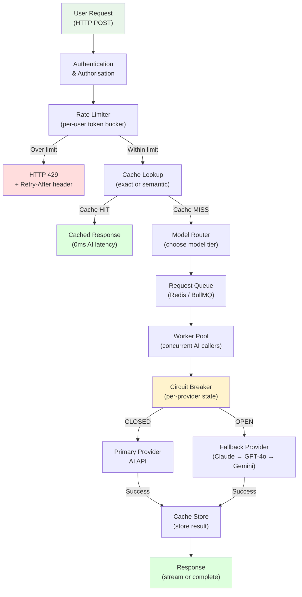
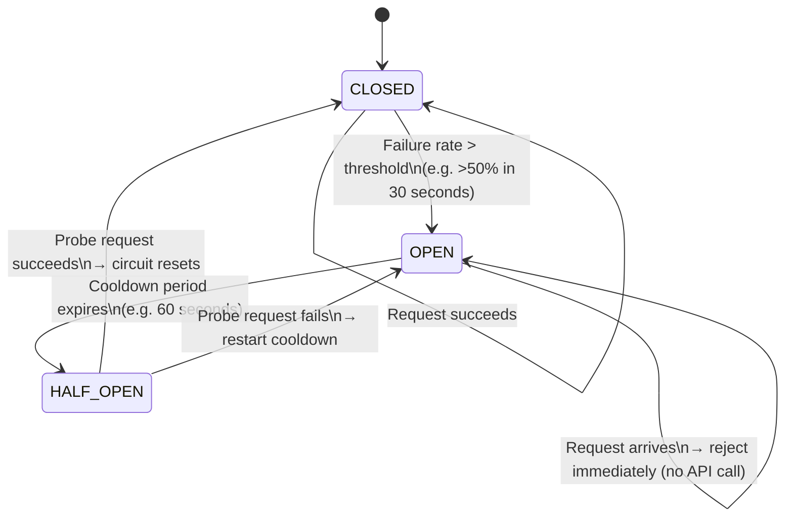
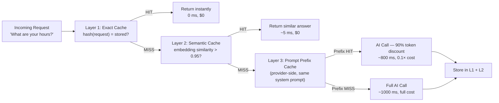
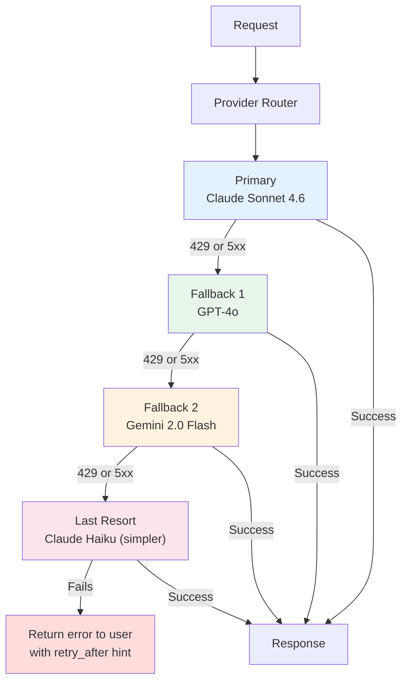
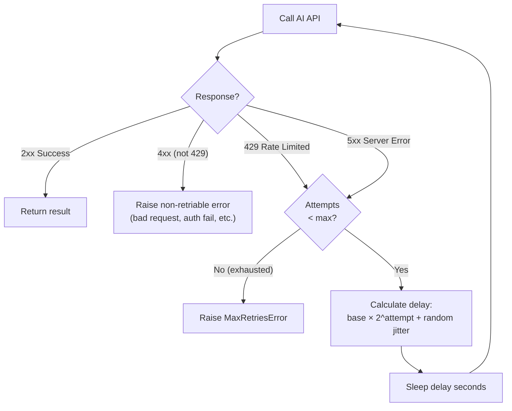
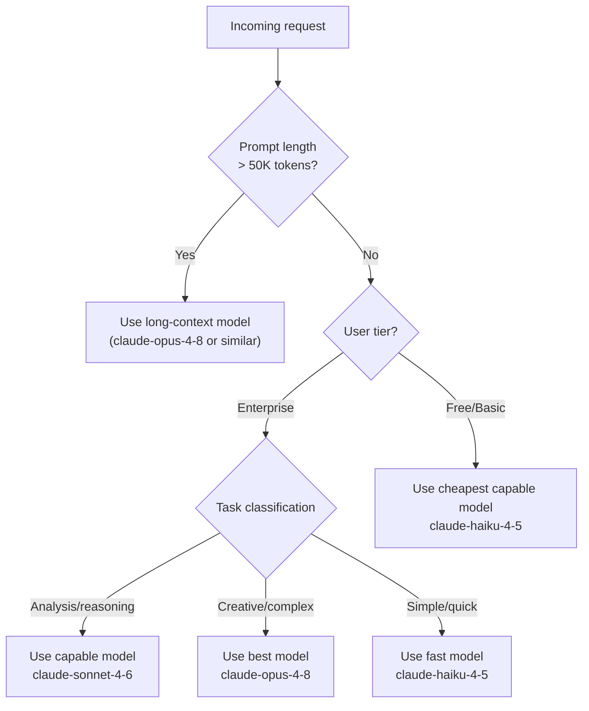

# Chapter 15: Production Architecture — Building AI at Scale

---

> *"Any AI system works on a developer's laptop. Only well-engineered ones work when a thousand users hit them simultaneously."*

---

## Learning Objectives

By the end of this chapter you will be able to:

- Implement exponential backoff with jitter to handle API rate limits gracefully
- Build a request queue using Celery and Redis to handle traffic spikes without dropping work
- Apply three types of caching to an AI system: exact match, semantic, and prompt prefix
- Implement a circuit breaker that automatically detects provider failures and fails over to alternatives
- Route requests to the cheapest model that can satisfy them
- Design a multi-provider fallback strategy so a single provider outage never brings your system down
- Identify and fix three production failure patterns: rate-limit cascades, cache poisoning, and stuck circuit breakers
- Describe the full lifecycle of a production AI request from the user's browser to the model and back

---

## Prerequisites

- **Required:** Chapter 4 — AI APIs, SDKs & Streaming (API calls, error handling, streaming)
- **Required:** Chapter 5 — Prompt Engineering (system prompts, token awareness)
- **Recommended:** Chapter 10 — AI Agents (async patterns and tool chains)
- **Installed:** Python with `uv`, Node.js, Docker and Docker Compose, Redis (via Docker)

---

## Estimated Reading Time

**85 – 100 minutes**

---

## Estimated Hands-on Time

**5 – 7 hours**

---

## Table of Contents

1. [Why This Topic Exists](#1-why-this-topic-exists)
2. [Real-World Analogy](#2-real-world-analogy)
3. [Core Concepts](#3-core-concepts)
4. [Architecture Diagrams](#4-architecture-diagrams)
5. [Flow Diagrams](#5-flow-diagrams)
6. [Beginner Implementation — Retry and Backoff](#6-beginner-implementation)
7. [Intermediate Implementation — Queuing and Caching](#7-intermediate-implementation)
8. [Advanced Implementation — Circuit Breaker and Fallback](#8-advanced-implementation)
9. [Production Architecture — The AI Gateway Pattern](#9-production-architecture)
10. [Technology Comparison](#10-technology-comparison)
11. [Best Practices](#11-best-practices)
12. [Security Considerations](#12-security-considerations)
13. [Cost Considerations](#13-cost-considerations)
14. [Common Mistakes](#14-common-mistakes)
15. [Debugging Guide](#15-debugging-guide)
16. [Performance Optimisation](#16-performance-optimisation)
17. [Exercises](#17-exercises)
18. [Quiz](#18-quiz)
19. [Mini Project](#19-mini-project)
20. [Production Project](#20-production-project)
21. [Key Takeaways](#21-key-takeaways)
22. [Chapter Summary](#22-chapter-summary)
23. [Resources](#23-resources)
24. [Glossary Terms Introduced](#24-glossary-terms-introduced)
25. [See Also](#25-see-also)
26. [Preparation for Chapter 16](#26-preparation-for-chapter-16)

---

## 1. Why This Topic Exists

Every AI system in this course worked perfectly in development. You ran the code, it called the API, you got a response. The problem is not making it work once — the problem is making it work correctly, consistently, and affordably for thousands of users, across provider outages, under traffic spikes, and over months of continuous operation.

The difference between a demo and a production system is not the AI part. It is the infrastructure around the AI.

Consider what happens when your application gets real traffic:

- **100 users send requests at exactly the same moment.** Your code calls the Claude API 100 times concurrently. Claude returns HTTP 429 (Too Many Requests) for 70 of them. Those 70 requests fail. Your users get errors.
- **Anthropic has a 15-minute outage.** Every request to Claude fails immediately. Your entire application is broken for 15 minutes, even though OpenAI and Gemini are still up.
- **A user asks exactly the same question 400 times per day.** You call Claude 400 times and pay 400× the cost of a single call. With caching, that would cost 1× and serve the other 399 from memory in milliseconds.
- **A single slow request takes 45 seconds to generate 10,000 tokens.** It holds a thread. Ten users all do this simultaneously. Your server runs out of connections. Everything stops.

Production architecture is the engineering discipline that prevents all of these failure modes. It wraps your AI API calls with: rate limit handling, queuing, caching, fallback, circuit breaking, and model routing. None of these require machine learning knowledge. They are standard distributed systems patterns applied to AI workloads.

---

## 2. Real-World Analogy

### The Hospital Emergency Room

An emergency room does not treat patients in the order they arrive and refuse everyone else. It has triage (priority queuing), waiting rooms (request buffering), multiple doctors across multiple rooms (parallel workers), backup specialists (fallback routing), and a protocol for when the building's electricity fails (circuit breaker). If a patient's doctor is not available, another doctor sees them. If the hospital is at capacity, ambulances are diverted to the next hospital.

A production AI system has all of these same components. Requests are triaged by priority. They queue when capacity is full. Multiple workers process them in parallel. If one AI provider fails, requests route to another. If a provider's API is returning errors at high rates, the circuit breaker "trips" and stops sending requests until the provider recovers.

### The Power Grid

An electrical circuit breaker does exactly one thing: if it detects current flowing at a dangerous rate, it trips — opening the circuit and stopping all current flow. This protects the rest of the system from the fault. When the fault is fixed, you manually reset the breaker (or it auto-resets after a cooldown). 

AI circuit breakers work identically. If an API endpoint is returning errors at a dangerous rate (your threshold is, say, >50% failures in 30 seconds), the circuit breaker trips. All subsequent requests fail immediately without even trying the API. After a cooldown period, one "test" request is allowed through. If it succeeds, the circuit resets to normal. If it fails, the cooldown starts again.

---

## 3. Core Concepts

### Rate Limit

**Technical definition:** A constraint imposed by an API provider on the maximum number of requests or tokens a client can send within a time window. Typically expressed as requests per minute (RPM), tokens per minute (TPM), or both. Exceeding the limit returns HTTP 429.

**Simple definition:** The API has a speed limit. Exceed it, and you get a temporary ban. The ban lasts until the time window resets.

**Analogy:** A bank's ATM allows 5 transactions per minute from the same card. If you try 10, the 6th–10th are rejected. Wait until the next minute and you can try again.

---

### Exponential Backoff with Jitter

**Technical definition:** A retry strategy that doubles the delay between each retry attempt and adds a random component (jitter) to prevent multiple clients from retrying at exactly the same moment after a shared failure.

**Simple definition:** After a failed request, wait a bit before retrying. After each failure, wait twice as long. Add a random number to the wait to spread out retries.

**Why jitter matters:** Without jitter, 100 clients that all fail at the same moment all retry at exactly the same time — and all fail again. With jitter, they spread their retries across the window, reducing contention.

---

### Request Queue

**Technical definition:** A data structure (typically implemented with Redis, RabbitMQ, or a database) that buffers incoming work items so that a pool of workers can process them at a controlled rate, decoupled from the rate at which work arrives.

**Simple definition:** A waiting room. Requests that arrive faster than you can process them wait in line, and workers process them one at a time at a sustainable rate. If the queue fills up, requests are rejected immediately rather than causing system-wide failure.

---

### Exact-Match Cache

**Technical definition:** A cache layer that stores `(hash(input)) → output` mappings. If an identical input arrives again, the stored output is returned without calling the AI model.

**Simple definition:** If you have already answered a question, remember the answer. If the same question arrives again, return the stored answer instantly — no API call needed.

**When it applies:** Frequently-asked static questions (FAQs, help articles), batch processing of repeated records, prompt templates with fixed inputs.

---

### Semantic Cache

**Technical definition:** A cache layer that uses embedding similarity (cosine distance) to find previously-answered questions that are semantically equivalent to the current question, even when the exact text differs. Uses a vector database or nearest-neighbour search.

**Simple definition:** Not just "have I seen this exact question?" but "have I answered something that means the same thing?" "What are your hours?" and "When do you open?" would be treated as a cache hit if their embedding similarity exceeds a threshold.

---

### Prompt Prefix Cache

**Technical definition:** A provider-side caching mechanism (available in Claude) that allows a portion of the input — typically the system prompt or a long shared document — to be reused across requests without re-processing. The cached portion is stored on the provider's servers between requests and fetched at a fraction of the full input token cost.

**Simple definition:** If every request re-sends the same 5,000-word system prompt, you pay for processing that prompt every single time. Prompt prefix caching tells the provider "remember this prompt, reuse it for the next 5 minutes." Repeat requests that share the same prefix cost 90% less to process.

---

### Circuit Breaker

**Technical definition:** A stateful fault-tolerance pattern with three states: CLOSED (normal operation — requests pass through), OPEN (failure threshold exceeded — requests are immediately rejected without hitting the downstream system), and HALF-OPEN (recovery probe — one test request is allowed through; if it succeeds, the circuit resets to CLOSED; if it fails, it returns to OPEN).

**Simple definition:** A tripswitch that prevents a failing external service from taking down your whole system. Once errors exceed a threshold, the breaker trips (opens). No requests are forwarded while it is open. After a cooldown, it probes for recovery. If the probe succeeds, normal operation resumes.

---

### Multi-Provider Fallback

**Technical definition:** A retry strategy that, when a primary AI provider returns a persistent error, automatically routes the same request to an alternative provider — maintaining the same API interface and response contract.

**Simple definition:** If Claude is down, try GPT-4o. If GPT-4o is also down, try Gemini. From the user's perspective, the AI just answered — the provider switch was invisible.

---

### Model Router

**Technical definition:** A component that analyses incoming requests and assigns each one to the cheapest or fastest model that can satisfy its quality requirements, based on rules such as prompt length, task complexity signals, or user tier.

**Simple definition:** Not every question needs the most expensive model. "What is 2+2?" goes to Haiku. "Redesign our database schema for GDPR compliance" goes to Opus. The router decides which tier of model to use before calling the API.

---

### Worker Pool

**Technical definition:** A set of persistent processes or threads that pull work from a queue and execute tasks concurrently, up to a configured maximum concurrency. Common implementations: Celery (Python), BullMQ (Node.js).

**Simple definition:** A team of workers waiting for tasks. Each picks up the next available task from the queue, processes it, marks it done, and picks up the next one. The team size is configurable — you control how much concurrency you want.

---

## 4. Architecture Diagrams

### 4.1 Full Production AI Request Flow



### 4.2 Circuit Breaker State Machine



### 4.3 Three Caching Layers



### 4.4 Multi-Provider Fallback Architecture



---

## 5. Flow Diagrams

### 5.1 Exponential Backoff Decision Flow



### 5.2 Model Routing Decision Flow



---

## 6. Beginner Implementation

### Retry and Exponential Backoff

The first production improvement any AI system needs is a proper retry wrapper. Raw API clients do not retry on rate limits — you must add this yourself.

```python
# retry_client.py
# Learning example — retry wrapper with exponential backoff and jitter
import time
import random
import anthropic
from anthropic import RateLimitError, APIStatusError, APIConnectionError

client = anthropic.Anthropic()


def call_with_retry(
    prompt: str,
    model: str = "claude-haiku-4-5-20251001",
    max_tokens: int = 1024,
    max_retries: int = 6,
    base_delay: float = 1.0,
    max_delay: float = 64.0,
) -> str:
    """
    Call Claude with exponential backoff retry on rate limits and server errors.
    
    Retry schedule with base_delay=1.0 and jitter:
      Attempt 1 fail → wait ~1s
      Attempt 2 fail → wait ~2s
      Attempt 3 fail → wait ~4s
      Attempt 4 fail → wait ~8s
      Attempt 5 fail → wait ~16s
      Attempt 6 fail → raise MaxRetriesError
    """
    last_error = None

    for attempt in range(max_retries):
        try:
            message = client.messages.create(
                model=model,
                max_tokens=max_tokens,
                messages=[{"role": "user", "content": prompt}],
            )
            return message.content[0].text

        except RateLimitError as e:
            last_error = e
            # Check for Retry-After header (the API sometimes provides it)
            retry_after = None
            if hasattr(e, "response") and e.response is not None:
                retry_after = e.response.headers.get("retry-after")

            if retry_after:
                wait = float(retry_after) + random.uniform(0, 1)
            else:
                # Exponential backoff with full jitter: random(0, min(max, base * 2^attempt))
                cap = min(max_delay, base_delay * (2 ** attempt))
                wait = random.uniform(0, cap)

            if attempt < max_retries - 1:
                print(f"Rate limited. Waiting {wait:.1f}s before retry {attempt + 2}/{max_retries}...")
                time.sleep(wait)

        except APIConnectionError as e:
            last_error = e
            cap = min(max_delay, base_delay * (2 ** attempt))
            wait = random.uniform(0, cap)
            if attempt < max_retries - 1:
                print(f"Connection error. Waiting {wait:.1f}s before retry {attempt + 2}/{max_retries}...")
                time.sleep(wait)

        except APIStatusError as e:
            # 4xx errors (other than 429) are not retriable
            if e.status_code != 429 and 400 <= e.status_code < 500:
                raise  # Fail immediately — bad request, auth error, etc.
            last_error = e
            cap = min(max_delay, base_delay * (2 ** attempt))
            wait = random.uniform(0, cap)
            if attempt < max_retries - 1:
                time.sleep(wait)

    raise Exception(f"Max retries ({max_retries}) exceeded. Last error: {last_error}")
```

**Node.js equivalent:**

```javascript
// retry_client.mjs
// Learning example — retry with exponential backoff in Node.js
import Anthropic from "@anthropic-ai/sdk";

const client = new Anthropic();

async function callWithRetry(
  prompt,
  { model = "claude-haiku-4-5-20251001", maxTokens = 1024, maxRetries = 6, baseDelay = 1000 } = {}
) {
  let lastError;

  for (let attempt = 0; attempt < maxRetries; attempt++) {
    try {
      const message = await client.messages.create({
        model,
        max_tokens: maxTokens,
        messages: [{ role: "user", content: prompt }],
      });
      return message.content[0].text;

    } catch (error) {
      lastError = error;

      // Non-retriable: bad request, auth errors (4xx except 429)
      if (error.status && error.status >= 400 && error.status < 500 && error.status !== 429) {
        throw error;
      }

      if (attempt < maxRetries - 1) {
        // Full jitter: random(0, min(maxDelay, base * 2^attempt))
        const cap = Math.min(64000, baseDelay * Math.pow(2, attempt));
        const wait = Math.random() * cap;
        console.log(`Retry ${attempt + 2}/${maxRetries} in ${(wait / 1000).toFixed(1)}s...`);
        await new Promise((res) => setTimeout(res, wait));
      }
    }
  }

  throw new Error(`Max retries exceeded. Last error: ${lastError?.message}`);
}
```

---

### Production Issue: Rate Limit Cascade Storm

**Symptoms:**
Your application handles moderate traffic without issues. During a traffic spike — say, a marketing email goes out and 500 users open the app simultaneously — the AI feature breaks for nearly all users. You see a flood of `HTTP 429 Too Many Requests` errors in your logs. Even after the spike subsides and the rate limit window resets, you see a *second* wave of 429s. This pattern repeats every 30 to 60 seconds for several minutes after the initial spike.

**Root Cause:**
The first spike exhausted the rate limit window and all 500 requests were rejected with 429. But your retry logic has a fixed delay — every rejected request waits exactly 5 seconds and retries. The next minute's window opens, 500 requests retry at exactly the same moment, exhausting the new window immediately. This cycle repeats: the requests are synchronised by the fixed retry delay. This is called a **thundering herd**.

**How to Diagnose It:**

```python
# Check your logs for the telltale pattern: bursts of 429s at fixed intervals
# This grep pattern looks for 429 log entries and shows their timestamps:
# grep "429" app.log | awk '{print $1, $2}' | sort | uniq -c
#
# If you see something like:
# 500 2026-06-29 14:00:01
# 500 2026-06-29 14:01:01
# 500 2026-06-29 14:02:01
# → Fixed 60-second retry interval → thundering herd confirmed

# In code: look for any retry logic that uses a fixed sleep:
# time.sleep(5)  # ← WRONG: synchronises all retries
# await asyncio.sleep(5)  # ← WRONG: same problem
```

**How to Fix It:**

```python
# WRONG: fixed sleep synchronises retries across all clients
def bad_retry(fn, retries=3):
    for attempt in range(retries):
        try:
            return fn()
        except RateLimitError:
            time.sleep(5)   # All clients retry simultaneously after exactly 5s
    raise Exception("Failed")


# RIGHT: full jitter distributes retries across the window
import random

def good_retry(fn, retries=6, base=1.0, cap=64.0):
    for attempt in range(retries):
        try:
            return fn()
        except RateLimitError:
            # Full jitter: random value between 0 and min(cap, base * 2^attempt)
            # Clients spread their retries randomly — no synchronisation
            wait = random.uniform(0, min(cap, base * (2 ** attempt)))
            time.sleep(wait)
    raise Exception("Failed after retries")
```

**How to Prevent It in Future:**
Switch all retry logic to exponential backoff with full jitter (not decorrelated jitter, not equal jitter — full jitter). Additionally, implement a request queue so that traffic spikes do not all hit the API simultaneously in the first place. With a queue, a 500-request spike becomes a 500-item queue that workers drain at a controlled rate — the API never sees 500 simultaneous requests.

---

## 7. Intermediate Implementation

### Redis-Based Rate Limiter

Before queuing, implement server-side rate limiting so that requests over the per-user limit are rejected early — before they consume server resources.

```python
# rate_limiter.py
# Production example — per-user token bucket rate limiter with Redis
import redis
import time
from dataclasses import dataclass


@dataclass
class RateLimitResult:
    allowed: bool
    remaining: int
    reset_at: float        # Unix timestamp when the window resets
    retry_after: float     # Seconds to wait before retrying (0 if allowed)


class TokenBucketRateLimiter:
    """
    Per-user rate limiter using Redis.
    
    Uses a sliding window counter to allow `max_requests` requests
    per `window_seconds` per user.
    """

    def __init__(self, redis_client: redis.Redis, max_requests: int = 60, window_seconds: int = 60):
        self.redis = redis_client
        self.max_requests = max_requests
        self.window_seconds = window_seconds

    def check(self, user_id: str) -> RateLimitResult:
        """Check if a user can make a request. Increments their counter if allowed."""
        key = f"rl:{user_id}"
        now = time.time()
        window_start = now - self.window_seconds

        pipe = self.redis.pipeline()
        # Remove entries outside the current window
        pipe.zremrangebyscore(key, 0, window_start)
        # Count entries in current window
        pipe.zcard(key)
        # Add this request's timestamp (scored by timestamp for range queries)
        pipe.zadd(key, {str(now): now})
        # Set expiry so old keys are cleaned up
        pipe.expire(key, self.window_seconds * 2)
        results = pipe.execute()

        current_count = results[1]  # Count BEFORE this request

        if current_count >= self.max_requests:
            # Remove the zadd we just did — request is rejected
            self.redis.zrem(key, str(now))
            oldest = self.redis.zrange(key, 0, 0, withscores=True)
            if oldest:
                reset_at = oldest[0][1] + self.window_seconds
            else:
                reset_at = now + self.window_seconds
            return RateLimitResult(
                allowed=False,
                remaining=0,
                reset_at=reset_at,
                retry_after=reset_at - now,
            )

        return RateLimitResult(
            allowed=True,
            remaining=self.max_requests - current_count - 1,
            reset_at=now + self.window_seconds,
            retry_after=0,
        )


# Usage in a FastAPI endpoint:
from fastapi import FastAPI, HTTPException, Request
from fastapi.responses import JSONResponse

app = FastAPI()
redis_client = redis.Redis(host="localhost", port=6379, decode_responses=True)
limiter = TokenBucketRateLimiter(redis_client, max_requests=20, window_seconds=60)


@app.post("/chat")
async def chat(request: Request, message: str):
    user_id = request.headers.get("X-User-ID", "anonymous")
    result = limiter.check(user_id)

    if not result.allowed:
        raise HTTPException(
            status_code=429,
            detail="Rate limit exceeded",
            headers={
                "Retry-After": str(int(result.retry_after)),
                "X-RateLimit-Limit": str(limiter.max_requests),
                "X-RateLimit-Remaining": "0",
                "X-RateLimit-Reset": str(int(result.reset_at)),
            },
        )

    # Proceed with AI call...
    response = call_with_retry(message)
    return {"response": response}
```

### Celery Task Queue

For requests that can tolerate a few seconds of latency (non-interactive analysis, batch jobs, report generation), a task queue decouples the user's HTTP request from the actual AI call.

```python
# tasks.py
# Production example — AI task queue with Celery and Redis
from celery import Celery
from celery.utils.log import get_task_logger
import anthropic
import redis
import json
import time

# Create Celery app using Redis as both broker and result backend
celery_app = Celery(
    "ai_tasks",
    broker="redis://localhost:6379/0",
    backend="redis://localhost:6379/1",
)

celery_app.conf.update(
    task_serializer="json",
    result_serializer="json",
    accept_content=["json"],
    task_acks_late=True,          # Only ack after successful completion
    worker_prefetch_multiplier=1,  # One task at a time per worker (AI calls are slow)
    task_max_retries=5,
    task_default_retry_delay=10,   # Base seconds between retries
)

logger = get_task_logger(__name__)
claude_client = anthropic.Anthropic()


@celery_app.task(
    bind=True,
    name="ai_tasks.generate_response",
    max_retries=5,
    default_retry_delay=10,
)
def generate_response(self, user_id: str, prompt: str, model: str = "claude-haiku-4-5-20251001") -> dict:
    """
    Background task: call Claude and return the result.
    The caller gets a task_id and polls for the result.
    """
    try:
        logger.info(f"Processing request for user {user_id}")
        start = time.time()

        message = claude_client.messages.create(
            model=model,
            max_tokens=2048,
            messages=[{"role": "user", "content": prompt}],
        )

        elapsed = time.time() - start
        return {
            "text": message.content[0].text,
            "model": model,
            "input_tokens": message.usage.input_tokens,
            "output_tokens": message.usage.output_tokens,
            "elapsed_seconds": round(elapsed, 2),
        }

    except anthropic.RateLimitError as e:
        # Retry after a delay; Celery handles the re-queuing
        countdown = 30 * (2 ** self.request.retries)  # 30s, 60s, 120s, 240s, 480s
        raise self.retry(exc=e, countdown=countdown)

    except anthropic.APIStatusError as e:
        if e.status_code >= 500:
            raise self.retry(exc=e, countdown=15)
        raise  # 4xx non-retriable errors fail immediately


# FastAPI endpoints that use the queue:
from fastapi import FastAPI
from pydantic import BaseModel

api = FastAPI()


class QueueRequest(BaseModel):
    prompt: str
    model: str = "claude-haiku-4-5-20251001"


@api.post("/queue/submit")
async def submit_job(body: QueueRequest, user_id: str = "anonymous"):
    """Submit an AI job to the queue. Returns task_id for status polling."""
    task = generate_response.delay(
        user_id=user_id,
        prompt=body.prompt,
        model=body.model,
    )
    return {"task_id": task.id, "status": "queued"}


@api.get("/queue/status/{task_id}")
async def get_job_status(task_id: str):
    """Poll for the result of a queued job."""
    task = celery_app.AsyncResult(task_id)

    if task.state == "PENDING":
        return {"status": "queued"}
    elif task.state == "STARTED":
        return {"status": "processing"}
    elif task.state == "SUCCESS":
        return {"status": "complete", "result": task.result}
    elif task.state == "FAILURE":
        return {"status": "failed", "error": str(task.result)}
    else:
        return {"status": task.state.lower()}
```

### Exact-Match Cache

```python
# exact_cache.py
# Production example — exact match response caching with Redis
import hashlib
import json
import redis
import anthropic
from typing import Any


class ExactCache:
    """Cache AI responses by exact input hash."""

    def __init__(
        self,
        redis_client: redis.Redis,
        ttl_seconds: int = 3600,  # Cache for 1 hour by default
        key_prefix: str = "aicache:",
    ):
        self.redis = redis_client
        self.ttl = ttl_seconds
        self.prefix = key_prefix

    def _cache_key(self, model: str, messages: list, system: str = "") -> str:
        """Create a stable hash key from the request parameters."""
        payload = json.dumps({
            "model": model,
            "messages": messages,
            "system": system,
        }, sort_keys=True)
        return self.prefix + hashlib.sha256(payload.encode()).hexdigest()

    def get(self, model: str, messages: list, system: str = "") -> dict | None:
        """Return cached response, or None if not cached."""
        key = self._cache_key(model, messages, system)
        cached = self.redis.get(key)
        if cached:
            return json.loads(cached)
        return None

    def set(self, model: str, messages: list, response: dict, system: str = ""):
        """Store a response in the cache."""
        key = self._cache_key(model, messages, system)
        self.redis.setex(key, self.ttl, json.dumps(response))


def cached_ai_call(
    prompt: str,
    cache: ExactCache,
    client: anthropic.Anthropic,
    model: str = "claude-haiku-4-5-20251001",
    system: str = "",
) -> dict:
    """Call Claude with exact-match caching."""
    messages = [{"role": "user", "content": prompt}]

    # Try cache first
    cached = cache.get(model, messages, system)
    if cached:
        cached["cache_hit"] = True
        return cached

    # Cache miss — call the API
    create_kwargs = {"model": model, "max_tokens": 2048, "messages": messages}
    if system:
        create_kwargs["system"] = system

    message = client.messages.create(**create_kwargs)
    result = {
        "text": message.content[0].text,
        "model": model,
        "input_tokens": message.usage.input_tokens,
        "output_tokens": message.usage.output_tokens,
        "cache_hit": False,
    }

    # Store in cache — but only if the response is deterministic (temperature=0 or FAQ-type)
    cache.set(model, messages, result, system)
    return result
```

---

## 8. Advanced Implementation

### Circuit Breaker

```python
# circuit_breaker.py
# Production example — circuit breaker for AI provider calls
import time
import threading
from enum import Enum
from dataclasses import dataclass, field


class CircuitState(Enum):
    CLOSED = "closed"       # Normal: requests pass through
    OPEN = "open"           # Tripped: requests rejected immediately
    HALF_OPEN = "half_open" # Testing: one probe request allowed


@dataclass
class CircuitBreakerConfig:
    failure_threshold: int = 5      # Failures to trip the breaker
    success_threshold: int = 2      # Successes needed to close from HALF_OPEN
    timeout_seconds: float = 60.0   # Cooldown before entering HALF_OPEN
    failure_window_seconds: float = 30.0  # Window for counting failures


class CircuitBreaker:
    """
    Thread-safe circuit breaker for AI API calls.
    
    Usage:
        breaker = CircuitBreaker("claude", config)
        try:
            with breaker:
                response = call_claude_api(prompt)
        except CircuitOpenError:
            # Circuit is open — use fallback
            response = call_fallback_api(prompt)
    """

    def __init__(self, name: str, config: CircuitBreakerConfig = None):
        self.name = name
        self.config = config or CircuitBreakerConfig()
        self._state = CircuitState.CLOSED
        self._failures: list[float] = []   # Timestamps of recent failures
        self._successes_in_half_open = 0
        self._opened_at: float | None = None
        self._lock = threading.Lock()

    @property
    def state(self) -> CircuitState:
        with self._lock:
            self._update_state()
            return self._state

    def _update_state(self):
        """Internal: update state based on elapsed time (call while holding lock)."""
        if self._state == CircuitState.OPEN:
            elapsed = time.time() - (self._opened_at or 0)
            if elapsed >= self.config.timeout_seconds:
                self._state = CircuitState.HALF_OPEN
                self._successes_in_half_open = 0

    def _record_failure(self):
        """Record a failure. Trip the circuit if threshold is exceeded."""
        now = time.time()
        window_start = now - self.config.failure_window_seconds
        # Keep only recent failures
        self._failures = [t for t in self._failures if t >= window_start]
        self._failures.append(now)

        if len(self._failures) >= self.config.failure_threshold:
            self._state = CircuitState.OPEN
            self._opened_at = now
            self._failures = []

    def _record_success(self):
        """Record a success. Close the circuit if in HALF_OPEN and threshold met."""
        if self._state == CircuitState.HALF_OPEN:
            self._successes_in_half_open += 1
            if self._successes_in_half_open >= self.config.success_threshold:
                self._state = CircuitState.CLOSED
                self._failures = []

    def __enter__(self):
        with self._lock:
            self._update_state()
            if self._state == CircuitState.OPEN:
                raise CircuitOpenError(
                    f"Circuit breaker '{self.name}' is OPEN. "
                    f"Retry after {self.config.timeout_seconds}s."
                )
        return self

    def __exit__(self, exc_type, exc_val, exc_tb):
        with self._lock:
            if exc_type is None:
                self._record_success()
            elif issubclass(exc_type, (Exception,)):
                self._record_failure()
        return False  # Don't suppress exceptions


class CircuitOpenError(Exception):
    """Raised when a circuit breaker is OPEN and a request is rejected."""
    pass
```

### Multi-Provider Fallback

```python
# multi_provider.py
# Production example — automatic provider fallback
import anthropic
import openai
import google.generativeai as genai
from typing import Callable

from circuit_breaker import CircuitBreaker, CircuitBreakerConfig, CircuitOpenError


# ─────────────────────────────────────────────
# PROVIDER CLIENTS
# ─────────────────────────────────────────────

claude_client = anthropic.Anthropic()
openai_client = openai.OpenAI()
genai.configure(api_key="...")  # Or from env


# ─────────────────────────────────────────────
# CIRCUIT BREAKERS — one per provider
# ─────────────────────────────────────────────

BREAKERS = {
    "claude":  CircuitBreaker("claude",  CircuitBreakerConfig(failure_threshold=3, timeout_seconds=60)),
    "openai":  CircuitBreaker("openai",  CircuitBreakerConfig(failure_threshold=3, timeout_seconds=60)),
    "gemini":  CircuitBreaker("gemini",  CircuitBreakerConfig(failure_threshold=3, timeout_seconds=60)),
}


# ─────────────────────────────────────────────
# PER-PROVIDER CALL FUNCTIONS
# ─────────────────────────────────────────────

def call_claude(prompt: str, system: str = "") -> str:
    """Call Claude Sonnet 4.6."""
    kwargs = {
        "model": "claude-sonnet-4-6",
        "max_tokens": 2048,
        "messages": [{"role": "user", "content": prompt}],
    }
    if system:
        kwargs["system"] = system
    msg = claude_client.messages.create(**kwargs)
    return msg.content[0].text


def call_openai(prompt: str, system: str = "") -> str:
    """Call GPT-4o as fallback."""
    messages = []
    if system:
        messages.append({"role": "system", "content": system})
    messages.append({"role": "user", "content": prompt})
    resp = openai_client.chat.completions.create(
        model="gpt-4o",
        max_tokens=2048,
        messages=messages,
    )
    return resp.choices[0].message.content


def call_gemini(prompt: str, system: str = "") -> str:
    """Call Gemini 2.0 Flash as second fallback."""
    full_prompt = f"{system}\n\n{prompt}" if system else prompt
    model = genai.GenerativeModel("gemini-2.0-flash")
    resp = model.generate_content(full_prompt)
    return resp.text


# ─────────────────────────────────────────────
# FALLBACK ORCHESTRATOR
# ─────────────────────────────────────────────

PROVIDER_CHAIN: list[tuple[str, Callable]] = [
    ("claude",  call_claude),
    ("openai",  call_openai),
    ("gemini",  call_gemini),
]


def ai_with_fallback(prompt: str, system: str = "") -> dict:
    """
    Try each provider in order. If a provider's circuit is OPEN or the call fails,
    move to the next provider. Return the result and which provider served it.
    """
    last_error = None

    for provider_name, call_fn in PROVIDER_CHAIN:
        breaker = BREAKERS[provider_name]

        try:
            with breaker:
                text = call_fn(prompt, system)
                return {
                    "text": text,
                    "provider": provider_name,
                    "fallback_used": provider_name != "claude",
                }
        except CircuitOpenError:
            # This provider's circuit is open — skip immediately, try next
            last_error = f"{provider_name}: circuit OPEN"
            continue
        except Exception as e:
            # API error — the circuit breaker recorded the failure
            last_error = f"{provider_name}: {e}"
            continue

    raise RuntimeError(f"All providers failed. Last error: {last_error}")
```

### Model Router

```python
# model_router.py
# Production example — route requests to the cheapest capable model
import re
from dataclasses import dataclass
from typing import Literal


ModelTier = Literal["haiku", "sonnet", "opus"]


@dataclass
class RoutingDecision:
    model: str
    tier: ModelTier
    reason: str
    estimated_cost_per_1k_tokens: float  # USD


# Cost per 1K tokens (input + typical output combined estimate)
MODELS = {
    "haiku":  ("claude-haiku-4-5-20251001", 0.001),
    "sonnet": ("claude-sonnet-4-6",          0.004),
    "opus":   ("claude-opus-4-8",            0.020),
}


def classify_complexity(prompt: str) -> ModelTier:
    """
    Simple heuristic-based complexity classifier.
    In production, replace this with a lightweight classification model.
    """
    word_count = len(prompt.split())

    # Very long prompts need a capable model
    if word_count > 2000:
        return "opus"

    # Signals of complex reasoning tasks
    complex_signals = [
        r"\banalyse\b", r"\banalyze\b", r"\barchitecture\b",
        r"\bsecurity\b", r"\bcompliance\b", r"\brefactor\b",
        r"\boptimis", r"\boptimiz", r"\bdesign\b",
        r"\bstrateg", r"\bmigrat",
    ]
    if any(re.search(p, prompt, re.I) for p in complex_signals):
        return "sonnet"

    # Signals of simple/quick tasks
    simple_signals = [
        r"\btranslat", r"\bsummariz", r"\bsummarise",
        r"\bformat\b", r"\bfix\b", r"\blist\b",
        r"\bwhat is\b", r"\bdefine\b", r"\bhow do I\b",
        r"\bconvert\b",
    ]
    if any(re.search(p, prompt, re.I) for p in simple_signals):
        return "haiku"

    # Default: sonnet is the safe middle tier
    return "sonnet"


def route(
    prompt: str,
    user_tier: Literal["free", "pro", "enterprise"] = "free",
    force_model: str | None = None,
) -> RoutingDecision:
    """
    Decide which model to use based on prompt content and user tier.
    
    free users → max haiku (keep costs controlled)
    pro users → sonnet or haiku based on complexity
    enterprise users → whatever the task needs
    """
    if force_model:
        # Admin override
        model_name, cost = MODELS.get("sonnet")  # Default fallback
        return RoutingDecision(
            model=force_model, tier="sonnet",
            reason="forced override", estimated_cost_per_1k_tokens=cost
        )

    complexity = classify_complexity(prompt)

    # Apply user tier caps
    if user_tier == "free":
        effective_tier: ModelTier = "haiku"  # Free users always get Haiku
    elif user_tier == "pro":
        effective_tier = "haiku" if complexity == "haiku" else "sonnet"
    else:  # enterprise
        effective_tier = complexity  # No cap — use whatever the task needs

    model_name, cost = MODELS[effective_tier]
    return RoutingDecision(
        model=model_name,
        tier=effective_tier,
        reason=f"complexity={complexity}, user_tier={user_tier}",
        estimated_cost_per_1k_tokens=cost,
    )
```

---

### Production Issue: Cache Poisoning via Loose Semantic Similarity

**Symptoms:**
Your AI assistant occasionally returns confidently wrong answers. Looking at the logs, these wrong answers always come from the semantic cache — the `cache_hit: true` flag is set. When you examine the cached answers being returned, they are correct answers to *similar* but *different* questions. Users who ask "What is the refund policy for annual subscriptions?" are sometimes getting the answer to "What is the refund policy for monthly subscriptions?" — a closely related but meaningfully different question.

**Root Cause:**
The semantic similarity threshold was set too loosely — 0.80 cosine similarity. This means any question that has an 80% semantic overlap with a cached question will return the cached answer. Monthly and annual subscription questions are semantically very similar (same nouns, same intent pattern) but have different correct answers. At 0.80 similarity, they share a cache entry. In domains with fine-grained distinctions (legal, medical, financial, subscription tiers), a 0.80 threshold is too permissive.

**How to Diagnose It:**

```python
def audit_cache_hits(log_file: str, threshold: float = 0.95):
    """
    Find cache hits where the similarity score was below threshold.
    These are the risky cache hits most likely to be wrong answers.
    
    Usage: parse your log file for entries like:
    {"cache_hit": true, "similarity": 0.83, "question": "...", "cached_question": "..."}
    """
    import json

    risky = []
    with open(log_file) as f:
        for line in f:
            try:
                entry = json.loads(line)
                if entry.get("cache_hit") and entry.get("similarity", 1.0) < threshold:
                    risky.append(entry)
            except json.JSONDecodeError:
                continue

    print(f"Found {len(risky)} risky cache hits (similarity < {threshold})")
    for entry in risky[:5]:
        print(f"  Similarity {entry['similarity']:.3f}: '{entry['question'][:60]}'")
        print(f"    → returned answer for: '{entry['cached_question'][:60]}'")
    return risky
```

**How to Fix It:**

```python
# WRONG: threshold too loose for factual domains
SIMILARITY_THRESHOLD = 0.80  # Allows semantically close but factually different matches

# RIGHT: domain-specific thresholds
THRESHOLDS = {
    "faq_general": 0.92,        # General FAQs: fairly safe at 0.92
    "billing_policy": 0.97,     # Billing: very strict — small differences matter
    "legal_compliance": 0.99,   # Legal: almost exact match only
    "creative_writing": 0.85,   # Creative: looser is fine, answers aren't "wrong"
    "code_generation": 0.95,    # Code: function names differ → different answer needed
}


def semantic_cache_get(
    question: str,
    domain: str,
    cache: VectorCache,
) -> dict | None:
    threshold = THRESHOLDS.get(domain, 0.95)
    results = cache.search(question, top_k=1, min_similarity=threshold)

    if results and results[0]["similarity"] >= threshold:
        # Log the hit with similarity score for auditing
        print(json.dumps({
            "cache_hit": True,
            "similarity": results[0]["similarity"],
            "question": question,
            "cached_question": results[0]["question"],
        }))
        return results[0]["answer"]
    return None
```

**How to Prevent It in Future:**
Set domain-specific similarity thresholds. For factual domains with fine-grained distinctions (billing, legal, medical, pricing tiers), use thresholds of 0.95–0.99. Only use thresholds below 0.90 for domains where the answers are genuinely interchangeable for similar questions. Run a weekly audit of cache hits with similarity between 0.85 and 0.95, reviewing whether the returned answers were appropriate. When in doubt, a cache miss is far safer than a cache hit with a wrong answer.

---

### Claude Prompt Prefix Caching

Claude has a built-in caching mechanism for large, repeatedly-used prompts — such as long system prompts or shared document context. When the same prompt prefix is reused, the cache hit costs 90% less than the full input.

```python
# prompt_caching.py
# Production example — Claude prompt prefix caching
import anthropic

client = anthropic.Anthropic()

# A long system prompt that is the same for all requests
LONG_SYSTEM_PROMPT = """You are an expert AI assistant for Acme Corp...
[Imagine this is 5,000 words of company policy, product details, 
tone guidelines, escalation procedures, etc.]
""" * 50  # Simulate a long prompt

def call_with_prefix_cache(user_message: str) -> str:
    """
    Use Claude's prompt prefix caching to avoid re-processing the system prompt
    on every call. The first call pays full price; subsequent calls within the
    cache TTL pay ~10% of normal input token cost for the cached portion.
    """
    response = client.messages.create(
        model="claude-sonnet-4-6",
        max_tokens=1024,
        system=[
            {
                "type": "text",
                "text": LONG_SYSTEM_PROMPT,
                "cache_control": {"type": "ephemeral"},  # Mark this section for caching
            }
        ],
        messages=[
            {"role": "user", "content": user_message}
        ],
    )

    # Check cache usage in the response
    usage = response.usage
    cache_read_tokens = getattr(usage, "cache_read_input_tokens", 0)
    cache_write_tokens = getattr(usage, "cache_creation_input_tokens", 0)

    if cache_read_tokens > 0:
        print(f"Cache HIT: {cache_read_tokens} tokens read from cache (90% discount)")
    elif cache_write_tokens > 0:
        print(f"Cache WRITE: {cache_write_tokens} tokens written to cache (125% cost this time)")

    return response.content[0].text


# For multi-turn conversations: cache both the system prompt AND the conversation history
def multi_turn_with_cache(conversation_history: list, new_message: str) -> str:
    """Cache a long, static conversation history to avoid reprocessing it."""
    cached_history = []
    for i, msg in enumerate(conversation_history):
        if i == len(conversation_history) - 1:
            # Mark the last message in history for caching
            cached_history.append({
                "role": msg["role"],
                "content": [
                    {
                        "type": "text",
                        "text": msg["content"],
                        "cache_control": {"type": "ephemeral"},
                    }
                ],
            })
        else:
            cached_history.append(msg)

    cached_history.append({"role": "user", "content": new_message})

    response = client.messages.create(
        model="claude-sonnet-4-6",
        max_tokens=1024,
        messages=cached_history,
    )
    return response.content[0].text
```

**Cost impact of prompt caching (Sonnet 4.6 pricing as of June 2026):**

| Scenario | Without caching | With caching (after first call) |
|----------|----------------|---------------------------------|
| 5,000-token system prompt, 1 request | $0.015 (input) | $0.015 (first write) |
| 5,000-token system prompt, 100 requests | $1.50 | ~$0.165 (89% saving) |
| 5,000-token system prompt, 1,000 requests | $15.00 | ~$1.65 (89% saving) |

> **Note:** Prompt prefix caching TTL is approximately 5 minutes for most models. The cache is server-side — it persists between your API calls within the TTL window. Always verify current TTL and pricing in the Anthropic documentation, as these specifics change with model updates.

---

## 9. Production Architecture

### The AI Gateway — Full Production Service

The AI gateway is the single service that every part of your application talks to when it needs AI. It encapsulates all the production patterns: rate limiting, queuing, caching, circuit breaking, fallback, and model routing.

```python
# ai_gateway.py
# Production example — complete AI gateway service
from fastapi import FastAPI, HTTPException, Request, BackgroundTasks
from fastapi.responses import StreamingResponse
from pydantic import BaseModel, Field
import anthropic
import redis
import uuid
import time
import asyncio
from contextlib import asynccontextmanager

from rate_limiter import TokenBucketRateLimiter, RateLimitResult
from exact_cache import ExactCache
from circuit_breaker import CircuitBreaker, CircuitBreakerConfig, CircuitOpenError
from multi_provider import ai_with_fallback
from model_router import route


# ─────────────────────────────────────────────
# STARTUP / SHUTDOWN
# ─────────────────────────────────────────────

@asynccontextmanager
async def lifespan(app: FastAPI):
    # Initialise shared resources on startup
    app.state.redis = redis.Redis(host="localhost", port=6379, decode_responses=True)
    app.state.limiter = TokenBucketRateLimiter(app.state.redis, max_requests=30, window_seconds=60)
    app.state.cache = ExactCache(app.state.redis, ttl_seconds=3600)
    yield
    # Clean up on shutdown
    app.state.redis.close()


app = FastAPI(lifespan=lifespan)


# ─────────────────────────────────────────────
# REQUEST / RESPONSE MODELS
# ─────────────────────────────────────────────

class ChatRequest(BaseModel):
    message: str = Field(..., max_length=32_000)
    system: str = ""
    user_tier: str = "free"   # "free", "pro", "enterprise"
    stream: bool = False


class ChatResponse(BaseModel):
    response: str
    model: str
    provider: str
    cache_hit: bool
    input_tokens: int
    output_tokens: int
    latency_ms: int


# ─────────────────────────────────────────────
# CHAT ENDPOINT
# ─────────────────────────────────────────────

@app.post("/v1/chat", response_model=ChatResponse)
async def chat(body: ChatRequest, request: Request):
    user_id = request.headers.get("X-User-ID", "anonymous")

    # 1. Rate limit check
    limit_result: RateLimitResult = request.app.state.limiter.check(user_id)
    if not limit_result.allowed:
        raise HTTPException(
            status_code=429,
            detail=f"Rate limit exceeded. Retry in {limit_result.retry_after:.0f}s.",
            headers={"Retry-After": str(int(limit_result.retry_after))},
        )

    # 2. Cache lookup (exact match)
    cache: ExactCache = request.app.state.cache
    routing = route(body.message, user_tier=body.user_tier)
    cached = cache.get(routing.model, [{"role": "user", "content": body.message}], body.system)

    if cached:
        return ChatResponse(
            response=cached["text"],
            model=routing.model,
            provider="cache",
            cache_hit=True,
            input_tokens=cached.get("input_tokens", 0),
            output_tokens=cached.get("output_tokens", 0),
            latency_ms=1,
        )

    # 3. Call AI with fallback
    start = time.time()
    try:
        result = ai_with_fallback(body.message, system=body.system)
    except RuntimeError as e:
        raise HTTPException(status_code=503, detail=f"All AI providers unavailable: {e}")

    latency_ms = int((time.time() - start) * 1000)

    # 4. Store in cache
    cache.set(
        routing.model,
        [{"role": "user", "content": body.message}],
        {
            "text": result["text"],
            "input_tokens": 0,  # Fallback result may not have token counts
            "output_tokens": 0,
        },
        body.system,
    )

    return ChatResponse(
        response=result["text"],
        model=routing.model,
        provider=result["provider"],
        cache_hit=False,
        input_tokens=0,
        output_tokens=0,
        latency_ms=latency_ms,
    )


# ─────────────────────────────────────────────
# HEALTH / STATUS
# ─────────────────────────────────────────────

@app.get("/health")
async def health(request: Request):
    """Health check — returns provider circuit breaker status."""
    from multi_provider import BREAKERS
    return {
        "status": "ok",
        "providers": {
            name: breaker.state.value
            for name, breaker in BREAKERS.items()
        },
    }
```

**Docker Compose stack for the gateway:**

```yaml
# docker-compose.yml
# Production example — AI gateway with Redis and Celery worker

services:
  redis:
    image: redis:7-alpine
    restart: unless-stopped
    ports:
      - "6379:6379"
    volumes:
      - redis_data:/data
    command: redis-server --appendonly yes

  api:
    build: .
    restart: unless-stopped
    ports:
      - "8000:8000"
    environment:
      - ANTHROPIC_API_KEY=${ANTHROPIC_API_KEY}
      - OPENAI_API_KEY=${OPENAI_API_KEY}
      - GOOGLE_API_KEY=${GOOGLE_API_KEY}
      - REDIS_URL=redis://redis:6379/0
    depends_on:
      - redis
    command: uvicorn ai_gateway:app --host 0.0.0.0 --port 8000

  worker:
    build: .
    restart: unless-stopped
    environment:
      - ANTHROPIC_API_KEY=${ANTHROPIC_API_KEY}
      - OPENAI_API_KEY=${OPENAI_API_KEY}
      - REDIS_URL=redis://redis:6379/0
    depends_on:
      - redis
    command: celery -A tasks worker --loglevel=info --concurrency=4

  flower:
    image: mher/flower:2.0
    restart: unless-stopped
    ports:
      - "5555:5555"
    environment:
      - CELERY_BROKER_URL=redis://redis:6379/0
    depends_on:
      - redis

volumes:
  redis_data:
```

**`Dockerfile`:**

```dockerfile
FROM python:3.12-slim

WORKDIR /app

RUN pip install uv

COPY pyproject.toml .
RUN uv sync

COPY . .

CMD ["uvicorn", "ai_gateway:app", "--host", "0.0.0.0", "--port", "8000"]
```

**`pyproject.toml`:**

```toml
[project]
name = "ai-gateway"
version = "1.0.0"
requires-python = ">=3.12"
dependencies = [
    "anthropic>=0.40.0",
    "openai>=1.50.0",
    "google-generativeai>=0.8.0",
    "fastapi>=0.115.0",
    "uvicorn>=0.32.0",
    "celery[redis]>=5.4.0",
    "redis>=5.2.0",
    "pydantic>=2.9.0",
]
```

---

### Production Issue: Circuit Breaker Stuck Open After Provider Recovery

**Symptoms:**
You receive an alert that Claude's API recovered from a 20-minute outage (your status page shows green). But your application is still returning 503 Service Unavailable for all AI requests. Checking the circuit breaker logs, it shows `state: OPEN` for Claude — it never transitioned to HALF_OPEN after the outage ended. Users have been experiencing failures for 45 minutes, even though the provider has been healthy for 25 of those minutes.

**Root Cause:**
The circuit breaker's timeout (cooldown before entering HALF_OPEN) was set to `timeout_seconds=3600` — one full hour. During a short 20-minute outage, the breaker tripped and then waited the full hour before allowing any probe requests. The `timeout_seconds` value was set too conservatively during initial configuration and never revisited. A secondary issue: there was no alerting when the circuit transitioned to OPEN, so the team did not notice the breaker state change independently.

**How to Diagnose It:**

```python
# Check circuit breaker state from your health endpoint:
# GET /health → {"providers": {"claude": "open", "openai": "closed", "gemini": "closed"}}
#
# Or query it directly in Python:
from multi_provider import BREAKERS
for name, breaker in BREAKERS.items():
    print(f"{name}: {breaker.state.value}")
    if breaker._opened_at:
        age = time.time() - breaker._opened_at
        print(f"  Opened {age:.0f}s ago (timeout={breaker.config.timeout_seconds}s)")


# Check if timeout has already expired but state hasn't updated:
def diagnose_stuck_breaker(breaker: CircuitBreaker):
    if breaker._state.value == "open" and breaker._opened_at:
        age = time.time() - breaker._opened_at
        if age > breaker.config.timeout_seconds:
            print(f"STUCK: Breaker should have moved to HALF_OPEN {age - breaker.config.timeout_seconds:.0f}s ago")
            print("Possible cause: no requests hitting the breaker to trigger state check")
```

**How to Fix It:**

```python
# FIX 1: Reduce timeout to a sensible value for AI provider outages
BREAKERS = {
    "claude":  CircuitBreaker("claude",  CircuitBreakerConfig(
        failure_threshold=3,
        timeout_seconds=30,    # Was: 3600. Now: 30 seconds — much faster recovery probe
        success_threshold=2,
    )),
}

# FIX 2: Add a background health probe so state updates even with no traffic
import asyncio

async def probe_open_breakers():
    """Background task: probe providers whose circuit is OPEN every 30 seconds."""
    while True:
        for name, breaker in BREAKERS.items():
            if breaker.state.value == "open":
                try:
                    # Force a state check — this will transition to HALF_OPEN if timeout expired
                    _ = breaker.state
                    print(f"Circuit breaker for {name} is now: {breaker.state.value}")
                except Exception:
                    pass
        await asyncio.sleep(30)

# Start this background task in your lifespan function:
# asyncio.create_task(probe_open_breakers())

# FIX 3: Add monitoring / alerting on circuit state changes
import logging
logger = logging.getLogger("circuit_breaker")

class MonitoredCircuitBreaker(CircuitBreaker):
    def _update_state(self):
        old_state = self._state
        super()._update_state()
        if old_state != self._state:
            logger.warning(
                f"Circuit breaker '{self.name}' transitioned: "
                f"{old_state.value} → {self._state.value}"
            )
            # Send to your alerting system here
```

**How to Prevent It in Future:**
Set circuit breaker `timeout_seconds` to 30–60 seconds for AI providers — they typically recover quickly, and a short probe interval means recovery is detected fast. Add a background health probe that actively checks open circuits even when no user traffic is flowing. Add observability: emit a metric or log entry every time a circuit transitions state, and alert your on-call team when any circuit enters OPEN state. Never set `timeout_seconds` above 120 seconds for external API providers — extended outages should be visible to your on-call team immediately, not discovered accidentally by the first user who happens to retry after an hour.

---

## 10. Technology Comparison

### Queue Backend Comparison

| Feature | Redis + Celery | Redis + BullMQ (Node.js) | PostgreSQL + pg-boss |
|---------|---------------|--------------------------|----------------------|
| **Language** | Python | Node.js/TypeScript | Any (SQL-based) |
| **Setup complexity** | Medium | Low | Low |
| **Persistence** | Redis AOF/RDB | Redis AOF/RDB | Full ACID |
| **Priority queues** | Yes | Yes | Yes |
| **Cron scheduling** | Yes (celery-beat) | Yes (built-in) | Yes |
| **Monitoring UI** | Flower | Bull Board | pg-boss UI |
| **Throughput** | High | High | Medium |
| **Best for** | Python-heavy stacks | Node.js stacks | Already using Postgres |

### Semantic Cache Implementation Comparison

| Feature | GPTCache | Custom (Redis + pgvector) | Langfuse Caching | None |
|---------|----------|--------------------------|------------------|------|
| **Setup** | pip install gptcache | Moderate — build it | Managed SaaS | N/A |
| **Cost** | Free (self-hosted) | Redis + Postgres cost | Langfuse pricing | API cost per call |
| **Accuracy control** | Via similarity threshold | Full control | Limited | N/A |
| **Audit trail** | Limited | Full (your DB) | Yes | N/A |
| **Staleness control** | TTL | TTL or version key | TTL | N/A |
| **Best for** | Quick start, Python | Production, audit needs | Observability-first teams | Single-tenant/dev |

### Multi-Provider Strategy Comparison

| Strategy | Pros | Cons | Use When |
|---------|------|------|---------|
| **Single provider** | Simplest, one API key | Single point of failure | Development, low-traffic |
| **Active-passive fallback** | Simple, predictable | Fallback is cold until needed | Primary SLA requirement |
| **Active-active (load balance)** | Max throughput, no single bottleneck | Complex, multiple billing relationships | High throughput, cost optimisation |
| **Cost-optimised routing** | Lowest cost per request | Inconsistent quality across providers | Cost-sensitive, varied workloads |
| **Quality-optimised routing** | Best response quality | Highest cost | Enterprise, accuracy-critical |

---

## 11. Best Practices

### 1. Always Set Timeouts on AI API Calls

```python
import httpx
import anthropic

# WRONG: no timeout — a slow or hung request blocks forever
client = anthropic.Anthropic()

# RIGHT: set both connect and read timeouts
client = anthropic.Anthropic(
    timeout=httpx.Timeout(
        connect=5.0,    # Connection timeout: give up after 5s if no connection
        read=120.0,     # Read timeout: allow up to 120s for a long response
        write=10.0,     # Write timeout: 10s to send the request
        pool=5.0,       # Connection pool timeout
    )
)
```

### 2. Separate Timeouts for Interactive vs Background Requests

```python
# Interactive (user is waiting at a screen):
INTERACTIVE_TIMEOUT = httpx.Timeout(connect=3.0, read=30.0, write=5.0, pool=3.0)

# Background (batch job, async worker):
BACKGROUND_TIMEOUT = httpx.Timeout(connect=10.0, read=180.0, write=10.0, pool=10.0)

interactive_client = anthropic.Anthropic(timeout=INTERACTIVE_TIMEOUT)
background_client = anthropic.Anthropic(timeout=BACKGROUND_TIMEOUT)
```

### 3. Never Cache Non-Deterministic or Personalised Responses

```python
# WRONG: caching personalised responses returns the same response to all users
def bad_cache_check(user_id: str, prompt: str) -> str | None:
    cache_key = hash(prompt)   # Same key regardless of user
    return cache.get(cache_key)  # User A gets User B's personalised response

# RIGHT: include context that affects the response in the cache key
def safe_cache_key(prompt: str, system: str, user_context: str = "") -> str:
    # Include user_context only when the response is genuinely user-independent
    # For personalised responses, do NOT use a shared cache
    payload = json.dumps({"prompt": prompt, "system": system}, sort_keys=True)
    return hashlib.sha256(payload.encode()).hexdigest()
```

### 4. Implement Idempotency Keys for Queued Jobs

```python
# If a client retries a job submission (e.g. after a network timeout),
# idempotency keys prevent the job from being executed twice.

@api.post("/queue/submit")
async def submit_job_idempotent(body: QueueRequest, idempotency_key: str):
    # Check if this key was already used
    existing_task_id = redis.get(f"idem:{idempotency_key}")
    if existing_task_id:
        return {"task_id": existing_task_id, "status": "already_queued"}

    task = generate_response.delay(body.prompt)
    redis.setex(f"idem:{idempotency_key}", 3600, task.id)  # Expire after 1 hour
    return {"task_id": task.id, "status": "queued"}
```

### 5. Use Structured Logging for Every AI Call

```python
import structlog

log = structlog.get_logger()

def logged_ai_call(prompt: str, user_id: str) -> str:
    start = time.time()
    try:
        result = call_with_retry(prompt)
        log.info("ai_call_success",
            user_id=user_id,
            model="claude-haiku-4-5-20251001",
            input_len=len(prompt.split()),
            output_len=len(result.split()),
            latency_ms=int((time.time() - start) * 1000),
        )
        return result
    except Exception as e:
        log.error("ai_call_failed",
            user_id=user_id,
            error=str(e),
            error_type=type(e).__name__,
            latency_ms=int((time.time() - start) * 1000),
        )
        raise
```

---

## 12. Security Considerations

### API Key Rotation

```python
# Never put API keys directly in code or environment variables shared across services.
# Use a secrets manager (AWS Secrets Manager, HashiCorp Vault, or similar).

# Bad: key in code or .env checked into git
ANTHROPIC_API_KEY = "sk-ant-abc123..."  # NEVER DO THIS

# Better: environment variable (but still a flat secret with no rotation)
import os
key = os.environ["ANTHROPIC_API_KEY"]

# Best: fetch from secrets manager with rotation support
import boto3  # AWS example

def get_api_key(secret_name: str) -> str:
    """Fetch current API key from AWS Secrets Manager."""
    client = boto3.client("secretsmanager", region_name="us-east-1")
    response = client.get_secret_value(SecretId=secret_name)
    return response["SecretString"]

# Cache the key in memory with a short TTL so rotation takes effect
_key_cache: dict = {}

def get_cached_api_key(secret_name: str, ttl: int = 300) -> str:
    now = time.time()
    cached = _key_cache.get(secret_name)
    if cached and now - cached["fetched_at"] < ttl:
        return cached["key"]
    key = get_api_key(secret_name)
    _key_cache[secret_name] = {"key": key, "fetched_at": now}
    return key
```

### Queue Poisoning Prevention

```python
# Validate all inputs BEFORE they enter the queue.
# A malicious or malformed job in a queue can cause worker crashes
# that appear as application bugs rather than security incidents.

from pydantic import BaseModel, Field, validator

class QueueJobInput(BaseModel):
    prompt: str = Field(..., min_length=1, max_length=32_000)
    user_id: str = Field(..., min_length=1, max_length=128)
    model: str = Field(default="claude-haiku-4-5-20251001")

    @validator("model")
    def validate_model(cls, v):
        allowed = {
            "claude-haiku-4-5-20251001",
            "claude-sonnet-4-6",
            "claude-opus-4-8",
        }
        if v not in allowed:
            raise ValueError(f"model must be one of: {allowed}")
        return v
```

---

## 13. Cost Considerations

### Cache Return on Investment

```python
def estimate_cache_savings(
    daily_requests: int,
    cache_hit_rate: float,  # e.g. 0.40 = 40% hit rate
    avg_prompt_tokens: int = 200,
    avg_response_tokens: int = 500,
    model_input_cost_per_mtok: float = 3.00,    # Sonnet 4.6 input
    model_output_cost_per_mtok: float = 15.00,  # Sonnet 4.6 output
) -> dict:
    """Estimate daily cost with and without caching."""
    full_calls = daily_requests
    cached_calls = int(daily_requests * cache_hit_rate)
    api_calls = full_calls - cached_calls

    input_cost = api_calls * avg_prompt_tokens * model_input_cost_per_mtok / 1_000_000
    output_cost = api_calls * avg_response_tokens * model_output_cost_per_mtok / 1_000_000
    daily_api_cost = input_cost + output_cost

    full_input_cost = full_calls * avg_prompt_tokens * model_input_cost_per_mtok / 1_000_000
    full_output_cost = full_calls * avg_response_tokens * model_output_cost_per_mtok / 1_000_000
    daily_full_cost = full_input_cost + full_output_cost

    return {
        "daily_requests": daily_requests,
        "cache_hit_rate": f"{cache_hit_rate:.0%}",
        "api_calls_made": api_calls,
        "daily_cost_without_cache": round(daily_full_cost, 2),
        "daily_cost_with_cache": round(daily_api_cost, 2),
        "daily_saving": round(daily_full_cost - daily_api_cost, 2),
        "monthly_saving": round((daily_full_cost - daily_api_cost) * 30, 2),
    }

# Example: 10,000 requests/day, 40% cache hit rate
print(estimate_cache_savings(10_000, 0.40))
# → daily_cost_without_cache: $27.50
# → daily_cost_with_cache: $16.50
# → daily_saving: $11.00
# → monthly_saving: $330.00
```

### Model Routing Cost Impact

```python
# Cost comparison: routing vs always using the best model
COSTS_PER_1K_TOKENS = {
    "claude-haiku-4-5-20251001": 0.001,
    "claude-sonnet-4-6": 0.004,
    "claude-opus-4-8": 0.020,
}

def routing_vs_flagship(
    daily_requests: int,
    distribution: dict = None,   # {"haiku": 0.60, "sonnet": 0.35, "opus": 0.05}
) -> dict:
    if distribution is None:
        distribution = {"haiku": 0.60, "sonnet": 0.35, "opus": 0.05}

    avg_tokens_per_request = 800

    routed_cost = sum(
        daily_requests * frac * avg_tokens_per_request * COSTS_PER_1K_TOKENS[model]
        for model, frac in distribution.items()
        if model in COSTS_PER_1K_TOKENS
    )

    flagship_cost = (
        daily_requests * avg_tokens_per_request * COSTS_PER_1K_TOKENS["claude-sonnet-4-6"]
    )

    return {
        "daily_routed_cost": round(routed_cost, 2),
        "daily_flagship_cost": round(flagship_cost, 2),
        "daily_saving": round(flagship_cost - routed_cost, 2),
        "monthly_saving": round((flagship_cost - routed_cost) * 30, 2),
    }

print(routing_vs_flagship(10_000))
# → daily_routed_cost: $3.64  (60% Haiku, 35% Sonnet, 5% Opus)
# → daily_flagship_cost: $32.00  (100% Sonnet)
# → monthly_saving: $855.60
```

---

## 14. Common Mistakes

### Mistake 1: Fixed Retry Delays (Thundering Herd)

```python
# WRONG: synchronised retries → thundering herd
for attempt in range(3):
    try:
        return call_api()
    except RateLimitError:
        time.sleep(5)   # All clients wake up at the same time

# RIGHT: exponential backoff with full jitter
for attempt in range(6):
    try:
        return call_api()
    except RateLimitError:
        cap = min(64.0, 1.0 * (2 ** attempt))
        time.sleep(random.uniform(0, cap))  # Spread out the retries
```

### Mistake 2: Caching Streaming Responses

```python
# WRONG: trying to cache while streaming
async def stream_and_cache(prompt: str):
    async with client.messages.stream(...) as stream:
        full_text = ""
        async for chunk in stream:
            full_text += chunk.text
            yield chunk.text  # User sees output immediately
    # You can't cache mid-stream — only after completion

# RIGHT: cache the complete response; stream from cache if needed
async def cached_stream(prompt: str):
    # Check cache first
    if cached := cache.get(prompt):
        # "Stream" from cache by yielding words
        for word in cached.split():
            yield word + " "
            await asyncio.sleep(0.01)  # Simulate stream timing
        return

    # Not cached — do a real stream and accumulate
    full_text = ""
    async with client.messages.stream(...) as stream:
        async for chunk in stream:
            full_text += chunk.text
            yield chunk.text
    cache.set(prompt, full_text)  # Cache after stream completes
```

### Mistake 3: Sharing Circuit Breakers Across Environments

```python
# WRONG: single circuit breaker used by both dev and prod traffic
SHARED_BREAKER = CircuitBreaker("claude")  # Module-level singleton

# If dev testing trips the breaker, prod traffic also gets blocked.

# RIGHT: breakers are per-environment, per-deployment
import os
env = os.environ.get("ENVIRONMENT", "development")
BREAKER = CircuitBreaker(f"claude_{env}")
```

### Mistake 4: No Timeouts on Streaming Requests

```python
# WRONG: no read timeout on streaming — a slow model can hang the connection forever
async def bad_stream(prompt: str):
    async with client.messages.stream(
        model="claude-sonnet-4-6",
        max_tokens=8192,
        messages=[...],
        # No timeout!
    ) as stream:
        async for chunk in stream:
            yield chunk.text

# RIGHT: wrap streaming in a timeout
import asyncio

async def safe_stream(prompt: str, timeout: float = 60.0):
    async def _stream():
        async with client.messages.stream(...) as stream:
            async for chunk in stream:
                yield chunk.text

    try:
        async with asyncio.timeout(timeout):
            async for chunk in _stream():
                yield chunk
    except asyncio.TimeoutError:
        raise TimeoutError(f"Stream timed out after {timeout}s")
```

### Mistake 5: Indefinite Queues

```python
# WRONG: unbounded queue — fills up memory, old jobs execute after their results are irrelevant
celery_app = Celery(broker="redis://localhost:6379/0")
# No queue length limit, no job TTL

# RIGHT: set queue length limit and job TTL
celery_app.conf.update(
    task_soft_time_limit=120,  # Raise SoftTimeLimitExceeded after 2 min
    task_time_limit=180,       # Hard kill after 3 min
    task_result_expires=3600,  # Delete results after 1 hour (saves Redis memory)
)

# Also limit queue length in Redis to prevent memory bloat:
# In Celery: use a task routing with a bounded queue
# In BullMQ: set { maxJobs: 1000 } in queue options
```

---

## 15. Debugging Guide

### Production AI Gateway Diagnostic Table

| Symptom | Likely Cause | Diagnostic Step | Fix |
|---------|-------------|-----------------|-----|
| All requests return 503 | All circuits OPEN | `GET /health` → check provider states | Check provider status pages; reduce circuit timeout |
| Requests slowly fail then recover | Rate limit hit without backoff | Check logs for burst of 429s at fixed intervals | Add exponential backoff with jitter |
| Cache hit rate drops to 0% | Redis connection lost | `redis-cli ping` | Fix Redis connectivity |
| Workers not processing jobs | Celery workers crashed | `celery inspect active` | Check worker logs; restart workers |
| Same slow request blocks others | No worker concurrency limit | Check Celery worker config | Set `worker_prefetch_multiplier=1` |
| Wrong cached answers returned | Semantic threshold too loose | Audit cache hits with similarity scores | Raise similarity threshold |
| Memory growing in Redis | No job TTL or result expiry | `redis-cli info memory` | Set `task_result_expires` |
| Requests timing out | AI call takes too long | Check p95 latency in logs | Reduce max_tokens; add timeout; use faster model |

### Circuit Breaker Diagnostic Script

```python
def diagnose_gateway():
    """Print a complete gateway health diagnosis."""
    from multi_provider import BREAKERS

    print("=== AI Gateway Diagnosis ===\n")

    # Check Redis
    try:
        redis_client.ping()
        print("✓ Redis: connected")
    except Exception as e:
        print(f"✗ Redis: {e}")

    # Check circuit breakers
    for name, breaker in BREAKERS.items():
        state = breaker.state
        if state.value == "open":
            age = time.time() - (breaker._opened_at or 0)
            print(f"✗ {name}: OPEN (tripped {age:.0f}s ago)")
        elif state.value == "half_open":
            print(f"~ {name}: HALF_OPEN (testing recovery)")
        else:
            print(f"✓ {name}: closed")

    # Check cache hit rate (last 100 requests)
    print("\nRun: redis-cli info stats | grep keyspace_hits")
    print("Expected: keyspace_hit_ratio > 0.30 for production (>30% cache hit rate)")
```

---

## 16. Performance Optimisation

### Async AI Calls for Parallel Requests

```python
import asyncio
import anthropic

async_client = anthropic.AsyncAnthropic()


async def call_parallel(prompts: list[str], model: str = "claude-haiku-4-5-20251001") -> list[str]:
    """Call Claude for multiple prompts simultaneously."""
    tasks = [
        async_client.messages.create(
            model=model,
            max_tokens=1024,
            messages=[{"role": "user", "content": p}],
        )
        for p in prompts
    ]
    responses = await asyncio.gather(*tasks, return_exceptions=True)

    results = []
    for resp in responses:
        if isinstance(resp, Exception):
            results.append(f"ERROR: {resp}")
        else:
            results.append(resp.content[0].text)
    return results


# Sequential: 5 prompts × 1.5s each = 7.5s total
# Parallel:   5 prompts concurrently = ~1.5s total (limited by slowest)
```

### Streaming for Perceived Performance

```python
# Even if total generation time is the same, streaming improves user experience:
# without streaming: user waits 4s then sees the full response
# with streaming: user starts reading after 0.3s

async def stream_response(prompt: str, websocket):
    """Stream AI response over WebSocket — user sees output immediately."""
    async with async_client.messages.stream(
        model="claude-haiku-4-5-20251001",
        max_tokens=1024,
        messages=[{"role": "user", "content": prompt}],
    ) as stream:
        async for text in stream.text_stream:
            await websocket.send_text(text)
    await websocket.send_text("[DONE]")
```

---

## 17. Exercises

### Exercise 1 — Retry Wrapper (30 minutes)
Write a Python function `resilient_call(prompt, max_retries=5)` that calls Claude Haiku and retries on both `RateLimitError` and `APIStatusError` (5xx only) with exponential backoff and full jitter. Test it by temporarily setting an invalid API key to trigger 401 errors (which should NOT be retried) and by mocking RateLimitError to verify the backoff timing.

### Exercise 2 — Rate Limiter (60 minutes)
Implement the `TokenBucketRateLimiter` from this chapter and wrap it around a simple FastAPI endpoint. Test it by writing a script that sends 30 requests per second to the endpoint (use `httpx.AsyncClient` with `asyncio.gather`). Confirm that requests beyond the limit receive HTTP 429 with a `Retry-After` header.

### Exercise 3 — Exact Cache (45 minutes)
Build the exact-match cache from this chapter. Create a FastAPI endpoint `/cached-chat` that returns cached responses for repeated prompts. Write a test that sends the same prompt twice and asserts: (1) the first response has `cache_hit: false`, (2) the second response has `cache_hit: true`, (3) the second response is returned in under 5ms.

### Exercise 4 — Circuit Breaker (60 minutes)
Implement the `CircuitBreaker` class from this chapter. Write a test that simulates 5 consecutive failures, then verifies that: (1) the 6th call raises `CircuitOpenError` immediately without calling the function, (2) after sleeping past `timeout_seconds`, a probe call is allowed through, (3) after 2 successful probes, the state returns to CLOSED.

### Exercise 5 — Docker Gateway (90 minutes)
Using the Docker Compose file from this chapter, launch the full gateway stack (`docker compose up`). Use `curl` or `httpx` to: (1) submit a chat request, (2) verify the response, (3) submit the same request again and confirm it returns `cache_hit: true`, (4) visit the Flower UI at `http://localhost:5555` and confirm your Celery worker is running.

---

## 18. Quiz

**1.** Your AI API returns HTTP 429. You retry immediately. What is the likely outcome, and what should you do instead?

**2.** What is the difference between exponential backoff and exponential backoff with full jitter? Why does jitter matter in distributed systems?

**3.** Name the three states of a circuit breaker and describe what happens to a request in each state.

**4.** You have an AI chatbot that serves 10,000 requests per day. 40% of requests are identical FAQ questions. Approximately how much money do you save per month on Sonnet 4.6 (assuming 200 input tokens + 500 output tokens per request) by implementing exact-match caching?

**5.** What is prompt prefix caching in Claude, how do you enable it in your API call, and what is the approximate cost reduction for a cache hit?

**6.** You cache AI responses in Redis with a 1-hour TTL. A user asks "Is our data processing GDPR compliant?" and gets a cached "Yes" from three months ago. What went wrong and how do you fix it?

**7.** What is the difference between a request queue and a rate limiter? Why might you need both?

**8.** Your circuit breaker is OPEN for your primary Claude provider. The provider recovered 5 minutes ago. How does the circuit transition back to CLOSED, and what design choices affect how quickly this happens?

**9.** Your semantic cache has a 0.85 similarity threshold. A user asks "What are the trading hours for gold futures?" and receives the cached answer to "What are the trading hours for silver futures?" — which has different hours. What is the root cause and what value should the threshold be for financial data?

**10.** Describe the model routing strategy that would serve 10,000 daily requests at minimum cost while still using Sonnet for complex tasks. What heuristics would you use to classify complexity?

---

**Answers:**

1. Retrying immediately after a 429 almost certainly produces another 429. The rate limit window has not reset. You should wait before retrying — and specifically use **exponential backoff with jitter** so that if many clients all hit the limit simultaneously, their retries are spread across time rather than all firing at the same moment (which would cause a repeat 429 wave — the thundering herd problem).

2. **Exponential backoff** doubles the delay after each failure: attempt 1 waits 1s, attempt 2 waits 2s, attempt 3 waits 4s. This prevents hammering a recovering service. **Full jitter** adds randomness: instead of waiting exactly 2s, the client waits a random duration between 0 and 2s. Jitter matters in distributed systems because without it, all clients that failed at the same moment all retry at the same moment — synchronising a second attack wave on the recovering service. Full jitter desynchronises them.

3. **CLOSED** (normal operation): all requests pass through to the downstream service. **OPEN** (tripped): all requests are immediately rejected with an error without touching the downstream service — protecting it from further load while it recovers. **HALF_OPEN** (recovery probe): after the cooldown expires, one request is allowed through. If it succeeds, the circuit transitions to CLOSED. If it fails, the circuit returns to OPEN and the cooldown restarts.

4. Using `estimate_cache_savings(10_000, 0.40)` with Sonnet 4.6 pricing: 10,000 × 40% = 4,000 requests served from cache (zero API cost). The remaining 6,000 requests call the API: 6,000 × 200 tokens × $3/MTok + 6,000 × 500 tokens × $15/MTok = $3.60 + $45.00 = $48.60/day. Without caching: 10,000 requests × same calculation = $81.00/day. Saving: $32.40/day × 30 = **$972/month**.

5. Prompt prefix caching in Claude stores a portion of your input (typically a long system prompt or static document) on the provider's servers between requests. Enable it by adding `"cache_control": {"type": "ephemeral"}` to the content block you want to cache. A cache hit costs approximately **10% of the normal input token price** — a 90% reduction. The first call writes to the cache at 125% of normal cost. The cache TTL is approximately 5 minutes for most models.

6. **Root cause:** the cached answer is three months old — the GDPR compliance status may have changed. A 1-hour TTL is appropriate for FAQ questions that rarely change. For policy, legal, and compliance questions, the answer changes with business and regulatory decisions. **Fix:** (1) For compliance-sensitive caches, use much shorter TTLs or no TTL at all; (2) add a `version` or `policy_updated_at` field to the cache key so any policy update invalidates all compliance-related cache entries; (3) exclude compliance questions from caching entirely and always call the AI (or have a human review the cached content periodically).

7. A **rate limiter** controls *how fast* requests are accepted — it rejects excess requests immediately when the user's rate quota is exhausted. A **request queue** controls *when work is executed* — it buffers accepted requests and processes them at a sustainable rate even if they arrive in bursts. You need both: the rate limiter protects the API from being overwhelmed by any single user, while the queue ensures that bursts of traffic from multiple users are smoothed into a steady stream rather than hitting the upstream API all at once.

8. After the cooldown period (`timeout_seconds`) expires, the next request that arrives transitions the circuit to **HALF_OPEN** and is allowed through as a probe. If that probe request succeeds (and subsequent successes meet `success_threshold`), the circuit returns to **CLOSED**. Design choices: (1) a shorter `timeout_seconds` (30–60s) means faster recovery detection — recommended for AI APIs that typically recover quickly; (2) adding a background health probe task means the circuit probes the provider even when no user traffic is flowing — without it, the circuit stays OPEN until the first user request happens to probe after the cooldown.

9. **Root cause:** a 0.85 similarity threshold is too loose for financial data where instrument-specific details (gold vs silver, daily vs weekly vs futures) carry materially different answers. The semantic embedding of "gold futures trading hours" and "silver futures trading hours" is very similar (same sentence structure, same intent), but the correct answers differ. **Fix:** for financial data domains, set the threshold to **0.97–0.99**. Near-identical phrasing should produce cache hits; similar-but-distinct questions should produce cache misses.

10. Route 60% of requests to Claude Haiku (simple, single-step queries), 35% to Claude Sonnet (multi-step reasoning, medium complexity), and 5% to Claude Opus (architectural decisions, complex analysis, very long documents). **Heuristics for classification:** (1) prompt length > 2,000 tokens → Sonnet or Opus; (2) keywords like `analyse`, `design`, `architecture`, `refactor`, `security` → Sonnet; (3) prompt length < 100 tokens or simple lookup keywords (`define`, `translate`, `what is`, `how do I`) → Haiku; (4) default case → Sonnet. For user tiers: cap free users at Haiku regardless of complexity. This achieves roughly the cost profile of `routing_vs_flagship(10_000)` — ~$109/month vs ~$960/month for all-Sonnet, saving ~$851/month.

---

## 19. Mini Project

### Build a Resilient AI Wrapper Library (2–3 hours)

Build a Python package `resilient_ai` that any application can use as a drop-in replacement for direct Anthropic SDK calls.

**What it must do:**

1. `client = ResilientAI(api_key="...", redis_url="...")` — initialise with one call
2. `client.chat(prompt, user_id)` — synchronous call with retry, backoff, exact-match caching, and model routing
3. `client.chat_async(prompt, user_id)` — async version of the same
4. `client.stats()` → return: `{"cache_hit_rate": 0.42, "requests_today": 1200, "avg_latency_ms": 340}`
5. On RateLimitError: auto-retry with exponential backoff (max 6 retries)
6. On cache hit: log the hit and skip the API call entirely

**Acceptance Criteria:**
- [ ] Two consecutive identical prompts: second returns `cache_hit: True` in <5ms
- [ ] `stats()` returns accurate hit rate based on actual calls
- [ ] Rate limit errors trigger retry with backoff — not immediate failure
- [ ] The library works without Redis (falls back to in-memory dict cache with a warning)
- [ ] All methods have type hints and one-line docstrings

---

## 20. Production Project

### Build a Production-Grade AI Gateway (1–2 days)

Build a deployable AI gateway that any internal team can call instead of calling AI providers directly. This gateway becomes your organisation's single point of control for all AI API access.

**System Requirements:**

```
POST /v1/chat           — synchronous request (< 30s expected)
POST /v1/queue          — async request (returns task_id)
GET  /v1/queue/{id}     — poll for async result
GET  /v1/health         — provider status + circuit breaker states
GET  /v1/metrics        — requests/min, cache hit rate, cost today, p95 latency
GET  /v1/admin/cache    — view/clear cache entries (admin token required)
```

**Step 1: Core Infrastructure**
Redis for caching, rate limiting, and queue backend. Celery worker for async jobs. Docker Compose for local development.

**Step 2: Request Pipeline**
Implement in order: authentication → rate limiting → exact-match cache → model routing → circuit breaker → multi-provider call → cache store → response.

**Step 3: Observability**
Every request logs: user_id, model, provider, latency_ms, input_tokens, output_tokens, cache_hit, error (if any). The `/v1/metrics` endpoint computes these from the last 24 hours of logs.

**Step 4: Admin Interface**
A simple HTML page (`/admin`) showing: provider health (green/red per provider), cache hit rate graph (last 24 hours), top 10 most-cached prompts, total cost today.

**Acceptance Criteria:**
- [ ] Retry with exponential backoff works: a simulated 429 triggers retry with correct backoff
- [ ] Cache correctly returns `cache_hit: true` on second identical request
- [ ] Circuit breaker trips after 3 consecutive failures per provider
- [ ] `/v1/health` returns real circuit breaker state for each provider
- [ ] `/v1/metrics` returns accurate request counts and cache hit rate
- [ ] Async queue: submit job, poll until complete, retrieve result
- [ ] Full stack starts with `docker compose up` with no manual configuration
- [ ] Model routing: a prompt containing "analyse" routes to Sonnet, a 3-word question routes to Haiku

---

## 21. Key Takeaways

- **Rate limits are a design constraint, not an error** — design for them from the start with exponential backoff and full jitter, not after the first production 429
- **Jitter prevents thundering herd** — without random delays, all retrying clients synchronise and repeat the spike that caused the limit in the first place
- **Three independent caching layers** — exact-match (free, fast), semantic cache (flexible), prompt prefix cache (provider-side, 90% discount) — deploy them in order from cheapest to implement
- **Circuit breakers decouple your system from provider failures** — without one, a 5-minute provider outage causes 5 minutes of user-facing errors; with one, it causes 5 minutes of fast fallback responses
- **Multi-provider fallback is not optional for production** — if your AI feature is important enough to ship, it is important enough to keep working when one provider has a bad hour
- **Model routing can reduce costs by 70–85%** — most requests do not need the most capable model; route simple queries to Haiku, complex ones to Sonnet, and reserve Opus for genuinely hard tasks
- **Queues decouple traffic spikes from API calls** — a 10× traffic spike fills a queue, which then drains at a controlled rate; without a queue, the spike hits the API directly
- **Prompt prefix caching is free money** — if your system prompt is long and reused across requests, enabling prompt prefix caching requires one line of code and immediately cuts input token costs by up to 90%
- **Timeouts are mandatory** — without read timeouts, a slow or hung AI stream blocks a thread or connection indefinitely; set both connect and read timeouts on every client
- **Observability makes production manageable** — log every AI call with model, provider, latency, tokens, and cost; without this data, debugging production failures and controlling costs is guesswork
- **Circuit breaker `timeout_seconds` should be short** — 30–60 seconds for AI providers; they typically recover quickly, and a 1-hour cooldown means users suffer an hour of fallback for a 5-minute outage

---

## 22. Chapter Summary

| Topic | Key Takeaway |
|-------|-------------|
| Rate limits | AI APIs have TPM/RPM limits; handle HTTP 429 with exponential backoff + full jitter |
| Thundering herd | Fixed retry delays synchronise retries → second spike; use random jitter to spread them |
| Request queue | Buffer traffic spikes in Redis/Celery; decouple request rate from API call rate |
| Exact-match cache | Hash(input) → stored output; best for FAQ, batch, deterministic prompts |
| Semantic cache | Embedding similarity → cached answer; threshold must be domain-specific |
| Prompt prefix cache | Claude provider-side caching; enable with `cache_control`; 90% input token saving |
| Circuit breaker | 3 states: CLOSED → OPEN (on failure) → HALF_OPEN (probe) → CLOSED (on recovery) |
| Multi-provider fallback | Claude → GPT-4o → Gemini; circuit breakers per provider; invisible to users |
| Model router | Route by complexity + user tier; 60% Haiku + 35% Sonnet + 5% Opus saves ~80% vs all-Sonnet |
| Timeouts | Connect: 3–10s; Read: 30–180s; always set both on every client |
| Idempotency keys | Prevent duplicate job execution when clients retry job submissions |
| Observability | Log every call: model, provider, latency, tokens, cost, cache_hit |

---

## 23. Resources

### Official Documentation

| Resource | URL |
|----------|-----|
| Anthropic Rate Limits | docs.anthropic.com/en/api/rate-limits |
| Anthropic Prompt Caching | docs.anthropic.com/en/docs/build-with-claude/prompt-caching |
| OpenAI Rate Limits | platform.openai.com/docs/guides/rate-limits |
| Celery Documentation | docs.celeryq.dev |
| BullMQ Documentation | docs.bullmq.io |

### Further Reading

| Resource | Why Read It |
|----------|-------------|
| AWS: "Exponential Backoff and Jitter" (2015) | The canonical explanation of why full jitter beats equal jitter and decorrelated jitter |
| "Release It!" — Michael T. Nygard | The book that introduced the circuit breaker pattern; essential production systems reading |
| Martin Fowler: "CircuitBreaker" (martinfowler.com) | Concise reference implementation and explanation of the three-state model |
| Redis documentation: ZADD + ZRANGEBYSCORE | The sliding window rate limiter pattern used in this chapter |

---

## 24. Glossary Terms Introduced

| Term | Definition |
|------|-----------|
| Rate limit | A provider-imposed cap on requests or tokens per time window; exceeding it returns HTTP 429 |
| Exponential backoff | Doubling the retry delay after each failure to reduce load on recovering services |
| Full jitter | Adding a random component to backoff delay to desynchronise retries across clients |
| Thundering herd | When many clients retry simultaneously after a shared failure, recreating the overload |
| Request queue | A buffer (Redis, database) that holds work items until workers can process them at a controlled rate |
| Worker pool | A set of processes that pull from a queue and execute tasks concurrently |
| Exact-match cache | Cache keyed by SHA-256 hash of the exact input; returns stored output for identical requests |
| Semantic cache | Cache using embedding similarity to match semantically equivalent but differently-worded questions |
| Prompt prefix cache | Provider-side caching of repeated static input portions (system prompts); 90% cost reduction on hits |
| Circuit breaker | Fault-tolerance pattern that stops forwarding requests to a failing service until it recovers |
| CLOSED state | Circuit breaker normal state: all requests pass through |
| OPEN state | Circuit breaker tripped state: requests immediately rejected, no downstream calls |
| HALF_OPEN state | Circuit breaker recovery state: one probe request allowed through |
| Multi-provider fallback | Automatic routing to an alternative AI provider when the primary fails |
| Model router | Component that assigns each request to the cheapest model that can satisfy its quality requirement |
| Idempotency key | A client-supplied ID that ensures a request is executed exactly once even if submitted multiple times |
| Token bucket | Rate limiting algorithm that allows burst traffic up to a bucket capacity, then limits to a sustained rate |

---

## 25. See Also

| Chapter | Why It's Related |
|---------|-----------------|
| [Chapter 4: AI APIs, SDKs & Streaming](./chapter-04-ai-apis-sdks.md) | Foundation: retry, error types, and streaming patterns used throughout this chapter |
| [Chapter 10: AI Agents](./chapter-10-ai-agents.md) | Agents create long-running async tasks that need queuing and circuit breaking |
| [Chapter 16: Testing & Evaluating AI Systems](./chapter-16-testing-evaluation.md) | Testing production patterns: how to verify that retry, fallback, and caching work correctly |
| [Chapter 17: AI Observability](./chapter-17-observability.md) | The metrics, logs, and traces that make production patterns debuggable in real systems |
| [Chapter 19: Cost Engineering](./chapter-19-cost-engineering.md) | Model routing and caching are the two biggest cost levers — full cost analysis in Ch 19 |

---

## 26. Preparation for Chapter 16

Chapter 16 (Testing & Evaluating AI Systems) covers how to verify that AI systems — including all the production patterns from this chapter — actually work correctly. Unit testing an LLM-based system is fundamentally different from unit testing a deterministic function. The model's output varies between runs, making traditional assertion-based tests unreliable. Chapter 16 introduces golden datasets, LLM-as-judge evaluation, regression testing for prompts, and how to run evaluations in CI.

The production infrastructure from this chapter creates specific testing challenges: how do you test a circuit breaker without waiting for it to trip? How do you test the semantic cache threshold without knowing what the model will output? How do you catch prompt regressions before they reach production? Chapter 16 answers all of these.

**Technical checklist:**
- [ ] You can call Claude, OpenAI, and Gemini APIs from Python
- [ ] You have Docker and Docker Compose installed
- [ ] You understand what Redis is and how to run it via Docker
- [ ] You have implemented at least one retry mechanism and tested it

**Conceptual check — answer without notes:**
- [ ] What are the three states of a circuit breaker?
- [ ] Why does full jitter improve on simple exponential backoff?
- [ ] Name two scenarios where you should NOT cache an AI response
- [ ] What is the token cost difference between a prompt prefix cache hit vs a cache miss in Claude?

**Optional challenge before Chapter 16:**
Add a load test to your gateway mini project. Using `locust` (`pip install locust`) or `k6`, simulate 100 concurrent users each sending 5 requests in a burst. Observe: (1) how many requests hit the rate limiter, (2) what the cache hit rate reaches, (3) whether any circuit breaker trips. Record your observations — Chapter 16 will ask you to write formal tests that prove these properties hold.

---

> **Note:** Rate limits, pricing, and SDK API signatures referenced in this chapter were current as of June 2026. AI provider rate limits change with billing tier updates. Always verify current limits in the official provider documentation before designing rate limit handling for a new system.

---

*Chapter 15 of 20 | The Complete AI Engineering Course*

*Previous: [Chapter 14: Multi-Modal AI — Images, Audio & Video](./chapter-14-multimodal.md)*
*Next: [Chapter 16: Testing & Evaluating AI Systems](./chapter-16-testing-evaluation.md)*
