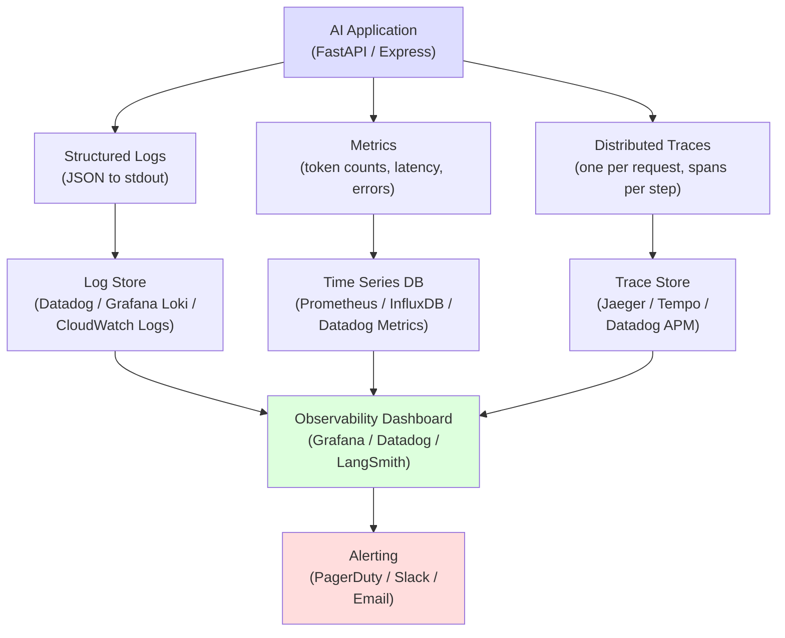
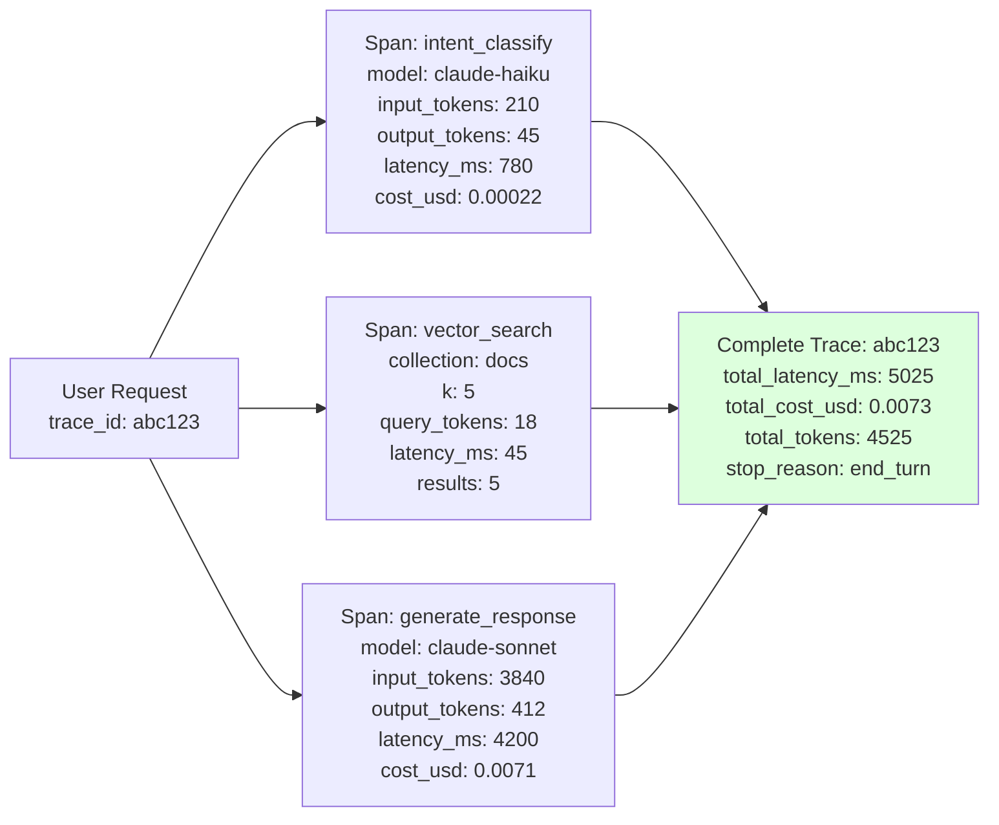
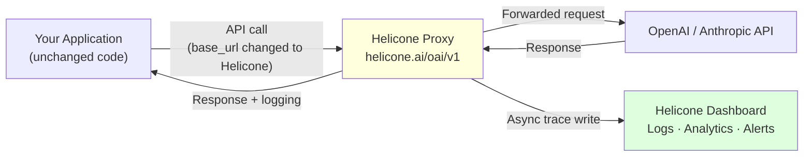
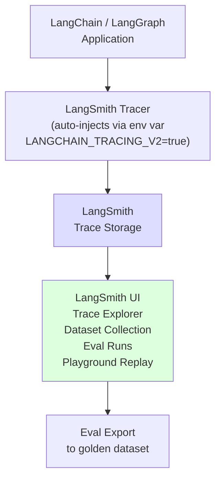
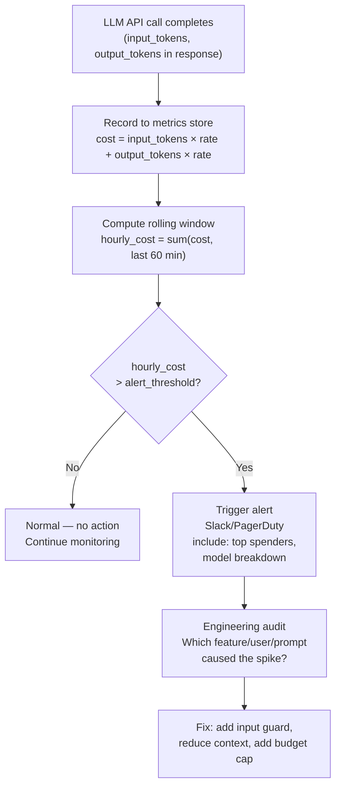
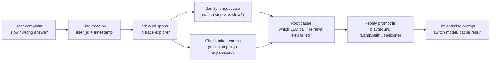

# Chapter 17: AI Observability — Monitoring & Tracing

---

> *"You can't improve what you can't see. In traditional software you watch your server. In AI systems you watch your reasoning."*

---

## Learning Objectives

By the end of this chapter you will be able to:

- Explain why traditional APM tools are insufficient for AI systems and what additional instrumentation is required
- Add structured logging to any AI application so that every LLM call, token count, and latency is captured
- Implement distributed tracing that follows a request through every LLM call, retrieval step, and tool use inside a single user interaction
- Set up real-time alerting for latency spikes, error rate increases, token cost anomalies, and quality regressions
- Use LangSmith to trace LangChain-based applications and replay failing traces for debugging
- Use Helicone as a drop-in proxy to instrument any OpenAI-compatible AI call without changing application code
- Instrument AI calls with OpenTelemetry so traces flow into any existing observability stack (Datadog, Grafana, Jaeger)
- Build a cost dashboard that tracks spend per model, user, feature, and environment
- Diagnose three observability failure patterns: invisible token cost spikes, context window bloat in long conversations, and silent retrieval degradation

---

## Prerequisites

- **Required:** Chapter 4 — AI APIs, SDKs & Streaming (API call patterns and usage objects)
- **Required:** Chapter 15 — Production Architecture (rate limiting, retries, circuit breakers)
- **Recommended:** Chapter 16 — Testing & Evaluating AI Systems (evals complement observability)
- **Recommended:** Chapter 9 — RAG (retrieval steps require their own tracing)
- **Installed:** Python with `uv`, Node.js, Docker (for local OpenTelemetry stack)

---

## Estimated Reading Time

**75 – 90 minutes**

---

## Estimated Hands-on Time

**4 – 5 hours**

---

## Table of Contents

1. [Why This Topic Exists](#1-why-this-topic-exists)
2. [Real-World Analogy](#2-real-world-analogy)
3. [Core Concepts](#3-core-concepts)
4. [Architecture Diagrams](#4-architecture-diagrams)
5. [Flow Diagrams](#5-flow-diagrams)
6. [Beginner Implementation — Structured Logging](#6-beginner-implementation)
7. [Intermediate Implementation — Distributed Tracing](#7-intermediate-implementation)
8. [Advanced Implementation — OpenTelemetry and Production Dashboards](#8-advanced-implementation)
9. [Production Architecture — The Full Observability Stack](#9-production-architecture)
10. [Technology Comparison](#10-technology-comparison)
11. [Best Practices](#11-best-practices)
12. [Security Considerations](#12-security-considerations)
13. [Cost Considerations](#13-cost-considerations)
14. [Common Mistakes](#14-common-mistakes)
15. [Debugging Guide](#15-debugging-guide)
16. [Performance Optimisation](#16-performance-optimisation)
17. [Exercises](#17-exercises)
18. [Quiz](#18-quiz)
19. [Mini Project](#19-mini-project)
20. [Production Project](#20-production-project)
21. [Key Takeaways](#21-key-takeaways)
22. [Chapter Summary](#22-chapter-summary)
23. [Resources](#23-resources)
24. [Glossary Terms Introduced](#24-glossary-terms-introduced)
25. [See Also](#25-see-also)
26. [Preparation for Chapter 18](#26-preparation-for-chapter-18)

---

## 1. Why This Topic Exists

Chapter 16 showed you how to evaluate an AI system before it ships. This chapter covers what happens after it ships.

In a traditional web service, observability means: did the server respond? How long did it take? What was the error rate? These metrics are well understood — every hosting provider, APM tool, and on-call dashboard was built around them.

AI systems expose all the same failure modes as traditional web services, and several new ones that existing tools cannot see:

**New failure modes unique to AI:**

| Failure | Why Traditional APM Misses It |
|---------|-------------------------------|
| Token cost spike | APM shows response time, not token count or dollar cost |
| Context window bloat | The server returned 200 OK — it did not fail, it just got expensive and slow |
| Silent quality degradation | The API returned a response — correctness of that response is invisible |
| Prompt injection in production | No server error, no 4xx, no latency change — the attack worked silently |
| Hallucination rate increase | Provider model update causes increased hallucination — indistinguishable from normal traffic |
| Retrieval drift in RAG | Vector DB returns different results after re-indexing — no errors, just wrong answers |
| Agent infinite loops | The HTTP request succeeds eventually; the cost is invisible until the invoice arrives |

You cannot debug these failures by looking at HTTP response codes. You need visibility into what the model received, what it generated, how many tokens it consumed, how long it spent reasoning, and whether the output quality changed relative to yesterday.

AI observability is the instrumentation layer that makes these new failure modes visible — before they become customer-facing incidents.

---

## 2. Real-World Analogy

### The Flight Data Recorder

When an aircraft behaves unexpectedly, investigators do not look at the outside of the plane. They pull the flight data recorder — a device that continuously logs engine performance, altitude, speed, control inputs, and every cockpit communication for the entire flight. Without this log, the cause of any anomaly would be unknowable.

AI observability is the flight data recorder for your AI system. Every prompt sent, every response received, every tool called, every token consumed, every latency measurement — all of it recorded in a structured way so that when something goes wrong, you can replay the exact sequence of events and find the cause.

### The Hospital Monitor

A patient in intensive care is not checked by a doctor every ten minutes. They are connected to continuous monitors: heart rate, blood pressure, oxygen saturation, temperature — all with alert thresholds. If any metric leaves its normal range, a nurse is paged immediately.

AI monitoring works the same way. You do not check your AI system manually. You set continuous monitors: token spend per hour, average response latency, error rate, context window utilisation, and judge score. When any metric drifts outside its normal band, your on-call engineer gets an alert before a user has even noticed a problem.

---

## 3. Core Concepts

### Observability

**Technical definition:** The ability to understand the internal state of a system from its external outputs. In practice: structured logs, metrics, and distributed traces that together explain what a system did, how long it took, and whether it worked correctly.

**Simple definition:** Observability is the difference between knowing your AI system is working and being able to prove it. An observable system can answer "why did that request behave that way?" from the outside, without needing to add new instrumentation after the fact.

**The three pillars of observability:**
- **Logs** — what happened, as a sequence of discrete events
- **Metrics** — how often things happened, aggregated over time (latency histograms, error rates, token counts)
- **Traces** — how a single request flowed through multiple components (one trace = one user request through all its LLM calls)

---

### Structured Logging

**Technical definition:** A logging strategy where each log entry is a machine-parseable JSON object with consistent key names, rather than a freeform human-readable string.

**Simple definition:** Instead of `logger.info("Claude took 2.3 seconds")`, you write `logger.info({"event": "llm_call", "model": "claude-haiku", "latency_ms": 2300, "input_tokens": 412, "output_tokens": 188})`. Now a log analytics system (Datadog, Grafana Loki, CloudWatch) can filter, aggregate, and alert on these values — it cannot do that with a string.

---

### Distributed Trace

**Technical definition:** A record of all operations performed to handle a single request as it passes through multiple services or components. Each operation is a **span** with a start time, end time, and metadata. All spans belonging to the same request share a **trace ID**.

**Simple definition:** One user message to your AI chatbot might trigger three LLM calls (intent classification → retrieval reranking → response generation), two database queries, and a vector search. A distributed trace stitches all of these together into a single timeline, so you can see exactly how long each step took and which step caused the response to be slow.

---

### Span

**Technical definition:** A single unit of work within a distributed trace — one LLM call, one database query, one tool use. A span has a name, a start timestamp, an end timestamp, and a dictionary of key-value attributes (token counts, model ID, prompt hash, etc.).

**Simple definition:** A span is like one line item in a receipt. The trace is the full receipt showing everything that happened in a request.

---

### Token Accounting

**Technical definition:** The process of recording the exact number of input tokens and output tokens consumed by each LLM call, attributed to a user, feature, and environment — enabling per-request cost calculation and anomaly detection.

**Simple definition:** Every API response from Anthropic and OpenAI includes `usage.input_tokens` and `usage.output_tokens`. Capturing these per call, storing them, and aggregating them lets you answer: "How much did this feature cost yesterday? Which user's conversation cost the most this month? Did our new prompt accidentally triple token consumption?"

---

### Context Window Utilisation

**Technical definition:** The ratio of tokens actually used in a given API call to the model's maximum context window size. Expressed as a percentage (e.g. 34,000 tokens used / 200,000 max = 17% utilisation).

**Simple definition:** Every LLM call sends tokens into the model — the system prompt, the conversation history, the retrieved documents, the user message. If this total creeps toward the model's limit, you get expensive calls, truncation bugs, or hard errors. Tracking utilisation per call lets you catch context bloat before it causes failures.

---

### LLM Trace (AI-Specific)

**Technical definition:** A distributed trace with AI-specific attributes: the complete prompt text (or a hash), the response text (or a hash), token counts, model ID, temperature, stop reason, and latency — recorded for every LLM call in a request.

**Simple definition:** A regular web trace shows that a database query ran for 120ms. An LLM trace shows that a Claude Haiku call took 1.8 seconds, used 312 input tokens and 148 output tokens at a cost of $0.0009, with a stop reason of "end_turn" — and here is the first 200 characters of what the prompt said, and what the response said.

---

### Alert Threshold

**Technical definition:** A defined boundary on a metric (e.g. `p99_latency > 10s` or `hourly_token_cost > $50`) that triggers a notification or automated action when crossed.

**Simple definition:** The number you set before going home on Friday so your phone wakes you up if something goes wrong overnight. For AI systems, you need thresholds not just on latency and error rate but also on token spend, context size, and output quality.

---

## 4. Architecture Diagrams

### 4.1 The AI Observability Stack



### 4.2 LLM Call Instrumentation — What Gets Captured



### 4.3 Helicone as Observability Proxy



### 4.4 LangSmith Trace Architecture



---

## 5. Flow Diagrams

### 5.1 Token Cost Anomaly Detection Flow



### 5.2 Trace Debugging Workflow



---

## 6. Beginner Implementation

### Structured Logging for AI Calls

The first step in AI observability is replacing ad-hoc `print()` statements with structured JSON logs. Every LLM call should emit a log entry with consistent fields that can be searched and aggregated.

```python
# ai_logger.py
# Learning example — structured logging for AI application calls
import json
import logging
import time
import anthropic
from datetime import datetime, timezone

# Configure Python's stdlib logger to output JSON to stdout
# In production, point this at Datadog, CloudWatch, or Loki
logging.basicConfig(
    level=logging.INFO,
    format="%(message)s",   # Only output the message — we serialise it ourselves
)
logger = logging.getLogger("ai_app")


def log_event(event: str, **fields):
    """Emit a single structured log entry."""
    entry = {
        "timestamp": datetime.now(timezone.utc).isoformat(),
        "event": event,
        **fields,
    }
    logger.info(json.dumps(entry))


# ─────────────────────────────────────────────
# Instrumented wrapper around the Anthropic client
# ─────────────────────────────────────────────

client = anthropic.Anthropic()

# Cost reference (as of mid-2026 — verify at docs.anthropic.com/pricing)
MODEL_COSTS = {
    "claude-haiku-4-5-20251001": {"input": 0.80e-6,  "output": 4.00e-6},
    "claude-sonnet-4-6":          {"input": 3.00e-6,  "output": 15.00e-6},
    "claude-opus-4-8":            {"input": 15.00e-6, "output": 75.00e-6},
}


def call_claude(
    user_message: str,
    system: str = "",
    model: str = "claude-haiku-4-5-20251001",
    max_tokens: int = 1024,
    user_id: str = "anonymous",
    feature: str = "unknown",
) -> str:
    """
    Instrumented Claude call. Emits a structured log entry for every call
    including token counts, cost, latency, and the model used.
    """
    start_ms = time.time() * 1000

    log_event("llm_call_start",
        model=model, user_id=user_id, feature=feature,
        input_length=len(user_message),
    )

    try:
        kwargs = {
            "model": model,
            "max_tokens": max_tokens,
            "messages": [{"role": "user", "content": user_message}],
        }
        if system:
            kwargs["system"] = system

        message = client.messages.create(**kwargs)

        latency_ms = int(time.time() * 1000 - start_ms)
        input_tokens = message.usage.input_tokens
        output_tokens = message.usage.output_tokens
        stop_reason = message.stop_reason

        rates = MODEL_COSTS.get(model, {"input": 0, "output": 0})
        cost_usd = input_tokens * rates["input"] + output_tokens * rates["output"]

        context_window = {
            "claude-haiku-4-5-20251001": 200_000,
            "claude-sonnet-4-6": 200_000,
            "claude-opus-4-8": 200_000,
        }.get(model, 200_000)

        log_event("llm_call_complete",
            model=model,
            user_id=user_id,
            feature=feature,
            input_tokens=input_tokens,
            output_tokens=output_tokens,
            total_tokens=input_tokens + output_tokens,
            cost_usd=round(cost_usd, 8),
            latency_ms=latency_ms,
            stop_reason=stop_reason,
            context_utilisation_pct=round((input_tokens / context_window) * 100, 1),
        )

        return message.content[0].text

    except Exception as e:
        latency_ms = int(time.time() * 1000 - start_ms)
        log_event("llm_call_error",
            model=model, user_id=user_id, feature=feature,
            error_type=type(e).__name__, error_message=str(e),
            latency_ms=latency_ms,
        )
        raise


# Node.js equivalent
NODEJS_EXAMPLE = """
// ai-logger.mjs  — Learning example
import Anthropic from "@anthropic-ai/sdk";

const client = new Anthropic();

const MODEL_COSTS = {
  "claude-haiku-4-5-20251001": { input: 0.80e-6, output: 4.00e-6 },
  "claude-sonnet-4-6":          { input: 3.00e-6,  output: 15.00e-6 },
};

function logEvent(event, fields = {}) {
  console.log(JSON.stringify({
    timestamp: new Date().toISOString(),
    event,
    ...fields,
  }));
}

export async function callClaude(userMessage, {
  system = "",
  model = "claude-haiku-4-5-20251001",
  maxTokens = 1024,
  userId = "anonymous",
  feature = "unknown",
} = {}) {
  const startMs = Date.now();
  logEvent("llm_call_start", { model, userId, feature });

  try {
    const response = await client.messages.create({
      model,
      max_tokens: maxTokens,
      ...(system && { system }),
      messages: [{ role: "user", content: userMessage }],
    });

    const latencyMs = Date.now() - startMs;
    const { input_tokens, output_tokens } = response.usage;
    const rates = MODEL_COSTS[model] ?? { input: 0, output: 0 };
    const costUsd = input_tokens * rates.input + output_tokens * rates.output;

    logEvent("llm_call_complete", {
      model, userId, feature,
      input_tokens, output_tokens,
      total_tokens: input_tokens + output_tokens,
      cost_usd: costUsd.toFixed(8),
      latency_ms: latencyMs,
      stop_reason: response.stop_reason,
    });

    return response.content[0].text;
  } catch (err) {
    logEvent("llm_call_error", { model, userId, feature,
      error_type: err.constructor.name, error_message: err.message,
      latency_ms: Date.now() - startMs,
    });
    throw err;
  }
}
"""


# Usage — the caller sees no difference:
if __name__ == "__main__":
    response = call_claude(
        "Summarise the key risks of using AI in healthcare.",
        feature="document_summariser",
        user_id="user_847",
    )
    print(response)

    # Structured log output (JSON, one line per event):
    # {"timestamp": "2026-06-29T12:00:01Z", "event": "llm_call_start", "model": "claude-haiku-4-5-20251001", ...}
    # {"timestamp": "2026-06-29T12:00:03Z", "event": "llm_call_complete", "input_tokens": 312, "output_tokens": 188, "cost_usd": 0.00000101, "latency_ms": 1840, ...}
```

---

### Conversation-Level Logging

A single conversation may span dozens of turns. Log at the conversation level too:

```python
# conversation_logger.py
# Production example — logging across a multi-turn conversation
import uuid
from dataclasses import dataclass, field


@dataclass
class ConversationMetrics:
    conversation_id: str = field(default_factory=lambda: str(uuid.uuid4()))
    user_id: str = "anonymous"
    total_turns: int = 0
    total_input_tokens: int = 0
    total_output_tokens: int = 0
    total_cost_usd: float = 0.0
    total_latency_ms: int = 0
    max_context_utilisation_pct: float = 0.0
    errors: int = 0


def log_conversation_start(user_id: str) -> ConversationMetrics:
    metrics = ConversationMetrics(user_id=user_id)
    log_event("conversation_start",
        conversation_id=metrics.conversation_id,
        user_id=user_id,
    )
    return metrics


def update_conversation_metrics(
    metrics: ConversationMetrics,
    input_tokens: int,
    output_tokens: int,
    cost_usd: float,
    latency_ms: int,
    context_utilisation_pct: float,
) -> None:
    metrics.total_turns += 1
    metrics.total_input_tokens += input_tokens
    metrics.total_output_tokens += output_tokens
    metrics.total_cost_usd += cost_usd
    metrics.total_latency_ms += latency_ms
    metrics.max_context_utilisation_pct = max(
        metrics.max_context_utilisation_pct, context_utilisation_pct
    )


def log_conversation_end(metrics: ConversationMetrics) -> None:
    log_event("conversation_end",
        conversation_id=metrics.conversation_id,
        user_id=metrics.user_id,
        total_turns=metrics.total_turns,
        total_input_tokens=metrics.total_input_tokens,
        total_output_tokens=metrics.total_output_tokens,
        total_cost_usd=round(metrics.total_cost_usd, 6),
        avg_latency_ms=metrics.total_latency_ms // max(metrics.total_turns, 1),
        max_context_utilisation_pct=metrics.max_context_utilisation_pct,
        errors=metrics.errors,
        # Alert flag: conversations with >50% context utilisation need attention
        high_context_risk=metrics.max_context_utilisation_pct > 50.0,
    )
```

---

## 7. Intermediate Implementation

### Distributed Tracing with Context Propagation

A single user request to an AI chatbot often triggers multiple internal operations — intent classification, retrieval, reranking, generation. All of these must be linked to a single trace ID so you can reconstruct the full timeline.

```python
# tracing.py
# Production example — lightweight distributed tracing without a framework
import uuid
import time
import json
from contextlib import contextmanager
from dataclasses import dataclass, field
from typing import Any

# Global trace store (in production, flush to OTLP or Jaeger instead)
_active_traces: dict[str, list[dict]] = {}


@dataclass
class Span:
    trace_id: str
    span_id: str
    parent_span_id: str | None
    name: str
    start_time_ms: float
    end_time_ms: float | None = None
    attributes: dict[str, Any] = field(default_factory=dict)
    status: str = "OK"   # "OK" | "ERROR"
    error: str | None = None

    def duration_ms(self) -> int:
        if self.end_time_ms is None:
            return 0
        return int(self.end_time_ms - self.start_time_ms)


# Thread-local current span (production: use contextvars.ContextVar)
import threading
_current_span = threading.local()


def current_trace_id() -> str | None:
    span = getattr(_current_span, "span", None)
    return span.trace_id if span else None


def current_span_id() -> str | None:
    span = getattr(_current_span, "span", None)
    return span.span_id if span else None


@contextmanager
def trace_span(name: str, **attributes):
    """
    Context manager that creates a span, records timing, and emits a log entry.
    Spans nest automatically — inner spans become children of the outer span.
    """
    trace_id = current_trace_id() or str(uuid.uuid4())
    span = Span(
        trace_id=trace_id,
        span_id=str(uuid.uuid4())[:8],
        parent_span_id=current_span_id(),
        name=name,
        start_time_ms=time.time() * 1000,
        attributes=attributes,
    )

    previous_span = getattr(_current_span, "span", None)
    _current_span.span = span

    try:
        yield span
        span.end_time_ms = time.time() * 1000
    except Exception as e:
        span.end_time_ms = time.time() * 1000
        span.status = "ERROR"
        span.error = f"{type(e).__name__}: {e}"
        raise
    finally:
        _current_span.span = previous_span
        _emit_span(span)


def _emit_span(span: Span) -> None:
    """Emit the completed span as a structured log entry."""
    log_event("span",
        trace_id=span.trace_id,
        span_id=span.span_id,
        parent_span_id=span.parent_span_id,
        name=span.name,
        duration_ms=span.duration_ms(),
        status=span.status,
        error=span.error,
        **span.attributes,
    )


# ─────────────────────────────────────────────
# Using trace_span in a RAG pipeline
# ─────────────────────────────────────────────

def handle_user_query(user_id: str, query: str) -> str:
    """RAG pipeline with full tracing across all steps."""
    with trace_span("handle_query", user_id=user_id, query_length=len(query)):

        with trace_span("intent_classify", model="claude-haiku"):
            intent = classify_intent(query)   # Returns "question" | "command" | "complaint"

        with trace_span("vector_search", collection="product_docs", k=5):
            docs = vector_search(query, k=5)   # Returns list of document strings

        with trace_span("generate_response",
            model="claude-sonnet-4-6",
            retrieved_doc_count=len(docs),
        ):
            response = generate_rag_response(query, docs)

        return response


# Now every operation in this request shares trace_id = <same UUID>
# A trace explorer can show:
#   handle_query            [5200ms total]
#     ├── intent_classify   [820ms]
#     ├── vector_search     [48ms]
#     └── generate_response [4332ms]
```

---

### Helicone: Zero-Code AI Observability Proxy

Helicone intercepts your AI API calls by acting as a transparent proxy. Change one line (`base_url`) and get full logging, analytics, rate limiting, and cost tracking — without modifying application logic.

```python
# helicone_setup.py
# Production example — Helicone proxy for Anthropic and OpenAI
import anthropic
import openai
import os

HELICONE_API_KEY = os.environ["HELICONE_API_KEY"]

# ─────────────────────────────────
# Anthropic via Helicone proxy
# ─────────────────────────────────

claude_client = anthropic.Anthropic(
    api_key=os.environ["ANTHROPIC_API_KEY"],
    base_url="https://anthropic.helicone.ai",       # Route through Helicone
    default_headers={
        "Helicone-Auth": f"Bearer {HELICONE_API_KEY}",
        # Optional metadata Helicone logs per request:
        "Helicone-User-Id": "user_847",
        "Helicone-Property-Feature": "customer_support",
        "Helicone-Property-Environment": "production",
    },
)

# ─────────────────────────────────
# OpenAI via Helicone proxy
# ─────────────────────────────────

openai_client = openai.OpenAI(
    api_key=os.environ["OPENAI_API_KEY"],
    base_url="https://oai.helicone.ai/v1",
    default_headers={
        "Helicone-Auth": f"Bearer {HELICONE_API_KEY}",
    },
)

# All calls through these clients are automatically:
# 1. Logged to the Helicone dashboard with token counts, cost, and latency
# 2. Tagged with your metadata properties (user, feature, environment)
# 3. Available for replay, filtering, and export in the Helicone UI
# 4. Optionally cached, rate-limited, or prompt-guarded

# ─────────────────────────────────
# Adding per-request Helicone metadata
# ─────────────────────────────────

def call_claude_with_helicone(
    user_message: str,
    user_id: str,
    session_id: str,
    feature: str,
) -> str:
    """Pass Helicone headers per-request for granular logging."""
    message = claude_client.messages.create(
        model="claude-haiku-4-5-20251001",
        max_tokens=1024,
        messages=[{"role": "user", "content": user_message}],
        extra_headers={
            "Helicone-User-Id": user_id,
            "Helicone-Session-Id": session_id,           # Groups turns in a conversation
            "Helicone-Property-Feature": feature,
            "Helicone-Property-AB-Test": "prompt_v2",    # Track A/B test variants
        },
    )
    return message.content[0].text
```

```javascript
// helicone-openai.mjs — Node.js with Helicone proxy
import OpenAI from "openai";

const client = new OpenAI({
  apiKey: process.env.OPENAI_API_KEY,
  baseURL: "https://oai.helicone.ai/v1",
  defaultHeaders: {
    "Helicone-Auth": `Bearer ${process.env.HELICONE_API_KEY}`,
    "Helicone-Property-Environment": "production",
  },
});

// Every call is now logged — no other code changes needed
const response = await client.chat.completions.create({
  model: "gpt-4o-mini",
  messages: [{ role: "user", content: "Hello" }],
});
```

---

### LangSmith Tracing

LangSmith provides AI-native tracing for LangChain and LangGraph applications. Enable it with two environment variables — no code changes.

```python
# langsmith_setup.py
# Production example — LangSmith tracing for LangChain applications
import os

# Enable LangSmith tracing for all LangChain operations in this process
os.environ["LANGCHAIN_TRACING_V2"] = "true"
os.environ["LANGCHAIN_API_KEY"] = os.environ["LANGSMITH_API_KEY"]
os.environ["LANGCHAIN_PROJECT"] = "customer-support-prod"   # Groups traces by project

# Now any LangChain or LangGraph call is automatically traced.
# Traces appear in the LangSmith UI at smith.langchain.com

from langchain_anthropic import ChatAnthropic
from langchain_core.messages import HumanMessage

llm = ChatAnthropic(model="claude-haiku-4-5-20251001")

# This call is automatically traced — no wrapper needed:
response = llm.invoke([HumanMessage(content="What is observability?")])

# LangSmith records:
# - Full prompt (system + messages)
# - Full response
# - Token counts and latency
# - All retrieval steps if using a RAG chain
# - Every tool call if using an agent
```

```python
# langsmith_manual.py
# Production example — manual LangSmith tracing for non-LangChain AI code
from langsmith import traceable
import anthropic

client = anthropic.Anthropic()


@traceable(name="classify_intent", tags=["classification"])
def classify_intent(query: str) -> str:
    """Intent classifier — traced by LangSmith @traceable decorator."""
    msg = client.messages.create(
        model="claude-haiku-4-5-20251001",
        max_tokens=32,
        system='Return only one word: "question", "command", or "complaint".',
        messages=[{"role": "user", "content": query}],
    )
    return msg.content[0].text.strip()


@traceable(name="generate_response", tags=["generation"])
def generate_rag_response(query: str, contexts: list[str]) -> str:
    """RAG response generator — all context and output traced."""
    context_text = "\n\n".join(contexts)
    msg = client.messages.create(
        model="claude-sonnet-4-6",
        max_tokens=1024,
        system=f"Answer based on these documents:\n\n{context_text}",
        messages=[{"role": "user", "content": query}],
    )
    return msg.content[0].text


@traceable(name="handle_support_query")
def handle_support_query(query: str, user_id: str) -> str:
    """Outer trace wraps all inner spans into a single trace tree."""
    intent = classify_intent(query)
    docs = ["Policy doc 1...", "Policy doc 2..."]   # Simplified — real system uses vector DB
    return generate_rag_response(query, docs)
```

---

### Production Issue: Invisible Token Cost Spike

**Symptoms:**
At 3 AM on a Tuesday, your AI service's hourly Anthropic bill jumps from $8/hr to $340/hr. No alerts fire. No errors are logged. No latency increases. Users are not complaining. By the time the daily invoice email arrives the next morning, $2,720 of unexpected spend has accumulated. Looking at the application code, everything appears to work correctly.

**Root Cause:**
A developer deployed a new "enhanced context" feature that retrieves and injects the last 30 conversation turns into every LLM call, plus the user's full profile document (8 KB), plus the product knowledge base excerpt (12 KB). For most users this adds ~2,000 input tokens per call. But one enterprise client started a batch job that triggered 1,200 API calls per hour — each at 22,000 input tokens instead of the expected 2,000 tokens. The total input token count increased 40× for this one client, but no metric tracked input tokens, so no alert fired.

**How to Diagnose It:**

```python
# Add this check to every LLM call wrapper:
def call_claude_with_budget_guard(
    messages: list[dict],
    system: str,
    model: str = "claude-haiku-4-5-20251001",
    user_id: str = "anonymous",
    max_input_tokens: int = 5_000,   # Alert if single call exceeds this
) -> str:
    import tiktoken  # For rough token estimation before the call

    # Estimate tokens before calling (avoid surprise on huge inputs)
    estimated_tokens = sum(len(m.get("content", "").split()) * 1.3 for m in messages)
    if estimated_tokens > max_input_tokens:
        log_event("token_budget_warning",
            user_id=user_id, estimated_tokens=int(estimated_tokens),
            max_input_tokens=max_input_tokens,
        )
        # Optionally: truncate or refuse the call here

    msg = client.messages.create(
        model=model, max_tokens=2048,
        system=system, messages=messages,
    )

    actual_input = msg.usage.input_tokens
    if actual_input > max_input_tokens:
        log_event("token_budget_exceeded",
            user_id=user_id, actual_input_tokens=actual_input,
            max_input_tokens=max_input_tokens,
            overage_pct=round((actual_input / max_input_tokens - 1) * 100, 1),
        )
    return msg.content[0].text
```

**How to Fix It:**

```python
# Add hourly spend alerting:
import redis
import time

r = redis.Redis()
ALERT_THRESHOLD_USD_PER_HOUR = 50.0

def record_and_check_spend(cost_usd: float, user_id: str, model: str):
    """Record spend in Redis and alert if hourly total exceeds threshold."""
    hour_key = f"spend:{int(time.time() // 3600)}"
    user_key = f"spend_user:{user_id}:{int(time.time() // 3600)}"

    # Atomic increment (pipeline for atomic multi-key update)
    pipe = r.pipeline()
    pipe.incrbyfloat(hour_key, cost_usd)
    pipe.expire(hour_key, 7200)   # Keep for 2 hours
    pipe.incrbyfloat(user_key, cost_usd)
    pipe.expire(user_key, 7200)
    results = pipe.execute()

    hourly_total = float(results[0])
    if hourly_total > ALERT_THRESHOLD_USD_PER_HOUR:
        trigger_alert(
            title="AI Spend Alert",
            message=f"Hourly spend: ${hourly_total:.2f} (threshold: ${ALERT_THRESHOLD_USD_PER_HOUR})",
            model=model,
        )
```

**How to Prevent It in Future:**
Instrument every LLM call to record actual input token counts and compute cost immediately from the `usage` object in the response. Store cumulative spend in Redis with a per-hour sliding window. Alert when the hourly total exceeds a defined threshold — set the threshold at 3× the daily average hourly spend so it catches genuine spikes without firing on normal peak traffic. Add a pre-call token estimator that refuses or truncates requests that exceed a per-call budget. Add per-user hourly caps for any API surface accessible to external clients.

---

## 8. Advanced Implementation

### OpenTelemetry Instrumentation

OpenTelemetry (OTel) is the industry standard for distributed tracing. Instrumenting your AI application with OTel means your traces can flow into any existing observability backend — Datadog, Jaeger, Tempo, Honeycomb — without vendor lock-in.

```python
# otel_setup.py
# Production example — OpenTelemetry instrumentation for AI applications
from opentelemetry import trace
from opentelemetry.sdk.trace import TracerProvider
from opentelemetry.sdk.trace.export import BatchSpanProcessor
from opentelemetry.exporter.otlp.proto.grpc.trace_exporter import OTLPSpanExporter
from opentelemetry.sdk.resources import Resource
import anthropic
import time

# ─────────────────────────────────────────────
# Initialise OpenTelemetry tracer
# ─────────────────────────────────────────────

resource = Resource.create({
    "service.name": "ai-customer-support",
    "service.version": "2.1.0",
    "deployment.environment": "production",
})

provider = TracerProvider(resource=resource)

# Export traces to OTLP endpoint (Jaeger, Tempo, Datadog agent, etc.)
otlp_exporter = OTLPSpanExporter(
    endpoint="http://otel-collector:4317",   # Your OTLP collector address
    insecure=True,
)
provider.add_span_processor(BatchSpanProcessor(otlp_exporter))
trace.set_tracer_provider(provider)

tracer = trace.get_tracer("ai_app")
client = anthropic.Anthropic()


def call_claude_otel(
    messages: list[dict],
    system: str = "",
    model: str = "claude-haiku-4-5-20251001",
    user_id: str = "anonymous",
    feature: str = "unknown",
) -> str:
    """Claude call fully instrumented with OpenTelemetry spans."""
    with tracer.start_as_current_span("llm.call") as span:
        span.set_attribute("llm.vendor", "anthropic")
        span.set_attribute("llm.model", model)
        span.set_attribute("llm.user_id", user_id)
        span.set_attribute("llm.feature", feature)
        span.set_attribute("llm.message_count", len(messages))

        start = time.time()
        try:
            kwargs = {
                "model": model,
                "max_tokens": 2048,
                "messages": messages,
            }
            if system:
                kwargs["system"] = system

            message = client.messages.create(**kwargs)

            # Record AI-specific attributes on the span
            span.set_attribute("llm.input_tokens", message.usage.input_tokens)
            span.set_attribute("llm.output_tokens", message.usage.output_tokens)
            span.set_attribute("llm.stop_reason", message.stop_reason)
            span.set_attribute("llm.latency_ms", int((time.time() - start) * 1000))

            MODEL_COSTS = {
                "claude-haiku-4-5-20251001": (0.80e-6, 4.00e-6),
                "claude-sonnet-4-6": (3.00e-6, 15.00e-6),
            }
            rates = MODEL_COSTS.get(model, (0, 0))
            cost = message.usage.input_tokens * rates[0] + message.usage.output_tokens * rates[1]
            span.set_attribute("llm.cost_usd", round(cost, 8))

            return message.content[0].text

        except Exception as e:
            span.set_status(trace.StatusCode.ERROR, str(e))
            span.record_exception(e)
            raise
```

```python
# otel_rag_trace.py
# Production example — full RAG pipeline trace with child spans
from opentelemetry import trace

tracer = trace.get_tracer("ai_app")


def handle_query_otel(query: str, user_id: str) -> str:
    """RAG pipeline with a parent span containing three child spans."""
    with tracer.start_as_current_span("rag.handle_query") as root:
        root.set_attribute("user.id", user_id)
        root.set_attribute("query.length", len(query))

        # Child span 1: intent classification
        with tracer.start_as_current_span("rag.classify_intent"):
            intent = classify_intent_otel(query)
            trace.get_current_span().set_attribute("intent.result", intent)

        # Child span 2: vector retrieval
        with tracer.start_as_current_span("rag.vector_search") as retrieval_span:
            docs = vector_search(query, k=5)
            retrieval_span.set_attribute("retrieval.doc_count", len(docs))
            retrieval_span.set_attribute("retrieval.collection", "product_docs")

        # Child span 3: response generation
        with tracer.start_as_current_span("rag.generate") as gen_span:
            response = call_claude_otel(
                messages=[{"role": "user", "content": query}],
                system=f"Use these docs:\n{'---'.join(docs)}",
                feature="rag_response",
                user_id=user_id,
            )
            gen_span.set_attribute("rag.doc_count", len(docs))

        root.set_attribute("response.length", len(response))
        return response
```

---

### Docker Compose: Local Observability Stack

Run a complete observability stack locally for development:

```yaml
# docker-compose.observability.yml
# Production example — local OpenTelemetry + Jaeger + Prometheus + Grafana stack
version: "3.9"

services:
  # OTel Collector: receives spans from your app, exports to Jaeger + Prometheus
  otel-collector:
    image: otel/opentelemetry-collector-contrib:0.103.0
    command: ["--config=/etc/otelcol/config.yaml"]
    volumes:
      - ./otel-collector-config.yaml:/etc/otelcol/config.yaml
    ports:
      - "4317:4317"   # OTLP gRPC receiver (your app sends here)
      - "4318:4318"   # OTLP HTTP receiver
    depends_on:
      - jaeger

  # Jaeger: distributed trace storage and UI
  jaeger:
    image: jaegertracing/all-in-one:1.58
    ports:
      - "16686:16686"   # Jaeger UI → open http://localhost:16686
      - "14250:14250"   # Jaeger gRPC receiver
    environment:
      - COLLECTOR_OTLP_ENABLED=true

  # Prometheus: metrics storage
  prometheus:
    image: prom/prometheus:v2.53.0
    command:
      - '--config.file=/etc/prometheus/prometheus.yml'
      - '--storage.tsdb.retention.time=7d'
    volumes:
      - ./prometheus.yml:/etc/prometheus/prometheus.yml
    ports:
      - "9090:9090"

  # Grafana: dashboards
  grafana:
    image: grafana/grafana:11.1.0
    ports:
      - "3000:3000"    # Grafana UI → open http://localhost:3000 (admin/admin)
    environment:
      - GF_AUTH_ANONYMOUS_ENABLED=true
      - GF_AUTH_ANONYMOUS_ORG_ROLE=Admin
    volumes:
      - ./grafana/dashboards:/var/lib/grafana/dashboards
      - ./grafana/provisioning:/etc/grafana/provisioning
    depends_on:
      - prometheus

  # Your AI application
  ai-app:
    build: .
    environment:
      - ANTHROPIC_API_KEY=${ANTHROPIC_API_KEY}
      - OTEL_EXPORTER_OTLP_ENDPOINT=http://otel-collector:4317
      - OTEL_SERVICE_NAME=ai-customer-support
    depends_on:
      - otel-collector
```

```yaml
# otel-collector-config.yaml
receivers:
  otlp:
    protocols:
      grpc:
        endpoint: 0.0.0.0:4317
      http:
        endpoint: 0.0.0.0:4318

processors:
  batch:
    timeout: 1s
    send_batch_size: 1024

exporters:
  jaeger:
    endpoint: jaeger:14250
    tls:
      insecure: true
  prometheus:
    endpoint: "0.0.0.0:8889"

service:
  pipelines:
    traces:
      receivers: [otlp]
      processors: [batch]
      exporters: [jaeger]
    metrics:
      receivers: [otlp]
      processors: [batch]
      exporters: [prometheus]
```

---

### Production Issue: Context Window Bloat in Long Conversations

**Symptoms:**
Your AI support chatbot works perfectly for the first 5–10 turns of a conversation. After 15–20 turns with a user who is working through a complex issue, response latency jumps from 1.8 seconds to 12 seconds. The API still returns 200 OK. Token costs per message are 8× higher than average. Some conversations return a `max_tokens` stop reason even when `max_tokens` is set to 2048 — the model ran out of output space because the input alone consumed most of the context window.

**Root Cause:**
The chatbot naively appends every turn to the messages array without any context management. After 20 turns of 300 tokens each, the conversation history alone is 6,000 tokens. Combined with the system prompt (1,200 tokens), retrieved documents (4,000 tokens), and the user's current message (200 tokens), the total input is 11,400 tokens — and climbing by ~300 tokens per additional turn. At 40 turns, input tokens exceed 20,000. The model must process all of it for every single response.

**How to Diagnose It:**

```python
def audit_conversation_growth(messages: list[dict]) -> dict:
    """Check context window utilisation for a conversation."""
    # Rough token estimation: ~1.3 tokens per whitespace-separated word
    total_tokens = sum(
        int(len(str(m.get("content", "")).split()) * 1.3)
        for m in messages
    )
    context_window = 200_000   # Claude's context window

    return {
        "turn_count": len([m for m in messages if m["role"] == "user"]),
        "estimated_tokens": total_tokens,
        "context_utilisation_pct": round((total_tokens / context_window) * 100, 1),
        "at_risk": total_tokens > context_window * 0.5,
        "projected_turns_until_full": max(
            0, int((context_window * 0.9 - total_tokens) / 300)
        ),
    }
```

**How to Fix It:**

```python
# Production example — sliding window context management
def trim_conversation_history(
    messages: list[dict],
    system_prompt: str,
    max_history_tokens: int = 4_000,   # Reserve space for system + docs + response
) -> list[dict]:
    """
    Keep the most recent turns that fit within max_history_tokens.
    Always preserves the last turn (current user message).
    """
    if not messages:
        return messages

    # Always keep the current user message
    current_message = messages[-1]
    history = messages[:-1]

    # Work backwards through history keeping what fits
    kept = []
    token_count = 0
    for message in reversed(history):
        msg_tokens = int(len(str(message.get("content", "")).split()) * 1.3)
        if token_count + msg_tokens > max_history_tokens:
            break
        kept.insert(0, message)
        token_count += msg_tokens

    result = kept + [current_message]

    if len(result) < len(messages):
        # Add a system note that history was trimmed
        trimmed_count = len(messages) - len(result)
        result.insert(0, {
            "role": "user",
            "content": f"[Note: {trimmed_count} earlier turns were omitted to fit context window]",
        })
        result.insert(1, {"role": "assistant", "content": "Understood."})

    log_event("context_trimmed",
        original_turns=len(messages),
        kept_turns=len(result),
        trimmed_turns=len(messages) - len(result),
    )
    return result


# Alternative: summarise old turns instead of discarding them
def summarise_old_turns(messages: list[dict], keep_recent: int = 6) -> list[dict]:
    """Summarise old turns into a single context message."""
    if len(messages) <= keep_recent * 2:
        return messages

    old_messages = messages[:-keep_recent * 2]
    recent_messages = messages[-keep_recent * 2:]

    # Summarise the old portion
    summary_input = "\n".join(
        f"{m['role'].upper()}: {m['content'][:200]}"
        for m in old_messages
    )
    summary = call_claude(
        f"Summarise this conversation history in 3–5 bullet points:\n\n{summary_input}",
        feature="context_summariser",
    )

    return [
        {"role": "user", "content": f"[Earlier conversation summary]\n{summary}"},
        {"role": "assistant", "content": "I have the context from our earlier conversation."},
        *recent_messages,
    ]
```

**How to Prevent It in Future:**
Track `context_utilisation_pct` as a metric in every LLM call log. Alert when any conversation exceeds 40% context utilisation — that is the warning zone where action is needed before it reaches the danger zone. Implement either the sliding window trim or the summarisation strategy as a mandatory preprocessing step that runs before every LLM call with more than 10 previous turns. Log when trimming occurs so you can audit how frequently it fires and adjust the trim threshold. Set a hard cap: refuse to process conversations that would exceed 80% context utilisation without first trimming.

---

## 9. Production Architecture

### Complete AI Observability Stack (Python FastAPI)

```python
# observability.py
# Production example — full observability middleware for a FastAPI AI application
import time
import uuid
import json
import logging
from contextlib import asynccontextmanager
from fastapi import FastAPI, Request, Response
from opentelemetry import trace
from opentelemetry.instrumentation.fastapi import FastAPIInstrumentor
import anthropic

# ─────────────────────────────────────────────
# Metrics accumulator (production: use Prometheus counters/histograms)
# ─────────────────────────────────────────────

from collections import defaultdict
import threading

_metrics_lock = threading.Lock()
_metrics = defaultdict(float)


def increment(key: str, value: float = 1.0):
    with _metrics_lock:
        _metrics[key] += value


# ─────────────────────────────────────────────
# FastAPI request logging middleware
# ─────────────────────────────────────────────

async def observability_middleware(request: Request, call_next):
    request_id = str(uuid.uuid4())[:12]
    start_ms = time.time() * 1000

    # Attach request_id for logging in downstream handlers
    request.state.request_id = request_id

    log_event("http_request",
        request_id=request_id,
        method=request.method,
        path=request.url.path,
        user_agent=request.headers.get("user-agent", ""),
    )

    try:
        response = await call_next(request)
        latency_ms = int(time.time() * 1000 - start_ms)

        log_event("http_response",
            request_id=request_id,
            status_code=response.status_code,
            latency_ms=latency_ms,
        )

        increment(f"http_requests_total.{response.status_code}")
        increment("http_latency_ms.total", latency_ms)
        increment("http_latency_ms.count")

        return response

    except Exception as e:
        latency_ms = int(time.time() * 1000 - start_ms)
        log_event("http_error",
            request_id=request_id,
            error_type=type(e).__name__,
            error=str(e),
            latency_ms=latency_ms,
        )
        increment("http_errors_total")
        raise


# ─────────────────────────────────────────────
# Health + metrics endpoints
# ─────────────────────────────────────────────

app = FastAPI()
app.middleware("http")(observability_middleware)
FastAPIInstrumentor.instrument_app(app)   # OTel auto-instrumentation for FastAPI


@app.get("/health")
async def health():
    return {"status": "ok", "timestamp": time.time()}


@app.get("/metrics/summary")
async def metrics_summary():
    """Return current accumulated metrics as a JSON summary."""
    with _metrics_lock:
        snapshot = dict(_metrics)

    total_requests = int(snapshot.get("http_requests_total.200", 0))
    total_errors = int(snapshot.get("http_errors_total", 0))
    total_latency = snapshot.get("http_latency_ms.total", 0)
    latency_count = snapshot.get("http_latency_ms.count", 1)

    return {
        "total_requests": total_requests,
        "error_rate": round(total_errors / max(total_requests, 1), 4),
        "avg_latency_ms": round(total_latency / latency_count),
        "total_ai_tokens": int(snapshot.get("ai_tokens_total", 0)),
        "total_ai_cost_usd": round(snapshot.get("ai_cost_usd_total", 0.0), 4),
    }


@app.post("/chat")
async def chat_endpoint(request: Request, body: dict):
    user_message = body.get("message", "")
    user_id = body.get("user_id", "anonymous")

    response_text = call_claude(
        user_message,
        user_id=user_id,
        feature="chat_endpoint",
    )

    return {"response": response_text}
```

---

### Production Issue: Silent Retrieval Degradation in RAG

**Symptoms:**
Three weeks after re-indexing your product knowledge base with updated documents, user satisfaction scores decline by 18%. There are no API errors. Response latency is unchanged. The AI is still generating coherent, grammatically correct responses. However, the answers are slightly off — describing features as they worked in the old version, missing newly added capabilities, occasionally contradicting the current documentation. Support tickets start referencing "incorrect AI answers" but engineers cannot reproduce the issue in testing because the problem only manifests for specific queries against the new documents.

**Root Cause:**
The re-indexing used a different chunking strategy than the original index — 800 tokens per chunk instead of 400. Some queries that previously retrieved two focused chunks now retrieve one large chunk containing the relevant section plus unrelated context. The embedding model's ability to rank these larger chunks against specific queries degraded, causing retrieval quality to drop silently. No metric tracked retrieval quality — only API success and latency.

**How to Diagnose It:**

```python
def trace_retrieval_quality(
    query: str,
    retrieved_docs: list[str],
    generated_answer: str,
    trace_id: str,
) -> None:
    """
    Log retrieval quality indicators alongside every RAG response.
    These logs enable post-hoc analysis of retrieval degradation.
    """
    # Signal 1: Average character count of retrieved chunks
    avg_chunk_size = sum(len(d) for d in retrieved_docs) / max(len(retrieved_docs), 1)

    # Signal 2: Lexical overlap between query terms and retrieved docs
    query_terms = set(query.lower().split())
    overlap_scores = []
    for doc in retrieved_docs:
        doc_terms = set(doc.lower().split())
        overlap = len(query_terms & doc_terms) / max(len(query_terms), 1)
        overlap_scores.append(overlap)
    avg_overlap = sum(overlap_scores) / max(len(overlap_scores), 1)

    # Signal 3: Doc count actually used (should be ≈ k)
    doc_count = len(retrieved_docs)

    log_event("retrieval_quality",
        trace_id=trace_id,
        query_length=len(query),
        doc_count=doc_count,
        avg_chunk_size_chars=int(avg_chunk_size),
        avg_query_overlap=round(avg_overlap, 3),
        answer_length=len(generated_answer),
        # Flag potentially poor retrieval for review:
        low_overlap_flag=avg_overlap < 0.2,
        large_chunk_flag=avg_chunk_size > 2000,
    )
```

**How to Fix It:**

```python
# Re-index with the correct chunking strategy and validate before cutover:
def validate_retrieval_quality_before_cutover(
    sample_queries: list[str],
    old_index,
    new_index,
    k: int = 5,
) -> dict:
    """
    Compare retrieval quality between old and new index on representative queries.
    Run this before switching production traffic to a new index.
    """
    old_scores = []
    new_scores = []

    for query in sample_queries:
        old_docs = old_index.search(query, k=k)
        new_docs = new_index.search(query, k=k)

        query_terms = set(query.lower().split())

        def overlap_score(docs):
            scores = []
            for doc in docs:
                doc_terms = set(doc.lower().split())
                scores.append(len(query_terms & doc_terms) / max(len(query_terms), 1))
            return sum(scores) / max(len(scores), 1)

        old_scores.append(overlap_score(old_docs))
        new_scores.append(overlap_score(new_docs))

    avg_old = sum(old_scores) / len(old_scores)
    avg_new = sum(new_scores) / len(new_scores)
    delta = avg_new - avg_old

    return {
        "avg_retrieval_score_old": round(avg_old, 3),
        "avg_retrieval_score_new": round(avg_new, 3),
        "delta": round(delta, 3),
        "safe_to_cutover": delta >= -0.05,   # New index should not be more than 5% worse
        "queries_evaluated": len(sample_queries),
    }
```

**How to Prevent It in Future:**
Add retrieval quality metrics to every RAG log entry: chunk count, average chunk size, lexical overlap score, and a flag for suspiciously large or small chunks. Track the distribution of these metrics over time so you can detect when a re-index changes retrieval behaviour. Before any index cutover, run the retrieval validation function on a sample of 50 representative production queries and enforce a delta gate: reject the cutover if average retrieval overlap drops more than 5%. This makes index changes as safe as prompt changes.

---

## 10. Technology Comparison

### AI Observability Tool Comparison

| Feature | Custom Logging (this chapter) | LangSmith | Helicone | OpenTelemetry + Jaeger |
|---------|------------------------------|-----------|----------|------------------------|
| **Setup effort** | Write logging wrapper | 2 env vars (LangChain) | 1 base_url change | ~50 lines of setup code |
| **Cost** | Storage cost only | Free tier + SaaS | Free tier + SaaS | Infrastructure cost only |
| **Prompt capture** | Your choice | Full (automatic) | Full (automatic) | Optional (set attribute) |
| **Token accounting** | Your code | Automatic | Automatic | Set span attributes |
| **Quality evals** | Via Ch 16 | Built-in (eval datasets) | Score annotations | Not built-in |
| **Replay failed traces** | No | Yes (playground) | Yes | No |
| **Non-LLM spans** | Full control | LangChain only | LLM only | Full coverage |
| **Vendor lock-in** | None | LangChain ecosystem | Helicone | None (OTel standard) |
| **Self-hosted option** | Yes | No | No | Yes (full stack) |
| **Best for** | Complete control, no SaaS | LangChain apps, evals | Quick setup, any provider | Existing OTel stack |

### Metrics Collection Comparison

| Tool | Free Tier | Retention | AI-Specific | Best For |
|------|-----------|-----------|-------------|---------|
| Prometheus + Grafana | Yes (self-hosted) | Configurable | With custom metrics | Production, self-hosted |
| Datadog | 14-day trial | 15 months | With AI integrations | Enterprise |
| CloudWatch | Free tier | 15 months | With custom namespaces | AWS deployments |
| Grafana Cloud | 14-day free | 30 days free | With Loki + custom | Mixed stacks |
| InfluxDB Cloud | Free tier | 30 days | With custom metrics | Time-series focused |

---

## 11. Best Practices

### 1. Never Log Full Prompt Content in Production Metrics

```python
# WRONG: Prompt text goes into your metrics system — bloats storage,
# creates PII risk, and isn't useful for aggregated analysis
span.set_attribute("llm.full_prompt", system_prompt + user_message)

# RIGHT: Log structural metadata, not content
span.set_attribute("llm.prompt_hash", hashlib.sha256(system_prompt.encode()).hexdigest()[:12])
span.set_attribute("llm.input_tokens", usage.input_tokens)
span.set_attribute("llm.prompt_length_chars", len(system_prompt + user_message))
# Log full content to a separate, PII-tagged log stream with restricted access
```

### 2. Always Use a Correlation ID

```python
# Every log entry from a single user request must share one ID.
# Without this, debugging requires time-based log matching — unreliable and slow.

import uuid
import contextvars

_request_id: contextvars.ContextVar[str] = contextvars.ContextVar(
    "request_id", default="no-request"
)

def set_request_id(request_id: str | None = None) -> str:
    rid = request_id or str(uuid.uuid4())[:12]
    _request_id.set(rid)
    return rid


def log_event_correlated(event: str, **fields):
    """Log with request ID automatically attached."""
    log_event(event, request_id=_request_id.get(), **fields)
```

### 3. Track the Four Golden Signals for AI

```python
# The four golden signals for traditional systems (latency, traffic, errors, saturation)
# have AI-specific equivalents:

AI_GOLDEN_SIGNALS = {
    "latency": {
        "metric": "llm_call_duration_ms",
        "alert": "p99 > 10000ms for 5 consecutive minutes",
        "normal_range": "p50: 1000-3000ms, p99: 5000-8000ms",
    },
    "traffic": {
        "metric": "llm_calls_per_minute",
        "alert": "traffic < 10% of normal for 10 minutes",  # Possible outage indicator
        "normal_range": "depends on application",
    },
    "errors": {
        "metric": "llm_error_rate",
        "alert": "error_rate > 5% for 3 consecutive minutes",
        "normal_range": "< 0.5% under normal conditions",
    },
    "cost_saturation": {
        "metric": "llm_spend_per_hour_usd",
        "alert": "spend > 3× daily_average_hourly_spend",
        "normal_range": "set per application based on budget",
    },
}
```

### 4. Separate Observability Logs from Application Logs

```python
# Use separate loggers with separate destinations:
import logging

# Application logic: info messages, user actions
app_logger = logging.getLogger("app")

# AI observability: structured LLM call metadata
obs_logger = logging.getLogger("ai.observability")

# In production: route ai.observability to Datadog / Loki with token budget tags
# and application to CloudWatch / default log stream
```

---

## 12. Security Considerations

### Prompt Logging and PII Risk

```python
# Prompts may contain sensitive user data. Log with care.

def safe_llm_log(
    user_input: str,
    system_prompt: str,
    response: str,
    usage: dict,
    allow_content_logging: bool = False,
) -> None:
    """Log LLM call metadata. Content logging is opt-in and PII-tagged."""
    base_fields = {
        "input_hash": hashlib.sha256(user_input.encode()).hexdigest()[:16],
        "system_hash": hashlib.sha256(system_prompt.encode()).hexdigest()[:16],
        "input_tokens": usage["input_tokens"],
        "output_tokens": usage["output_tokens"],
    }

    if allow_content_logging:
        # Tag clearly so your data retention policy can apply
        content_fields = {
            "contains_pii": True,       # Triggers 30-day retention policy
            "input_preview": user_input[:100],   # First 100 chars only
            "response_preview": response[:100],
        }
        base_fields.update(content_fields)
        # Log to separate PII-tagged stream
        pii_logger.info(json.dumps({"event": "llm_content", **base_fields}))
    else:
        obs_logger.info(json.dumps({"event": "llm_metadata", **base_fields}))
```

### Never Expose Trace IDs in User-Facing Responses

```python
# WRONG: attaching internal trace IDs to API responses exposes your infrastructure
return {
    "response": text,
    "trace_id": trace_id,         # Exposes internal system identity
    "model": model,               # Exposes which model you use (competitive info)
    "tokens_used": input_tokens,  # Exposes cost calculation to adversaries
}

# RIGHT: keep observability data internal only
return {"response": text}
# The trace_id is stored internally and used for debugging, not exposed to users
```

---

## 13. Cost Considerations

### Observability Tooling Cost

| Approach | Monthly Cost (production) | Notes |
|----------|--------------------------|-------|
| Custom JSON logs → CloudWatch | $0.50 / GB ingested | 10 GB/month ≈ $5 |
| Helicone | Free up to 100K requests, then $20/mo | Most cost-effective for small scale |
| LangSmith | Free (developer), $39/mo (team) | Includes eval datasets and playground |
| Datadog APM | ~$31 / host / month + $2.50 / million spans | Expensive but feature-complete |
| Self-hosted OTel + Jaeger + Grafana | ~$40/month infrastructure | Best for control and cost at scale |

### Tracing Sampling Strategy

```python
# Tracing every request is expensive at high traffic.
# Use head-based sampling: decide at request start whether to trace it.

import random

def should_trace(request_type: str, user_id: str, error_occurred: bool) -> bool:
    """Decide whether to emit a full trace for this request."""
    # Always trace errors (they are rare and critical)
    if error_occurred:
        return True

    # Always trace a defined user sample for debugging
    if hash(user_id) % 100 < 10:   # 10% user sample
        return True

    # Sample regular traffic based on request type
    sampling_rates = {
        "chat": 0.05,       # 5% of normal chat requests
        "rag_query": 0.10,  # 10% of RAG queries (more complex, more debug value)
        "agent_run": 0.25,  # 25% of agent runs (highest debug value)
    }
    rate = sampling_rates.get(request_type, 0.05)
    return random.random() < rate

# Without sampling: 1M requests/day × 10 spans/request × 1KB/span = 10 GB/day
# With 5% sampling:   50K requests traced × 10 spans × 1KB/span = 500 MB/day = 20× cheaper
```

---

## 14. Common Mistakes

### Mistake 1: Logging After the Exception Instead of Inside the Try

```python
# WRONG: latency is measured even when an exception was thrown before the API call
def call_ai_wrong(prompt):
    start = time.time()
    try:
        result = client.messages.create(...)
        return result
    except Exception as e:
        raise
    finally:
        # This fires on BOTH success and error.
        # On error, latency is meaningless and tokens are missing.
        log(latency_ms=int((time.time() - start) * 1000))

# RIGHT: log success metrics inside try, error metrics in except
def call_ai_right(prompt):
    start = time.time()
    try:
        result = client.messages.create(...)
        log_event("llm_success",
            latency_ms=int((time.time() - start) * 1000),
            input_tokens=result.usage.input_tokens,
        )
        return result
    except Exception as e:
        log_event("llm_error",
            latency_ms=int((time.time() - start) * 1000),
            error=str(e),
        )
        raise
```

### Mistake 2: Using String Formatting Instead of JSON for Log Fields

```python
# WRONG: human-readable but machine-unreadable
logger.info(f"LLM call to {model} took {latency}ms, used {tokens} tokens")
# Cannot filter by model or aggregate token counts in a log analytics system

# RIGHT: structured JSON — every field is independently queryable
logger.info(json.dumps({
    "event": "llm_call_complete",
    "model": model,
    "latency_ms": latency,
    "input_tokens": tokens,
}))
```

### Mistake 3: Not Propagating Trace IDs Across Async Calls

```python
# WRONG: async tasks lose the trace context because they run on different threads
async def handle_request(request_id: str):
    asyncio.create_task(background_llm_call())   # No trace_id passed!

# RIGHT: use contextvars to propagate context into async tasks
import contextvars

async def handle_request():
    ctx = contextvars.copy_context()
    asyncio.create_task(ctx.run(background_llm_call))
```

### Mistake 4: Alerting on Every Individual Error Instead of Error Rate

```python
# WRONG: fires a PagerDuty alert for every single 429 error
if response.status_code == 429:
    send_pagerduty_alert("Rate limit hit!")   # Fires 50+ times per minute under load

# RIGHT: alert on error rate over a time window
def check_error_rate() -> None:
    window_calls = get_calls_last_5_minutes()
    window_errors = get_errors_last_5_minutes()
    error_rate = window_errors / max(window_calls, 1)
    if error_rate > 0.05:   # > 5% error rate for 5 consecutive minutes
        send_alert(f"Error rate {error_rate:.1%} exceeds threshold")
```

### Mistake 5: Forgetting to Log the `stop_reason`

```python
# `stop_reason` tells you WHY the model stopped generating.
# "end_turn"   = normal completion
# "max_tokens" = response was truncated because max_tokens was too small
# "stop_sequence" = hit a custom stop sequence

# WRONG: ignoring stop_reason means you never know about truncated responses
response = client.messages.create(model=model, max_tokens=1024, messages=messages)
return response.content[0].text  # Might be truncated! You'd never know.

# RIGHT: log and alert on unexpected stop reasons
stop_reason = response.stop_reason
log_event("llm_complete", stop_reason=stop_reason, ...)
if stop_reason == "max_tokens":
    log_event("response_truncated",
        max_tokens_configured=1024,
        output_tokens_generated=response.usage.output_tokens,
    )
    # Possible action: retry with larger max_tokens, or return partial response with flag
```

---

## 15. Debugging Guide

### AI Observability Diagnostic Table

| Symptom | Likely Cause | Diagnostic Step | Fix |
|---------|-------------|-----------------|-----|
| Latency suddenly 5× higher | Context window bloat | Check `context_utilisation_pct` in last 100 calls | Implement context trimming |
| Cost spiked but no errors | Token volume increase | Query `input_tokens` by user/feature for last hour | Add per-call token cap + user budget |
| Judge score declining | Silent prompt regression | Check recent prompt deploys | Roll back prompt, run eval |
| Error rate spike to 20% | Provider rate limit or outage | Check stop_reason + error_type distributions | Check Anthropic status page; add retry |
| Some traces missing from Jaeger | OTel sampling too aggressive | Check `should_trace()` sampling rate | Increase sampling for error paths |
| LangSmith not showing traces | Env vars not set | Check `LANGCHAIN_TRACING_V2=true` | Export env vars before process start |
| `max_tokens` stop_reason in logs | max_tokens too small for content | Check output_tokens vs max_tokens config | Increase max_tokens or trim input |
| Cost dashboard not updating | Metrics not flushed | Check BatchSpanProcessor timeout | Reduce batch timeout from 5s to 1s |

---

## 16. Performance Optimisation

### Async Logging to Avoid Adding Latency

```python
import asyncio
from queue import Queue
import threading

# Synchronous logging adds ~0.5ms per call from JSON serialisation.
# For high-throughput applications, push to an async queue instead.

_log_queue: Queue = Queue(maxsize=10_000)


def _log_worker():
    """Background thread that drains the log queue to stdout."""
    while True:
        entry = _log_queue.get()
        if entry is None:
            break
        print(entry, flush=True)
        _log_queue.task_done()


# Start background log worker on module import
_worker_thread = threading.Thread(target=_log_worker, daemon=True)
_worker_thread.start()


def log_event_async(event: str, **fields):
    """Non-blocking log — adds to queue and returns immediately."""
    entry = json.dumps({
        "timestamp": datetime.now(timezone.utc).isoformat(),
        "event": event,
        **fields,
    })
    try:
        _log_queue.put_nowait(entry)
    except Exception:
        pass   # Never let logging failure crash the application


# For extremely high-throughput: use a dedicated logging library
# like structlog or loguru which handle async flushing more robustly.
```

---

## 17. Exercises

### Exercise 1 — Add Structured Logging (30 minutes)
Take any AI application from a previous chapter and wrap every LLM call with the `call_claude()` wrapper from Section 6. Run it, examine the JSON log output, and verify that every call emits: model name, input_tokens, output_tokens, latency_ms, cost_usd, and stop_reason. Deliberately set `max_tokens=5` and verify that `stop_reason: max_tokens` appears in the log.

### Exercise 2 — Conversation-Level Metrics (45 minutes)
Implement the `ConversationMetrics` class and attach it to a multi-turn chatbot. After a 10-turn conversation, verify the conversation-end log entry shows the correct cumulative token count, cost, and `max_context_utilisation_pct`. Write a function that returns a warning if `max_context_utilisation_pct > 30%`.

### Exercise 3 — Context Trimming (60 minutes)
Implement and test the `trim_conversation_history()` function from Section 8. Build a chatbot that calls this function before every LLM call. Simulate a 30-turn conversation and observe: (1) when trimming first activates, (2) how the `context_utilisation_pct` metric behaves after trimming, (3) whether the conversation remains coherent after turns are removed.

### Exercise 4 — Helicone Integration (30 minutes)
Sign up for a free Helicone account. Add the Helicone proxy base URL to an existing Anthropic or OpenAI client. Make 20 API calls with different `Helicone-Property-Feature` headers (e.g. "summariser", "chatbot", "classifier"). In the Helicone dashboard, verify you can filter by feature, see per-feature token counts, and identify the most expensive feature.

### Exercise 5 — OTel Local Stack (90 minutes)
Use the Docker Compose from Section 8 to start a local Jaeger + Prometheus + Grafana stack. Instrument your AI application with the OTel tracer and run a RAG query (or any multi-step AI pipeline). Open the Jaeger UI and verify you can see: (1) the parent span with total duration, (2) child spans for each step, (3) span attributes including token counts and cost.

---

## 18. Quiz

**1.** What are the three pillars of observability, and how does each apply specifically to AI systems?

**2.** Your AI service is returning 200 OK on every request, latency is normal, and there are no errors in the logs. But users are complaining about wrong answers. What observability gap does this reveal, and how would you close it?

**3.** What is a distributed trace, and why is it more useful for debugging AI systems than a single log entry?

**4.** Explain context window utilisation as a metric. What does 80% utilisation mean, what causes it to grow, and what are the consequences if it reaches 100%?

**5.** You are using Helicone as a proxy for your OpenAI calls. You need to track costs per user and per product feature. What specific HTTP headers do you add to each request?

**6.** Describe the token cost spike production scenario from Section 7 in your own words. What was the root cause, and what two specific changes would prevent it recurring?

**7.** What is the difference between head-based sampling and tail-based sampling in distributed tracing? Which one is simpler to implement, and what is the main disadvantage of the simpler one?

**8.** Your AI chatbot's response latency is climbing steadily — from 2 seconds on day 1 to 12 seconds on day 30 for the same type of questions. You have structured logs for every LLM call. What specific log fields would you query first to identify the root cause?

**9.** Why should you never log the full prompt text to your general-purpose metrics or APM system, even when debugging?

**10.** You deploy a new version of your RAG pipeline with a different chunking strategy. How would you validate that retrieval quality has not degraded before routing production traffic to the new index?

---

**Answers:**

1. The three pillars: **Logs** (discrete events — "this LLM call happened, took 1.8s, used 312 tokens"), **Metrics** (aggregated time-series data — "p99 latency is 4.2s, error rate is 0.3%, hourly spend is $8.40"), **Traces** (request-level flow — "this user message triggered an intent classifier call, then a vector search, then a generation call — total 5 seconds"). AI-specific applications: logs capture token counts, model names, and stop reasons for debugging; metrics reveal cost spikes and latency trends; traces show which step in a multi-step pipeline (RAG, agent) was slow or failed.

2. The observability gap is **quality visibility** — your infrastructure is working but the AI output quality has degraded. Standard APM only measures whether the API responded, not whether the response was correct or helpful. Close it by: (1) adding LLM-as-judge scoring as an async background check on sampled responses; (2) connecting the observability system to your golden dataset eval pipeline from Chapter 16; (3) tracking user-facing quality signals (thumbs up/down, conversation abandonment rate) as metrics alongside technical signals.

3. A distributed trace records every operation in a single user request as a tree of time-stamped spans, all sharing one trace ID. For a simple API call a single log entry may suffice. For an AI system where one user message triggers intent classification, retrieval, and generation, a single log entry cannot show which step was slow or failed — you would need to manually correlate multiple log entries by timestamp, which is unreliable under concurrent traffic. A trace shows the exact timeline: "intent classification took 820ms, retrieval took 48ms, generation took 4.3s — generation was the bottleneck, and it consumed 3,840 input tokens because the retrieved documents were too large."

4. Context window utilisation is the ratio of tokens in an LLM call to the model's maximum context window. 80% utilisation means 80% of the available space is used — the call is processing a large volume of tokens. It grows primarily through: (1) long conversation history accumulating turn by turn; (2) large retrieved document chunks in RAG; (3) verbose system prompts; (4) multiple tool results in agent loops. At 100%, the model cannot accept the input at all and returns a context length error. Even at 80%, calls are expensive (many input tokens), slower (more to process), and at risk of truncating important context if the model needs to prioritise.

5. Use these Helicone request headers: `"Helicone-User-Id": user_id` (tracks cost per user), `"Helicone-Property-Feature": feature_name` (tracks cost per product feature). You can add any number of `Helicone-Property-*` headers with custom values — they all appear as filterable dimensions in the Helicone analytics dashboard. Additionally use `"Helicone-Session-Id": session_id` to group multi-turn conversations.

6. A developer added an "enhanced context" feature that inserted 30 conversation turns + user profile + knowledge base into every LLM call. For most users this was acceptable. But one enterprise client's batch job triggered 1,200 API calls per hour — each at 22,000 input tokens instead of the expected 2,000. Total hourly cost increased 40× for that client. No metric tracked per-call token counts, so no alert fired. The two prevention changes: (1) add a per-call token budget guard that logs a warning and optionally refuses requests that exceed a defined input token limit; (2) add a Redis sliding window spend monitor that alerts when hourly cost exceeds 3× the daily average hourly rate.

7. **Head-based sampling** decides at the start of a request whether to trace it (e.g. "trace 5% of all requests"). Simple to implement — you flip a coin before the request starts. Disadvantage: errors and interesting cases may be in the 95% that was not sampled, so you never see their trace. **Tail-based sampling** buffers all spans and decides after the request completes whether to keep them (e.g. "always keep error traces, discard 95% of successful fast ones"). More complex — requires a buffering layer. Head-based is simpler; its disadvantage is that you can miss the traces that would be most useful for debugging (the slow and failing requests).

8. Query these log fields in order: (1) `context_utilisation_pct` — if this is climbing over the 30 days, context bloat is the cause; (2) `input_tokens` per call — a growing trend here confirms the same thing; (3) `total_turns` in conversation logs — are users having longer conversations, or is the same conversation length showing more tokens? (4) `feature` — is the growth isolated to one feature, or system-wide? If `context_utilisation_pct` is stable and `input_tokens` is flat, the latency increase is likely a provider-side issue (model update, infrastructure load) rather than a code change.

9. Full prompt text in general-purpose APM/metrics tools creates three problems: (1) **PII exposure** — user prompts often contain email addresses, names, health information, financial details; most APM tools are not rated for PII storage and your data retention policies don't apply to them; (2) **Storage cost** — prompt text is large; 10 million API calls per day with 1KB average prompt = 10 GB/day of storage in a system designed for kilobyte-sized metric values; (3) **Security** — APM systems have broader access than audit-log systems; full prompts give anyone with dashboard access the ability to read user messages. Instead: log the prompt hash (for deduplication), token counts (for cost analysis), and input length (for context analysis). Log full content only to a separate, access-controlled, PII-tagged audit stream with an appropriate retention policy.

10. Before cutover: (1) run the `validate_retrieval_quality_before_cutover()` function on a sample of 50–100 representative production queries; (2) compare lexical overlap scores between old and new index; (3) enforce a gate: new index must not score more than 5% lower than old index; (4) optionally, run RAG evals (Chapter 16 faithfulness + relevance metrics) on a sample of query+answer pairs to verify end-to-end quality, not just retrieval alone; (5) if any gate fails, diagnose the chunking or embedding strategy before proceeding. After cutover: monitor `avg_query_overlap` in the retrieval quality logs for 48 hours — if it drops below the pre-cutover baseline, roll back.

---

## 19. Mini Project

### Build an AI Observability Dashboard for Your Chatbot (2–3 hours)

Instrument an existing AI chatbot (or build a minimal one) with full observability and serve a live metrics page.

**What it must include:**

1. Instrumented LLM calls: every call logs model, tokens, cost, latency, stop_reason, and user_id
2. Conversation-level metrics: turn count, total cost, max context utilisation per conversation
3. A `/metrics` endpoint returning a JSON summary of: total calls today, p50/p95 latency, error rate, total cost today, top 5 most expensive conversations
4. A `/health` endpoint returning `{"status": "ok"}` plus the last 5 minutes' error count
5. An alert log: when any call exceeds a configurable token budget, write a `token_budget_exceeded` log entry with user_id and overage amount

**Acceptance Criteria:**
- [ ] Every LLM call emits a structured JSON log with at least 8 fields
- [ ] `/metrics` updates in real-time (no restart needed)
- [ ] A deliberately large input (paste a 3,000-word document as user message) triggers a `token_budget_exceeded` log entry
- [ ] After a 10-turn conversation, a `conversation_end` log entry shows correct cumulative totals
- [ ] A deliberate API error (invalid model name) triggers an `llm_call_error` log entry

---

## 20. Production Project

### Build a Full AI Observability Stack (1–2 days)

Build a production-grade observability system for an AI application of your choice (the RAG system from Chapter 9, the agent from Chapter 10, or any application from the course).

**Required Observability Stack:**

1. **Structured logging** to stdout (or file) — every LLM call, every retrieval step, every conversation boundary
2. **Distributed tracing** — either OTel → Jaeger, or LangSmith @traceable, or Helicone — covering all steps in the request lifecycle
3. **Cost dashboard** — shows hourly/daily cost by model, feature, and user tier
4. **Alerting** — triggers on: latency p99 > 10s, error rate > 5%, hourly cost > configured threshold, context utilisation > 60%
5. **Context management** — automatic sliding window trim when any conversation exceeds 40% context utilisation
6. **Retrieval quality logging** — if your system uses RAG: log chunk size, overlap score, and doc count per query

**Acceptance Criteria:**
- [ ] Every request produces at least 3 structured log entries (start, LLM call, end)
- [ ] Full traces are visible in Jaeger, LangSmith, or Helicone for all AI operations
- [ ] Cost dashboard updates within 60 seconds of any API call
- [ ] A simulated cost spike (artificially high token input) triggers a Slack or email alert within 5 minutes
- [ ] Context trimming activates automatically in long conversations and is logged
- [ ] A sampling strategy is implemented: 100% of errors traced, 10% of normal traffic traced
- [ ] All sensitive user data is hashed before being written to any shared observability system

---

## 21. Key Takeaways

- **AI observability is not traditional APM** — you need token counts, cost, context utilisation, and quality signals on top of standard latency and error rate
- **Structured JSON logs are the foundation** — freeform log strings cannot be filtered, aggregated, or alerted on by log analytics systems
- **Every LLM call must record tokens and cost** — the `usage` object in every API response contains this data; failing to capture it means invisible cost spikes
- **Distributed traces link steps into a story** — one user message triggering five internal operations requires a trace ID to understand what happened and in what order
- **Helicone is the fastest path to AI observability** — change one line, get full logging; useful for any team that does not already have an OTel stack
- **LangSmith adds eval and replay to tracing** — uniquely valuable for debugging quality regressions because you can replay a failing trace in the playground
- **Context window utilisation must be monitored** — it grows silently per conversation turn and causes expensive, slow, and eventually broken calls without any error signal
- **Retrieval quality must be logged in RAG** — re-indexing can degrade retrieval without any API errors; lexical overlap and chunk size metrics catch it before users notice
- **Sampling is required at scale** — tracing every request at 1M/day is prohibitively expensive; sample 5–10% of normal traffic and 100% of errors
- **Never log full prompts to general APM** — PII exposure risk, storage cost, and access control make a dedicated audit log stream mandatory for prompt content
- **Alert on rate, not on individual events** — one 429 error is expected; a 5% error rate over 5 minutes is a problem worth waking someone up for

---

## 22. Chapter Summary

| Topic | Key Takeaway |
|-------|-------------|
| Observability vs APM | AI needs token/cost/quality visibility beyond standard HTTP metrics |
| Structured logs | JSON logs with consistent fields — the minimum viable AI observability |
| Token accounting | Capture `usage.input_tokens` + `usage.output_tokens` in every LLM call log |
| Distributed traces | One trace ID per user request, spans for each LLM call and retrieval step |
| stop_reason | Log it always — "max_tokens" means truncated response, which is a bug |
| Helicone | Change base_url → instant full logging for any OpenAI-compatible API |
| LangSmith | 2 env vars → automatic tracing + replay for LangChain applications |
| OpenTelemetry | OTel standard spans flow into any existing Datadog / Grafana / Jaeger stack |
| Context window utilisation | Monitor `input_tokens / context_window_size` — alert above 40%, trim above 60% |
| Cost alerting | Rolling window spend accumulation in Redis → Slack/email alert on spike |
| Retrieval quality | Log chunk size + query overlap per RAG call — degradation shows before errors do |
| Sampling | 100% error traces, 5–25% normal traffic — balances coverage vs storage cost |

---

## 23. Resources

### Official Documentation

| Resource | URL |
|----------|-----|
| OpenTelemetry Python SDK | opentelemetry.io/docs/languages/python |
| Helicone documentation | docs.helicone.ai |
| LangSmith tracing | docs.smith.langchain.com/observability |
| Jaeger distributed tracing | jaegertracing.io/docs |
| Grafana dashboards | grafana.com/docs/grafana |
| Anthropic API usage object | docs.anthropic.com/en/api/messages — see `usage` field |

### Further Reading

| Resource | Why Read It |
|----------|-------------|
| "Observability Engineering" (Charity Majors, 2022) | The definitive book on modern observability — applies directly to AI systems, teaches thinking in events not metrics |
| OpenLLMetry (traceloop.com) | Open-source OpenTelemetry instrumentation specifically for LLM calls — wraps Anthropic, OpenAI, LangChain automatically |
| "How Shopify Runs AI at Scale" (engineering blog) | Real production story of adding observability to a multi-model AI system; discusses cost attribution by feature |
| Arize AI Phoenix | Open-source AI observability toolkit with specific support for RAG evaluation tracing |

---

## 24. Glossary Terms Introduced

| Term | Definition |
|------|-----------|
| Observability | Ability to understand system internal state from external outputs — via logs, metrics, and traces |
| Structured logging | Logging strategy where each entry is a machine-parseable JSON object with consistent key names |
| Distributed trace | A record of all operations for a single request across all components, linked by a shared trace ID |
| Span | One unit of work within a trace — one LLM call, one DB query, one tool use |
| Token accounting | Recording input/output tokens per LLM call, used for cost calculation and anomaly detection |
| Context window utilisation | Ratio of tokens used in a call to the model's maximum context window size |
| LLM trace | A distributed trace with AI-specific attributes: prompt hash, token counts, model, stop reason, cost |
| Alert threshold | A metric boundary that triggers notification or action when crossed |
| Head-based sampling | Trace sampling that decides at request start whether to record the trace |
| Tail-based sampling | Trace sampling that decides after request completion whether to retain buffered spans |
| OpenTelemetry (OTel) | Open standard and SDK for distributed tracing, metrics, and logs — vendor-neutral |
| Stop reason | LLM response field indicating why generation stopped: "end_turn", "max_tokens", "stop_sequence" |
| Correlation ID | A unique ID attached to all log entries for a single request, enabling cross-component debugging |
| Context trimming | Automated removal of old conversation turns when history exceeds a token budget |

---

## 25. See Also

| Chapter | Why It's Related |
|---------|-----------------|
| [Chapter 4: AI APIs, SDKs & Streaming](./chapter-04-ai-apis-sdks.md) | The `usage` object in every API response is the source of all token count data |
| [Chapter 9: RAG](./chapter-09-rag.md) | Retrieval steps need their own tracing — chunk quality and overlap metrics come from here |
| [Chapter 10: AI Agents](./chapter-10-ai-agents.md) | Agent tool calls generate many spans; loop detection depends on trace-level visibility |
| [Chapter 15: Production Architecture](./chapter-15-production-architecture.md) | Circuit breakers and rate limiters from Ch 15 emit the errors that Ch 17 monitors |
| [Chapter 16: Testing & Evaluating AI Systems](./chapter-16-testing-evaluation.md) | Evals run before deployment; observability monitors quality after deployment — complementary |
| [Chapter 18: AI Security & Safety](./chapter-18-security.md) | Security events (prompt injection, jailbreaks) must be detected in the observability layer |

---

## 26. Preparation for Chapter 18

Chapter 18 (AI Security & Safety) covers how to protect AI systems from adversarial inputs, prompt injection, jailbreaks, and data exfiltration — and how to detect these attacks using the observability infrastructure built in this chapter.

You cannot defend against attacks you cannot see. Chapter 17's observability layer — especially structured logs with prompt hashes, user IDs, and input patterns — is the detection layer that Chapter 18 builds its security controls on top of.

**Technical checklist:**
- [ ] You can add structured logging to any AI function so tokens and latency are captured
- [ ] You can explain what context window utilisation measures and why it matters
- [ ] You have run at least one distributed trace (OTel, LangSmith, or Helicone) for a multi-step request
- [ ] You can describe what stop_reason values mean and which one indicates a truncated response
- [ ] You understand the difference between head-based and tail-based sampling

**Conceptual check — answer without notes:**
- [ ] Why do AI systems need observability beyond standard HTTP latency and error rate monitoring?
- [ ] What specific metric would you check first if response latency was gradually increasing over 30 days?
- [ ] Why should you never log full user prompt content to a general-purpose APM system?
- [ ] What is the difference between a log, a metric, and a trace?

**Optional challenge before Chapter 18:**
Add anomaly detection to your observability stack from the mini project. Compute a 7-day rolling baseline for `input_tokens` per user per hour. Flag any user whose current-hour token count exceeds 3× their 7-day baseline as a potential anomaly. Log the flag with a `suspicious_usage` event. This is the first step toward detecting prompt injection attacks that dramatically increase token consumption — a pattern you will see in Chapter 18.

---

> **Note:** Observability tooling (Helicone pricing tiers, LangSmith features, OTel SDK versions, Grafana dashboard configurations) changes frequently. The principles — structured logging, distributed tracing, cost accounting, quality monitoring — are stable and apply regardless of which specific tools you use. Always check current documentation for exact SDK and configuration syntax before integrating into a production system.

---

*Chapter 17 of 20 | The Complete AI Engineering Course*

*Previous: [Chapter 16: Testing & Evaluating AI Systems](./chapter-16-testing-evaluation.md)*
*Next: [Chapter 18: AI Security: Prompt Injection, Safety & Red-Teaming](./chapter-18-security.md)*
