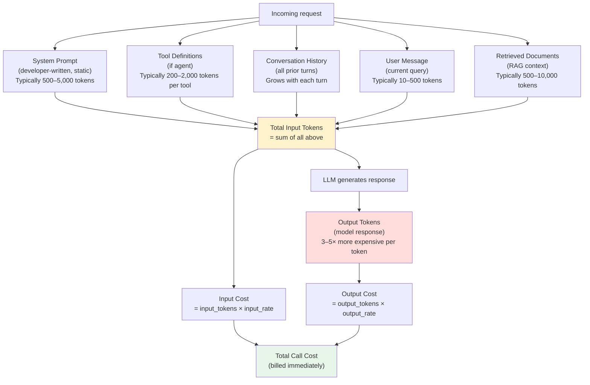
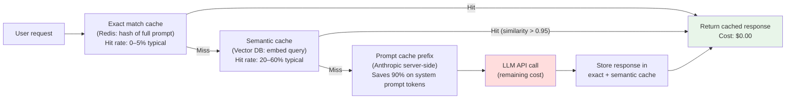
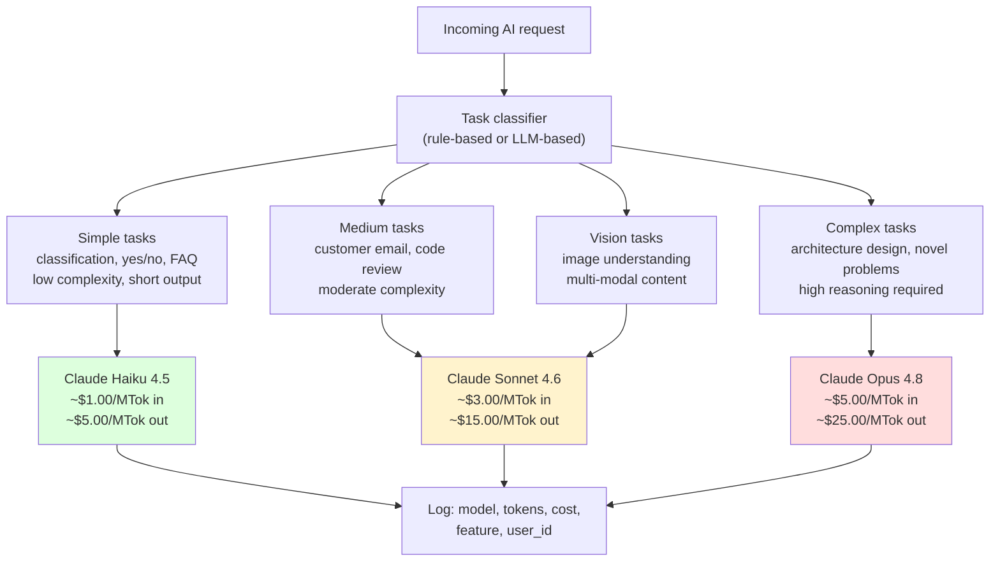
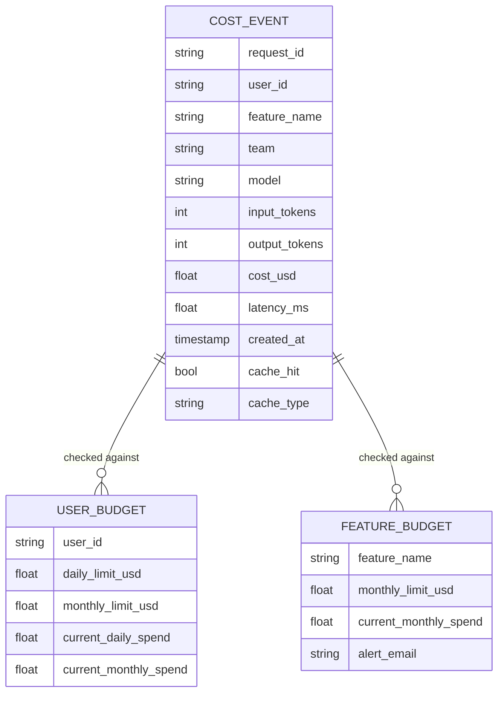
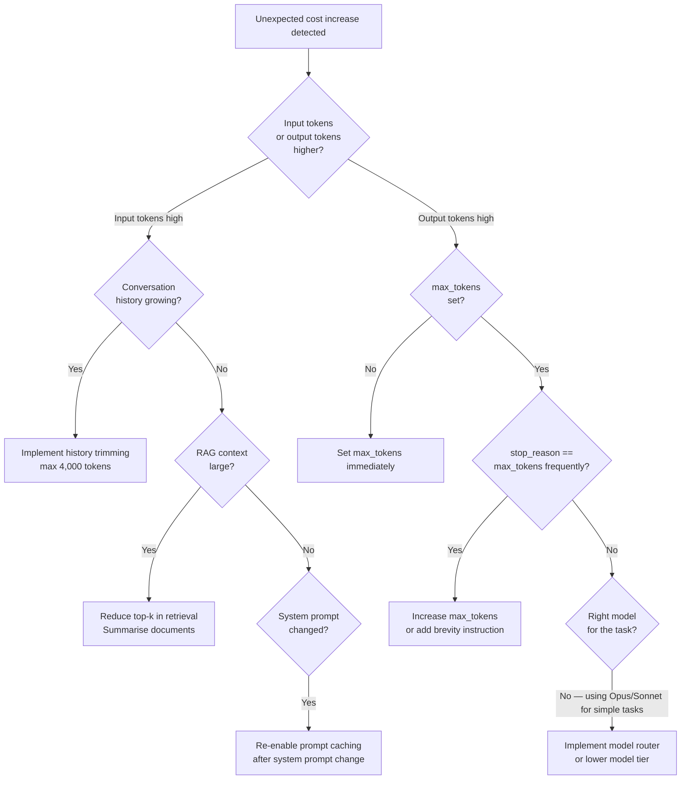

# Chapter 19: Cost Engineering — Running AI Without Going Broke

---

> *"You do not have a cost problem. You have a visibility problem. You can't control what you can't measure."*

---

## Learning Objectives

By the end of this chapter you will be able to:

- Explain why AI operational cost behaves differently from traditional software infrastructure cost, and why standard cloud cost controls do not apply without modification
- Count tokens accurately before sending a request, and predict the cost of a call before it is made
- Implement prompt caching to reduce the cost of large, repeated system prompts by up to 90%
- Build a semantic cache that serves cached AI responses for similar (not just identical) queries
- Design a model routing system that automatically selects the cheapest model capable of handling each request
- Use the Anthropic Batch API to run large workloads at 50% cost reduction with no code changes to your core logic
- Attribute every token of cost to a specific user, feature, team, and business unit — and expose that data in a cost dashboard
- Set per-user token budgets and automatic spend alerts that fire before your bill does

---

## Prerequisites

- **Required:** Chapter 4 — AI APIs, SDKs & Streaming (understanding API calls and token mechanics)
- **Required:** Chapter 17 — AI Observability (cost data lives in the same structured log stream)
- **Recommended:** Chapter 5 — Prompt Engineering (prompt design has direct cost implications)
- **Recommended:** Chapter 9 — RAG (RAG pipelines are a major cost driver)
- **Recommended:** Chapter 18 — AI Security (security classifiers add cost; routing reduces it)

---

## Estimated Reading Time

**80 – 95 minutes**

---

## Estimated Hands-on Time

**4 – 5 hours**

---

## Table of Contents

1. [Why This Topic Exists](#1-why-this-topic-exists)
2. [Real-World Analogy](#2-real-world-analogy)
3. [Core Concepts](#3-core-concepts)
4. [Architecture Diagrams](#4-architecture-diagrams)
5. [Flow Diagrams](#5-flow-diagrams)
6. [Beginner Implementation — Token Counting and Cost Estimation](#6-beginner-implementation)
7. [Intermediate Implementation — Prompt Caching and Model Routing](#7-intermediate-implementation)
8. [Advanced Implementation — Semantic Caching and Batch Processing](#8-advanced-implementation)
9. [Production Architecture — Full Cost Engineering Stack](#9-production-architecture)
10. [Technology Comparison](#10-technology-comparison)
11. [Best Practices](#11-best-practices)
12. [Security Considerations](#12-security-considerations)
13. [Cost Considerations](#13-cost-considerations)
14. [Common Mistakes](#14-common-mistakes)
15. [Debugging Guide](#15-debugging-guide)
16. [Performance Optimisation](#16-performance-optimisation)
17. [Exercises](#17-exercises)
18. [Quiz](#18-quiz)
19. [Mini Project](#19-mini-project)
20. [Production Project](#20-production-project)
21. [Key Takeaways](#21-key-takeaways)
22. [Chapter Summary](#22-chapter-summary)
23. [Resources](#23-resources)
24. [Glossary Terms Introduced](#24-glossary-terms-introduced)
25. [See Also](#25-see-also)
26. [Preparation for Chapter 20](#26-preparation-for-chapter-20)

---

## 1. Why This Topic Exists

Traditional software infrastructure has a cost profile that engineers understand intuitively. Servers have predictable monthly costs. Database queries are cheap. A bug that runs an N+1 query pattern might cost you a few hundred milliseconds of latency but rarely bankrupts a company. The worst case for a misconfigured server is a fixed monthly bill.

AI inference is different. Every character the user types is metered. Every character the model generates is metered. A poorly designed system that includes 10,000 tokens of context when 500 would suffice costs 20× more per request — not for the user's first request, but for every request, forever. A feature that runs Claude Opus when Claude Haiku would work equally well for that task costs 20× more per call, silently, with no error, no warning, and no way to know unless you measured it.

The cost per API call is small. At $0.00003 per Haiku request, it feels negligible. The problem emerges at scale:

| Scale | Haiku ($0.00003/request) | Sonnet ($0.00015/request) | Opus ($0.00075/request) |
|-------|--------------------------|---------------------------|-------------------------|
| 1,000 requests/day | $0.03/day | $0.15/day | $0.75/day |
| 100,000 requests/day | $3/day | $15/day | $75/day |
| 1,000,000 requests/day | $30/day | $150/day | $750/day |
| 10,000,000 requests/day | $300/day | $1,500/day | $7,500/day |

*These are rough estimates — exact cost depends on token counts, not request counts.*

The second problem is surprise. AI costs are not predictable from deployment metrics. A user who sends a 4,000-token system prompt with a 20,000-token conversation history on every request costs 240× more to serve than a user with a 200-token prompt and a clean context. Standard infrastructure monitoring (CPU, memory, request rate) shows nothing unusual. Only token-level observability reveals the problem.

This chapter teaches you to measure, predict, control, and attribute AI costs — before a bill arrives that surprises you.

> **Note:** All pricing figures in this chapter were verified in mid-2026. AI pricing changes regularly. Always verify against the current official documentation before making production decisions. Direct links are provided in the Resources section.

---

## 2. Real-World Analogy

### The N+1 Query Problem

Any backend engineer who has optimised a slow API endpoint knows the N+1 query problem. A loop that makes one database query per item in a list — instead of one query for all items — works correctly but costs 100× in database calls. The application looks fine. Users get correct data. But the database is executing 1,000 queries per page load instead of 10.

The fix is not to write less code. It is to understand what the database is being asked to do and restructure it. A JOIN fetches the same data in one query. The feature becomes 100× cheaper to operate, with no change in what users see.

AI cost engineering is the same problem:

| N+1 Query | AI Cost Equivalent |
|-----------|-------------------|
| Querying the database per item in a loop | Calling Claude Opus for every classification that Haiku can handle |
| Fetching the same row 100 times | Sending the same 5,000-token system prompt on every call without caching |
| Loading all table columns when only 2 are needed | Generating 2,000-token responses when 200 tokens would answer the question |
| No query result caching | No semantic cache for repeated questions |

The application works in all cases. The cost difference is 10× to 100×. An engineer who does not measure it will never find it.

### The Electricity Meter

A second analogy: a factory that switched from traditional machines to electric machines. Before the switch, power was a flat monthly estimate. After: every machine has a meter. The factory manager can now see that the press on line 3 is drawing 40% of the building's power while producing 8% of the output. That one machine is the target of a cost engineering project. Without meters, it was invisible.

Token counting and cost attribution are your factory's meters. The goal is to make every token of cost visible to the team responsible for it.

---

## 3. Core Concepts

### Token Economy

**Technical definition:** Large language model APIs charge per token, where a token is approximately 3–4 characters of English text (roughly ¾ of a word). The exact count depends on the tokeniser used by each model.

**Plain English:** When you call an AI API, you are billed per "word fragment" both for what you send and what you receive. The bill is calculated from the exact number of these fragments in every API call.

**Analogy:** Sending a telegram that charges per word. You pay for every word in the message you send AND every word in the reply you receive.

**Key numbers (approximate, verify before production):**
- 100 tokens ≈ 75 words ≈ 400 characters
- 1,000 tokens ≈ 750 words ≈ 1 A4 page of text
- A 5-minute coding conversation: ~8,000–15,000 tokens
- Claude Haiku 4.5 context window: 200,000 tokens; Claude Sonnet 4.6 and Opus 4.8: 1,000,000 tokens (1M)

---

### Input Tokens vs Output Tokens

**Technical definition:** Input tokens are the tokens in the prompt (system prompt + conversation history + user message + tool definitions). Output tokens are the tokens the model generates in its response. Providers charge different rates for each — output tokens typically cost 3–5× more than input tokens.

**Why output costs more:** Generating each output token requires a full forward pass through the model. Reading input tokens is comparatively cheaper because the computation is partially parallelisable. Generating is always sequential: each token depends on all previous tokens.

**Engineering implication:** Reducing output length has a larger cost impact per token than reducing input length. A system that generates 2,000-token responses when 200 would suffice wastes 10× the output budget. Setting `max_tokens` is one of the highest-value cost controls available.

---

### Model Tiers

Every major AI provider offers multiple model tiers at different capability levels and price points. The engineering decision is always the same: use the cheapest model that produces acceptable quality for the task.

**Anthropic model tiers (verify pricing before production use):**

| Model | Input (per MTok) | Output (per MTok) | Strength | Use for |
|-------|------------------|-------------------|----------|---------|
| Claude Haiku 4.5 | ~$1.00 | ~$5.00 | Fast, cheap, capable | Classification, routing, simple Q&A, content filtering |
| Claude Sonnet 4.6 | ~$3.00 | ~$15.00 | Balanced | Most production tasks, code generation, analysis |
| Claude Opus 4.8 | ~$5.00 | ~$25.00 | Most capable | Complex reasoning, novel problems, architecture review |

> **Note:** These prices were accurate at time of writing. Check [anthropic.com/pricing](https://www.anthropic.com/pricing) for current rates.

The price ratio between Haiku and Opus is approximately 5:1 on input and output. A task where Haiku produces 90% of the quality of Opus is worth doing with Haiku — especially for high-volume tasks.

---

### Prompt Caching

**Technical definition:** A feature offered by AI providers where a designated prefix of the prompt is stored server-side after the first request. Subsequent requests that share the same prefix read from the cache instead of reprocessing the prefix, at a fraction of the cost.

**Plain English:** If your system prompt is 10,000 tokens and you send it on every request, the provider reprocesses those 10,000 tokens every time. With caching, you pay full price once and a small "cache read" fee on every subsequent request. Anthropic charges 10% of the standard input price for cached token reads.

**Cost impact:**
- Standard: 10,000 tokens × $3.00/MTok × 1,000 requests = $30.00
- With caching (after first request): 10,000 tokens × $0.30/MTok × 999 requests = $3.00
- **Saving: 90% on the system prompt portion**

**Requirements (Anthropic):**
- Minimum cacheable block: 1,024 tokens for Sonnet and Opus models; **4,096 tokens for Haiku 4.5**
- Cache TTL: 5 minutes (resets on each cache hit — effectively persistent for active use); optional 1-hour TTL available at 2× base input price
- Marked with `cache_control: {"type": "ephemeral"}` in the API request
- Cache write cost: 125% of regular input price (one-time, paid once per 5-minute window)

---

### Semantic Caching

**Technical definition:** A caching strategy that stores AI responses and retrieves them based on semantic similarity of queries — using embedding distance — rather than exact string matching. A query for "what are your business hours?" and "when do you open?" both hit the same cached response.

**Plain English:** Traditional caching only matches exactly. Semantic caching matches by meaning. Two questions that ask the same thing in different words get the same cached answer without calling the model at all.

**Cost impact:** For high-traffic FAQ-style use cases, semantic caching can eliminate 40–70% of API calls entirely.

---

### Model Routing

**Technical definition:** A system-level pattern that evaluates each incoming request and dynamically assigns it to the cheapest model capable of handling it, based on the task's complexity, required capabilities, and quality threshold.

**Plain English:** Instead of using Opus for everything (safe but expensive) or Haiku for everything (cheap but occasionally insufficient), a router decides which model to use per request. Simple classification → Haiku. Customer email drafting → Sonnet. Architecture planning → Opus.

---

### Batch Processing

**Technical definition:** Instead of processing AI requests one at a time synchronously, batch processing accumulates requests and processes them asynchronously, allowing the provider to schedule them for off-peak processing at lower cost.

**Anthropic Batch API specifics:**
- 50% discount on both input and output tokens
- Results delivered asynchronously, within 24 hours (typically within 1–2 hours)
- Suitable for: evaluation runs, report generation, data enrichment, content moderation queues
- Not suitable for: real-time chat, streaming responses, user-facing features with latency requirements

---

### Cost Attribution

**Technical definition:** The process of tagging every API call with metadata (user ID, feature name, team, business unit) and aggregating those tags into dashboards that show who is spending what, on which features, using which models.

**Plain English:** Without attribution, you get one monthly bill with one number. With attribution, you can see that the "email drafting" feature costs $4,200/month, the top 1% of users account for 23% of cost, and switching that one feature from Sonnet to Haiku would save $2,800/month.

---

## 4. Architecture Diagrams

### 4.1 Where Tokens Come From in a Typical AI Request



### 4.2 Caching Layer Architecture



### 4.3 Model Routing Architecture



### 4.4 Cost Attribution Schema



---

## 5. Flow Diagrams

### 5.1 Per-Request Cost Decision Flow

```mermaid
flowchart TD
    INPUT["Incoming request + metadata"]
    
    INPUT --> BUDGET{User daily budget\nexceeded?}
    BUDGET -->|"Yes"| REJECT["Reject: budget exceeded\nReturn 429 with explanation"]
    BUDGET -->|"No"| EXACT{Exact cache\nhit?}
    EXACT -->|"Yes"| SERVE_EXACT["Serve from exact cache\nCost: $0.00\nLog: cache_type=exact"]
    EXACT -->|"No"| SEMANTIC{Semantic cache\nhit (>0.95)?}
    SEMANTIC -->|"Yes"| SERVE_SEM["Serve from semantic cache\nCost: ~$0.0001 (embed only)\nLog: cache_type=semantic"]
    SEMANTIC -->|"No"| ROUTE["Model router\nClassify task complexity"]
    ROUTE --> MODEL["Select model\n(Haiku / Sonnet / Opus)"]
    MODEL --> CALL["API call with\nprompt caching enabled"]
    CALL --> STORE["Store in exact + semantic cache"]
    STORE --> LOG["Log cost event:\nuser, feature, model,\ntokens, cost_usd"]
    LOG --> ALERT{Hourly spend\n> alert threshold?}
    ALERT -->|"Yes"| NOTIFY["Send alert to team\n(Slack/email/PagerDuty)"]
    ALERT -->|"No"| DONE["Return response to user"]
    NOTIFY --> DONE
```

---

## 6. Beginner Implementation

### Token Counting and Pre-Flight Cost Estimation

Before you can control costs, you must be able to count tokens and calculate what a call will cost before you make it. This is the foundation of every other cost control.

```python
# token_counter.py
# Learning example — count tokens and estimate cost before calling the API
import anthropic

client = anthropic.Anthropic()

# Current pricing as of mid-2026 — verify at anthropic.com/pricing before production use
MODEL_PRICING = {
    "claude-haiku-4-5-20251001": {
        "input":  1.00e-6,    # $1.00 per million input tokens
        "output": 5.00e-6,    # $5.00 per million output tokens
        "context_window": 200_000,
    },
    "claude-sonnet-4-6": {
        "input":  3.00e-6,    # $3.00 per million input tokens
        "output": 15.00e-6,   # $15.00 per million output tokens
        "context_window": 1_000_000,
    },
    "claude-opus-4-8": {
        "input":  5.00e-6,    # $5.00 per million input tokens
        "output": 25.00e-6,   # $25.00 per million output tokens
        "context_window": 1_000_000,
    },
}


def count_tokens(
    messages: list[dict],
    system: str = "",
    model: str = "claude-haiku-4-5-20251001",
) -> int:
    """
    Count the tokens in a request before sending it.
    Uses the API's token counting endpoint — exact, not approximate.
    """
    response = client.messages.count_tokens(
        model=model,
        system=system,
        messages=messages,
    )
    return response.input_tokens


def estimate_call_cost(
    input_tokens: int,
    estimated_output_tokens: int,
    model: str = "claude-haiku-4-5-20251001",
) -> dict:
    """
    Estimate the cost of an API call given token counts.
    Useful for pre-flight checks and budget enforcement.
    """
    pricing = MODEL_PRICING[model]
    input_cost = input_tokens * pricing["input"]
    output_cost = estimated_output_tokens * pricing["output"]
    total_cost = input_cost + output_cost

    context_utilisation_pct = (input_tokens / pricing["context_window"]) * 100

    return {
        "model": model,
        "input_tokens": input_tokens,
        "estimated_output_tokens": estimated_output_tokens,
        "input_cost_usd": round(input_cost, 8),
        "output_cost_usd": round(output_cost, 8),
        "total_cost_usd": round(total_cost, 8),
        "context_utilisation_pct": round(context_utilisation_pct, 1),
        "cost_per_1000_calls_usd": round(total_cost * 1000, 4),
    }


def calculate_actual_cost(response, model: str) -> float:
    """
    Calculate the actual cost of a completed API call from its usage data.
    Call this immediately after every client.messages.create().
    """
    pricing = MODEL_PRICING[model]
    input_cost = response.usage.input_tokens * pricing["input"]
    output_cost = response.usage.output_tokens * pricing["output"]
    return round(input_cost + output_cost, 8)


# Usage example:
def demo_token_counting():
    system = "You are a helpful customer support agent for Acme Corp."
    messages = [{"role": "user", "content": "What is your return policy?"}]

    # Count tokens before calling
    input_tokens = count_tokens(messages, system=system)
    estimate = estimate_call_cost(
        input_tokens=input_tokens,
        estimated_output_tokens=200,  # your expected response length
        model="claude-haiku-4-5-20251001",
    )

    print(f"Estimated call cost: ${estimate['total_cost_usd']:.6f}")
    print(f"Context utilisation: {estimate['context_utilisation_pct']}%")
    print(f"Cost per 1,000 calls: ${estimate['cost_per_1000_calls_usd']:.4f}")

    # Make the actual call
    response = client.messages.create(
        model="claude-haiku-4-5-20251001",
        max_tokens=300,   # ALWAYS set max_tokens — this is your cost ceiling per call
        system=system,
        messages=messages,
    )

    actual_cost = calculate_actual_cost(response, "claude-haiku-4-5-20251001")
    print(f"Actual cost: ${actual_cost:.6f}")
    print(f"Output tokens used: {response.usage.output_tokens}")
    print(f"Stop reason: {response.stop_reason}")
```

---

```javascript
// tokenCounter.mjs — Learning example (Node.js)
import Anthropic from "@anthropic-ai/sdk";

const client = new Anthropic();

const MODEL_PRICING = {
  "claude-haiku-4-5-20251001": { input: 0.8e-6, output: 4.0e-6 },
  "claude-sonnet-4-6":         { input: 3.0e-6, output: 15.0e-6 },
  "claude-opus-4-8":           { input: 15.0e-6, output: 75.0e-6 },
};

export function calculateActualCost(usage, model) {
  const pricing = MODEL_PRICING[model];
  const inputCost = usage.input_tokens * pricing.input;
  const outputCost = usage.output_tokens * pricing.output;
  return {
    inputCost: parseFloat(inputCost.toFixed(8)),
    outputCost: parseFloat(outputCost.toFixed(8)),
    totalCost: parseFloat((inputCost + outputCost).toFixed(8)),
  };
}

// Always set max_tokens — it is the per-call cost ceiling
export async function callWithCostTracking(messages, system, model, maxTokens) {
  const response = await client.messages.create({
    model,
    max_tokens: maxTokens,
    system,
    messages,
  });

  const cost = calculateActualCost(response.usage, model);
  console.log(
    `Cost: $${cost.totalCost} | ` +
    `In: ${response.usage.input_tokens} | ` +
    `Out: ${response.usage.output_tokens} | ` +
    `Stop: ${response.stop_reason}`
  );

  return { response, cost };
}
```

---

### Production Issue: Uncontrolled Output Length Causes 10× Cost Spike

**Symptoms:**
Your AI feature runs fine in development. In production, your daily AI spend climbs from $50 to $500 over three days without any change in user count. The observability dashboard shows that average output tokens per request jumped from 180 to 1,800 on Thursday. There is no alert configured for output length.

**Root Cause:**
The model was deployed without a `max_tokens` parameter. By default, models generate until they reach a natural stopping point. A specific category of query — open-ended questions about your product — causes the model to generate verbose, exhaustive responses. Once a few users started asking those questions, the behaviour propagated through semantic caching and became the default response style for similar queries.

**How to Diagnose It:**

```python
def audit_response_length_distribution(log_entries: list[dict]) -> dict:
    """
    Find the distribution of output token counts across recent requests.
    Identify the tail that is driving up costs.
    """
    output_tokens = [e.get("output_tokens", 0) for e in log_entries]
    output_tokens.sort()

    n = len(output_tokens)
    return {
        "p50": output_tokens[int(n * 0.50)],
        "p90": output_tokens[int(n * 0.90)],
        "p95": output_tokens[int(n * 0.95)],
        "p99": output_tokens[int(n * 0.99)],
        "max": output_tokens[-1],
        "pct_over_500_tokens": sum(1 for t in output_tokens if t > 500) / n,
        "total_output_tokens": sum(output_tokens),
    }
    # If p99 is 10× p50, you have a long-tail output problem.
    # The top 1% of requests are disproportionately expensive.
```

**How to Fix It:**

```python
# BEFORE: no max_tokens — model decides output length
response = client.messages.create(
    model="claude-haiku-4-5-20251001",
    messages=messages,
)

# AFTER: always set max_tokens appropriate to the task
response = client.messages.create(
    model="claude-haiku-4-5-20251001",
    max_tokens=300,    # Customer support: 300 is almost always enough
    messages=messages,
)
# If the model hits max_tokens, response.stop_reason == "max_tokens"
# Log this — if it fires frequently, either increase max_tokens or
# add an instruction to the system prompt: "Keep responses under 200 words."
```

**How to Prevent It in Future:**
Never deploy a production AI call without `max_tokens`. Set it deliberately, based on what is actually useful for the task. For customer support: 300–500. For code generation: 1,000–2,000. For document summarisation: 500–800. Add `stop_reason == "max_tokens"` as a metric. If it fires on more than 5% of requests, your limit is too low for the task and you should increase it — but log this explicitly so you know the limit is regularly being hit.

---

## 7. Intermediate Implementation

### Prompt Caching — 90% Off Your System Prompt

Prompt caching is the single highest-leverage cost optimisation for systems with large, repeated system prompts. If your system prompt is 5,000 tokens and you send it on every request, enabling caching reduces that from $3.00/MTok to $0.30/MTok for every request after the first.

```python
# prompt_cache.py
# Production example — Anthropic prompt caching
import anthropic
import time

client = anthropic.Anthropic()

# Large system prompt (5,000+ tokens to be worth caching — minimum 1,024)
LARGE_SYSTEM_PROMPT = """
You are a customer support specialist for Acme Corp with access to the complete
product documentation, return policy, and support knowledge base.

## Complete Product Catalogue
[... 3,000 tokens of product documentation ...]

## Return and Refund Policy
[... 1,000 tokens of policy text ...]

## Escalation Procedures
[... 500 tokens of procedures ...]
"""


def call_with_prompt_cache(
    user_message: str,
    conversation_history: list[dict],
    model: str = "claude-haiku-4-5-20251001",
) -> dict:
    """
    Call Claude with prompt caching enabled on the system prompt.
    The system prompt is marked with cache_control — Anthropic caches it
    for 5 minutes and charges 10% of normal input price for cache reads.
    """
    messages = conversation_history + [
        {"role": "user", "content": user_message}
    ]

    start_ms = time.time() * 1000

    response = client.messages.create(
        model=model,
        max_tokens=500,
        system=[
            {
                "type": "text",
                "text": LARGE_SYSTEM_PROMPT,
                "cache_control": {"type": "ephemeral"},  # Mark this block for caching
            }
        ],
        messages=messages,
    )

    latency_ms = int(time.time() * 1000 - start_ms)

    # Detect whether the cache was hit or missed
    # cache_read_input_tokens > 0 means the cache was hit
    cache_read = getattr(response.usage, "cache_read_input_tokens", 0)
    cache_write = getattr(response.usage, "cache_creation_input_tokens", 0)
    regular_input = response.usage.input_tokens

    # Calculate cost with cache awareness
    pricing = {
        "claude-haiku-4-5-20251001": {"input": 1.00e-6, "output": 5.00e-6,
                                       "cache_write": 1.25e-6, "cache_read": 0.10e-6},
        "claude-sonnet-4-6":         {"input": 3.00e-6, "output": 15.00e-6,
                                       "cache_write": 3.75e-6, "cache_read": 0.30e-6},
    }
    p = pricing.get(model, pricing["claude-haiku-4-5-20251001"])

    cost = (
        regular_input * p["input"] +
        response.usage.output_tokens * p["output"] +
        cache_write * p["cache_write"] +
        cache_read * p["cache_read"]
    )

    return {
        "text": response.content[0].text,
        "input_tokens": regular_input,
        "output_tokens": response.usage.output_tokens,
        "cache_read_tokens": cache_read,
        "cache_write_tokens": cache_write,
        "cache_hit": cache_read > 0,
        "cost_usd": round(cost, 8),
        "latency_ms": latency_ms,
    }


# Node.js equivalent:
NODEJS_PROMPT_CACHE = """
// promptCache.mjs — Production example
import Anthropic from "@anthropic-ai/sdk";
const client = new Anthropic();

export async function callWithCache(userMessage, history, systemPrompt, model) {
  const response = await client.messages.create({
    model,
    max_tokens: 500,
    system: [
      {
        type: "text",
        text: systemPrompt,
        cache_control: { type: "ephemeral" },  // Enable caching
      },
    ],
    messages: [...history, { role: "user", content: userMessage }],
  });

  const cacheReadTokens = response.usage.cache_read_input_tokens ?? 0;
  const cacheWriteTokens = response.usage.cache_creation_input_tokens ?? 0;

  return {
    text: response.content[0].text,
    cacheHit: cacheReadTokens > 0,
    cacheReadTokens,
    cacheWriteTokens,
  };
}
"""
```

---

### Model Routing — Right Model for the Job

Not all tasks require the same model. A well-designed router can cut costs by 60–80% by automatically sending simple tasks to Haiku and reserving Opus for tasks that actually need it.

```python
# model_router.py
# Production example — dynamic model selection based on task complexity
import re
import anthropic
from dataclasses import dataclass
from enum import Enum

client = anthropic.Anthropic()


class TaskComplexity(str, Enum):
    SIMPLE = "simple"     # Classification, yes/no, FAQ lookup → Haiku
    MEDIUM = "medium"     # Drafting, summarisation, code review → Sonnet
    COMPLEX = "complex"   # Architecture, novel problems, deep reasoning → Opus


@dataclass
class RoutingDecision:
    complexity: TaskComplexity
    model: str
    reason: str
    confidence: float


# Rule-based routing (zero cost, <1ms)
SIMPLE_PATTERNS = [
    r"^(yes|no|true|false|correct|incorrect).*\?$",
    r"what (is|are) (your )?(hours?|address|location|phone|email)\b",
    r"^(classify|categorise|label|tag)\b",
    r"(sentiment|positive|negative|neutral)\b",
]

COMPLEX_PATTERNS = [
    r"\b(architect|design|strategy|approach)\b.{0,50}\b(system|platform|infrastructure)\b",
    r"\b(compare|evaluate|recommend)\b.{0,50}\b(option|approach|framework|architecture)\b",
    r"\b(debug|diagnose|root cause)\b.{0,50}\b(complex|intermittent|production)\b",
    r"\bcreate a (complete|production|enterprise)\b",
]

COMPILED_SIMPLE = [re.compile(p, re.IGNORECASE) for p in SIMPLE_PATTERNS]
COMPILED_COMPLEX = [re.compile(p, re.IGNORECASE) for p in COMPLEX_PATTERNS]

MODEL_FOR_COMPLEXITY = {
    TaskComplexity.SIMPLE:  "claude-haiku-4-5-20251001",
    TaskComplexity.MEDIUM:  "claude-sonnet-4-6",
    TaskComplexity.COMPLEX: "claude-opus-4-8",
}


def route_request(
    user_message: str,
    conversation_history: list[dict] | None = None,
    force_model: str | None = None,
) -> RoutingDecision:
    """
    Classify the complexity of a user request and route to the appropriate model.
    Uses rule-based routing first (free, instant), then falls back to heuristics.
    """
    if force_model:
        return RoutingDecision(
            complexity=TaskComplexity.MEDIUM,
            model=force_model,
            reason="forced override",
            confidence=1.0,
        )

    # Rule-based fast path
    for pattern in COMPILED_SIMPLE:
        if pattern.search(user_message):
            return RoutingDecision(
                complexity=TaskComplexity.SIMPLE,
                model=MODEL_FOR_COMPLEXITY[TaskComplexity.SIMPLE],
                reason=f"simple pattern match",
                confidence=0.9,
            )

    for pattern in COMPILED_COMPLEX:
        if pattern.search(user_message):
            return RoutingDecision(
                complexity=TaskComplexity.COMPLEX,
                model=MODEL_FOR_COMPLEXITY[TaskComplexity.COMPLEX],
                reason="complex pattern match",
                confidence=0.85,
            )

    # Heuristics: long messages are more likely to need more capable models
    word_count = len(user_message.split())
    if word_count < 15:
        return RoutingDecision(
            complexity=TaskComplexity.SIMPLE,
            model=MODEL_FOR_COMPLEXITY[TaskComplexity.SIMPLE],
            reason=f"short message ({word_count} words)",
            confidence=0.75,
        )
    if word_count > 150:
        return RoutingDecision(
            complexity=TaskComplexity.COMPLEX,
            model=MODEL_FOR_COMPLEXITY[TaskComplexity.COMPLEX],
            reason=f"long message ({word_count} words) — may require deeper reasoning",
            confidence=0.7,
        )

    # Default: medium complexity
    return RoutingDecision(
        complexity=TaskComplexity.MEDIUM,
        model=MODEL_FOR_COMPLEXITY[TaskComplexity.MEDIUM],
        reason="default medium complexity",
        confidence=0.65,
    )


def routed_call(
    user_message: str,
    system: str = "",
    max_tokens: int = 500,
    force_model: str | None = None,
) -> dict:
    """
    Make an AI call using the automatically routed model.
    Logs the routing decision for later analysis.
    """
    decision = route_request(user_message, force_model=force_model)

    response = client.messages.create(
        model=decision.model,
        max_tokens=max_tokens,
        system=system,
        messages=[{"role": "user", "content": user_message}],
    )

    return {
        "text": response.content[0].text,
        "model_used": decision.model,
        "routing_reason": decision.reason,
        "routing_confidence": decision.confidence,
        "input_tokens": response.usage.input_tokens,
        "output_tokens": response.usage.output_tokens,
    }
```

---

### Production Issue: Using Opus for Simple Classification Tasks

**Symptoms:**
Your content moderation pipeline runs every user message through an LLM to classify whether it violates policy. The pipeline has been running for 3 months. The monthly AI bill for this single feature is $14,400. A developer notices while auditing the code that the pipeline was hard-coded to use `claude-opus-4-8` when a team member set it up, because "Opus is the most accurate."

**Root Cause:**
The developer correctly identified that Opus is the most capable model. But content moderation for a customer support chatbot is a binary yes/no classification task. Haiku achieves 97%+ accuracy on this task vs Opus's 99% — a 2% quality difference — but at 20× lower cost. The decision to use Opus was made once, at setup, without a cost comparison. It was never revisited.

**How to Diagnose It:**

```python
def analyse_model_cost_distribution(log_entries: list[dict]) -> dict:
    """
    Group costs by model to find which model is spending the most.
    If Opus is handling tasks that Haiku could do, this makes it visible.
    """
    by_model = {}
    for entry in log_entries:
        model = entry.get("model", "unknown")
        cost = entry.get("cost_usd", 0)
        if model not in by_model:
            by_model[model] = {"calls": 0, "total_cost": 0.0, "features": set()}
        by_model[model]["calls"] += 1
        by_model[model]["total_cost"] += cost
        by_model[model]["features"].add(entry.get("feature", "unknown"))

    # Convert sets to lists for reporting
    for model_data in by_model.values():
        model_data["features"] = list(model_data["features"])
        if model_data["calls"] > 0:
            model_data["avg_cost_per_call"] = (
                model_data["total_cost"] / model_data["calls"]
            )

    return by_model
```

**How to Fix It:**

```python
# BEFORE: hard-coded to Opus
def classify_content_policy(text: str) -> bool:
    response = client.messages.create(
        model="claude-opus-4-8",  # 20× too expensive for this task
        ...
    )

# AFTER: use Haiku for classification, validate quality first
def classify_content_policy(text: str) -> bool:
    response = client.messages.create(
        model="claude-haiku-4-5-20251001",  # 20× cheaper, 97% accuracy
        max_tokens=10,  # Classification only needs "yes" or "no"
        system="Classify the following message. Reply with YES if it violates policy, NO if it does not. Reply with nothing else.",
        messages=[{"role": "user", "content": text[:500]}],
    )
    return response.content[0].text.strip().upper().startswith("YES")
```

**Approximate savings:** $14,400/month × (19/20) = **~$13,680/month saved**

**How to Prevent It in Future:**
Before deploying any AI feature, document: what task the model is performing, why that specific model was chosen, and what the monthly cost at expected volume will be. Add model selection to your code review checklist. Require a justification for Sonnet over Haiku, and Opus over Sonnet. Run a small quality comparison before committing to a model for high-volume tasks. Add per-feature cost to your monitoring dashboard so these choices are visible after the fact.

---

## 8. Advanced Implementation

### Semantic Caching with Embeddings

Exact-match caching requires an identical query. Semantic caching matches by meaning — two different ways of asking the same question get the same cached response.

```python
# semantic_cache.py
# Production example — embedding-based semantic response cache
import hashlib
import json
import time
import numpy as np
import anthropic
import redis

client = anthropic.Anthropic()
r = redis.Redis(decode_responses=True)

# Cache configuration
SIMILARITY_THRESHOLD = 0.95    # Cosine similarity threshold for cache hit
CACHE_TTL_SECONDS = 3600 * 24  # Cache responses for 24 hours
EMBED_MODEL = "text-embedding-3-small"  # OpenAI embedding for cache keys
                                         # Could also use Voyage AI or a local model


def embed_query(text: str) -> list[float]:
    """Generate embedding for use as a semantic cache key."""
    import openai
    oe = openai.OpenAI()
    response = oe.embeddings.create(model=EMBED_MODEL, input=text)
    return response.data[0].embedding


def cosine_similarity(a: list[float], b: list[float]) -> float:
    """Compute cosine similarity between two embedding vectors."""
    a_arr = np.array(a)
    b_arr = np.array(b)
    return float(np.dot(a_arr, b_arr) / (np.linalg.norm(a_arr) * np.linalg.norm(b_arr)))


def semantic_cache_lookup(query: str, namespace: str = "default") -> dict | None:
    """
    Look up a query in the semantic cache.
    Returns the cached response dict if similarity > threshold, else None.
    """
    query_embedding = embed_query(query)

    # Retrieve all cached entries for this namespace
    cache_keys = r.keys(f"sc:{namespace}:*")

    best_similarity = 0.0
    best_entry = None

    for key in cache_keys[:200]:  # Cap search to 200 entries for latency
        entry_json = r.get(key)
        if not entry_json:
            continue
        entry = json.loads(entry_json)
        similarity = cosine_similarity(query_embedding, entry["embedding"])
        if similarity > best_similarity:
            best_similarity = similarity
            best_entry = entry

    if best_similarity >= SIMILARITY_THRESHOLD and best_entry:
        return {
            "cached": True,
            "similarity": round(best_similarity, 4),
            "response": best_entry["response"],
            "original_query": best_entry["query"],
            "cache_age_seconds": int(time.time() - best_entry["cached_at"]),
        }

    return None


def semantic_cache_store(
    query: str,
    response: str,
    namespace: str = "default",
) -> str:
    """Store a query-response pair in the semantic cache."""
    embedding = embed_query(query)
    cache_key = f"sc:{namespace}:{hashlib.sha256(query.encode()).hexdigest()[:16]}"

    entry = {
        "query": query,
        "response": response,
        "embedding": embedding,
        "cached_at": time.time(),
    }
    r.setex(cache_key, CACHE_TTL_SECONDS, json.dumps(entry))
    return cache_key


def ai_call_with_semantic_cache(
    query: str,
    system: str = "",
    model: str = "claude-haiku-4-5-20251001",
    max_tokens: int = 500,
    namespace: str = "default",
) -> dict:
    """
    AI call with semantic caching.
    Returns cached response if a similar query was answered recently.
    """
    # Check semantic cache first
    cached = semantic_cache_lookup(query, namespace)
    if cached:
        return {
            "text": cached["response"],
            "cache_type": "semantic",
            "similarity": cached["similarity"],
            "cost_usd": 0.0,   # No API call was made
            "latency_source": "cache",
        }

    # No cache hit — call the API
    response = client.messages.create(
        model=model,
        max_tokens=max_tokens,
        system=system,
        messages=[{"role": "user", "content": query}],
    )
    response_text = response.content[0].text

    # Store in semantic cache for future queries
    semantic_cache_store(query, response_text, namespace)

    pricing = {"claude-haiku-4-5-20251001": (1.00e-6, 5.00e-6)}
    in_rate, out_rate = pricing.get(model, (3.00e-6, 15.00e-6))
    cost = response.usage.input_tokens * in_rate + response.usage.output_tokens * out_rate

    return {
        "text": response_text,
        "cache_type": "miss",
        "similarity": None,
        "cost_usd": round(cost, 8),
        "input_tokens": response.usage.input_tokens,
        "output_tokens": response.usage.output_tokens,
        "latency_source": "api",
    }
```

---

### Batch Processing for High-Volume Workloads

The Anthropic Batch API processes requests asynchronously at 50% of the standard price. It is ideal for workloads that do not need real-time responses: evaluation datasets, content moderation queues, report generation, data enrichment.

```python
# batch_processor.py
# Production example — Anthropic Batch API for cost-efficient bulk processing
import anthropic
import json
import time
from pathlib import Path

client = anthropic.Anthropic()


def create_batch_job(
    requests: list[dict],
    model: str = "claude-haiku-4-5-20251001",
    max_tokens: int = 500,
    system: str = "",
) -> str:
    """
    Submit a batch of requests to the Anthropic Batch API.
    Returns the batch_id for polling.

    Pricing: 50% of standard API price for both input and output tokens.
    Delivery: typically within 1–2 hours, guaranteed within 24 hours.
    """
    batch_requests = []
    for i, req in enumerate(requests):
        batch_requests.append(
            anthropic.types.message_create_params.MessageCreateParamsNonStreaming(
                custom_id=req.get("id", f"req_{i}"),
                params={
                    "model": model,
                    "max_tokens": max_tokens,
                    "system": system,
                    "messages": [
                        {"role": "user", "content": req["message"]}
                    ],
                },
            )
        )

    batch = client.messages.batches.create(requests=batch_requests)
    print(f"Batch submitted: {batch.id} | {len(batch_requests)} requests")
    return batch.id


def poll_batch_until_complete(
    batch_id: str,
    poll_interval_seconds: int = 60,
    timeout_seconds: int = 7200,
) -> list[dict]:
    """
    Poll a batch job until it completes or times out.
    In production, use a webhook or scheduled job instead of polling in-process.
    """
    start_time = time.time()

    while time.time() - start_time < timeout_seconds:
        batch = client.messages.batches.retrieve(batch_id)

        if batch.processing_status == "ended":
            break

        print(
            f"Batch {batch_id} status: {batch.processing_status} | "
            f"Completed: {batch.request_counts.succeeded}/{batch.request_counts.processing}"
        )
        time.sleep(poll_interval_seconds)

    # Retrieve results
    results = []
    for result in client.messages.batches.results(batch_id):
        if result.result.type == "succeeded":
            results.append({
                "id": result.custom_id,
                "text": result.result.message.content[0].text,
                "input_tokens": result.result.message.usage.input_tokens,
                "output_tokens": result.result.message.usage.output_tokens,
                "stop_reason": result.result.message.stop_reason,
            })
        else:
            results.append({
                "id": result.custom_id,
                "error": result.result.error.type,
                "text": None,
            })

    return results


def calculate_batch_savings(requests: list[dict], model: str) -> dict:
    """
    Compare standard vs batch API cost for a given workload.
    """
    STANDARD_PRICING = {
        "claude-haiku-4-5-20251001": (1.00e-6, 5.00e-6),
        "claude-sonnet-4-6":         (3.00e-6, 15.00e-6),
    }
    in_rate, out_rate = STANDARD_PRICING.get(model, (3.00e-6, 15.00e-6))

    # Rough estimate: assume avg 100 input + 200 output tokens per request
    avg_input = 100
    avg_output = 200
    n = len(requests)

    standard_cost = n * (avg_input * in_rate + avg_output * out_rate)
    batch_cost = standard_cost * 0.5  # 50% discount

    return {
        "requests": n,
        "standard_cost_usd": round(standard_cost, 4),
        "batch_cost_usd": round(batch_cost, 4),
        "savings_usd": round(standard_cost - batch_cost, 4),
        "savings_pct": 50,
    }


# Example usage:
def run_content_moderation_batch(user_messages: list[str]) -> list[dict]:
    """
    Run content moderation on a queue of messages at 50% cost using batch API.
    Suitable for a moderation queue that can tolerate 1–2 hour latency.
    """
    requests = [
        {"id": f"msg_{i}", "message": msg}
        for i, msg in enumerate(user_messages)
    ]

    savings = calculate_batch_savings(requests, "claude-haiku-4-5-20251001")
    print(f"Batch savings: ${savings['savings_usd']:.4f} ({savings['savings_pct']}%)")

    batch_id = create_batch_job(
        requests=requests,
        model="claude-haiku-4-5-20251001",
        max_tokens=20,  # Classification only needs a short response
        system=(
            "Classify the message as: SAFE, SPAM, ABUSE, or POLICY_VIOLATION. "
            "Reply with the single classification label only."
        ),
    )

    return poll_batch_until_complete(batch_id)
```

---

## 9. Production Architecture

### Full Cost Engineering Stack

```python
# cost_engineering_stack.py
# Production example — complete cost management system
import time
import json
import hashlib
import redis
import anthropic
from dataclasses import dataclass, field

client = anthropic.Anthropic()
r = redis.Redis(decode_responses=True)

MODEL_PRICING = {
    "claude-haiku-4-5-20251001": {
        "input": 1.00e-6, "output": 5.00e-6,
        "cache_write": 1.25e-6, "cache_read": 0.10e-6,
    },
    "claude-sonnet-4-6": {
        "input": 3.00e-6, "output": 15.00e-6,
        "cache_write": 3.75e-6, "cache_read": 0.30e-6,
    },
    "claude-opus-4-8": {
        "input": 5.00e-6, "output": 25.00e-6,
        "cache_write": 6.25e-6, "cache_read": 0.50e-6,
    },
}


@dataclass
class CostConfig:
    user_daily_limit_usd: float = 1.00
    user_monthly_limit_usd: float = 20.00
    feature_monthly_limits: dict[str, float] = field(default_factory=dict)
    alert_threshold_hourly_usd: float = 50.00
    alert_emails: list[str] = field(default_factory=list)


def check_and_record_budget(
    user_id: str,
    feature: str,
    estimated_cost: float,
    config: CostConfig,
) -> dict:
    """
    Check user and feature budgets before making an API call.
    Record the cost after the call.

    Uses Redis counters with TTL for rolling windows.
    """
    # ── User daily budget check ──────────────────────
    user_day_key = f"budget:user:{user_id}:day:{int(time.time() // 86400)}"
    current_daily = float(r.get(user_day_key) or 0)

    if current_daily + estimated_cost > config.user_daily_limit_usd:
        return {
            "allowed": False,
            "reason": f"Daily budget exceeded: ${current_daily:.4f} / ${config.user_daily_limit_usd:.2f}",
        }

    # ── Feature monthly budget check ─────────────────
    feature_limit = config.feature_monthly_limits.get(feature)
    if feature_limit:
        feature_month_key = f"budget:feature:{feature}:month:{int(time.time() // (86400*30))}"
        current_feature = float(r.get(feature_month_key) or 0)
        if current_feature + estimated_cost > feature_limit:
            return {
                "allowed": False,
                "reason": f"Feature budget exceeded: ${current_feature:.2f} / ${feature_limit:.2f}",
            }

    return {"allowed": True, "current_daily_spend": current_daily}


def record_cost_event(
    user_id: str,
    feature: str,
    team: str,
    model: str,
    input_tokens: int,
    output_tokens: int,
    cache_read_tokens: int,
    cache_write_tokens: int,
    latency_ms: int,
    cache_type: str = "none",
) -> float:
    """
    Record a cost event to Redis and structured logs.
    Returns the total cost in USD.
    """
    p = MODEL_PRICING.get(model, MODEL_PRICING["claude-sonnet-4-6"])
    cost = (
        input_tokens * p["input"] +
        output_tokens * p["output"] +
        cache_read_tokens * p["cache_read"] +
        cache_write_tokens * p["cache_write"]
    )

    # Update rolling cost counters
    day_key = f"budget:user:{user_id}:day:{int(time.time() // 86400)}"
    month_key = f"budget:feature:{feature}:month:{int(time.time() // (86400*30))}"
    hour_key = f"spend:total:hour:{int(time.time() // 3600)}"

    pipe = r.pipeline()
    pipe.incrbyfloat(day_key, cost)
    pipe.expire(day_key, 86400 * 2)
    pipe.incrbyfloat(month_key, cost)
    pipe.expire(month_key, 86400 * 32)
    pipe.incrbyfloat(hour_key, cost)
    pipe.expire(hour_key, 7200)
    results = pipe.execute()

    hourly_total = float(results[4])

    # Structured cost log — feeds the cost dashboard
    cost_event = {
        "event_type": "cost_event",
        "user_id": user_id,
        "feature": feature,
        "team": team,
        "model": model,
        "input_tokens": input_tokens,
        "output_tokens": output_tokens,
        "cache_read_tokens": cache_read_tokens,
        "cache_write_tokens": cache_write_tokens,
        "cost_usd": round(cost, 8),
        "latency_ms": latency_ms,
        "cache_type": cache_type,
        "hourly_total_usd": round(hourly_total, 4),
        "timestamp": time.time(),
    }
    print(json.dumps(cost_event))  # In production: structured logger → ELK / Grafana

    return round(cost, 8)


def managed_ai_call(
    user_message: str,
    user_id: str,
    feature: str,
    team: str,
    config: CostConfig,
    system: str = "",
    model: str | None = None,    # None = auto-route
    max_tokens: int = 500,
) -> dict:
    """
    A fully managed AI call with:
    - Budget enforcement (user daily + feature monthly)
    - Model routing (auto-select cheapest sufficient model)
    - Prompt caching
    - Cost recording and attribution
    - Overspend alerting
    """
    # ── Route to model ──────────────────────────────
    if model is None:
        decision = route_request(user_message)
        model = decision.model
    else:
        decision = None

    # ── Pre-flight budget check ─────────────────────
    est_input = len(user_message.split()) * 1.3 + 200  # Rough estimate
    est_cost = est_input * MODEL_PRICING[model]["input"] + max_tokens * MODEL_PRICING[model]["output"]

    budget_check = check_and_record_budget(user_id, feature, est_cost, config)
    if not budget_check["allowed"]:
        return {
            "blocked": True,
            "reason": budget_check["reason"],
            "response": "You have reached your usage limit. Please contact support.",
        }

    # ── API call with prompt caching ─────────────────
    start_ms = time.time() * 1000

    response = client.messages.create(
        model=model,
        max_tokens=max_tokens,
        system=[{"type": "text", "text": system, "cache_control": {"type": "ephemeral"}}] if system else "",
        messages=[{"role": "user", "content": user_message}],
    )

    latency_ms = int(time.time() * 1000 - start_ms)

    cache_read = getattr(response.usage, "cache_read_input_tokens", 0)
    cache_write = getattr(response.usage, "cache_creation_input_tokens", 0)

    # ── Record cost event ─────────────────────────────
    actual_cost = record_cost_event(
        user_id=user_id, feature=feature, team=team,
        model=model,
        input_tokens=response.usage.input_tokens,
        output_tokens=response.usage.output_tokens,
        cache_read_tokens=cache_read,
        cache_write_tokens=cache_write,
        latency_ms=latency_ms,
        cache_type="prompt_cache" if cache_read > 0 else "none",
    )

    return {
        "blocked": False,
        "response": response.content[0].text,
        "model": model,
        "routing_reason": decision.reason if decision else "forced",
        "cost_usd": actual_cost,
        "cache_hit": cache_read > 0,
        "input_tokens": response.usage.input_tokens,
        "output_tokens": response.usage.output_tokens,
        "stop_reason": response.stop_reason,
    }
```

---

### Cost Dashboard

```python
# cost_dashboard.py
# Production example — query cost data and generate reports
import redis
import time
from datetime import datetime, timedelta

r = redis.Redis(decode_responses=True)


def get_spend_summary(hours: int = 24) -> dict:
    """
    Retrieve total spend for the last N hours from Redis counters.
    In production, query your time-series database (InfluxDB, TimescaleDB, etc.)
    """
    now = int(time.time())
    hourly_spend = {}

    for hour_offset in range(hours):
        hour_bucket = (now - (hour_offset * 3600)) // 3600
        key = f"spend:total:hour:{hour_bucket}"
        value = r.get(key)
        if value:
            hour_dt = datetime.fromtimestamp(hour_bucket * 3600)
            hourly_spend[hour_dt.strftime("%Y-%m-%d %H:00")] = float(value)

    total = sum(hourly_spend.values())
    peak = max(hourly_spend.values(), default=0)

    return {
        "period_hours": hours,
        "total_spend_usd": round(total, 4),
        "peak_hourly_spend_usd": round(peak, 4),
        "avg_hourly_spend_usd": round(total / hours, 4),
        "hourly_breakdown": hourly_spend,
    }


def get_top_spenders(n: int = 10) -> list[dict]:
    """
    Find the users spending the most in the last 24 hours.
    Useful for identifying abuse or unexpectedly expensive usage patterns.
    """
    day_bucket = int(time.time() // 86400)
    pattern = f"budget:user:*:day:{day_bucket}"
    keys = r.keys(pattern)

    spenders = []
    for key in keys:
        user_id = key.split(":")[2]
        spend = float(r.get(key) or 0)
        spenders.append({"user_id": user_id, "daily_spend_usd": round(spend, 4)})

    spenders.sort(key=lambda x: x["daily_spend_usd"], reverse=True)
    return spenders[:n]


def print_cost_report() -> None:
    """Print a human-readable cost report to stdout."""
    summary = get_spend_summary(24)
    top_spenders = get_top_spenders(5)

    print("=" * 50)
    print("AI COST REPORT — Last 24 hours")
    print("=" * 50)
    print(f"Total spend:        ${summary['total_spend_usd']:.4f}")
    print(f"Peak hourly spend:  ${summary['peak_hourly_spend_usd']:.4f}")
    print(f"Avg hourly spend:   ${summary['avg_hourly_spend_usd']:.4f}")
    print()
    print("Top spenders:")
    for s in top_spenders:
        print(f"  {s['user_id']}: ${s['daily_spend_usd']:.4f}")
    print("=" * 50)
```

---

## 10. Technology Comparison

### Caching Strategies Compared

| Strategy | Hit Rate | Latency | Cost | Complexity | Best For |
|----------|----------|---------|------|------------|---------|
| **Exact match cache** (Redis hash of prompt) | Very low (0–5%) | <1ms | Free | Low | Identical repeated calls (e.g. health checks) |
| **Anthropic prompt cache** (server-side prefix) | Very high (90%+ for system prompt) | No added latency | 10% of input price | Low — just add `cache_control` | Large system prompts, long tool definitions |
| **Semantic cache** (embedding similarity) | Medium–high (20–60%) | +50–200ms (embed call) | ~$0.0001/query (embedding) | Medium | FAQ systems, customer support, repeated question patterns |
| **Request deduplication** (client-side TTL) | Medium | <1ms | Free | Low | Prevents accidental duplicate calls in retry logic |
| **Batch API** | N/A (no cache) | 1–24 hour latency | 50% off all tokens | Low | Eval runs, offline processing, queues |

### Model Provider Comparison (Approximate — Verify Current Pricing)

> **Note:** The following prices were approximate at time of writing. Verify at official pricing pages before production decisions.

| Provider | Model | Input ($/MTok) | Output ($/MTok) | Context Window | Strengths |
|----------|-------|----------------|-----------------|----------------|-----------|
| **Anthropic** | Claude Haiku 4.5 | ~$1.00 | ~$5.00 | 200K | Fast, cheap, capable classification |
| **Anthropic** | Claude Sonnet 4.6 | ~$3.00 | ~$15.00 | 1M | Best balance, most production tasks |
| **Anthropic** | Claude Opus 4.8 | ~$5.00 | ~$25.00 | 1M | Strongest reasoning, complex tasks |
| **OpenAI** | GPT-4o mini | ~$0.15 | ~$0.60 | 128K | Cheapest capable model, OpenAI ecosystem |
| **OpenAI** | GPT-4o | ~$2.50 | ~$10.00 | 128K | Strong coding, function calling |
| **Google** | Gemini 1.5 Flash | ~$0.075 | ~$0.30 | 1M | Cheapest for long-context, large file processing |
| **Google** | Gemini 1.5 Pro | ~$1.25 | ~$5.00 | 1M | Large context, video/audio, competitive on price |

**Key observation:** For cost-sensitive workloads requiring only short-context simple classification, Google Gemini Flash or OpenAI GPT-4o mini may be cheaper than Claude Haiku. For complex reasoning at medium context, Claude Sonnet is competitive. Always benchmark against your actual workload — not published benchmarks.

---

## 11. Best Practices

### 1. Always Set `max_tokens`

```python
# WRONG: no output ceiling — model generates until done
response = client.messages.create(
    model="claude-sonnet-4-6",
    messages=messages,
)

# RIGHT: always set a task-appropriate ceiling
MAX_TOKENS_BY_TASK = {
    "classification":        10,    # "POSITIVE" / "NEGATIVE" / "NEUTRAL"
    "customer_support":     400,    # A paragraph of support response
    "code_review":        1_500,    # Comments on a file
    "report_generation":  2_000,    # A structured report section
    "complex_analysis":   4_000,    # Deep reasoning output
}

response = client.messages.create(
    model="claude-sonnet-4-6",
    max_tokens=MAX_TOKENS_BY_TASK["customer_support"],
    messages=messages,
)
# If stop_reason == "max_tokens", log it — your ceiling may be too low
```

### 2. Enable Prompt Caching for Any System Prompt Over 1,000 Tokens

```python
# WRONG: large system prompt without caching
response = client.messages.create(
    model="claude-haiku-4-5-20251001",
    system=LARGE_SYSTEM_PROMPT,   # 5,000 tokens, paid in full every request
    messages=messages,
)

# RIGHT: mark the system prompt for caching
response = client.messages.create(
    model="claude-haiku-4-5-20251001",
    system=[
        {
            "type": "text",
            "text": LARGE_SYSTEM_PROMPT,
            "cache_control": {"type": "ephemeral"},  # 90% cheaper after first call
        }
    ],
    messages=messages,
)
```

### 3. Trim Conversation History Before It Costs More Than It's Worth

```python
def trim_to_budget(
    messages: list[dict],
    token_budget: int = 4_000,
) -> list[dict]:
    """
    Keep the most recent messages that fit within a token budget.
    Always preserves the last user message.
    """
    if not messages:
        return messages

    last_message = messages[-1]
    history = messages[:-1]
    kept = []
    used = 0

    for msg in reversed(history):
        # Rough token estimate: characters / 4
        msg_tokens = len(str(msg.get("content", ""))) // 4
        if used + msg_tokens > token_budget:
            break
        kept.insert(0, msg)
        used += msg_tokens

    return kept + [last_message]
```

### 4. Tag Every API Call for Cost Attribution

```python
# WRONG: no metadata — cost is invisible
response = client.messages.create(model=model, messages=messages)

# RIGHT: always include attribution in your logging wrapper
def tracked_call(messages, model, user_id, feature, team, max_tokens):
    response = client.messages.create(model=model, max_tokens=max_tokens, messages=messages)
    cost = calculate_actual_cost(response, model)
    log_cost_event(user_id=user_id, feature=feature, team=team,
                   model=model, cost_usd=cost,
                   input_tokens=response.usage.input_tokens,
                   output_tokens=response.usage.output_tokens)
    return response
```

### 5. Set Budgets and Alerts Before Going to Production

```python
# Minimum production cost controls — add before first user reaches the system

COST_CONTROLS = {
    "user_daily_limit_usd": 2.00,           # No single user can spend more than $2/day
    "user_monthly_limit_usd": 30.00,        # Monthly per-user cap
    "total_hourly_alert_usd": 100.00,       # Alert if total spend exceeds $100/hour
    "feature_monthly_budgets": {
        "customer_support": 2_000.00,       # $2,000/month budget for support feature
        "code_review": 500.00,              # $500/month for code review
        "content_moderation": 1_000.00,     # $1,000/month for moderation
    },
}
```

### 6. Use Batch API for Offline Workloads

```python
# WRONG: process 10,000 evaluation records synchronously at full price
for test_case in test_cases:
    response = client.messages.create(...)    # $0.001 per call × 10,000 = $10.00

# RIGHT: submit as batch at 50% discount
batch_id = create_batch_job(requests=test_cases)  # $5.00 for the same work
results = poll_batch_until_complete(batch_id)
```

---

## 12. Security Considerations

### Protecting Cost Data

Cost data reveals user behaviour, feature popularity, and system architecture. Treat it with appropriate access controls.

```python
# Cost logs contain: user_id, feature name, model used, token counts
# This is potentially sensitive business intelligence.

# Controls required:
# 1. Cost logs should not be publicly accessible
# 2. Per-user spend data should only be accessible to the user and admins
# 3. Aggregate feature cost data is internal — do not expose via API
# 4. Implement rate limiting to prevent cost enumeration attacks

def get_user_spend(user_id: str, requesting_user_id: str, is_admin: bool) -> dict:
    """Only allow users to see their own spend, or admins to see any spend."""
    if not is_admin and user_id != requesting_user_id:
        raise PermissionError("Access denied: you can only view your own usage data")
    return _get_spend_data(user_id)
```

### Preventing Cost-Based Abuse

Malicious users can deliberately exhaust your AI budget through denial-of-wallet attacks — sending requests designed to maximise token consumption.

```python
# Defence: combine rate limiting with budget enforcement

def check_abuse_patterns(user_id: str, request_text: str) -> dict:
    """
    Detect patterns that suggest intentional cost abuse.
    """
    # Pattern 1: Input designed to maximise output length
    if any(p in request_text.lower() for p in [
        "write a very long", "as detailed as possible",
        "1000 words", "5000 words", "be extremely verbose",
    ]):
        return {"suspicious": True, "reason": "verbose output request"}

    # Pattern 2: Context flooding (already caught by input validation)
    if len(request_text) > 8_000:
        return {"suspicious": True, "reason": "excessive input length"}

    # Pattern 3: High request frequency (use rate limiter from Chapter 18)
    minute_key = f"rate:{user_id}:{int(time.time() // 60)}"
    count = int(r.incr(minute_key) or 0)
    r.expire(minute_key, 120)
    if count > 30:
        return {"suspicious": True, "reason": f"rate limit: {count} requests/minute"}

    return {"suspicious": False}
```

---

## 13. Cost Considerations

### The Economics of Each Optimisation

| Optimisation | Implementation Effort | Monthly Savings (at $1,000/month baseline) | Notes |
|-------------|----------------------|-------------------------------------------|-------|
| Set `max_tokens` | 30 minutes | $200–$800 | Immediate, no downside |
| Prompt caching (large system prompts) | 2 hours | $300–$700 | Only for prompts >1,024 tokens |
| Model routing (Haiku for simple tasks) | 1–2 days | $400–$800 | Requires quality validation |
| Semantic caching | 2–3 days | $200–$600 | Best for FAQ/support use cases |
| Batch API for offline work | 4–8 hours | 50% of offline workload cost | No change to real-time cost |
| Context window trimming | 2–4 hours | $100–$400 | Especially valuable for long conversations |
| Combined (all of the above) | 1–2 weeks | $700–$900 | Typical real-world result |

### The Cost of Cost Engineering

Cost engineering itself consumes resources:
- Redis for budget counters and semantic cache: ~$20–$100/month
- Embedding API calls for semantic cache: ~$0.0001 per query (OpenAI text-embedding-3-small)
- Additional code complexity: engineering time, maintenance overhead

For most production systems at >$500/month AI spend, all of the above pay for themselves within the first billing cycle.

---

## 14. Common Mistakes

### Mistake 1: No `max_tokens` Parameter

```python
# WRONG: model generates until it decides to stop
response = client.messages.create(
    model="claude-sonnet-4-6",
    messages=[{"role": "user", "content": "Tell me everything about quantum computing."}],
)
# For an open-ended question, Sonnet may generate 3,000+ tokens.
# At $15/MTok output: 3,000 tokens = $0.045 per call.
# At 10,000 calls/day: $450/day.

# RIGHT: set a ceiling appropriate to the task
response = client.messages.create(
    model="claude-sonnet-4-6",
    max_tokens=500,   # A paragraph is almost always enough for a support answer
    messages=[...],
)
```

### Mistake 2: Including Full Conversation History Forever

```python
# WRONG: conversation history grows unbounded
def chat(user_message, history):
    history.append({"role": "user", "content": user_message})
    response = client.messages.create(
        model="claude-sonnet-4-6",
        messages=history,  # By turn 20, history = 20,000+ tokens = $0.06 per call
    )
    # By turn 50: history alone = 50,000 tokens = $0.15/call just for history

# RIGHT: trim history to a token budget
def chat(user_message, history):
    trimmed_history = trim_to_budget(history, token_budget=4_000)
    trimmed_history.append({"role": "user", "content": user_message})
    response = client.messages.create(
        model="claude-sonnet-4-6",
        messages=trimmed_history,
    )
```

### Mistake 3: Hard-Coding Models Without Justification

```python
# WRONG: using Opus everywhere because it feels safest
def classify_intent(text: str) -> str:
    response = client.messages.create(
        model="claude-opus-4-8",      # $15/MTok + $75/MTok for "positive or negative?"
        max_tokens=10,
        messages=[{"role": "user", "content": f"Is this positive or negative: {text}"}],
    )
    return response.content[0].text

# RIGHT: validate that Haiku is sufficient for this task, then use it
def classify_intent(text: str) -> str:
    response = client.messages.create(
        model="claude-haiku-4-5-20251001",  # 20× cheaper, 97%+ accuracy on binary classification
        max_tokens=10,
        messages=[{"role": "user", "content": f"Is this positive or negative? Reply with one word only: {text}"}],
    )
    return response.content[0].text
```

### Mistake 4: No Cost Attribution

```python
# WRONG: raw API calls with no context
response = client.messages.create(model=model, messages=messages)
# Result: one monthly bill. No idea which features cost what.
# Cannot make informed optimisation decisions.

# RIGHT: always wrap API calls with attribution
result = managed_ai_call(
    user_message=query,
    user_id=user.id,
    feature="customer_support",
    team="product",
    config=cost_config,
    ...
)
# Result: per-user, per-feature cost data.
# Can immediately see which features are expensive and optimise them.
```

### Mistake 5: Deploying Semantic Cache Without a Staleness Strategy

```python
# WRONG: cache responses indefinitely with no expiry
def store_response(query, response):
    r.set(f"cache:{hash(query)}", response)   # Never expires!
    # If your product changes, users get stale answers from the cache forever.

# RIGHT: set appropriate TTL based on how often the underlying answers change
CACHE_TTL_BY_FEATURE = {
    "product_faq":    3600 * 24,    # FAQs: 24 hours (change infrequently)
    "pricing":        3600 * 1,     # Pricing: 1 hour (can change often)
    "support_policy": 3600 * 168,   # Policies: 1 week (very stable)
}

def store_response(query, response, feature):
    ttl = CACHE_TTL_BY_FEATURE.get(feature, 3600)
    r.setex(f"cache:{hash(query)}", ttl, response)
```

---

## 15. Debugging Guide

### Cost Debugging Diagnostic Table

| Symptom | Likely Cause | Diagnostic Step | Fix |
|---------|-------------|-----------------|-----|
| Monthly bill 3× higher than expected | Missing max_tokens | Check p99 output_tokens in logs | Set task-appropriate max_tokens |
| Cost climbing each day without user growth | Conversation history growing | Check avg input_tokens over time | Implement history trimming |
| Cache hit rate is 0% despite enabling prompt cache | Cache block < 1,024 tokens | Count tokens in system prompt | Expand system prompt or consolidate content into one block |
| Semantic cache not triggering | Threshold too high | Log similarity scores for known similar queries | Lower threshold from 0.95 to 0.92 |
| One user accounts for 40% of total cost | No per-user budget enforcement | Check per-user spend in Redis | Implement daily budget limits |
| Feature costs 10× more in production than development | Development traffic is low; production has long conversations | Compare avg conversation turn count | Trim history; reduce max_tokens for simple queries |
| Batch job costs same as real-time calls | Batch API not being used | Check which endpoint is being called | Migrate offline workloads to `client.messages.batches.create()` |

### Cost Monitoring Flowchart



---

## 16. Performance Optimisation

### Parallelising Independent API Calls

When a feature needs multiple independent AI calls, running them in parallel reduces latency and does not increase cost.

```python
# WRONG: sequential calls — total latency = sum of all individual latencies
import asyncio
import anthropic

client = anthropic.AsyncAnthropic()

async def analyse_reviews_sequential(reviews: list[str]) -> list[str]:
    results = []
    for review in reviews:
        response = await client.messages.create(
            model="claude-haiku-4-5-20251001",
            max_tokens=100,
            messages=[{"role": "user", "content": f"Summarise: {review}"}],
        )
        results.append(response.content[0].text)
    return results
# For 10 reviews at 500ms each: 5,000ms total


# RIGHT: parallel calls — total latency ≈ slowest single call
async def analyse_reviews_parallel(reviews: list[str]) -> list[str]:
    tasks = [
        client.messages.create(
            model="claude-haiku-4-5-20251001",
            max_tokens=100,
            messages=[{"role": "user", "content": f"Summarise: {review}"}],
        )
        for review in reviews
    ]
    responses = await asyncio.gather(*tasks)
    return [r.content[0].text for r in responses]
# For 10 reviews at 500ms each: ~600ms total (near-parallel)
# Same cost, 8× faster
```

### Choosing the Right Caching Layer for Each Use Case

```python
# Decision guide for caching strategy:

CACHING_DECISION = """
Is the system prompt > 1,024 tokens and consistent across requests?
  → Yes: Enable Anthropic prompt cache. Zero latency, 90% cost reduction.

Do users ask the exact same questions repeatedly?
  → Yes: Exact match cache (Redis hash). Zero latency, zero cost for hits.

Do users ask similar questions in different words?
  → Yes: Semantic cache (embedding similarity). +100ms lookup, eliminates API call for hits.

Is the workload offline (eval, report generation, enrichment)?
  → Yes: Batch API. 50% cost reduction, 1–24 hour latency.

None of the above:
  → Focus on max_tokens and model routing first.
"""
```

---

## 17. Exercises

### Exercise 1 — Token Cost Calculator (30 minutes)
Build a function `cost_report(messages, system, model)` that: (1) calls `client.messages.count_tokens()` to count exact input tokens; (2) estimates output cost assuming the model generates at max_tokens; (3) returns a breakdown of cost by component: system prompt, conversation history, user message, and estimated output. Run it against three different message sizes and report which component contributes most to cost.

### Exercise 2 — Prompt Cache Analysis (45 minutes)
Take a 2,000-token system prompt and make 20 requests with it — 10 without caching and 10 with `cache_control: {"type": "ephemeral"}`. Log `cache_read_input_tokens` and `cache_creation_input_tokens` for each request. Calculate: (1) the actual cost of the uncached run; (2) the actual cost of the cached run (including the cache write fee); (3) the break-even point in number of requests where caching pays for itself.

### Exercise 3 — Model Router Quality Validation (60 minutes)
Implement the `route_request()` function and run it against 50 test prompts (you create them) — 20 that should route to Haiku, 15 to Sonnet, and 15 to Opus. For each routing decision, also call the routed model and evaluate whether the response quality is acceptable for the task. Report: routing accuracy rate, cost per 1,000 requests with routing vs without routing (all Sonnet baseline), and any cases where the router assigned too cheap a model for the task.

### Exercise 4 — Budget Enforcement System (45 minutes)
Implement `check_and_record_budget()` using Redis. Write tests that verify: (1) a user who has not made any requests today passes the budget check; (2) a user whose simulated spend equals their daily limit is blocked on the next request; (3) after midnight (simulate by changing the day_bucket key), the same user's budget resets and they can make requests again. Add an alert that logs "BUDGET_ALERT" when total hourly spend exceeds a threshold.

### Exercise 5 — Semantic Cache Hit Rate Analysis (60 minutes)
Implement `semantic_cache_lookup()` and `semantic_cache_store()`. Populate the cache with 20 FAQ responses for a fictional product. Then run 100 test queries — 30 exact matches, 40 semantically similar (same intent, different wording), and 30 out-of-scope questions. Report: hit rate for exact matches, hit rate for semantic matches, false positive rate (questions about unrelated topics that incorrectly hit the cache), and the total cost saved vs calling the API for all 100 queries.

---

## 18. Quiz

**1.** Why does output cost more per token than input at every major AI provider? What does this mean for how you should design your `max_tokens` strategy?

**2.** You have a system prompt that is 800 tokens. Your teammate suggests enabling prompt caching. What would you tell them about why this specific prompt would NOT benefit from Anthropic's prompt caching, and what would need to change to make it eligible?

**3.** A feature uses Claude Opus for every request and currently costs $3,000/month. You believe Haiku can handle 70% of requests and Sonnet can handle 25%, with only 5% genuinely requiring Opus. Estimate the new monthly cost after implementing a router with this distribution.

**4.** Explain the difference between exact match caching, prompt caching, and semantic caching. For each, give one use case where it is the best choice and one where it is the wrong choice.

**5.** What is the Anthropic Batch API? When should you use it and when should you NOT use it? Give two real examples of each.

**6.** A user's daily spend limit is $2.00. Your pre-flight cost estimate is $0.05 for their next request. Their current daily spend (from Redis) is $1.97. Should you allow the request? What edge case does this reveal about pre-flight estimation, and how do you handle it?

**7.** You set `max_tokens=300` for a customer support feature. After 1 week, your monitoring shows that 12% of requests have `stop_reason == "max_tokens"`. What does this tell you, and what two different fixes might you consider?

**8.** Explain conversation history token growth. A chatbot has been in conversation for 40 turns, each with approximately 200 tokens of user input and 300 tokens of AI output. How many input tokens will the 41st turn cost in history alone? What is the cost of that conversation at Sonnet pricing?

**9.** Why does cost attribution matter beyond just controlling spend? Give three specific engineering decisions that you could NOT make without per-feature, per-user cost data.

**10.** What is a denial-of-wallet attack? Name two input patterns that suggest a user is attempting to maximise your AI API cost, and describe a defence for each.

---

**Answers:**

1. Output tokens are more expensive because generating each one requires a full sequential forward pass through the model — each token depends on all previous tokens and cannot be parallelised. Input tokens are processed in parallel (the model attends to all of them simultaneously). This asymmetry means reducing output length has the highest cost impact per token saved. Your `max_tokens` strategy should be set to the minimum output that is genuinely useful for the task — not a generous buffer. A classification that needs one word should have `max_tokens=10`, not `max_tokens=1000`.

2. Anthropic's prompt caching requires a minimum block size of 1,024 tokens. An 800-token system prompt does not meet this threshold and will not be cached. To benefit from caching: add more content to the system prompt (more detailed instructions, product documentation, knowledge base content) until it reaches at least 1,024 tokens. This may feel counterintuitive — making the prompt larger to cache it — but a 1,100-token cached prompt costs 90% less to read on subsequent requests than an 800-token uncached prompt.

3. Cost estimate:
   - Current: 100% Opus at $3,000/month
   - With routing (assuming token counts stay constant):
     - 70% Haiku: 70% × ($3,000 × $1.00/$5.00) = 70% × $600 = $420
     - 25% Sonnet: 25% × ($3,000 × $3.00/$5.00) = 25% × $1,800 = $450
     - 5% Opus: 5% × $3,000 = $150
   - New total: ~$1,020/month — approximately **66% reduction**
   - (Actual result depends on token counts per tier, but order of magnitude is accurate.)

4. Exact match caching: stores the full response keyed by a hash of the full prompt. Best for: health check endpoints that send identical prompts repeatedly, or automated evaluation runs with fixed prompts. Wrong for: user-facing chat where every message is unique. Prompt caching: stores the system prompt prefix on the provider's servers. Best for: any system with a large (>1,024 token) system prompt that stays the same across requests. Wrong for: system prompts that change per user, per request, or that are shorter than 1,024 tokens. Semantic caching: stores responses keyed by embedding of the query. Best for: FAQ-style use cases where users ask the same question in different ways. Wrong for: open-ended creative or analytical tasks where slight wording differences should produce different responses.

5. The Batch API submits multiple requests for asynchronous processing at 50% off. Use it when: (1) running evaluation datasets (thousands of test cases do not need real-time results); (2) nightly content moderation queues; (3) weekly report generation; (4) bulk data enrichment (classifying product descriptions, extracting fields from documents). Do NOT use it when: (1) users are waiting for the response (customer support chatbot); (2) streaming is required; (3) the result is needed within seconds; (4) you need to use the response in a subsequent API call in the same pipeline.

6. You should allow the request — $1.97 + $0.05 = $2.02, which barely exceeds the $2.00 limit. The edge case is that your pre-flight estimate is approximate (based on token count estimation and a fixed output assumption), while the actual cost may differ. One approach: set the effective budget check at 95% of the limit ($1.90), reserving 5% headroom for estimation variance. Another: check the budget strictly but handle `over_budget` gracefully after the fact by rolling the excess into the next day's count. Never send a potentially very expensive call (e.g., one estimated at $0.50) when the user is close to their limit — the estimation error for large calls is larger.

7. `stop_reason == "max_tokens"` on 12% of requests means: (1) the model had more to say than your limit allowed — responses were truncated; (2) either your `max_tokens` is too low for the task, OR some users are asking questions that warrant longer answers. Fix 1 (if quality is suffering): increase `max_tokens` from 300 to 450 and re-measure — check whether user satisfaction metrics improve. Fix 2 (if cost is the priority): add a system prompt instruction "Keep responses under 150 words" — this reduces generation at the source, which is cheaper than a higher max_tokens (the limit becomes less necessary). Monitor both: if truncation drops to 3% with the instruction but no `max_tokens` change, you have improved both cost and quality.

8. Turn 41 input tokens in history: 40 turns × (200 user + 300 AI) = 40 × 500 = 20,000 tokens in history alone, plus the current user message (~200 tokens), plus system prompt (say 500 tokens) = ~20,700 input tokens. At Sonnet pricing ($3.00/MTok): 20,700 × $3.00 / 1,000,000 = $0.0621 just for input on that one turn. Over a 40-turn conversation, total input tokens: sum from 1 to 40 of (i × 500) ≈ 20 × 40 × 500 / 2 = 200,000 tokens just in history = $0.60 in input costs for the conversation history alone. This illustrates why trimming history is critical for long conversations.

9. Three decisions requiring per-feature, per-user cost data: (1) **Which feature to optimise first** — without attribution, you cannot tell that "email drafting" costs $4,200/month while "sentiment analysis" costs $80. You would guess at which to optimise; with attribution, you target the highest-spend features first. (2) **Whether to pass costs to users** — a B2B product might charge customers for AI usage, but you cannot do this fairly without per-customer cost data. Without attribution, you either under-charge (losing money on heavy users) or over-charge (losing light users). (3) **Whether a new feature is economically viable** — after launch, if you cannot see that a feature costs $0.03 per user session, you cannot calculate whether it is profitable at your pricing. You might run a loss-making feature for months without realising it.

10. A denial-of-wallet attack deliberately maximises your AI API costs by sending requests designed to generate maximum tokens. Pattern 1: explicit verbose requests ("write a 5,000-word essay on…") — defence: input validation pattern matching for phrases like "write a very long", "as detailed as possible", combined with `max_tokens` ceiling. Pattern 2: context flooding — sending 8,000 characters of irrelevant content to maximise input tokens before the actual question — defence: `max_length` input validation (already implemented in Chapter 18's `validate_user_input()`). General defence: per-user daily token budgets combined with rate limiting catch the pattern even when individual requests appear legitimate.

---

## 19. Mini Project

### Build a Cost Dashboard CLI Tool (2–3 hours)

Build a command-line tool that queries your Redis cost data and displays a formatted cost report.

**What it must include:**

1. `cost report --hours 24` — shows total spend, hourly breakdown, and top 5 spending features for the last 24 hours
2. `cost top-users --n 10` — shows the 10 highest-spending users and their daily spend vs their daily limit
3. `cost feature <feature_name>` — shows daily cost for a named feature over the last 7 days
4. `cost simulate <model> <input_tokens> <output_tokens>` — shows the cost if this call ran on each of the three Claude models (Haiku / Sonnet / Opus), with a recommendation for which to use
5. A sample data generator that populates Redis with 3 days of fake cost events across 3 features and 20 users so the tool has data to display

**Acceptance Criteria:**
- [ ] `cost report` output includes total spend and per-feature breakdown
- [ ] `cost top-users` correctly ranks users by spend
- [ ] `cost simulate` shows cost comparison across all three Claude tiers
- [ ] The tool handles the case where Redis is empty gracefully
- [ ] All Redis keys use appropriate TTL — no stale data older than 32 days

---

## 20. Production Project

### Build a Cost-Engineered AI Feature with Full Observability (1–2 days)

Build a customer support chatbot with every cost engineering technique from this chapter implemented and verified.

**System Requirements:**

1. **Model routing** — rule-based router that directs simple FAQ queries to Haiku and complex support queries to Sonnet; logs routing decision and confidence with every request

2. **Prompt caching** — system prompt is >1,024 tokens with `cache_control: {"type": "ephemeral"}`; logs `cache_hit: true/false` with every request

3. **Semantic caching** — Redis-backed semantic cache for FAQ-category queries; logs cache type (`exact`, `semantic`, `api`) and similarity score with every request

4. **Budget enforcement** — per-user daily limit of $2.00; logs the check result; returns a user-friendly message when the budget is exceeded

5. **History trimming** — conversation history trimmed to 4,000 tokens before each API call; logs original vs trimmed token count

6. **Cost attribution** — every API call emits a structured JSON cost event with: user_id, feature, team, model, input_tokens, output_tokens, cost_usd, cache_type, routing_reason, latency_ms

7. **Cost dashboard endpoint** — `GET /admin/cost-summary` returns: total 24h spend, spend by model, spend by feature, cache hit rate, and model distribution

**Acceptance Criteria:**
- [ ] Simple FAQ query routes to Haiku and logs `routing_reason`
- [ ] System prompt cache shows `cache_hit: true` from the second request onward
- [ ] Semantic cache returns a hit for a rephrased version of a previously answered FAQ question
- [ ] A simulated user who exceeds daily budget receives the budget message on the next request
- [ ] A 30-turn conversation shows constant input_tokens (trimming is working) rather than linearly growing input_tokens
- [ ] `/admin/cost-summary` returns valid JSON with all required fields
- [ ] Estimated monthly cost per 1,000 daily active users (calculated from your logged cost_usd average) is documented

---

## 21. Key Takeaways

- **AI cost does not scale like traditional infrastructure** — a bug in prompt design or model selection can multiply your bill by 10× or 100× without any visible error or alert
- **Token visibility is the foundation** — you cannot control what you cannot measure; instrument every API call with `input_tokens`, `output_tokens`, and `cost_usd` before doing anything else
- **`max_tokens` is your per-call cost ceiling** — never deploy a production AI call without it; set it based on what is actually useful for the task, not a generous buffer
- **Output tokens cost more than input tokens** — reducing output length has a higher cost impact per token than reducing input length
- **Prompt caching is the highest-return single optimisation** — 90% cost reduction on system prompt tokens, zero code change beyond adding `cache_control`
- **Model routing is the second-highest return** — the right model for the task is the cheapest one that produces acceptable quality; validate quality before committing
- **Semantic caching is a multiplier on high-traffic FAQ use cases** — 40–70% of API calls can be eliminated entirely for support and FAQ systems
- **Conversation history grows silently** — trim it before it becomes your biggest cost driver; a 40-turn conversation can have 20,000 tokens of history
- **Batch API cuts costs 50% for offline workloads** — evaluation runs, content moderation queues, and report generation are all candidates
- **Cost attribution is a business necessity** — without per-feature, per-user data you cannot make pricing, product, or engineering decisions rationally
- **Budget enforcement protects against both bugs and abuse** — set limits before your first production user reaches the system

---

## 22. Chapter Summary

| Topic | Key Takeaway |
|-------|-------------|
| Token economy | Every character in and out is metered; input and output priced differently |
| Model tiers | Haiku:Opus price ratio is ~5:1 — use the cheapest model that works |
| `max_tokens` | Always set it; it is the per-call cost ceiling; log when it triggers |
| Prompt caching | Mark system prompts >1,024 tokens (>4,096 for Haiku) with `cache_control`; 90% cost reduction |
| Semantic caching | Cache by embedding similarity; 40–70% cache hit rate for FAQ-style use cases |
| Exact match caching | Near-zero cost for identical repeated calls; low hit rate in real chat |
| Model routing | Classify each request and assign the cheapest sufficient model |
| Batch API | 50% discount for asynchronous, non-real-time workloads |
| History trimming | Cap conversation history at a token budget; prevents silent cost growth |
| Cost attribution | Tag every call with user_id, feature, team; build dashboards |
| Budget enforcement | Per-user daily limits + feature monthly caps protect against surprises |
| Monitoring | Track: cost_usd, input_tokens, output_tokens, cache_hit, model, stop_reason |

---

## 23. Resources

### Official Documentation

| Resource | URL |
|----------|-----|
| Anthropic pricing | anthropic.com/pricing |
| Anthropic prompt caching guide | docs.anthropic.com/en/docs/build-with-claude/prompt-caching |
| Anthropic Message Batches API | docs.anthropic.com/en/docs/build-with-claude/message-batches |
| Anthropic token counting | docs.anthropic.com/en/docs/build-with-claude/token-counting |
| OpenAI pricing | platform.openai.com/pricing |
| Google Gemini pricing | ai.google.dev/pricing |

### Further Reading

| Resource | Why Read It |
|----------|-------------|
| Simon Willison's LLM pricing tracking | Regularly updated practical comparison of model costs and capabilities across providers |
| "How Vercel cut their AI costs by 90% with prompt caching" | Real-world case study on prompt cache economics at scale |
| tiktoken (OpenAI) | Token counting library — useful for pre-flight estimates without an API call |
| OpenAI Cookbook — Cost optimisation | Practical recipes, broadly applicable across providers |

---

## 24. Glossary Terms Introduced

| Term | Definition |
|------|-----------|
| Input tokens | Tokens in the prompt (system + history + user message + tools) — billed per API call |
| Output tokens | Tokens generated by the model in its response — 3–5× more expensive per token than input |
| `max_tokens` | The maximum number of output tokens the model is allowed to generate in one call |
| `stop_reason` | Why the model stopped generating: `end_turn` (natural stop), `max_tokens` (limit hit), `stop_sequence` |
| Prompt caching | Server-side caching of a prompt prefix; Anthropic charges 10% of input price for cache reads |
| Cache write | The one-time cost of storing a prompt prefix in the cache: 125% of input price |
| Cache hit | A request that successfully reads from the prompt cache; confirmed by `cache_read_input_tokens > 0` |
| Semantic caching | Caching responses by embedding similarity of queries; hits similar (not just identical) queries |
| Exact match cache | Traditional cache keyed by an exact hash of the full prompt |
| Model routing | Automatically selecting the cheapest model capable of handling a given request |
| Batch API | Asynchronous request processing at 50% discount; results delivered within 24 hours |
| Cost attribution | Tagging API calls with metadata (user, feature, team) to enable per-dimension cost analysis |
| Token budget | A limit on the maximum tokens (and therefore cost) allowed for a given context window or history |
| Denial-of-wallet attack | Deliberate attempts to maximise an AI service's API costs by sending resource-intensive requests |
| Cache TTL | Time-to-live for a cached entry; Anthropic prompt cache TTL is 5 minutes, reset on each hit |

---

## 25. See Also

| Chapter | Why It's Related |
|---------|-----------------|
| [Chapter 4: AI APIs, SDKs & Streaming](./chapter-04-ai-apis-sdks.md) | Token mechanics and API usage patterns that determine cost |
| [Chapter 5: Prompt Engineering](./chapter-05-prompt-engineering.md) | Prompt design has direct cost implications — inefficient prompts waste tokens on every call |
| [Chapter 9: RAG](./chapter-09-rag.md) | RAG context is a major input token driver; chunk size and top-k directly affect cost |
| [Chapter 16: Testing & Evaluating AI Systems](./chapter-16-testing-evaluation.md) | Evaluation runs are ideal batch API workloads — 50% cheaper |
| [Chapter 17: AI Observability](./chapter-17-observability.md) | Cost events share the same structured log stream as observability metrics |
| [Chapter 18: AI Security](./chapter-18-security.md) | Security classifiers add cost; model routing reduces it; denial-of-wallet attacks require both |

---

## 26. Preparation for Chapter 20

Chapter 20 is the capstone. You will build a complete production AI system end-to-end, integrating components from all 19 previous chapters: API integration, prompt engineering, RAG pipeline, agent with tools, multi-modal input, observability, security middleware, and cost engineering.

Cost engineering from this chapter is not a separate component in the capstone — it runs through every other component. The capstone's RAG pipeline uses prompt caching. The agent uses model routing. The cost dashboard is integrated with the observability system from Chapter 17.

**Technical checklist:**
- [ ] You can count tokens using `client.messages.count_tokens()` and calculate the exact cost before making a call
- [ ] You can enable prompt caching by adding `cache_control: {"type": "ephemeral"}` to a system prompt block
- [ ] You understand the difference between a cache write cost (125%) and a cache read cost (10%)
- [ ] You can implement a basic model router that assigns Haiku, Sonnet, or Opus based on task complexity signals
- [ ] You know how to submit a batch job using `client.messages.batches.create()` and poll for results

**Conceptual check — answer without notes:**
- [ ] Why does unbounded conversation history become your most expensive cost driver at scale?
- [ ] When should you use the Batch API and when should you not?
- [ ] What is the minimum block size for Anthropic's prompt caching, and what happens if your prompt is shorter?
- [ ] Why does output cost more per token than input, and what is the engineering implication?

**Optional challenge before Chapter 20:**
Run all the cost optimisations from this chapter against one of the systems you built in an earlier chapter. Measure the cost per 1,000 requests before and after each optimisation: (1) add `max_tokens`; (2) enable prompt caching; (3) implement model routing; (4) add semantic caching. Record the total cost reduction. Bring this measurement into the capstone as your baseline — it will inform your architectural decisions when building the complete production system.

---

> **Note:** All pricing data in this chapter was verified in mid-2026. AI pricing changes regularly and without notice — often downward as competition intensifies. Always verify current rates at the provider's official pricing page before making production cost projections.

---

*Chapter 19 of 20 | The Complete AI Engineering Course*

*Previous: [Chapter 18: AI Security — Prompt Injection, Safety & Red-Teaming](./chapter-18-security.md)*
*Next: [Chapter 20: Capstone — Build a Production AI System End-to-End](./chapter-20-capstone.md)*
